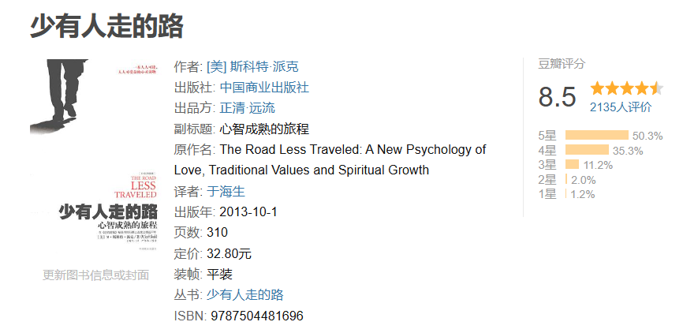
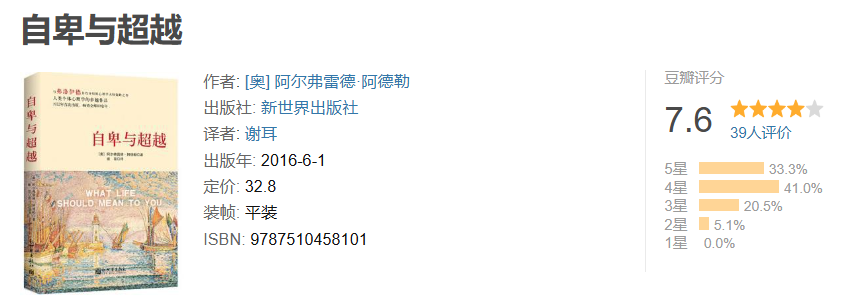
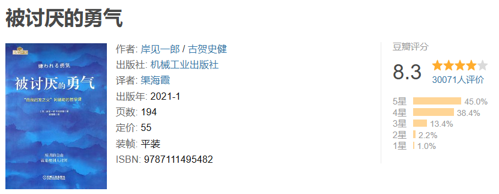

# 告别

## 主线任务：成为你自己

成为自己是每个人的主线任务。要想成为自己，首先要了解自己。下面罗列的书单，我认为是非常契合认识自己，成为自己这一主线任务的。

尽管我已经记不清书中的大多数内容了，但这确实是第一本给我留下深刻印象的书。当时读到书中第一页的第一句话时，那种犹如触电的感觉我到现在还记忆犹新。这本书对我的意义就像楚门的世界里突然从天而降的摄影棚大灯，启发我真正开始对周遭的人事物有所思考和质疑。

阿德勒将人类面对现实生活中的各种困难和挑战时的无力感定义为“自卑情结”。由于人类自身普遍存在着的局限性，导致每个人都必将会有“自卑情结”出现的时候。因此，自卑感是极其普遍的。

然而问题不在于自卑感的普遍性而是你选择超越自卑感的方式。健康的超越方式是付出实质性的努力，去改善自身的处境，进而真正地解决问题。不健康的超越方式是选择逃避和自我欺骗，转而追求所谓的优越感。逃避其实是一种糟糕的心理防御机制，它看起来能让你免受外界的伤害，但实际上是断送了通过解决问题以培养健康人格的机会。逃避会让相似的问题会一而再再而三地出现在你面前，使你感到困扰。须知优越感和自卑感是一体两面的，它们本质上是同一个东西。

《被讨厌的勇气》这本书很好地诠释了什么是真正的超越。我们知道心理学中的精神分析学派喜欢追问你在原生家庭中的生活细节，试图将你身上存在的心理问题“甩锅”到原生家庭上面，即为你身上的问题去找原因。《被讨厌的勇气》通过青年与哲学家的对话，严谨地驳斥了原因论，倡导我们拥抱目的论。

## 支线任务：由聪明到智慧

