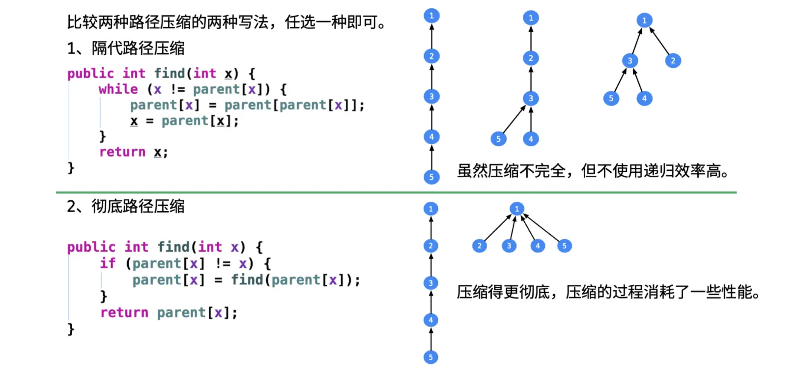
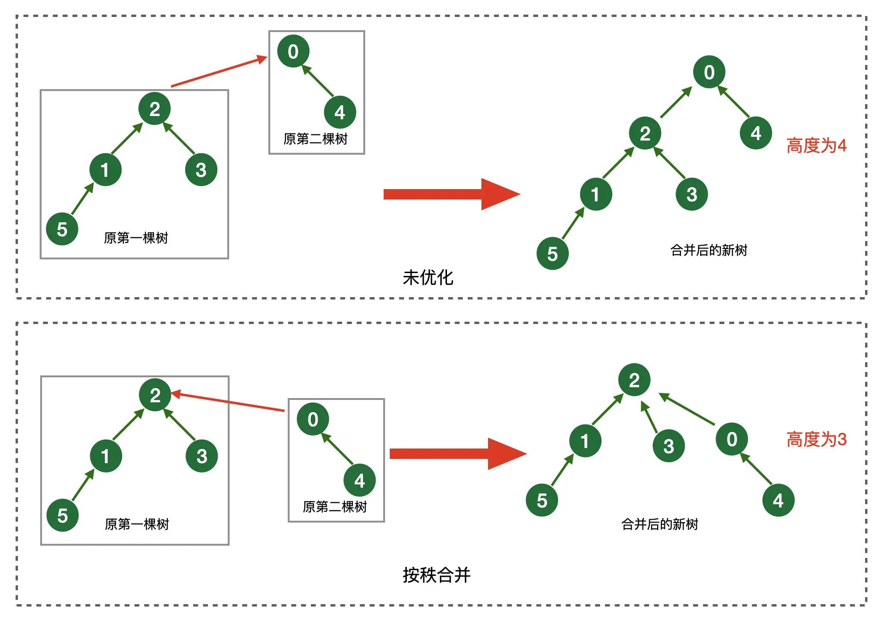

# 【算法训练营】数据结构

作者：wallace-lai </br>
发布：2024-06-22 </br>
更新：2024-06-22 <br>

## 栈

（1）声明：`stack<int> stk;`

（2）入栈：`stk.push(1)`

（3）出栈：`stk.pop()`

注意：若栈为空，则`pop()`会抛异常

（4）取栈顶元素：`stk.top()`

（5）判空：`stk.empty()`

（6）栈中元素个数：`stk.size()`

## 队列

（1）声明：`queue<int> q;`

（2）入队：`q.push(x);`

（3）出队：`q.pop();`

（4）返回队首元素：`q.front()`

（5）返回队尾元素：`q.back()`

（6）判空：`q.empty()`

（7）返回队列个数：`q.size()`

## 双端队列

（1）声明：`deque<int> dq`

（2）队尾插入：`dq.push_back(1)`

（3）队首插入：`dq.push_front(1)`

（4）队尾删除：`dq.pop_back()`

（5）队首删除：`dq.pop_front()`

（6）返回队尾元素：`dq.back()`

（7）返回队首元素：`dq.front()`

（8）返回（修改）第i个元素：`dq.at(i)`

（9）遍历队列：

```cpp
for (deque<int>::iterator it = dq.begin(); it != dq.end(); it++) {
    // ...
}
```

（10）判空：`dq.empty()`

（11）返回队列个数：`dq.size()`

## 并查集

（1）建立集合

```c
#define MAX_NODE_SUM (128)
static unsigned sum;
static int pa[MAX_NODE_SUM];

void uf_init(unsigned n)
{
    assert(n <= MAX_NODE_SUM);

    sum = n;
    for (int i = 0; i < n; i++) {
        pa[i] = i;
    }
}
```

（2）查找根结点

首先写一个没有路径压缩的版本如下：

```c
int uf_find0(int x)
{
    assert(x < sum);

    // no compress
    while (x != pa[x]) {
        x = pa[x];
    }

    return x;
}
```

如下图所示，假设要查找结点`5`的根结点，则`uf_find0`的将沿着`5 -> 4 -> 3 -> 2 -> 1`的路径找到结点`5`所归属的根结点为`1`。



图片来源：leetcode题解

什么是隔代路径压缩？核心思想是**每当发现结点`x`不是最终的根结点时，则将结点`x`的父结点设置为结点`x`父节点的父节点。此时结点`x`就与其父结点处于同一层次，结点`x`和其父结点由上下层父子关系变成了同层级的兄弟关系，缩短了查询路径**。重复这一过程，直至遇到最终的根结点为止。

隔代路径压缩代码实现如下所示：

```c
int uf_find1(int x)
{
    assert(x < sum);

    // compress
    while (x != pa[x]) {
        pa[x] = pa[pa[x]];
        x = pa[x];
    }

    return x;
}
```

什么是完全路径压缩？核心思想是**每当发现结点`x`不是最终根结点时，则将其根结点设置为其父结点的根结点，同时对其父结点递归地进行相同的操作**。重复这一过程，最终所有搜索路径上的非根节点的父节点都将被设置成最终的根结点。

完全路径压缩代码实现如下所示：

```c
int uf_find2(int x)
{
    assert(x < sum);

    // full compress
    if (x != pa[x]) {
        pa[x] = uf_find2(pa[x]);
    }

    return pa[x];
}
```

针对`find(5)`的递归调用形式如下：

```
pa[5] = find(pa[5])
      = find(4)
      pa[4] = find(pa[4])
            = find(3)
            pa[3] = find(pa[3])
                  = find(2)
                  pa[2] = find(pa[2])
                        = find(1)  // find(1) == 1
                  pa[2] = 1  // return find(1)
            pa[3] = 1        // return pa[2]
      pa[4] = 1              // return pa[3]
pa[5] = 1                    // return pa[4]
```

（3）合并两个节点

首先写一个不带任何优化的版本如下，核心思想是**找到两个结点`x`和`y`的最终根结点，如果两个根结点不相等说明两个结点`x`和`y`位于不同的子树中，将结点`x`的最终根结点的父节点设置为结点`y`的最终父结点。这相当于是将结点`x`所在的子树挂在了结点`y`所在的子树下，两棵树合并成了一棵树**。



图片来源：leetcode题解

```c
typedef int (*uf_find_ptr)(int x);

int uf_union(int x, int y)
{
    uf_find_ptr uf_find = uf_find0;

    int xp = uf_find(x);
    int yp = uf_find(y);
    if (xp != yp) {
        pa[xp] = yp;
    }
}
```

对于并查集的两结点合并，有个优化方法叫做按秩合并，即将秩（树结点个数）少的树合并到另一个秩更大的树上。目的是为了降低合并后树的高度。但是，你在查找的时候就会做路径压缩，感觉合并做的这点优化有点不痛不痒。更何况为了实现按秩合并，需要维护每个树结点所包含的子树个数，即ranks数组，这需要增加一些内存和时间成本。

因此对按秩合并不做描述，需要的话可以查阅相关资料。

## 优先队列