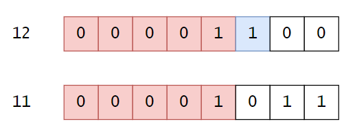

# 位运算

作者：wallace-lai </br>
发布：2023-06-02 </br>
更新：2023-06-03 </br>

## 算法原理

### 基本位运算
**与**
```
0 & 0 = 0
0 & 1 = 0
1 & 0 = 0
1 & 1 = 1
```
只有两个二进制位均为`1`时，结果才为`1`。

**或**
```
0 | 0 = 0
0 | 1 = 1
1 | 0 = 1
1 | 1 = 1
```
只要两个二进制位中有一个`1`，那么结果就是`1`。

**取反**
```
~0 = 1
~1 = 0
```

**异或**
```
0 ^ 0 = 0
0 ^ 1 = 1
1 ^ 0 = 1
1 ^ 1 = 0
```
异或看的是两个二进制位是否相同，若相同则结果为0，否则结果为1。注意异或有几个有妙用的性质，值得注意：

1. 任何数和0做异或运算，结果仍然是原来的数
2. 任何数和其自身做异或，结果是0，因为每个二进制位都相同，异或结果必然为0
3. 异或满足交换和结合律

**左移**

左移是指整个二进制串往左边移动一位，然后丢弃最高位，空出来的最低位补0。

**右移**

右移指的是整个二进制串往右边移动一位，丢弃最低位，根据最高位的补位情况可以分为逻辑右移或者算术右移。逻辑右移指的是不管数的正负情况直接补0，算术右移指的是最高位补的是符号位。

以上是所有的基本位运算，位运算的用途很多，因此其作用不好总结，还是直接看下面的习题吧。


### Brian Kernighan算法
Brian Kernighan算法指的是通过将`n`与`n - 1`按位与之后，用于清除二进制串`n`最右边的1。其原理如下图所示。当`n`为12时，`n - 1`为11，12变成11的过程中，最右边的1被“借一当二”，于是12和11按位与的结果就是12最右边的1被干掉了。



Brian Kernighan算法是位运算中非常常见的算法，具体的应用案例可以看下列练习题：

- LeetCode 0201

## LeetCode 0067 二进制求和
## LeetCode 0136 只出现一次的数字
## LeetCode 0137 只出现一次的数字 II
## LeetCode 0190 颠倒二进制位
## LeetCode 0191 位1的个数
## LeetCode 0201 数字范围按位与
