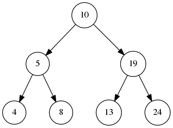

# 深度优先搜索

作者：wallace-lai </br>
发布：2024-02-15 </br>
更新：2024-02-15 <br>

## LeetCode 0094 二叉树的中序遍历
求二叉树中序遍历的递归法很简单，在这里不赘述。这里只探索迭代法，因为迭代法相对更困难一点。



所谓中序遍历指的是以**左根右**的顺序去遍历二叉树中的结点。对上面这棵二叉树，当root指针指向根结点时，你会怎么去做中序遍历？是不是会按照以下的大概顺序去作遍历。

（1）不断往左子树的方向走，直到找到最左结点，输出该结点。

（2）向上回溯，输出最左结点的父结点。注意此时如果父节点的右子树不为空，需要对右子树根结点重复步骤（1）

如果借用栈来实现上述步骤，应该怎么做呢？

（1）首先应该有一个while循环，目的是不断地往左子树走并把遍历过的结点入栈

（2）随后将栈顶元素弹出将其值添加到遍历序列的尾部

（3）将指针设置为栈顶元素结点的右子树，目的是对右子树重复步骤（1）

最终代码实现如下所示：

```cpp
vector<int> result;

vector<int> inorderTraversal(TreeNode* root) {
    stack<TreeNode*> stk;
    TreeNode *curr = root;
    while (curr != nullptr || !stk.empty()) {
        while (curr != nullptr) {
            stk.push(curr);
            curr = curr->left;
        }

        curr = stk.top();
        stk.pop();
        result.push_back(curr->val);
        curr = curr->right;
    }

    return result;
}
```

## LeetCode 0105 从前序与中序遍历序列构造二叉树【中等】
[链接](https://leetcode.cn/problems/construct-binary-tree-from-preorder-and-inorder-traversal/description/)

二叉树的前序遍历形式为：

```
[ 根节点, [左子树的前序遍历结果], [右子树的前序遍历结果] ]
```

中序遍历形式为：

```
[ [左子树的中序遍历结果], 根节点, [右子树的中序遍历结果] ]
```

从前序与中序遍历序列中还原成原始二叉树的思路为：

（1）获取二叉树前序遍历序列中的第一个元素作为根结点

（2）然后去中序遍历序列中找到根结点，这样就将中序序列分成了左右子树两个部分

（3）递归地对左右子树重复上述步骤，直到把整棵树给构造出来

注意有个可以优化的点是：因为树结点值不重复，所以可以使用哈希表保存结点值在中序遍历序列中的位置，以便快速查找根结点在中序遍历序列中的位置。核心代码如下：

```cpp
TreeNode *BuildTree(vector<int> &pre, int preBeg, int preEnd, vector<int> &in, int inBeg, int inEnd) {
    TreeNode *root = nullptr;

    if (preEnd - preBeg >= 1) {
        root = new TreeNode(pre[preBeg]);
        int rootPos = pos[root->val];
        int leftSize = rootPos - inBeg;
        root->left = BuildTree(pre, preBeg + 1, preBeg + 1 + leftSize, in, inBeg, inBeg + leftSize);
        root->right = BuildTree(pre, preBeg + 1 + leftSize, preEnd, in, inBeg + leftSize + 1, inEnd);
    }

    return root;
}

TreeNode* buildTree(vector<int>& preorder, vector<int>& inorder) {
    for (size_t i = 0; i < inorder.size(); i++) {
        pos[inorder[i]] = i;
    }

    return BuildTree(preorder, 0, preorder.size(), inorder, 0, inorder.size());
}
```

## LeetCode 0106 从中序与后序遍历序列构造二叉树【中等】
[链接](https://leetcode.cn/problems/shortest-bridge/description/)

和上一题是类似的，仍然是递归地构建即可，核心代码如下：

```cpp
TreeNode *Build(vector<int> &post, int postBeg, int postEnd, vector<int> &in, int inBeg, int inEnd) {
    TreeNode *result = nullptr;

    if (postEnd - postBeg >= 1) {
        int root = post[postEnd - 1];
        int rootPos = pos[root];
        int leftSize = rootPos - inBeg;

        result = new TreeNode(root);
        result->left = Build(post, postBeg, postBeg + leftSize, in, inBeg, inBeg + leftSize);
        result->right = Build(post, postBeg + leftSize, postEnd - 1, in, inBeg + leftSize + 1, inEnd);
    }

    return result;
}
```

## LeetCode 0144 二叉树的前序遍历
前序遍历指的是按照**根左右**的顺序遍历二叉树中的结点，前序遍历用迭代法实现相对比较简单，只需要在遍历根结点的时候将左右子树放入栈中作为下一步遍历的起始结点即可。其代码实现如下所示：

```cpp
vector<int> result;

vector<int> preorderTraversal(TreeNode* root) {
    if (root == nullptr) {
        return result;
    }

    stack<TreeNode*> stk;
    stk.push(root);
    TreeNode *curr;
    while (!stk.empty()) {
        curr = stk.top();
        stk.pop();
        result.push_back(curr->val);
        // 注意左子树应该在右子树之前被遍历
        // 按照后进先出的特性右子树应该先入栈
        if (curr->right != nullptr) {
            stk.push(curr->right);
        }
        if (curr->left != nullptr) {
            stk.push(curr->left);
        }
    }

    return result;
}
```

## LeetCode 0145 二叉树的后序遍历

后序遍历指的是按照**左右根**的顺序遍历二叉树中的结点，观察前序和后序遍历的不同。如果将前序遍历进行逆序，那么得到的顺序是**右左根**，和后序遍历的差别在于左右的顺序不同而已。

由此得到后序遍历的迭代算法思路如下：借用前序遍历框架得到**根右左**的遍历顺序，然后再将结果逆序，由此得到后序遍历的结果。代码如下所示：

```cpp
vector<int> result;

vector<int> postorderTraversal(TreeNode* root) {
    if (root == nullptr) {
        return result;
    }

    stack<TreeNode*> stk;
    stk.push(root);
    TreeNode *curr;
    while (!stk.empty()) {
        curr = stk.top();
        stk.pop();
        result.push_back(curr->val);
        // 注意和前序遍历的区别
        if (curr->left != nullptr) {
            stk.push(curr->left);
        }
        if (curr->right != nullptr) {
            stk.push(curr->right);
        }
    }

    reverse(result.begin(), result.end());
    return result;
}
```

## LeetCode 0590 N叉树的后序遍历【简单】

[链接](https://leetcode.cn/problems/n-ary-tree-postorder-traversal/description/)

比较简单，观察可知我只需要遵循以下的两个规则就能得到N叉树的后序遍历：

（1）如果结点存在子树，则优先遍历子树

（2）同级别的子树之间按照从左到右的顺序进行层序遍历

关键代码如下：

```cpp
void DFS(Node *root, vector<int> &result) {
    if (root == nullptr) {
        return;
    }

    for (auto &x : root->children) {
        DFS(x, result);
    }
    result.push_back(root->val);
}
```

## LeetCode 0797 所有可能的路径【中等】

[链接](https://leetcode.cn/problems/all-paths-from-source-to-target/description/)

比较简单，直接DFS搜索即可
