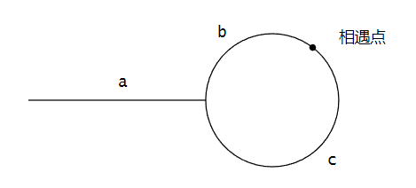

# 链表

作者：wallace-lai </br>
发布：2024-02-25 </br>
更新：2024-08-05 <br>

## 简单和中等

### LeetCode 0021 合并两个有序链表

```cpp
    ListNode* mergeTwoLists(ListNode* list1, ListNode* list2) {
        ListNode dummy;
        ListNode *p = &dummy;

        while (list1 != nullptr && list2 != nullptr) {
            if (list1->val < list2->val) {
                p->next = list1;
                list1 = list1->next;
            } else {
                p->next = list2;
                list2 = list2->next;
            }
            p = p->next;
        }

        ListNode *remain = (list1 != nullptr ? list1 : list2);
        while (remain != nullptr) {
            p->next = remain;
            remain = remain->next;
            p = p->next;
        }

        return dummy.next;
    }
```

### LeetCode 0141 环形链表

思路：

（1）要判断单链表是否存在环，可以让快慢指针同时指向头结点，每次快指针往前走2步，慢指针往前走1步；

（2）重复步骤（1），如果走到最后发现快慢指针相遇了，则说明有环；如果走到最后快指针为空且没有和慢指针相遇则说明没有环；

```cpp
    bool hasCycle(ListNode *head) {
        ListNode *fast = head;
        ListNode *slow = head;
        while (fast != nullptr && fast->next != nullptr) {
            fast = fast->next->next;
            slow = slow->next;
            if (fast == slow) {
                return true;
            }
        }

        return false;
    }
```

### LeetCode 0142 环形链表2

思路：

假设链表中环外部分长度为$a$，slow指针又走了$b$的距离后与fast指针相遇。此时fast指针已经走过了环的$n$圈。此时fast指针所走过的距离为：

$$
a + n(b + c) + b
$$

由于任意时刻fast指针所走过的距离都是slow指针的两倍，所以有：

$$
a + n(b + c) + b = 2(a + b)
$$

即：

$$
a = c + (n - 1)(b + c)
$$

所以此时，如果让slow指针重新指向头结点，与fast指针一起每次都往前走1步。那么最终当slow指针走完了$a$步后，fast指针一定是走完了$n-1$圈后，又往前走了$c$步。此时slow和fast恰好在环点相遇了。




```cpp
    ListNode *detectCycle(ListNode *head) {
        if (!hasCycle(head)) {
            return nullptr;
        }

        ListNode *fast = head;
        ListNode *slow = slow;
        while (fast != nullptr && fast->next != nullptr) {
            fast = fast->next->next;
            slow = slow->next;
            if (fast == slow) {
                break;
            }
        }

        slow = head;
        while (slow != fast) {
            fast = fast->next;
            slow = slow->next;
        }

        return slow;
    }
```

### LeetCode 0160 相交链表

解题代码如下所示，思路很简单：让两个指针沿着链表往前走，**一旦到头就将指针值替换成另一条链表的头结点**。这样当两个指针相等时，指针所指向的结点就是两链表相交的结点。

```cpp
ListNode *getIntersectionNode(ListNode *l1, ListNode *l2) {
    ListNode *A = l1;
    ListNode *B = l2;
    while (A != B) {
        A = (A != nullptr) ? A->next : l2;
        B = (B != nullptr) ? B->next : l1;
    }

    return A;
}
```

### LeetCode 0206 反转链表

**方法一：使用递归**

反转链表是很多链表题目的基础操作，这里提供两种实现方法。首先是递归法，代码如下所示：

```cpp
ListNode* reverseList(ListNode* head) {
    if (head == nullptr || head->next == nullptr) {
        return head;
    }

    ListNode *newHead = reverseList(head->next);
    head->next->next = head;
    head->next = nullptr;
    return newHead;
}
```

**方法二：使用迭代**

其次是迭代法，代码如下所示：

```cpp
ListNode* reverseList(ListNode* head) {
    ListNode dummy(0, nullptr);
    ListNode *tail;

    while (head != nullptr) {
        tail = head->next;
        head->next = dummy.next;
        dummy.next = head;
        head = tail;
    }

    return dummy.next;
}
```

### LeetCode 0092 反转链表2

【pending】

### LeetCode 0234 回文链表

**思路一**

最简单的思路是：

（1）先遍历链表，将序列存在vector中；

（2）根据vector中的内容判断是否为回文链表。

**思路二**

但是该方法的空间复杂度是`O(N)`，如果需要空间复杂度为`O(1)`的方法，可以按照下面的步骤来做：

（1）找到链表的中间结点；

（2）对中间结点后的链表部分进行逆序；

（3）比较链表的前后两半部分是否相同，若是则说明是回文串；否则不是

```cpp
    bool isPalindrome(ListNode* head) {
        // 寻找中点
        ListNode *slow = head;
        ListNode *fast = head;
        while (fast != nullptr && fast->next != nullptr) {
            slow = slow->next;
            fast = fast->next->next;
        }
        if (fast != nullptr) {
            // 结点个数为奇数
            slow = slow->next;
        }

        // 逆序中点右侧部分链表
        ListNode *left = head;
        ListNode *right = reverseList(slow);

        // 开始比较
        while (right != nullptr) {
            if (left->val != right->val) {
                return false;
            }
            left = left->next;
            right = right->next;
        }

        return true;
    }
```


**思路三：使用递归**

先扩展一个概念，即单链表的“前序遍历”和“后续遍历”，如下所示，一目了然：

```cpp
    void PreOrderTraverse(ListNode *head) {
        if (head == nullptr) {
            return;
        }

        cout << head->val << endl;
        PreOrderTraverse(head->next);
    }

    void PostOrderTraverse(ListNode *head) {
        if (head == nullptr) {
            return;
        }

        PostOrderTraverse(head->next);
        cout << head->val << endl;
    }
```

利用单链表的后序遍历，我们可以得到单链表的逆序结果，所以判断单链表是否为回文链可以这么做：

```cpp
    void doCheck(ListNode **left, ListNode *right, bool *result) {
        if (*result == false) {
            // 一旦在某一步当中判断为不是回文则直接快速返回
            return;
        }
        if (right == nullptr) {
            return;
        }

        doCheck(left, right->next, result);
        if ((*left)->val != right->val) {
            *result = false;
            return;
        }
        *left = (*left)->next;
    }

    bool isPalindrome(ListNode* head) {
        ListNode *left = head;
        bool result = true;
        doCheck(&left, head, &result);
        return result;
    }
```


### LeetCode 0705 设计哈希集合

解题思路很简单，简单写一个拉链法的哈希桶即可，代码略。

### LeetCode 0706 设计哈希映射

思路很简单，和LeetCode 0705非常类似，代码略。

### LeetCode 0876 链表的中间结点

思路：

（1）要寻找中间结点，可以让快慢指针同时指向链表第一个结点，随后快指针每次往前走2步，慢指针每次往前走1步；

（2）重复步骤（1），直到**快指针为空，或者快指针的next为空**；

```cpp
    ListNode* middleNode(ListNode* head) {
        ListNode *slow = head;
        ListNode *fast = head;
        while (fast != nullptr && fast->next != nullptr) {
            fast = fast->next->next;
            slow = slow->next;
        }

        return slow;
    }
```

### LeetCode 0019 删除链表倒数第N个结点

思路：

（1）让快慢指针指向链表第一个结点，快指针先往前走K步，随后快慢指针同时往前走，直到快指针走到头。这样可以找到倒数第K个结点（slow指针指向的即是）；

```cpp
    ListNode *findReverseKth(ListNode *head, int k) {
        ListNode *slow = head;
        ListNode *fast = head;
        for (int i = 0; i < k; i++) {
            fast = fast->next;
        }
        while (fast != nullptr) {
            slow = slow->next;
            fast = fast->next;
        }

        return slow;
    }
```

（2）要想删除单链表倒数第n个结点，就要找到倒数第n + 1个结点。注意此时要使用哑结点；

（3）找到倒数第n + 1个结点后，按照单链表方式删除即可

```cpp
    ListNode* removeNthFromEnd(ListNode* head, int n) {
        // 单链表要删除倒数第n个结点，则要找到倒数第n + 1个结点
        // 当n和链表元素个数相等时，第n + 1个结点会指向链表第1个结点的前一个结点
        // 所以需要加上一个哑结点来表示第0个虚拟结点
        ListNode dummy(0, head);
        ListNode *prev = findReverseKth(&dummy, n + 1);
        prev->next = prev->next->next;
        return dummy.next;
    }
```

### LeetCode 0086 分隔链表

```cpp
    ListNode* partition(ListNode* head, int x) {
        ListNode l1;
        ListNode l2;
        ListNode *p1 = &l1;
        ListNode *p2 = &l2;

        ListNode dummy(0, head);
        ListNode *curr = dummy.next;
        while (curr != nullptr) {
            // 将curr结点移动到新链表中
            if (curr->val < x) {
                p1->next = curr;
                p1 = p1->next;
            } else {
                p2->next = curr;
                p2 = p2->next;
            }

            // 将curr结点与后序结点断链
            dummy.next = curr->next;
            curr->next = nullptr;
            curr = dummy.next;
        }

        // 将链表2合并到链表1的末尾
        p1->next = l2.next;
        return l1.next;
    }
```

### LeetCode 0143 重排链表


解题思路如下：

（1）先通过快慢指针将链表分为左右两部分，对右边部分进行逆序

（2）对左边部分和逆序后的右半部分进行merge操作即可

核心代码如下：

```cpp
void reorderList(ListNode* head) {
    ListNode *mid = FindMiddle(head);

    ListNode *l1 = head;
    ListNode *l2 = reverseList(mid->next);
    mid->next = nullptr;

    ListNode dummy(0, nullptr);
    ListNode *curr = &dummy;
    while (l1 != nullptr && l2 != nullptr) {
        curr->next = l1;
        l1 = l1->next;
        curr = curr->next;

        curr->next = l2;
        l2 = l2->next;
        curr = curr->next;
    }
    curr->next = l1;

    return;
}
```

### LeetCode 0146 LRU缓存

解题思路如下：

（1）首先维护一个双向链表，因为要满足LRU的规则需要频繁地将链表中的元素移动到链表头部，所以选择便于删除的双向链表

（2）还要维护一个key到对应链表结点的映射表，目的是快速地找到在缓存中的key-value对

### LeetCode 0148 排序链表

对于链表而言，似乎更容易使用归并排序算法对其进行排序。

（1）不断地寻找链表中点，将链表一分为二，对左右两部分递归地进行排序

（2）如果递归到只剩一个结点，直接返回即可

（3）对返回的左右两部分有序链表进行合并操作

核心代码如下：

```cpp
ListNode *sort(ListNode *head, ListNode *tail) {
    if (head == nullptr) {
        return head;
    }
    if (head->next == tail) {
        head->next = nullptr;
        return head;
    }

    ListNode *slow = head;
    ListNode *fast = head;
    while (fast != tail) {
        slow = slow->next;
        fast = fast->next;
        if (fast != tail) {
            fast = fast->next;
        }
    }
    ListNode *mid = slow;

    return merge(sort(head, mid), sort(mid, tail));
}

ListNode* sortList(ListNode* head) {
    return sort(head, nullptr);
}
```


### LeetCode 0445 两数相加2

解题思路很简单，先把两个链表逆序，然后再模拟加法计算即可。计算得到新结点以头插法的形式插入这样可以避免对结果链表再次进行逆序。


## 困难

### LeetCode 0023 合并K个升序链表

**方法一：使用递归**

思路：

（1）使用二分法不断地将`lists`一分为二，直到最后只剩下一条链表或者两条链表为止；

（2）如果只剩一条链表，直接返回即可；如果剩下两条链表则合并这两条链表并返回；

（3）在返回的过程中，不断两两合并，最后得到一条合并后的完整链表；

```cpp
    ListNode *mergeTwoLists(ListNode *l1, ListNode *l2) {
        // 合并两条有序链表
    }

    ListNode *doMerge(vector<ListNode *> &lists, int left, int right) {
        if (left == right) {
            // 只剩一条链表
            return lists[left];
        }
        if (left + 1 == right) {
            // 只剩两条链表
            return mergeTwoLists(lists[left], lists[right]);
        }

        int mid = left + (right - left) / 2;
        return mergeTwoLists(doMerge(lists, left, mid), doMerge(lists, mid + 1, right));
    }

    ListNode* mergeKLists(vector<ListNode*>& lists) {
        if (lists.size() == 0) {
            return nullptr;
        }

        return doMerge(lists, 0, lists.size() - 1);
    }
```

**方法二：使用优先队列**

思路：

（1）创建小顶堆的优先队列，将所有链表的第一个结点加入，因为K个链表中最小结点一定在所有链表的第一个结点之中；

（2）从小顶堆中取出当前最小的结点，加入到新创建链表中，如果最小结点的next不为空，则将其next结点加入到小顶堆中；

（3）重复步骤（2），直到队列为空为止；

```cpp
    struct Compare {
        bool operator()(const ListNode *l, const ListNode *r) {
            return l->val > r->val;
        }
    };

    ListNode* mergeKLists(vector<ListNode*>& lists) {
        if (lists.size() == 0) {
            return nullptr;
        }

        ListNode dummy;
        ListNode *curr = &dummy;

        priority_queue<ListNode *, vector<ListNode *>, Compare> pq;
        for (int i = 0; i < lists.size(); i++) {
            if (lists[i] != nullptr) {
                pq.push(lists[i]);
            }
        }

        while (!pq.empty()) {
            ListNode *minNode = pq.top();
            pq.pop();

            curr->next = minNode;
            if (minNode->next != nullptr) {
                pq.push(minNode->next);
            }
            curr = curr->next;
        }

        return dummy.next;
    }
```

