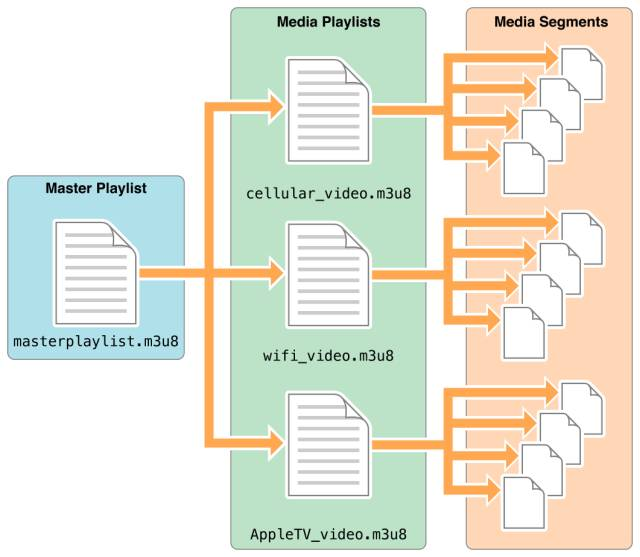

# m3u8原理

## 一、m3u8文件
m3u8文件是一个播放列表playlist索引，记录了一系列媒体片段资源，顺序播放这些片段资源即可完整展示这段多媒体资源。

### m3u8协议的好处
对于长视频而言， 由于moov比较大，头部解析比较耗时，缓存是以整个文件为单位的，而m3u8切片的方式保证了可以单独下载单独缓存，提高了复用率。

另外m3u8还可以 根据用户的网络带宽情况，自动为客户端匹配一个合适的码率文件进行播放，从而保证视频的流畅度。
<p style="color:red;">
补充知识：
</p>

视频的moov指的是MP4文件中的数据信息，是MP4视频的头部信息。它至少包含mvhd标签、cmov标签、rmra标签这三种Atom中的一种。只有解析出moov信息，才能完整识别这个MP4视频，否则无法解析MP4的核心数据mdat。

长视频的mp4文件的moov会比较大。因为moov包含了整个视频文件的元数据，这些元数据描述了视频的结构、编码方式、时长、分辨率等信息。对于长时长视频来说，由于视频时长较长，包含的视频帧和元数据量也相对比较大，因此需要更多的元数据来描述这些信息，从而导致moov的大小相对较大。

### 1.1 m3u8文件实例
下面是一个实际的m3u8文件（部分）。

```shell
#EXTM3U
#EXT-X-VERSION:3
#EXT-X-MEDIA-SEQUENCE:0
#EXT-X-ALLOW-CACHE:YES
#EXT-X-TARGETDURATION:16
#EXTINF:15.520000,
out-0000.ts
#EXTINF:14.360000,
out-0001.ts
#EXTINF:15.720000,
out-0002.ts
#EXTINF:14.720000,
out-0003.ts
#EXTINF:14.440000,
out-0004.ts
...
#EXTINF:14.720000,
out-0015.ts
#EXTINF:9.960000,
out-0016.ts
#EXT-X-ENDLIST
```

其中各字段的含义：
- `#EXTM3U`

M3U8文件的标记，它指明该文件是一个M3U8文件。M3U8文件是一个文本文件，其中包含了媒体文件的播放列表

- `#EXT-X-VERSION:3`

表示HLS协议的版本号，目前HLS协议主要有3个版本，分别是1.0、2.0、3.0

- `#EXT-X-MEDIA-SEQUENCE:0`

定义了播放列表中媒体文件的序列号，这里，序列号从0开始

- `#EXT-X-ALLOW-CACHE:YES`

表示是否允许客户端缓存媒体文件，这里的设置是允许

- `#EXT-X-TARGETDURATION:16`

定义了目标持续时间，单位是秒。它表示播放列表中任何媒体片段的持续时间都不应该超过这个时间长度。在这里，目标持续时间是16秒

- `#EXTINF:15.520000`

`EXTINF`标签用于指定媒体片段的持续时间。这里的媒体片段out-0000.ts的持续时间是15.52秒。`,`后面通常会跟随一个媒体片段的标题，但在这个例子中标题被省略了

- `out-0000.ts`

这是一个媒体片段的文件名。它与上一个`#EXTINF`标签相关联，表示一个持续时间为15.52秒的媒体片段

- `#EXT-X-ENDLIST`

表示播放列表的结束，当客户端播放器遇到`#EXT-X-ENDLIST`时，它将停止从该播放列表中获取媒体片段并开始播放已缓存的媒体片段

注意上面的m3u8文件中没有提供ts分片文件的下载地址，是因为这些m3u8文件采用了加密或者隐藏的方法，以防止未经授权的访问和下载。这种情况下，只有通过特定的授权或者验证方式，才能够获取到ts分片文件的下载地址。另外，一些m3u8文件可能只是提供了视频的直播流，而没有提供ts分片文件的下载链接，这种情况下也无法直接下载ts分片文件

## 二、ts文件
ts文件是多媒体文件的一个切片文件，可以直接播放

### 2.1 HLS加密原理
HLS是目前最成熟的支持流媒体加密的能应用在浏览器里的流媒体传输协议，HLS 原生支持加密，下面来详细介绍它。在介绍如何加密 HLS 先了解下 HLS 相比于其它流媒体传输协议的优缺点。

优点在于：

- 建立在 HTTP 之上，使用简单，接入代价小
- 分片技术有利于 CDN 加速技术的实施
- 部分浏览器原生支持，支持点播和录播

缺点在于：

- 用作直播时延迟太大。
- 移动端支持还好，PC端只有Safari原生支持。

#### HLS加密原理
HLS由两部分构成，一个是`.m3u8`文件，一个是`.ts`视频文件（TS 是视频文件格式的一种）。整个过程是，浏览器会首先去请求`.m3u8`的索引文件，然后解析`m3u8`，找出对应的`.ts`文件链接，并开始下载。



m3u8文件是一个文本文件，在开启HLS加密后，内容大致如下：

```shell
#EXTM3U
#EXT-X-VERSION:6
#EXT-X-TARGETDURATION:10
#EXT-X-MEDIA-SEQUENCE:26

#EXT-X-KEY:METHOD=AES-128,URI="https://priv.example.com/key.do?k=1"
#EXTINF:9.901,
http://media.example.com/segment26.ts

#EXT-X-KEY:METHOD=AES-128,URI="https://priv.example.com/key.do?k=2"
#EXTINF:9.501,
http://media.example.com/segment28.ts
```

文件内容描述了每个ts分片的URL，但这些分片都是加密后的内容，要还原出原内容需要从

```shell
#EXT-X-KEY:METHOD=AES-128,URI="https://priv.example.com/key.do?k=1"
```

中解析出获取解密密钥的URL（`https://priv.example.com/key.do`）和对称加密算法`AES-128`。获取到密钥后再在客户端解密出原内容。可以看出启用HLS加密后会多出更多的事情：

- 针对每个ts需要去请求密钥
- 需要多提供一个给客户端获取密钥的鉴权服务
- 针对每个ts需要去执行对称加密的解密计算

以上这些动作会带来更多的网络请求和计算量，可能会对延迟和性能造成一定的不良影响。

# 12-09 进度