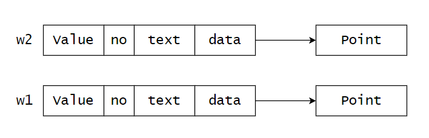
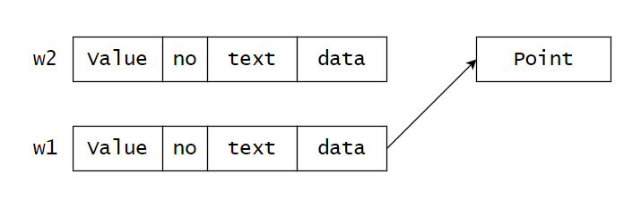
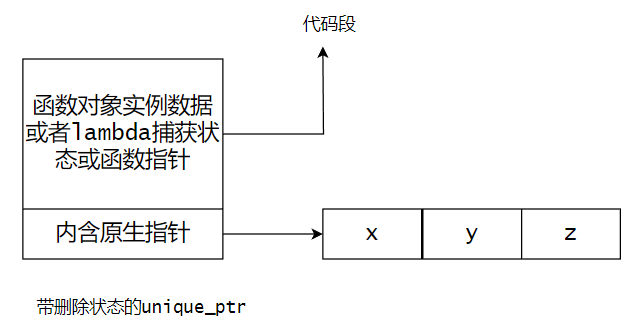
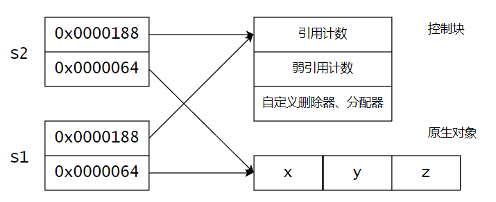

# 【C/C++】从内存角度透视现代C++的（部分）关键特性

作者：wallace-lai </br>
发布：2024-03-13 </br>
更新：2024-03-14 </br>

## 一、理解对象的移动

考虑下面的一个常见对象Widget：

```cpp
struct Point {
    int x;
    int y;
};

struct WidgetBase {
    double value;
};

struct Widget : WidgetBase {
    int no;
    std::string text;
    Point *data;
};
```

### 它的深拷贝是如何实现的？

类Widget的内存布局示意图（忽略string中的指针）如下：



如下所示，要实现对`w2`的完整深拷贝：

```cpp
Widget w1, w2;
w1 = w2;
```

需要做以下几件事：

（1）拷贝`WidgetBase`基类（委托给`WidgetBase`的拷贝构造函数）；

（2）拷贝基本类型`int no`；

（3）拷贝对象类型`string text`（调用string的拷贝构造函数）；

（4）深拷贝指针类型`Point *data`（创建堆内存指针，调用构造函数）；


### 它的移动是如何实现的？

理解了深拷贝的过程，那么移动的过程就很好理解了，内存布局示意图如下所示：



如下所示，要实现对`w2`的移动，

```cpp
Widget w1, w2;
w1 = std::move(w2);
```

需要这么做：

（1）对`WidgetBase`基类执行`std::move`；

（2）拷贝基本类型`int no`（基本类型的移动即拷贝）；

（3）移动对象类型`string text`（调用`std::move`函数）；

（4）移动指针类型`Point *data`（将`w2`的当前指针设置为`nullptr`，将`w1`的当前指针指向原先的内存，这是唯一需要自己移动的成员）；

## 二、集合变更会有深拷贝代价

各种集合的`push_back`、`insert`、`emplace`、`resize`、`erase`等变更操作可能导致容器扩容。如果元素类型不支持`move`，那么扩容会触发容器上现存元素的拷贝构造（深拷贝）。

<p style="color: red;">问题：自定义类型分别支持和不支持深拷贝，观察容器扩容时的性能差异？</p>

如果元素类型支持`move`，那么扩容会更加容易，只需要：

（1）容器上现存所有元素中的内联对象会被拷贝；

（2）容器上现存所有元素中的分离内存会被“移动”；

<p style="color: red;">问题：编译器什么情况下会，什么情况下不会为对象类型生成移动构造函数？</p>

## 三、智能指针

### 带删除状态的unique_ptr



### shared_ptr内存模型




## 四、lambda表达式

### lambda捕获值

有以下lambda表达式：

```cpp
Point p1 {100, 200};
Point p2 {100, 200};

auto lam = [=] (int n)
{
    p1.print(n);
    p2.print(n);
}
```

其对应的内存布局示意如下：

```cpp
struct Lambda {
    Point p1;
    Point p2;

    Lambda(const Point &p1, const Point &p2)
        : p1(p1), p2(p2) {}
    
    void operator()(int n) {
        p1.print(n);
        p2.print(n);
    }
};
```

即：**捕获的两个值存入了Lambda结构中的成员变量中**。

### lambda捕获引用

有以下lambda表达式：

```cpp
Point p1 {100, 200};
Point p2 {100, 200};

auto lam = [&] (int n)
{
    p1.x += n;
    p2.x += n;
}
```

其对应的内存布局示意如下：

```cpp
struct Lambda {
    Point &p1;
    Point &p2;

    Lambda(const Point &p1, const Point &p2)
        : p1(p1), p2(p2) {}
    
    void operator()(int n) {
        p1.x += n;
        p2.x += n;
    }
};
```

即：**Lambda的成员变量类型变成了引用类型**。
