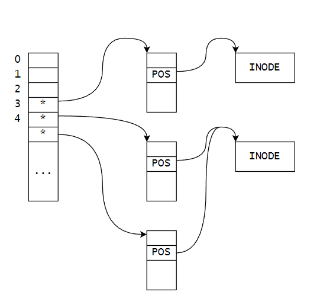

# 【Linux C】输入输出

作者：wallace-lai <br>
发布：2024-05-29 <br>
更新：2024-05-29 <br>

输入输出对应APUE上的章节为：

- 第3章：文件IO

- 第5章：标准IO库

- 第14章：高级IO

对应的教程：

（1）P123 ~ P141

（2）P220 ~ P235

## P123 ~ P124 标准IO - 介绍

IO是一切实现的基础，IO分为两种：

（1）stdio：标准IO库

（2）sysio：系统调用IO

原则：**优先使用标准IO库，而不是系统调用IO**。标准IO库的一大功能是合并系统调用，提升性能，且具有可移植性。

### 1. 标准IO主要接口

（1）打开与关闭：

- fopen()
- fclose()

（2）字符输入输出

- fgetc()
- fputc()
- fgets()
- fputs()

（3）二进制读写

- fread()
- fwrite()

（4）常用输入输出

- printf()
- scanf()

（5）设置文件位置

- fseek()
- ftell()
- rewind()

（6）刷新缓冲区
- fflush()

## P125 ~ P127 标准IO - 文件打开与关闭

### 1. 接口

（1）打开文件

```c
    #include <stdio.h>

    FILE *fopen(const char *pathname, const char *mode);

    FILE *fdopen(int fd, const char *mode);

    FILE *freopen(const char *pathname, const char *mode, FILE *stream);
```

（2）关闭文件

```c
    #include <stdio.h>

    int fclose(FILE *stream);
```

打开文件中的`mode`可以有以下几种方式：

- r：打开文件（仅）用于读，要求文件必须存在，读取位置设置在文件开头处
- r+：打开文件用于读写，要求文件必须存在，读取位置设置在文件开头处

- w：打开文件（仅）用于写，文件不存在则创建，文件存在在截断为0，写入位置在文件开头处
- w+：打开文件用于读写，文件不存在则创建，文件存在则截断为0，读写开始位置在文件开头处

- a：打开文件用于追加（写），文件不存在则创建，追加位置在文件末尾处
- a+：打开文件用于读和追加，文件不存在则创建，追加和读位置在文件开头处（glibc）

### 2. 打开文件应用实例1

```c
int main()
{
    FILE *fp = fopen("noexist", "w+");
    if (fp == NULL) {
        perror("fopen()");
        exit(1);
    }
    puts("OK");

    fclose(fp);
    return 0;
}
```

### 3. 打开文件应用实例2 - 可打开文件个数上限

```c
int main()
{
    FILE *fp = NULL;
    int count = 0;

    while (1) {
        fp = fopen("fopen.c", "r");
        if (fp == NULL) {
            perror("fopen()");
            break;
        }
        count++;
    }
    printf("count = %d\n", count);

    return 0;
}
```

运行查看程序结果：

```shell
$ ./fopen_max
fopen(): Too many open files
count = 1021

$ ulimit -a
core file size          (blocks, -c) 0
data seg size           (kbytes, -d) unlimited
scheduling priority             (-e) 0
file size               (blocks, -f) unlimited
pending signals                 (-i) 15188
max locked memory       (kbytes, -l) 65536
max memory size         (kbytes, -m) unlimited
open files                      (-n) 1024
pipe size            (512 bytes, -p) 8
POSIX message queues     (bytes, -q) 819200
real-time priority              (-r) 0
stack size              (kbytes, -s) 8192
cpu time               (seconds, -t) unlimited
max user processes              (-u) 15188
virtual memory          (kbytes, -v) unlimited
file locks                      (-x) unlimited
```

可以看到内核限制进程可打开的文件个数open files为1024个，由于标准输入、输出、错误占用了3个文件个数，所以可打开的文件个数上限为1021个。

## P128 标准IO - 字符输入输出

### 1. 输入字符
```c
    #include <stdio.h>

    int fgetc(FILE *stream);
    int getc(FILE *stream);

    int getchar(void);
```

getc与fgetc等价，但它是个宏。而fgetc是函数。

```c
    #include <stdio.h>

    int fputc(int c, FILE *stream);
    int putc(int c, FILE *stream);
    int putchar(int c);
    int puts(const char *s);
```

### 2. 字符输入输出应用案例1

[完整源码](https://github.com/wallace-lai/learn-apue/blob/main/src/io/stdio/mycopy.c)

基于读写字符串的mycpy实现。

```c
    fpSrc = fopen(argv[1], "r");
    if (fpSrc == NULL) {
        perror("fopen()");
        exit(1);
    }

    fpDst = fopen(argv[2], "w");
    if (fpDst == NULL) {
        fclose(fpSrc);
        perror("fopen()");
        exit(1);
    }

    while (1) {
        ch = fgetc(fpSrc);
        if (ch == EOF) {
            break;
        }
        fputc(ch, fpDst);
    }
```

解释：

（1）当fgetc返回EOF时表示读取文件完毕，此时需要退出循环

## P129 标准IO - fread和fwrite

### 1. fgets

```c
    char *fgets(char *s, int size, FILE *stream);
```

```
fgets()  reads in at most one less than size characters from stream and stores
them into the buffer pointed to by s.  Reading stops after an EOF  or  a  new‐
line.  If a newline is read, it is stored into the buffer.  A terminating null
byte ('\0') is stored after the last character in the buffer.
```

### 2. fgets应用案例1

[完整源码](https://github.com/wallace-lai/learn-apue/blob/main/src/io/stdio/mycopy_fgets.c)

使用fgets重写mycpy程序。

```c
    char buffer[BUFSIZE];
    while (fgets(buffer, BUFSIZ, fpSrc) != NULL) {
        fputs(buffer, fpDst);
    }
```

解释：

（1）fgets返回NULL时表示文件读取结束

### 3. fread和fwrite

```c
    #include <stdio.h>

    size_t fread(void *ptr, size_t size, size_t nmemb, FILE *stream);
    size_t fwrite(const void *ptr, size_t size, size_t nmemb, FILE *stream);
```

### 4. fread和fwrite应用案例1

```c
    int n = 0;
    while ((n = fread(buffer, 1, BUFSIZ, fpSrc)) > 0) {
        fwrite(buffer, 1, n, fpDst);
    }
```

解释：

（1）fread和fwrite适合工整的结构体内容读取

（2）为了避免可能的错误，建议将size设置成1，把nmemb设置成为缓冲区的大小

（3）注意fread返回的是实际读取到的对象的个数

## P130 标准IO - printf和scanf函数族

### 1. printf函数族

```c
    #include <stdio.h>

    int printf(const char *format, ...);
    int fprintf(FILE *stream, const char *format, ...);
    int dprintf(int fd, const char *format, ...);
    int sprintf(char *str, const char *format, ...);
    int snprintf(char *str, size_t size, const char *format, ...);
```

（1）printf是往标准输出中输出内容

（2）fprintf可以指定往哪个文件中输出内容

（3）dprintf是往某个fd文件描述符中输出内容

（4）sprintf是往buffer中格式化输出内容

（5）snprintf是往buffer中格式化输出内容，同时限定最大可写入的大小

### 2. 字符串转整数

```c
    #include <stdlib.h>

    int atoi(const char *nptr);
    long atol(const char *nptr);
    long long atoll(const char *nptr);
```

### 3. scanf函数族

```c
    #include <stdio.h>

    int scanf(const char *format, ...);
    int fscanf(FILE *stream, const char *format, ...);
    int sscanf(const char *str, const char *format, ...);
```

## P131 ~ P132 标准IO - fseek和ftell

### 1. 定位流

```c
    #include <stdio.h>

    int fseek(FILE *stream, long offset, int whence);
    long ftell(FILE *stream);
    void rewind(FILE *stream);
```

对于fseek，其功能为在whence的基础上，便宜offset大小。其参数含义如下：

（1）stream：要定位的流

（2）offset：偏移量

（3）whence：相对位置

- SEEK_SET：文件首
- SEEK_CUR：当前位置
- SEEK_END：文件尾

fseek和ftell的丑陋之处：

（1）offset的类型为long

long有多大？不知道；为什么用带类型的long而不是unsigned long？这正是fseek的丑陋之处。

**使用下面的函数来替代丑陋的fseek和ftell**：

```c
    #include <stdio.h>

    int fseeko(FILE *stream, off_t offset, int whence);

    off_t ftello(FILE *stream);
```

解释：

（1）`off_t`类型有多大？你不用管，反正它有足够的空间来表示偏移量

（2）编译时加上`_FILE_OFFSET_BITS`可以让`off_t`变成64位大小

ftell的功能为告知流当前的位置。rewind的功能为将流的位置调整到文件首。

### 2. 刷新流的缓冲区

```c
    #include <stdio.h>

    int fflush(FILE *stream);
```

### 3. 修改缓冲模式

```c
    #include <stdio.h>

    void setbuf(FILE *stream, char *buf);

    void setbuffer(FILE *stream, char *buf, size_t size);

    void setlinebuf(FILE *stream);

    int setvbuf(FILE *stream, char *buf, int mode, size_t size);
```

## P133 标准IO - getline

```c
    #include <stdio.h>

    ssize_t getline(char **lineptr, size_t *n, FILE *stream);
```

### 1. getline应用案例
[完整源码](https://github.com/wallace-lai/learn-apue/blob/main/src/io/stdio/getline.c)

统计文件每行的长度。

```c
    // !!! we must initialize line_buffer and line_length here
    char *line_buffer = NULL;
    size_t line_length = 0;
    while (1) {
        count++;
        if (getline(&line_buffer, &line_length, f) < 0) {
            break;
        }
        printf("Line %d, length  %ld, buffer length %ld\n", count, strlen(line_buffer), line_length);
        free(line_buffer);
    }
```

## P134 标准IO - 临时文件

为什么要有专门的接口用于产生临时文件？主要是为了避免以下的问题出现：

（1）避免在多用户多进程的情况下出现文件名冲突

（2）没有及时销毁临时文件

### 1. 接口

```c
    #include <stdio.h>

    char *tmpnam(char *s);
    FILE *tmpfile(void);
```

解释：

（1）`tmpnam`的缺陷：产生文件名和打开文件没办法一步完成，多线程并发可能出现文件冲突；打开不关闭会导致临时文件无法销毁

（2）`tmpfile`创建的是一个匿名的临时文件，可自动被销毁


## P135 系统IO - 文件描述符的原理

### 1. 系统IO涉及的知识点

（1）文件描述符的概念

（2）文件IO操作：open、close、read、write、lseek

（3）文件IO与标准IO的区别

（4）IO效率问题

（5）文件共享

（6）原子操作

（7）程序中的重定向：dup、dup2

（8）同步：sync、fsync、fdatasync

（9）fcntl

（10）ioctl

（11）/dev/fd目录

### 2. 文件描述符原理

如下所示，所谓的文件描述符其实是一个整型数。这个整型数其实是进程地址空间中fd数组中的下标。数组中包含了一个指针，该指针指向内核中的一个数据结构。



## P136 系统IO - open和close

### 1. 接口

```c
    #include <sys/types.h>
    #include <sys/stat.h>
    #include <fcntl.h>

    int open(const char *pathname, int flags);
    int open(const char *pathname, int flags, mode_t mode);
```

注意，两个同名的open是通过变参函数的形式实现的。

```c
    #include <unistd.h>

    int close(int fd);
```

## P137 系统IO - read、write和lseek

### 1. 接口

```c
    #include <unistd.h>

    ssize_t read(int fd, void *buf, size_t count);
```

```c
    #include <unistd.h>

    ssize_t write(int fd, const void *buf, size_t count);
```

```c
    #include <sys/types.h>
    #include <unistd.h>

    off_t lseek(int fd, off_t offset, int whence);
```

### 2. 应用案例

[完整源码](https://github.com/wallace-lai/learn-apue/blob/main/src/io/sysio/mycpy_sys.c)

使用系统IO实现mycpy程序。

```c
    int sfd = open(argv[1], O_RDONLY);
    if (sfd < 0) {
        perror("open()");
        exit(1);
    }

    int dfd = open(argv[2], O_WRONLY | O_CREAT | O_TRUNC, 0600);
    if (dfd < 0) {
        close(sfd);
        perror("open()");
        exit(1);
    }

    int ret;
    ssize_t len = 0;
    char buffer[MAX_BUFSIZE];
    while (1) {
        len = read(sfd, buffer, MAX_BUFSIZE);
        if (len < 0) {
            perror("read()");
            break;
        }

        if (len == 0) {
            break;
        }

        int pos = 0;
        while (len > 0) {
            ret = write(dfd, buffer + pos, len);
            if (ret < 0) {
                perror("write()");
                close(dfd);
                close(sfd);
                exit(1);
            }

            pos += ret;
            len -= ret;
        }
    }
```

解释：

（1）以只读的方式（O_RDONLY）打开源文件

（2）以写的方式（O_WRONLY）打开目标文件，如果不存在则创建（O_CREAT），存在则截断（O_TRUNC）

（3）注意write可能不能一次将len大小的数据写完，所以需要通过循环来将所有数据写完整

## P138 系统IO - sysio和stdio之间的比较

区别：

（1）响应速度：sysio更快

（2）吞吐量：stdio更大

如何使一个程序变快？

要提升响应速度用sysio，要提升吞吐量用stdio

注意：**sysio和stdio不可混用**，这里的不可混用指的是不在同一个文件上同时使用sysio和stdio。

下面是一个对应标准输出混用sysio和stdio的案例

```c
int main()
{
    putchar('a');
    write(1, "b", 1);

    putchar('a');
    write(1, "b", 1);

    putchar('a');
    write(1, "b", 1);

    exit(0);
}
```

运行查看结果：

```shell
$ ./ab
bbbaaa
```

输出结果是sysio的3个b最先输出，stdio的3个a最后输出。这和预想的顺序不一致，所以不要混用sysio和stdio。

使用strace命令查看程序的系统调用顺序，如下所示：

```shell
// ...
write(1, "b", 1b)                        = 1
write(1, "b", 1b)                        = 1
write(1, "b", 1b)                        = 1
write(1, "aaa", 3aaa)                      = 3
exit_group(0)                           = ?
+++ exited with 0 +++
```

可以看到3个putchar，最终是合并成了一条系统调用`write(1, "aaa", 3aaa)`。

sysio和stdio之间的转换：

（1）stdio转sysio

```c
    #include <stdio.h>
    int fileno(FILE *stream);
```

（2）sysio转stdio

```c
    #include <stdio.h>
    FILE *fdopen(int fd, const char *mode);
```

## P139 系统IO - 文件共享

要求：写一个程序删除文件的第10行

【pending】

## P140 系统IO - dup和dup2

原子操作是指不可分割的操作，用于解决竞争和冲突问题

```c
    #include <unistd.h>

    int dup(int oldfd);
    int dup2(int oldfd, int newfd);

    #define _GNU_SOURCE             /* See feature_test_macros(7) */
    #include <fcntl.h>              /* Obtain O_* constant definitions */
    #include <unistd.h>

    int dup3(int oldfd, int newfd, int flags);
```

### 1. 使用案例

我们需要将标准输出重定向到`/tmp/out`下。

```c
#define FNAME "/tmp/out"

int main(int argc, char **argv)
{
    int fd = open(FNAME, O_WRONLY | O_CREAT | O_TRUNC, 0600);
    if (fd < 0) {
        perror("open()");
        exit(1);
    }

    dup2(fd, 1);

    puts("hello world!");

    exit(0);
}
```

问题：**程序结束以后，如何再将标准输出恢复关联至原先的标准输出设备？**

## P141 系统IO - fcntl和ioctl

```c
    #include <unistd.h>

    void sync(void);
    int syncfs(int fd);
```

```c
    #include <unistd.h>

    int fsync(int fd);
    int fdatasync(int fd);
```

解释：

（1）`fsync`只刷新文件内容

（2）`fdatasync`同时刷新文件内容和元数据

### 1. fcntl

功能非常杂的函数，所有关于文件描述符的操作基本都涉及到了

```c
    #include <unistd.h>
    #include <fcntl.h>

    int fcntl(int fd, int cmd, ... /* arg */ );
```

### 2. ioctl

用于控制设备相关内容

```c
    #include <sys/ioctl.h>

    int ioctl(int fd, unsigned long request, ...);
```

## P220 高级IO - 数据中继原理

