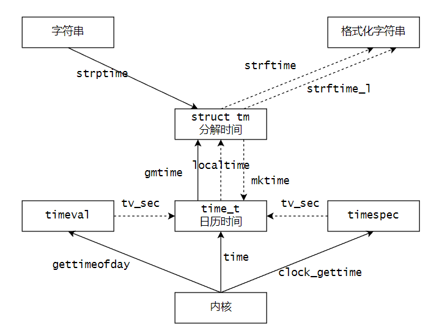
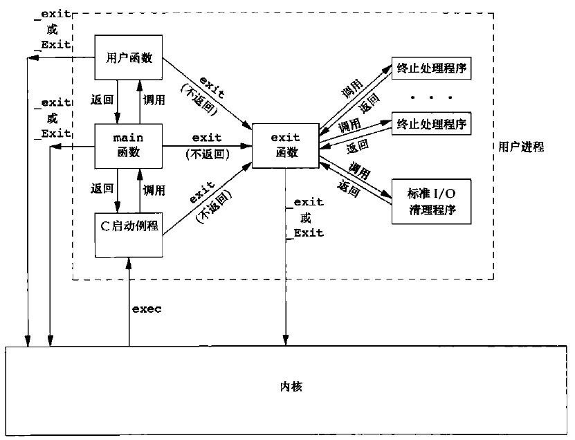
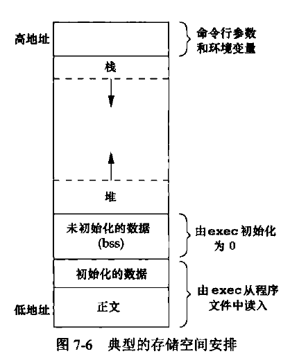

# 【Linux C】文件系统

作者：wallace-lai <br>
发布：2024-05-29 <br>
更新：2024-07-30 <br>

文件系统对应APUE上的章节为：

- 第4章：文件和目录

- 第6章：系统数据文件和信息

- 第7章：进程环境

对应的教程：P142 ~ P166

## P142 文件系统 - 介绍

### 1. 目录和文件

（1）获取文件属性

- stat
- fstat
- lstat

（2）文件访问权限

- `st_mode`是一个16位的位图，用于表示文件类型、访问权限、特殊权限位

（3）umask

（4）文件权限的更改、管理

（5）粘住位

（6）文件系统：FAT和UFS

（7）硬链接、符号链接

（8）utime

（9）目录的创建和销毁

（10）更改当前工作目录

### 2. 系统数据文件和信息

### 3. 进程环境

## P143 ~ P145 文件系统 - stat

### 1. 接口

```c
    #include <sys/types.h>
    #include <sys/stat.h>
    #include <unistd.h>

    int stat(const char *pathname, struct stat *statbuf);
    int fstat(int fd, struct stat *statbuf);
    int lstat(const char *pathname, struct stat *statbuf);

    struct stat {
        dev_t     st_dev;         /* ID of device containing file */
        ino_t     st_ino;         /* Inode number */
        mode_t    st_mode;        /* File type and mode */
        nlink_t   st_nlink;       /* Number of hard links */
        uid_t     st_uid;         /* User ID of owner */
        gid_t     st_gid;         /* Group ID of owner */
        dev_t     st_rdev;        /* Device ID (if special file) */
        off_t     st_size;        /* Total size, in bytes */
        blksize_t st_blksize;     /* Block size for filesystem I/O */
        blkcnt_t  st_blocks;      /* Number of 512B blocks allocated */

        /* Since Linux 2.6, the kernel supports nanosecond
            precision for the following timestamp fields.
            For the details before Linux 2.6, see NOTES. */

        struct timespec st_atim;  /* Time of last access */
        struct timespec st_mtim;  /* Time of last modification */
        struct timespec st_ctim;  /* Time of last status change */

    #define st_atime st_atim.tv_sec      /* Backward compatibility */
    #define st_mtime st_mtim.tv_sec
    #define st_ctime st_ctim.tv_sec
    };
```

### 2. stat应用案例

[完整源码](https://github.com/wallace-lai/learn-apue/blob/main/src/fs/flen.c)

使用stat输出文件大小

```c
static off_t flen(const char *pathname)
{
    struct stat res;
    if (stat(pathname, &res) < 0) {
        perror("stat()");
        exit(1);
    }

    return res.st_size;
}
```

### 3. 空洞文件

```c
    off_t     st_size;        /* Total size, in bytes */
    blksize_t st_blksize;     /* Block size for filesystem I/O */
    blkcnt_t  st_blocks;      /* Number of 512B blocks allocated */
```

（1）`st_size`为文件逻辑上的大小

（2）`st_blksize`为文件系统的块大小

（3）`st_blocks`为所申请的512B大小的块个数

```shell
$ stat flen.c
  File: flen.c
  Size: 560             Blocks: 8          IO Block: 4096   regular file
```

解释：文件`flen.c`大小为560字节，文件系统块大小为4K，文件`flen.c`占用了8块512B的块（扇区）

创建一个包含大量空洞的5G大小文件：

[完整源码](https://github.com/wallace-lai/learn-apue/blob/main/src/fs/big.c)

```c
    int fd = open(argv[1], O_WRONLY | O_CREAT | O_TRUNC, 0600);
    if (fd < 0) {
        perror("open()");
        exit(1);
    }

    off_t len = 5LL * 1024 * 1024 * 1024 - 1;
    ret = lseek(fd, len, SEEK_SET);
    if (ret < 0) {
        perror("lseek()");
        exit(1);
    }

    write(fd, "\0", 1);
    close(fd);
```

解释：

（1）使用lseek将文件当前位置设置到5G - 1的位置

（2）然后写入一个尾零`\0`

```shell
$ stat /tmp/bigfile
  File: /tmp/bigfile
  Size: 5368709120      Blocks: 8          IO Block: 4096   regular file
Device: fd00h/64768d    Inode: 655390      Links: 1

$ stat /tmp/bigfile.bak
  File: /tmp/bigfile.bak
  Size: 5368709120      Blocks: 8          IO Block: 4096   regular file
Device: fd00h/64768d    Inode: 655391      Links: 1
```

可以看到这个5G大小的文件实际只占用了4K大小的磁盘空间

### 4. 文件类型

（1）测试文件类型

```
    S_ISREG(m)  is it a regular file?
    S_ISDIR(m)  directory?
    S_ISCHR(m)  character device?
    S_ISBLK(m)  block device?
    S_ISFIFO(m) FIFO (named pipe)?
    S_ISLNK(m)  symbolic link?  (Not in POSIX.1-1996.)
    S_ISSOCK(m) socket?  (Not in POSIX.1-1996.)
```

（2）文件类型应用案例

[完整源码](https://github.com/wallace-lai/learn-apue/blob/main/src/fs/ftype.c)

```c
    if (stat(fname, &res) < 0) {
        perror("stat");
        exit(1);
    }

    int ret = 0;
    if (S_ISREG(res.st_mode)) {
        ret = '-';
    } else if (S_ISDIR(res.st_mode)) {
        ret = 'd';
    } else if (S_ISCHR(res.st_mode)) {
        ret = 'c';
    } else if (S_ISBLK(res.st_mode)) {
        ret = 'b';
    } else if (S_ISFIFO(res.st_mode)) {
        ret = 'p';
    } else if (S_ISSOCK(res.st_mode)) {
        ret = 's';
    } else if (S_ISLNK(res.st_mode)) {
        ret = 'l';
    } else {
        ret = '?';
    }

    return ret;
```

（3）`st_mode`位图定义

```
The following mask values are defined for the file mode component of the st_mode field:

    S_ISUID     04000   set-user-ID bit (see execve(2))
    S_ISGID     02000   set-group-ID bit (see below)
    S_ISVTX     01000   sticky bit (see below)

    S_IRWXU     00700   owner has read, write, and execute permission
    S_IRUSR     00400   owner has read permission
    S_IWUSR     00200   owner has write permission
    S_IXUSR     00100   owner has execute permission

    S_IRWXG     00070   group has read, write, and execute permission
    S_IRGRP     00040   group has read permission
    S_IWGRP     00020   group has write permission
    S_IXGRP     00010   group has execute permission

    S_IRWXO     00007   others (not in group) have read,  write,  and
                        execute permission
    S_IROTH     00004   others have read permission
    S_IWOTH     00002   others have write permission
    S_IXOTH     00001   others have execute permission
```

## P145 ~ P146 文件系统 - 文件权限的更改

### 1. umask

创建文件时如果没有指定访问权限，则其默认值为`0600 & ~umask`。umask的作用是防止产生权限过大的文件

```c
    #include <sys/types.h>
    #include <sys/stat.h>

    mode_t umask(mode_t mask);
```

### 2. 更改文件权限

```c
    #include <sys/stat.h>

    int chmod(const char *pathname, mode_t mode);
    int fchmod(int fd, mode_t mode);
```

### 3. 粘住位

t位（粘住位）的原始设计是针对二进制可执行文件，设置t位后可保留其使用痕迹，下次再次装载运行该文件时可以更快速。

现在最常用的是给目录设置t位，比如`/tmp`目录就设置了t位

```shell
$ ls -l /
dr-xr-xr-x  13 root root          0 Jul 23 22:55 sys
drwxrwxrwt  15 root root      12288 Jul 23 23:26 tmp
drwxr-xr-x  14 root root       4096 Aug 31  2022 usr
drwxr-xr-x  15 root root       4096 Jun 14 16:11 var
```

### 4. FAT文件系统

略

## P147 文件系统 - UFS文件系统

略

## P148 文件系统 - 链接文件

### 1. 命令
（1）创建硬链接：`ln /tmp/bigfile /tmp/bigfile_link`

（2）创建符号链接：`ls -s /tmp/bigfile /tmp/bigfile_s`

注意：硬链接与目录项是同义词，但建立硬链接有限制，即不能跨分区建立也不能给目录建立。符号链接可以跨越分区，也可以给目录建立符号链接。

### 2. 接口
```c
    #include <unistd.h>

    int link(const char *oldpath, const char *newpath);
```

（1）使用link创建硬链接

```c
    #include <unistd.h>

    int unlink(const char *pathname);
```

（2）使用unlink删除文件，不能删除非空目录

```c
    #include <stdio.h>

    int remove(const char *pathname);
```

（3）使用remove删除文件或者目录，不能删除非空目录

```c
    #include <stdio.h>

    int rename(const char *old, const char *new);
    int renameat(int oldfd, const char *old, int newfd,
        const char *new);
```

### 3. 更改时间

```c
    #include <sys/types.h>
    #include <utime.h>

    int utime(const char *filename, const struct utimbuf *times);
```

utime用于改变文件的时间，可以更改atime和mtime

### 4. 创建和删除目录

```c
    #include <sys/stat.h>
    #include <sys/types.h>

    int mkdir(const char *pathname, mode_t mode);

    #include <unistd.h>
    int rmdir(const char *pathname);
```

### 5. 更改当前工作目录

```c
    #include <unistd.h>

    int chdir(const char *path);
    int fchdir(int fd);
```

```c
    #include <unistd.h>

    char *getcwd(char *buf, size_t size);
```

获取当前的工作路径

## P149 ~ P152 文件系统 - 目录解析

目录遍历有2中方式：

（1）使用glob

- glob()
- globfree()

（2）使用一些列的接口

- opendir()
- closedir()
- readdir()
- rewinddir()
- seekdir()
- telldir()

### 1. glob

```c
    #include <glob.h>

    typedef struct {
        size_t   gl_pathc;    /* Count of paths matched so far  */
        char   **gl_pathv;    /* List of matched pathnames.  */
        size_t   gl_offs;     /* Slots to reserve in gl_pathv.  */
    } glob_t;

    int glob(const char *pattern, int flags,
            int (*errfunc) (const char *epath, int eerrno),
            glob_t *pglob);
    void globfree(glob_t *pglob);
```

### 2. glob应用案例

[完整源码](https://github.com/wallace-lai/learn-apue/blob/main/src/fs/glob.c)

使用glob去匹配模式

```c
    #define PAT "/etc/*"

    glob_t res = { 0 };

    err = glob(PAT, 0, NULL, &res);
    if (err) {
        printf("ERROR CODE : %d\n", err);
        exit(1);
    }

    for (int i = 0; i < res.gl_pathc; i++) {
        puts(res.gl_pathv[i]);
    }
```

解释：

（1）模式为`"/etc/*"`表示要找到`/etc`目录下的所有文件

### 3. 解析目录系列接口

（1）打开目录，和打开文件极其类似

```c
    #include <sys/types.h>
    #include <dirent.h>

    DIR *opendir(const char *name);
    DIR *fdopendir(int fd);
```

（2）关闭目录

```c
    #include <sys/types.h>
    #include <dirent.h>

    int closedir(DIR *dirp);
```

（3）读取目录内容

```c
    #include <dirent.h>

    struct dirent {
        ino_t          d_ino;       /* Inode number */
        off_t          d_off;       /* Not an offset; see below */
        unsigned short d_reclen;    /* Length of this record */
        unsigned char  d_type;      /* Type of file; not supported
                                        by all filesystem types */
        char           d_name[256]; /* Null-terminated filename */
    };

    struct dirent *readdir(DIR *dirp);
```

（4）设置readdir()的读取位置，与操作文件位置接口极其类似

```c
    #include <dirent.h>

    void seekdir(DIR *dirp, long loc);
    void rewinddir(DIR *dirp);
    long telldir(DIR *dirp);
```

### 4. readdir应用案例1

[完整源码](https://github.com/wallace-lai/learn-apue/blob/main/src/fs/readdir.c)

使用readdir解析目录下文件（不递归）

```c
    #define PAT "/etc"

    dp = opendir(PAT);
    if (dp == NULL) {
        perror("opendir()");
        exit(1);
    }

    while ((curr = readdir(dp)) != NULL) {
        puts(curr->d_name);
    }
```

解释：

（1）先使用`opendir`打开目录，得到`DIR`指针

（2）使用`readdir`读取`/etc`目录下的所有文件名

### 5. readdir应用案例2

[完整源码](https://github.com/wallace-lai/learn-apue/blob/main/src/fs/mydu.c)

使用递归形式遍历目录，实现mydu程序。

【pending，有BUG】

```c
    ret = lstat(path, &statres);
    if (ret < 0) {
        perror("lstat()");
        return 0;
    }

    if (!S_ISDIR(statres.st_mode)) {
        return (statres.st_blocks);
    }

    strncpy(nextpath, path, PATHSIZE);
    strncat(nextpath, "/*", strlen(nextpath) + strlen("/*") + 1);
    ret = glob(nextpath, 0, NULL, &globres);
    if (ret != 0) {
        perror("glob()");
        return 0;
    }

    strncpy(nextpath, path, PATHSIZE);
    strncat(nextpath, "/.*", strlen(nextpath) + strlen("/.*") + 1);
    ret = glob(nextpath, GLOB_APPEND, NULL, &globres);

    uint64_t sum = statres.st_blocks;
    for (int i = 0; i < globres.gl_pathc; i++) {
        if (is_current_or_parent_dir(globres.gl_pathv[i])) {
            continue;
        }
        sum += mydu(globres.gl_pathv[i]);
    }

    globfree(&globres);
```

解释：

（1）先判断是否为目录，不是目录则返回文件大小`st_blocks`即可，实际是文件所占的块个数，除以2才是以K为单位的大小值

（2）如果是目录，则使用glob解析到目录下的所有子文件和子目录，再次使用glob解析到所有的隐藏文件

（3）递归调用mydu

（4）程序有BUG，pending

## P153 文件系统 - 系统文件和信息

### 1. 主要内容

（1）/etc/passwd

（2）/etc/group

（3）/etc/shadow

（4）时间戳

### 2. passwd文件

```c
    #include <sys/types.h>
    #include <pwd.h>

    struct passwd {
        char   *pw_name;       /* username */
        char   *pw_passwd;     /* user password */
        uid_t   pw_uid;        /* user ID */
        gid_t   pw_gid;        /* group ID */
        char   *pw_gecos;      /* user information */
        char   *pw_dir;        /* home directory */
        char   *pw_shell;      /* shell program */
    };

    struct passwd *getpwnam(const char *name);

    struct passwd *getpwuid(uid_t uid);

    int getpwnam_r(const char *name, struct passwd *pwd,
                    char *buf, size_t buflen, struct passwd **result);

    int getpwuid_r(uid_t uid, struct passwd *pwd,
                    char *buf, size_t buflen, struct passwd **result);
```

使用getpwuid得到用户名：

[完整源码](https://github.com/wallace-lai/learn-apue/blob/main/src/fs/uname.c)

```c
    struct passwd *pwdline = NULL;
    pwdline = getpwuid(atoi(argv[1]));
    puts(pwdline->pw_name);
```

### 3. group文件

```c
    #include <sys/types.h>
    #include <grp.h>

    struct group {
        char   *gr_name;        /* group name */
        char   *gr_passwd;      /* group password */
        gid_t   gr_gid;         /* group ID */
        char  **gr_mem;         /* NULL-terminated array of pointers
                                    to names of group members */
    };

    struct group *getgrnam(const char *name);

    struct group *getgrgid(gid_t gid);

    int getgrnam_r(const char *name, struct group *grp,
                char *buf, size_t buflen, struct group **result);

    int getgrgid_r(gid_t gid, struct group *grp,
                char *buf, size_t buflen, struct group **result);
```

## P155 文件系统 - shadow文件

```c
    struct spwd {
        char *sp_namp;     /* Login name */
        char *sp_pwdp;     /* Encrypted password */
        long  sp_lstchg;   /* Date of last change
                                (measured in days since
                                1970-01-01 00:00:00 +0000 (UTC)) */
        long  sp_min;      /* Min # of days between changes */
        long  sp_max;      /* Max # of days between changes */
        long  sp_warn;     /* # of days before password expires
                                to warn user to change it */
        long  sp_inact;    /* # of days after password expires
                                until account is disabled */
        long  sp_expire;   /* Date when account expires
                                (measured in days since
                                1970-01-01 00:00:00 +0000 (UTC)) */
        unsigned long sp_flag;  /* Reserved */
    };

    /* General shadow password file API */
    #include <shadow.h>

    struct spwd *getspnam(const char *name);
```

```c
crypt()
```

```c
    #include <unistd.h>

    char *getpass(const char *prompt);
```

### 1. 应用案例

[完整源码](https://github.com/wallace-lai/learn-apue/blob/main/src/fs/chkpass.c)

```c
int main(int argc, char *argv[])
{
    char *input = NULL;
    struct spwd *shadowline = NULL;
    char *crypted_pass = NULL;

    if (argc < 2) {
        fprintf(stderr, "Usage ...\n");
        exit(1);
    }

    input = getpass("Password :");
    shadowline = getspnam(argv[1]);
    crypted_pass = crypt(input, shadowline->sp_pwdp);
    if (strcmp(shadowline->sp_pwdp, crypted_pass) == 0) {
        puts("OK!");
    } else {
        puts("FAILED!");
    }

    exit(0);
}
```

程序链接不通过，原因是crypt函数的提供方式发生了变化

```shell
/usr/bin/ld: /tmp/ccHshNKB.o: in function `main':
chkpass.c:(.text+0x95): undefined reference to `crypt'
collect2: error: ld returned 1 exit status
make: *** [<builtin>: chkpass] Error 1
```

## P156 ~ P158 文件系统 - 时间戳

### 1. 各种时间之间的转换
系统中，各种时间之间的转换关系如下图所示：



时间的表示类型：

（1）大整数：`time_t`

（2）字符串：`char *`

（3）结构体：`struct tm`

对应的切换函数：

（1）获取自1970年1月1日零时开始所经历的秒数：`time()`

```c
    #include <time.h>

    time_t time(time_t *tloc);
```

（2）将`time_t`类型转换成`struct tm`类型：`gmtime()`

```c
    #include <time.h>

    struct tm {
        int tm_sec;    /* Seconds (0-60) */
        int tm_min;    /* Minutes (0-59) */
        int tm_hour;   /* Hours (0-23) */
        int tm_mday;   /* Day of the month (1-31) */
        int tm_mon;    /* Month (0-11) */
        int tm_year;   /* Year - 1900 */
        int tm_wday;   /* Day of the week (0-6, Sunday = 0) */
        int tm_yday;   /* Day in the year (0-365, 1 Jan = 0) */
        int tm_isdst;  /* Daylight saving time */
    };

    struct tm *gmtime(const time_t *timep);
    struct tm *gmtime_r(const time_t *timep, struct tm *result);
```


（3）将`time_t`类型转换成`struct tm`类型：`localtime()`

```c
    #include <time.h>
    struct tm *localtime(const time_t *timep);
    struct tm *localtime_r(const time_t *timep, struct tm *result);
```


（4）将`struct tm`类型转换成`time_t`：`mktime()`

```c
    #include <time.h>
    time_t mktime(struct tm *tm);
```

（5）将`struct tm`格式化成字符串

```c
    #include <time.h>

    size_t strftime(char *s, size_t max, const char *format,
                    const struct tm *tm);
```

### 2. 时间戳综合应用案例

[完整源码](https://github.com/wallace-lai/learn-apue/blob/main/src/fs/timelog.c)

要求往屏幕和文件中输出下面类似的时间戳，一秒一行：

```shell
0 2024-07-28 02:14:52
1 2024-07-28 02:14:53
2 2024-07-28 02:14:54
3 2024-07-28 02:14:55
```

```c
    while (1) {
        stamp = time(NULL);
        localtime_r(&stamp, &result);
        memset(buffer, 0, BUFSIZE);
        (void)strftime(buffer, BUFSIZE, "%Y-%m-%d %H:%M:%S", &result);
        fprintf(stdout, "%u %s\n", count, buffer);
        fprintf(fp, "%u %s\n", count, buffer);
        fflush(NULL);

        count++;
        sleep(1);
    }
```

解释：

（1）使用`time()`从内核中获取当前所经历的秒数

（2）使用`localtime_r`将`time_t`转换成`struct tm`

（3）使用`strftime`将`struct tm`格式化成字符串

### 3. 时间戳中和应用案例

[完整源码](https://github.com/wallace-lai/learn-apue/blob/main/src/fs/100days.c)

要求打印今天的年月日，然后再打印100天以后的年月日

```c
    stamp = time(NULL);
    tm = localtime(&stamp);
    strftime(timestr, TIMESIZE, "Now : %Y-%m-%d", tm);
    puts(timestr);

    tm->tm_mday += 100;
    mktime(tm);
    strftime(timestr, TIMESIZE, "100 Days After : %Y-%m-%d", tm);
    puts(timestr);
```

解释：

（1）直接将`tm_mday`字段加上100后，利用`mktime()`的副作用调整`tm`

（2）调整完毕后，直接输出`tm`即可


## P159 ~ P166 文件系统 - 进程环境

### 1. 相关话题：

（1）main函数

```c
int main(int argc, char **argv, /* 古早的C语言：环境变量作为第三个参数 */);
```

（2）进程的终止

正常终止的情况：

- 从main函数返回
- 调用exit
- 调用_exit或者_Exit
- 最后一个线程从其启动例程中返回
- 最后一个线程调用pthread_exit

异常终止的情况：
- 调用abort
- 接到一个信号并终止
- 最后一个线程对其取消请求作出响应

（3）命令行参数分析

（4）环境变量

（5）C程序的存储空间布局

（6）库

（7）函数跳转

（8）资源的获取其控制

### 2. 钩子函数

```c
    #include <stdlib.h>

    void exit(int status);
```

All functions registered with atexit(3) and on_exit(3) are called, in the reverse order  of  their  registration. 当调用exit时，所有由`atexit`或者`on_exit`注册的钩子函数将会以注册顺序逆序的方式调用。

[完整源码](https://github.com/wallace-lai/learn-apue/blob/main/src/fs/atexit.c)

```c
    puts("BEGIN ...");
    atexit(f1);
    atexit(f2);
    atexit(f3);
    puts("END ...");
```

运行得到结果：

```shell
$ ./atexit
BEGIN ...
END ...
f3 working !
f2 working !
f1 working !
```

```c
    #include <stdlib.h>

    int atexit(void (*function)(void));
```

`exit`、`_exit`和`_Exit`之间的区别如下图所示：



总结而言就是，`_exit`和`_Exit`是系统调用，调用它们会立即退出程序，而调用`exit`则是会首先进行各种清理，完成后再退出程序。

什么时候使用`_exit`或者`_Exit`立即退出程序？主要是遇到踩内存这种严重错误的时候。

### 3. 命令行参数分析

```c
    #include <unistd.h>

    int getopt(int argc, char * const argv[],
                const char *optstring);
    int getopt_long(int argc, char * const argv[],
                const char *optstring,
                const struct option *longopts, int *longindex);
```

将上节的100days程序改造成支持命令行输入的形式

[完整源码](https://github.com/wallace-lai/learn-apue/blob/main/src/fs/mydate.c)

【pending】

### 4. 环境变量

**使用export查看环境变量：**

```shell
$ export
declare -x DBUS_SESSION_BUS_ADDRESS="unix:path=/run/user/1000/bus"
declare -x HOME="/home/xxx"
declare -x LANG="en_US.UTF-8"
declare -x LESSCLOSE="/usr/bin/lesspipe %s %s"
declare -x LESSOPEN="| /usr/bin/lesspipe %s"
declare -x LOGNAME="xxx"
declare -x MOTD_SHOWN="pam"
declare -x OLDPWD
declare -x PATH="/usr/local/sbin:/usr/local/bin:/usr/sbin:/usr/bin:/sbin:/bin:/usr/games:/usr/local/games:/snap/bin:/usr/local/go/bin"
declare -x PWD="/home/xxx"
declare -x SHELL="/bin/bash"
declare -x SHLVL="1"
declare -x SSH_CLIENT="192.168.40.1 6331 22"
declare -x SSH_CONNECTION="192.168.40.1 6331 192.168.40.135 22"
declare -x SSH_TTY="/dev/pts/0"
declare -x TERM="xterm-256color"
declare -x USER="xxx"
declare -x XDG_DATA_DIRS="/usr/local/share:/usr/share:/var/lib/snapd/desktop"
declare -x XDG_RUNTIME_DIR="/run/user/1000"
declare -x XDG_SESSION_CLASS="user"
declare -x XDG_SESSION_ID="1"
declare -x XDG_SESSION_TYPE="tty"
```

（1）HOME表示当前用户的家目录

（2）PATH表示二进制命令所在路径，这些二进制命令被称为外部命令

（3）PWD表示当前工作所在的路径

（4）环境变量是程序员或者系统管理员跟操作系统之间的约定

**环境变量相关接口：**

```c
    extern char **environ;

    #include <stdlib.h>

    char *getenv(const char *name);

    int setenv(const char *name, const char *value, int overwrite);
    int unsetenv(const char *name);
```

`environ`是一个`char *`数组，数组中的所有指针指向了一个环境变量的起始地址。

**打印所有环境变量：**

[完整源码](https://github.com/wallace-lai/learn-apue/blob/main/src/fs/myenv.c)

```c
extern char **environ;

int main()
{
    for (int i = 0; environ[i] != NULL; i++) {
        puts(environ[i]);
    }

    exit(0);
}
```

查看运行结果：

```shell
$ ./myenv
SHELL=/bin/bash
PWD=/home/xxx/dev/learn-apue/src/fs
LOGNAME=xxx
XDG_SESSION_TYPE=tty
MOTD_SHOWN=pam
HOME=/home/xxx
LANG=en_US.UTF-8
SSH_CONNECTION=192.168.40.1 6331 192.168.40.135 22
LESSCLOSE=/usr/bin/lesspipe %s %s
XDG_SESSION_CLASS=user
TERM=xterm-256color
LESSOPEN=| /usr/bin/lesspipe %s
USER=xxx
SHLVL=1
XDG_SESSION_ID=1
XDG_RUNTIME_DIR=/run/user/1000
SSH_CLIENT=192.168.40.1 6331 22
XDG_DATA_DIRS=/usr/local/share:/usr/share:/var/lib/snapd/desktop
PATH=/usr/local/sbin:/usr/local/bin:/usr/sbin:/usr/bin:/sbin:/bin:/usr/games:/usr/local/games:/snap/bin:/usr/local/go/bin
DBUS_SESSION_BUS_ADDRESS=unix:path=/run/user/1000/bus
SSH_TTY=/dev/pts/0
OLDPWD=/home/xxx
_=./myenv
```

**get和set环境变量**

[完整源码](https://github.com/wallace-lai/learn-apue/blob/main/src/fs/getenv.c)

```c
    puts(getenv("HOME"));
    setenv("PNAME", "getenv.c", 1);
    puts(getenv("PNAME"));
```

查看运行结果：

```shell
$ ./getenv
/home/xxx
getenv.c
```

setenv的原理：释放原先旧的环境变量，然后在堆上申请空间存放新的环境变量

### 5. C程序空间分布



注意：以32位X86机器上的Linux为例，上图只画了低地址0 ~ 3G的情况，即用户空间。而最高地址的1G属于内核空间。

利用pmap命令查看getenv程序的空间分布情况：

```shell
$ pmap 5628
5628:   ./getenv
00005652530b1000      4K r---- getenv
00005652530b2000      4K r-x-- getenv
00005652530b3000      4K r---- getenv
00005652530b4000      4K r---- getenv
00005652530b5000      4K rw--- getenv
000056525382c000    132K rw---   [ anon ]
00007f8cfb684000    136K r---- libc-2.31.so
00007f8cfb6a6000   1504K r-x-- libc-2.31.so
00007f8cfb81e000    312K r---- libc-2.31.so
00007f8cfb86c000     16K r---- libc-2.31.so
00007f8cfb870000      8K rw--- libc-2.31.so
00007f8cfb872000     24K rw---   [ anon ]
00007f8cfb887000      4K r---- ld-2.31.so
00007f8cfb888000    140K r-x-- ld-2.31.so
00007f8cfb8ab000     32K r---- ld-2.31.so
00007f8cfb8b4000      4K r---- ld-2.31.so
00007f8cfb8b5000      4K rw--- ld-2.31.so
00007f8cfb8b6000      4K rw---   [ anon ]
00007ffd09037000    132K rw---   [ stack ]
00007ffd090d5000     12K r----   [ anon ]
00007ffd090d8000      4K r-x--   [ anon ]
ffffffffff600000      4K --x--   [ anon ]
 total             2492K
```

写程序验证C语言各种变量所在的空间分布。【pending】

### 6. 库

**库有以下几种：**

（1）动态库

（2）静态库

（3）手工装载库

**手工装载库相关接口**

```c
       #include <dlfcn.h>

       void *dlopen(const char *filename, int flags);

       int dlclose(void *handle);

       void *dlsym(void *handle, const char *symbol);
```

```c
#include <stdio.h>
#include <stdlib.h>
#include <dlfcn.h>
#include <gnu/lib-names.h>  /* Defines LIBM_SO (which will be a
                                string such as "libm.so.6") */
int main(void)
{
    void *handle;
    double (*cosine)(double);
    char *error;

    handle = dlopen(LIBM_SO, RTLD_LAZY);
    if (!handle) {
        fprintf(stderr, "%s\n", dlerror());
        exit(EXIT_FAILURE);
    }

    dlerror();    /* Clear any existing error */

    cosine = (double (*)(double)) dlsym(handle, "cos");

    /* According to the ISO C standard, casting between function
        pointers and 'void *', as done above, produces undefined results.
        POSIX.1-2003 and POSIX.1-2008 accepted this state of affairs and
        proposed the following workaround:
            *(void **) (&cosine) = dlsym(handle, "cos");

        This (clumsy) cast conforms with the ISO C standard and will
        avoid any compiler warnings.

        The 2013 Technical Corrigendum to POSIX.1-2008 (a.k.a.
        POSIX.1-2013) improved matters by requiring that conforming
        implementations support casting 'void *' to a function pointer.
        Nevertheless, some compilers (e.g., gcc with the '-pedantic'
        option) may complain about the cast used in this program. */

    error = dlerror();
    if (error != NULL) {
        fprintf(stderr, "%s\n", error);
        exit(EXIT_FAILURE);
    }

    printf("%f\n", (*cosine)(2.0));
    dlclose(handle);
    exit(EXIT_SUCCESS);
}
```

解释：

（1）使用`dlopen`延迟加载`libm.so.6`这个动态库

（2）使用`dlsym`查找动态库中的`cos`函数

（3）计算`cos(2.0)`的值并打印

### 7. 函数跳转

C语言中的goto语句无法实现跨函数跳转，但如果一定要跨函数跳转呢？比如在深度1万的树中递归查找某个值，如何快速返回？

**跨函数跳转接口**

```c
    #include <setjmp.h>

    int setjmp(jmp_buf env);
    int sigsetjmp(sigjmp_buf env, int savesigs);

    void longjmp(jmp_buf env, int val);
    void siglongjmp(sigjmp_buf env, int val);
```

解释：

（1）setjmp用于设置跳转点

（2）longjmp用于跳转到指定的跳转点

**函数跳转应用案例**

[完整源码](https://github.com/wallace-lai/learn-apue/blob/main/src/fs/jump.c)

```c
static jmp_buf save;

static void d(void)
{
    printf("%s() : BEGIN ...\n", __FUNCTION__);

    printf("%s() : JUMP NOW ...\n", __FUNCTION__);
    longjmp(save, 0);

    printf("%s() : END ...\n", __FUNCTION__);
}

static void c(void)
{
    printf("%s() : BEGIN ...\n", __FUNCTION__);
    printf("%s() : CALL d() ...\n", __FUNCTION__);
    d();
    printf("%s() : d() RETURNED ...\n", __FUNCTION__);
    printf("%s() : END ...\n", __FUNCTION__);
}

static void b(void)
{
    printf("%s() : BEGIN ...\n", __FUNCTION__);
    printf("%s() : CALL c() ...\n", __FUNCTION__);
    c();
    printf("%s() : c() RETURNED ...\n", __FUNCTION__);
    printf("%s() : END ...\n", __FUNCTION__);
}

static void a(void)
{
    int ret;
    printf("%s() : BEGIN ...\n", __FUNCTION__);

    ret = setjmp(save);
    if (ret == 0) {
        printf("%s() : CALL b() ...\n", __FUNCTION__);
        b();
        printf("%s() : b() RETURNED ...\n", __FUNCTION__);
    } else {
        printf("%s() : JUMPED BACK HERE WITH CODE %d\n", __FUNCTION__, ret);
    }

    printf("%s() : END ...\n", __FUNCTION__);
}

int main()
{
    printf("%s() : BEGIN ...\n", __FUNCTION__);
    printf("%s() : CALL a() ...\n", __FUNCTION__);
    a();
    printf("%s() : a() RETURNED ...\n", __FUNCTION__);
    printf("%s() : END ...\n", __FUNCTION__);
}
```

解释：

（1）函数调用流程为：`main --> a --> b --> c --> d --> return a`；

（2）在`a`函数中，如果`setjmp`返回值为0表示正常调用流程，如果非0则表示是从别的地方`longjmp`跳转过来的；

（3）在`d`函数中，使用`longjmp`跳转到`a`函数中的`setjmp`处。如果故意设置返回值为0，则跳转后的真实返回值会用1代替；

### 8. 资源的获取与控制

**相关接口**

```c
    #include <sys/time.h>
    #include <sys/resource.h>

    struct rlimit {
        rlim_t rlim_cur;  /* Soft limit */
        rlim_t rlim_max;  /* Hard limit (ceiling for rlim_cur) */
    };

    int getrlimit(int resource, struct rlimit *rlim);
    int setrlimit(int resource, const struct rlimit *rlim);
```

（1）无论是root用户还是普通用户，软限制`rlim_cur`都不能超过硬限制`rlim_max`；

（2）普通用户对于自己的硬限制只能降低，不能抬高。对于软限制可以降低也可以抬高，但是不能超过硬限制；

（3）root用户对于自己的硬限制可以降低，也可以抬高。对于软限制也可以降低也可以抬高，但是不能超过硬限制；

（4）常见的`resource`：

- RLIMIT_CORE：core文件大小限制
- RLIMIT_FSIZE：所能创建的文件最大数值
- RLIMIT_STACK：栈空间大小

## 综合应用案例

myls程序的实现。

【pending】
