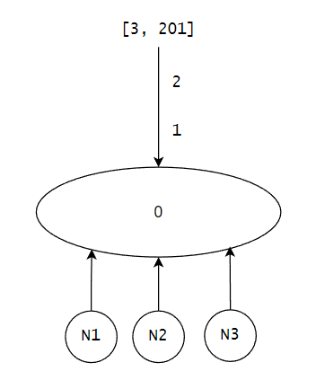
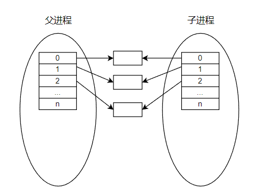
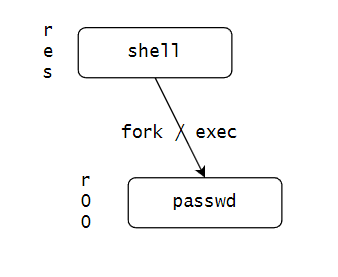
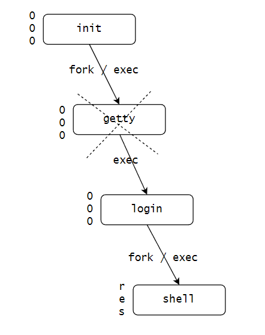
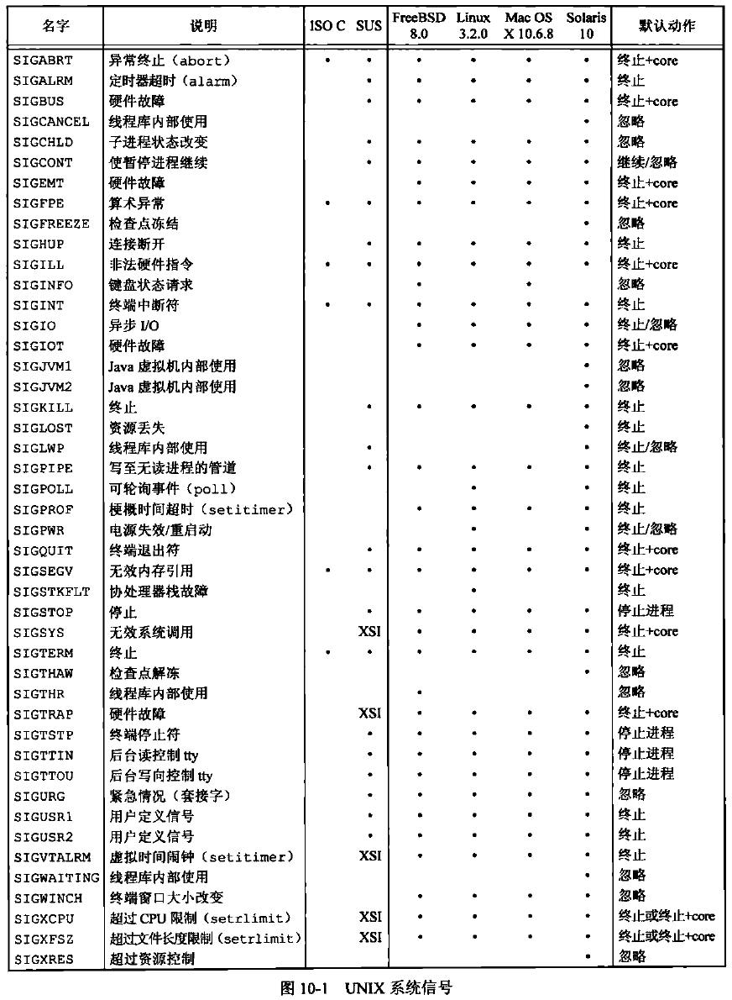
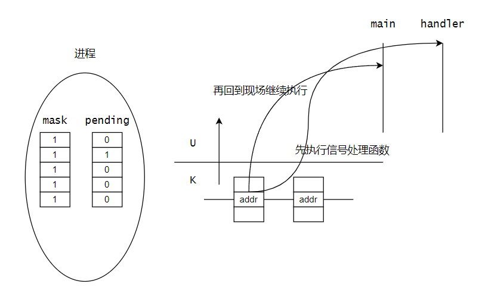

# 【Linux C】并发操作

作者：wallace-lai <br>
发布：2024-05-29 <br>
更新：2024-07-08 <br>

并发操作对应APUE上的章节为：

- 第10章：信号

- 第11章：线程

- 第12章：线程控制

对应的教程：P167 ~ P235

## P167 进程 - 进程的概念

### 1. 进程标识符pid

- 类型：`pid_t`

- 命令：`ps`

- 进程号是顺次向下使用的

- 返回当前进程的pid号：`getpid()`

- 返回当前进程的ppid号：`getppid()`


### 2. 进程的产生

（1）接口
- fork()

- vfork()

（2）fork()原理


父进程通过fork调用，拷贝了一个子进程出来，父子进程除了以下几点（不是全部）不一样之外，其他都一样：

- fork返回值不一样：父进程返回一个非负整数（子进程的pid），子进程返回0

- 父子进程的pid不同，ppid也不相同

- 未决信号和文件锁不继承

- 新创建子进程的资源利用量清0

- init进程（1号进程）是所有进程的祖先进程

- 不要假定父子进程谁会先被执行，这取决于linux内核调度器的调度策略

- fflush的重要性（在fork子进程之前刷新父进程打开的流）

（3）vfork原理

为什么会有vfork的出现？

因为早期的fork是通过内存拷贝实现的，即父进程内存块中的内容会被完整地拷贝到子进程中。这样带来的一个问题是，fork调用的开销巨大。想象这样一个场景：父进程从数据库中读取了大量的数据，此时需要开辟子进程做一些简单的任务，比如打印额外的信息，此时子进程的开辟就很不划算，因为要拷贝大量与打印任务无关的父进程中的数据。

为了解决这个问题，vfork应用而生。vfork通过父子进程共享同一块内存的方式，避免了拷贝只读的数据。后来的fork抛弃了内存拷贝的实现方式，使用COW技术实现，已经完全替代了vfork的功能。因此，现今的vfork基本处于废弃状态，使用fork就行了。

### 3. 进程的消亡及资源释放

```c
    #include <sys/types.h>
    #include <sys/wait.h>

    pid_t wait(int *wstatus);

    pid_t waitpid(pid_t pid, int *wstatus, int options);
```

### 4. exec函数族

```c
    #include <unistd.h>

    extern char **environ;

    int execl(const char *pathname, const char *arg, ... /* (char  *) NULL */);
    int execlp(const char *file, const char *arg, ... /* (char  *) NULL */);
    int execle(const char *pathname, const char *arg, ...
        /*, (char *) NULL, char *const envp[] */);
    int execv(const char *pathname, char *const argv[]);
    int execvp(const char *file, char *const argv[]);
    int execvpe(const char *file, char *const argv[], char *const envp[]);
```

### 5. 用户权限和组权限

### 6. 观摩课：解释器文件

### 7. 系统调用system()

```c
    #include <stdlib.h>

    int system(const char *command);
```

```
The system() library function uses fork(2) to create a child process that executes the shell command
specified in command using execl(3) as follows:

    execl("/bin/sh", "sh", "-c", command, (char *) NULL);

system() returns after the command has been completed.
```

### 8. 进程会计

```c
    #include <unistd.h>

    int acct(const char *filename);
```

### 9. 进程时间

```c
    #include <sys/times.h>

    clock_t times(struct tms *buf);

    struct tms {
        clock_t tms_utime;  /* user time */
        clock_t tms_stime;  /* system time */
        clock_t tms_cutime; /* user time of children */
        clock_t tms_cstime; /* system time of children */
    };
```

### 10. 守护进程

### 11. 系统日志

## P168 ~ P169 进程 - fork实例

### 1. 简单fork实例

[完整源码](https://github.com/wallace-lai/learn-apue/blob/main/src/con/process_basic/fork1.c)

写一个简单的fork实例代码，如下所示：

```c
    pid_t pid;

    printf("pid [%d] : begin ...\n", getpid());

    pid = fork();
    if (pid < 0) { /* ... */ }

    if (pid == 0) {
        // child
        printf("pid [%d] : I'm child ...\n", getpid());
    } else {
        // parent
        printf("pid [%d] : I'm parent ...\n",getpid());
    }

    printf("pid [%d] : end ...\n", getpid());
    exit(0);
```

解释：

（1）fork完成后，子进程通过复制父进程而产生，随后父子进程的执行顺序由调度器决定

（2）打印begin在fork之前，所以只有父进程会打印这句话

（3）fork完成之后的打印顺序是不确定的，同样是因为这取决于具体的调度策略

上述代码的运行结果之一为：

```shell
pid [2657] : begin ...
pid [2657] : I'm parent ...
pid [2657] : end ...
pid [2658] : I'm child ...
pid [2658] : end ...
```

**进程父子关系**

在程序`exit(0)`之前，暂停进程，使用`ps axf`命令查看父子进程的关系。如下所示：

```shell
   2248 pts/0    Ss     0:00  |       \_ -bash
   3070 pts/0    S+     0:00  |           \_ ./fork
   3071 pts/0    S+     0:00  |               \_ ./fork
```

可以看到，bash进程创建了父进程fork，然后父进程通过fork调用创建了子进程fork。

**begin为什么会打印两次**

和上面一样的程序，将程序输出重定向到文件中。发现begin打印了两次，且两次begin都是父进程打印的，为什么会这样？

```shell
$ ./fork > /tmp/out
$ cat /tmp/out
pid [3588] : begin ...
pid [3588] : I'm parent ...
pid [3588] : end ...
pid [3588] : begin ...
pid [3589] : I'm child ...
pid [3589] : end ...
```

如果在fork之前刷新所有打开的流，再重复之前的步骤，发现begin只打印了一次，为什么是这样？

```c
    printf("pid [%d] : begin ...\n", getpid());
    fflush(NULL);

    pid = fork();
    if (pid < 0) { /* ... */ }
```

```shell
$ ./fork > /tmp/out
$ cat /tmp/out
pid [3963] : begin ...
pid [3963] : I'm parent ...
pid [3963] : end ...
pid [3964] : I'm child ...
pid [3964] : end ...
```

原因在于，**printf中的内容还没往文件/tmp/out中写入，还在缓冲区的时候，开始fork子进程。此时，父子进程的缓冲区中各有一句begin的打印。即使printf的输出内容带了换行符也不行，因为文件是全缓冲，换行符不会触发缓冲区的刷新**。

所以，在每次fork子进程之前都需要调用fflush将父进程打开的流给刷新一遍。

### 2. 求取质数的多进程并发版本

[完整源码](https://github.com/wallace-lai/learn-apue/tree/main/src/con/process_basic)

先写一个单进程版本，如下所示：

```c
    for (int i = BEG; i <= END; i++) {
        mark = 1;
        for (int p = 2; p < i / 2; p++) {
            if (i % p == 0) {
                mark = 0;
                break;
            }
        }

        if (mark) {
            printf("%d is a primer.\n", i);
        }
    }
```

改造成多进程版本，思路是每枚举到一个i值，将判断i是否为质数的功能扔给子进程去完成。

```c
    for (int i = BEG; i <= END; i++) {
        pid_t pid = fork();
        if (pid < 0) {
            perror("fork()");
            exit(1);
        }

        if (pid == 0) {
            mark = 1;
            for (int p = 2; p < i / 2; p++) {
                if (i % p == 0) {
                    mark = 0;
                    break;
                }
            }

            if (mark) {
                printf("%d is a primer.\n", i);
            }

            exit(0);
        }
    }
```

解释：

（1）父进程只负责创建子进程

（2）判断i是否为质数的工作交给子进程去完成

（3）注意子进程判断完毕无比调用exit(0)退出，否则系统有死机风险


比较这两个程序的运行所需时间，结果如下：

```shell
$ time ./primer1 > /dev/null

real    0m0.972s
user    0m0.944s
sys     0m0.027s

$ time ./primer2 > /dev/null

real    0m0.096s
user    0m0.000s
sys     0m0.018s
```

## P170 进程 - init进程和vfork

让子进程在退出前睡眠一段时间，让父进程正常结束，使用`ps axf`查看进程详情如下：

```shell
   2317 pts/0    S      0:00 ./primer2
   2318 pts/0    S      0:00 ./primer2
   2319 pts/0    S      0:00 ./primer2
   2320 pts/0    S      0:00 ./primer2
   2321 pts/0    S      0:00 ./primer2
   2322 pts/0    S      0:00 ./primer2
   2323 pts/0    S      0:00 ./primer2
   2324 pts/0    S      0:00 ./primer2
   2325 pts/0    S      0:00 ./primer2
   2326 pts/0    S      0:00 ./primer2
```

解释：

（1）子进程的状态为S，表示处于睡眠状态

（2）子进程顶格显示（没有显示其父进程），说明此时子进程的父进程成了init进程

注：父进程提前退出后，子进程将被init进程收养

让父子进程在退出前都睡眠一段时间，查看进程详情如下：

```shell
   1775 pts/0    Ss     0:00  |       \_ -bash
   3057 pts/0    S+     0:00  |           \_ ./primer2
   3058 pts/0    Z+     0:00  |               \_ [primer2] <defunct>
   3059 pts/0    Z+     0:00  |               \_ [primer2] <defunct>
   3060 pts/0    Z+     0:00  |               \_ [primer2] <defunct>
   3061 pts/0    Z+     0:00  |               \_ [primer2] <defunct>
   3062 pts/0    Z+     0:00  |               \_ [primer2] <defunct>
   3063 pts/0    Z+     0:00  |               \_ [primer2] <defunct>
   3064 pts/0    Z+     0:00  |               \_ [primer2] <defunct>
   3065 pts/0    Z+     0:00  |               \_ [primer2] <defunct>
   3066 pts/0    Z+     0:00  |               \_ [primer2] <defunct>
   3067 pts/0    Z+     0:00  |               \_ [primer2] <defunct>
```

解释：

（1）子进程状态为Z，僵尸态。父进程状态为S，睡眠态

（2）由于子进程已经结束了，但是父进程没有回收它们的资源，导致子进程“无人收尸”

（3）当父进程被唤醒后，僵尸态的子进程将被init进程收养，其资源由init进程释放

## P171 进程 - wait和waitpid

### 1. 接口
```c
    #include <sys/types.h>
    #include <sys/wait.h>

    pid_t wait(int *wstatus);

    pid_t waitpid(pid_t pid, int *wstatus, int options);
```

解释：

（1）wait指的是wait for process to change state

（2）子进程的状态通过`wstatus`指针带回

**子进程返回状态检测**

（1）`WIFEXITED(wstatus)`：如果子进程正常结束，则该宏为真

注：进程正常终止的三种方式

- 调用`exit()`

- 调用`_exit()`

- 从`main()`中返回

（2）`WEXITSTATUS(wstatus)`：如果子进程正常结束，则该宏可以打印子进程结束的返回码

（3）`WIFSIGNALED(wstatus)`：如果子进程被信号终止，则该宏为真

（4）`WTERMSIG(wstatus)`：如果子进程被信号终止，则该宏可以打印造成子进程终止的信号编号


**更高级的等待子进程返回**

waitpid相比wait更加复杂一点，具体：

（1）`pid`值可以是：

- `< -1`： meaning wait for any child process whose process group ID is equal to the absolute value of pid（比如pid值为-5，表示等待组号为5的任意一个子进程）

- `-1`：meaning wait for any child process（等待任意一个子进程）

- `0`： meaning wait for any child process whose process group ID is equal to that of the calling process at the time of the call to waitpid()（等待与我同组的任意一个子进程）

- `> 0`： meaning wait for the child whose process ID is equal to the value of pid（等待指定的子进程）

（2）`options`可以是：

- `WNOHANG`：return immediately if no child has exited（由阻塞变成了非阻塞）

所以，wait相当于如下的waitpid：

```c
waitpid(-1, &wstatus, 0);
```

### 2. wait使用案例

我们将求解质数的多进程并发版本写完整，如下所示：

```c
    for (int i = BEG; i <= END; i++) {
        pid_t pid = fork();
        if (pid < 0) {
            perror("fork()");
            exit(1);
        }

        if (pid == 0) {
            // ...
            exit(0);
        }
    }

    for (int i = BEG; i <= END; i++) {
        wait(NULL);
    }
```

解释：

（1）子进程判断i是否为质数，记得最后一定要使用exit退出

（2）父进程在创建完子进程后，使用wait等待所有的子进程结束，且不关心子进程退出状态

## P172 进程 - 进程的交叉分配法实现

假设将`[1, 201]`范围内的数是否为质数的任务分配给3个进程，有以下的进程任务分配的方法：

（1）分块法：将范围平均划分成前中后三个部分，分别分配给3个进程

缺点：进程负载不均衡，显然进程1的负载最重（最小范围内的质数密度最高）


（2）交叉分配法：类似发牌的方式，将范围内的数一个个地按序分配给3个进程

缺点：仍然存在负载不均衡的问题！显然进程1拿到的数一定是3的倍数，它不可能是质数，因此进程1的负载基本为空。

注意：由于求解质数的案例比较特殊，输入是一个范围内的连续整数，所以导致交叉分配法的性能拉胯。实际上，在一般的任务中，交叉分配法的性能是比较好的。

（3）池类算法：将任务放入容器中，由进程从容器中抢任务，谁抢到了谁执行。一般而言，池类算法具有很好的随机性。



### 1. 将求解质数的程序改造成交叉分配法

[完整源码](https://github.com/wallace-lai/learn-apue/blob/main/src/con/process_basic/primern.c)

```c
    for (int n = 0; n < N; n++) {
        pid_t pid = fork();
        if (pid < 0) { /* ... */ }

        if (pid == 0) {
            // child
            for (int i = BEG + n; i <= END; i += N) {
                if (is_primer(i)) {
                    printf("[%d] %d is primer number\n", n, i);
                }
            }

            exit(0);
        }
    }

    for (int n = 0; n < N; n++) {
        wait(NULL);
    }
```

解释：

（1）父进程循环创建N个子进程，每个子进程只选择能整除进程编号n的数去判断

（2）父进程等待N个子进程结束

代码执行结果：

```shell
$ ./primern
[2] 30000023 is primer number
[1] 30000001 is primer number
[1] 30000037 is primer number
[2] 30000041 is primer number
[1] 30000049 is primer number
[2] 30000059 is primer number
[1] 30000079 is primer number
[2] 30000071 is primer number
[1] 30000109 is primer number
[2] 30000083 is primer number
[1] 30000133 is primer number
[2] 30000137 is primer number
[1] 30000163 is primer number
[2] 30000149 is primer number
[1] 30000169 is primer number
[2] 30000167 is primer number
[1] 30000193 is primer number
[1] 30000199 is primer number
```

可以看到0号进程确实没有处理一个质数

## P173 进程 - exec函数族

`few`三个字符搭建了整个Linux的进程框架，它们是：

（1）`fork`：创建子进程

（2）`exec`：执行文件

（3）`wait`：等待子进程退出

### 1. 接口

The exec() family of functions replaces the current process image with a new process image.

```c
#include <unistd.h>

extern char **environ;

int execl(const char *pathname, const char *arg, ... /* (char  *) NULL */);
```

（1）`pathname`：可执行程序所在的路径

（2）`arg`：给程序的传参，多个参数最后以NULL结尾

```c
int execlp(const char *file, const char *arg, ... /* (char  *) NULL */);
```

（1）`file`：可执行程序的名称，从`environ`中指定的路径下去查找该程序

（2）`arg`：给程序的传参

```c
int execle(const char *pathname, const char *arg, ... 
    /*, (char *) NULL, char *const envp[] */);
```

（1）`envp`：给程序传递的环境变量

```c
int execv(const char *pathname, char *const argv[]);
int execvp(const char *file, char *const argv[]);
int execvpe(const char *file, char *const argv[],
    char *const envp[]);
```

（1）`argv`：以argv的形式传参

### 2. exec使用案例之打印时间戳1

[完整源码](https://github.com/wallace-lai/learn-apue/blob/main/src/con/process_basic/exe.c)

```c
int main()
{
    puts("my date begin ...");

    execl("/usr/bin/date", "date", "+%s", NULL);
    perror("execl()");
    exit(1);

    puts("my date end ...");
    exit(0);
}
```

解释：

（1）使用`execl`直接将当前进程的进程映像替换成data的

（2）如果替换不成功，那么程序会往下走`perror`报错退出；如果替换成功，那么当前整个镜像都会被干掉

（3）可以预想到`my date end`是不会打印出来的，因为main的进程镜像被干掉了

运行结果：

```shell
$ ./exe
my date begin ...
1718810449
```

如果将输出给重定向的话，查看结果：

```shell
$ ./exe > /tmp/out
$ cat /tmp/out
1718810906
```
`my date begin`的打印为什么消失了？因为文件（往文件`/tmp/out`中写入）是全缓冲，所以换行符不会触发缓冲区的刷新。`execl`执行后，在缓冲区的`my date begin`还没来得及打印就随着整个进程镜像的替换而被干掉了，自然也就打印不了了。

由此得出一个结论：**和fork类似，在执行exec之前也需要调用fflush刷新进程当前打开的流**！

```c
int main()
{
    puts("my date begin ...");

    fflush(NULL);
    execl("/usr/bin/date", "date", "+%s", NULL);
    perror("execl()");
    exit(1);

    puts("my date end ...");
    exit(0);
}
```

再看程序结果：

```shell
$ ./exe > /tmp/out
$ cat /tmp/out
my date begin ...
1718811669
```


如何形容`execl`？**你还是你（pid号以及父子进程的关系不变），但你已经不是你了（进程映像已经被替换了）**！

### 3. exec使用案例之打印时间戳2

[完整源码](https://github.com/wallace-lai/learn-apue/blob/main/src/con/process_basic/few.c)

使用`few`实现打印时间戳，即创建子进程并替换子进程的映像，让子进程去执行时间戳的打印任务，父进程回收子进程。

```c
    puts("my date begin ...");

    fflush(NULL);
    pid_t pid = fork();
    if (pid < 0) { /* ... */ }

    if (pid == 0) {
        // child
        execl("/usr/bin/date", "date", "+%s", NULL);
        perror("execl()");
        exit(1);
    }

    wait(NULL);

    puts("my date end ...");
    exit(0);
```

## P174 ~ P175 进程 - shell命令实现原理

为什么fork出来的子进程和父进程内容打印在了同一个终端中？



因为fork出来的子进程的打开文件列表和父进程是一样的，前3个文件都指向了同一个设备。

### 1. mysh的简易shell实现

[完整源码](https://github.com/wallace-lai/learn-apue/blob/main/src/con/process_basic/mysh.c)

这次案例我们需要实现自己的一个建议shell命令，目前只支持内部命令。

```c
    while (1) {
        prompt();

        char *buffer = NULL;
        size_t buffer_size = 0;

        ret = getline(&buffer, &buffer_size, stdin);
        if (ret < 0) { /* ... */ }

        cmd_t cmd;
        parse(buffer, &cmd);

        if (0) {
            // ...
        } else {
            fflush(NULL);
            pid_t pid = fork();
            if (pid < 0) { /* ... */ }

            if (pid == 0) {
                execvp(cmd.result.gl_pathv[0], cmd.result.gl_pathv);
                perror("execvp()");
                exit(1);
            } else {
                wait(NULL);
            }
        }
    }
```

解释：

（1）父进程是一个死循环，第一步先打印提示符

（2）第二步使用getline获取用户输入

（3）第三步使用parse解析用户的输入

（4）第四部fork子进程去执行命令

（5）最后父进程等待子进程结束

```c
typedef struct cmd_s {
    glob_t result;
} cmd_t;

static void prompt(void)
{
    printf("mysh - 0.1 >>> ");
}

static void parse(char *line, cmd_t *cmd)
{
    // ls -l -a -h /home/xyz/
    int i = 0;
    char *tok = NULL;

    while (1) {
        tok = strsep(&line, DELIMS);
        if (tok == NULL) {
            break;
        }
        if (tok[0] == '\0') {
            continue;
        }

        if (glob(tok, GLOB_NOCHECK | GLOB_APPEND * i, NULL, &cmd->result) != 0) {
            break;
        }
        i = 1;
    }
}
```

解释：

（1）使用strsep分割完整字符串

（2）如果为NULL说明分割完毕，退出循环

（3）如果为`\0`说明当前分割的子串为空，跳过

（4）使用glob将所有分割的子串组装成类似`argv[]`的结构

## P176 ~ P177 进程 - 用户权限和组权限实现原理

普通用户没有查看和修改shadow文件的权限，但是却可以使用passwd命令修改自身账号的密码，这是为何？

```shell
$ cat /etc/shadow
cat: /etc/shadow: Permission denied
$ passwd
Changing password for bob.
Current password:
```

### 1. 用户权限鉴定流程

下面的内容没太理解，先做个记录。

（1）uid和sid均有三个，分别是

- r : real uid/sid

- e : effective uid/sid

- s : save uid/sid

其中s可以没有，但一定会有r和e，鉴权的时候会看r和e。

（2）可以看到passwd命令是有u+s权限的（`rws`）

```shell
$ which passwd
/usr/bin/passwd
$ ls -lah /usr/bin/passwd
-rwsr-xr-x 1 root root 67K Feb  6 12:49 /usr/bin/passwd
```

当一个程序具有u+s权限说明当别的用户来调用该程序时，它的身份会切换成当前程序所属用户的身份。对于passwd命令来说，该用户是root。

如下图所示，当exec在执行passwd命令时发现它有u+s权限。于是passwd的权限不再是继承而来的res值，e和s会变成0，也即passwd实际是以root用户的权限在执行。passwd命令作为子进程执行完后销毁，不复存在。

因此，写passwd命令的程序员应该万分小心，因为passwd是以root的权限在执行的。



### 2. shell命令执行时的身份（账号）是怎么来的



解释：

（1）初始init进程使用fork和exec产生getty进程，此时屏幕上会提示你输入用户名

（2）getty进程拿到用户名后使用exec产生login进程，此时屏幕上会提示你继续输入用户密码

（3）此时login进程仍然是以root权限在运行，并且已经拿到了用户名和密码。通过使用用户名和密码加上盐值salt的方式得到一个加密哈希串，将该串与shadow文件中的串进行对比，如果相同则说明用户密码正确，成功登录系统。

（4）如果登录成功，则login进程使用fork和exec创建shell进程，这个shell进程就拿到了你的身份（账户）信息

### 3. 相关接口

- getuid
- geteuid
- getgid
- getegid

- setuid
- setgid
- setreuid
- setregid

### 4. mysu的实现

mysu是一个简单的实现类似sudo功能的程序，我们希望能通过mysu来达到获取root权限来执行命令的功能。如下所示，其中0表示root用户的uid值。

```shell
./mysu 0 cat /etc/passwd
```

代码实现如下：

```c
int main(int argc, char **argv)
{
    // ./mysu 0 cat /etc/passwd
    if (argc < 3) {
        fprintf(stderr, "Usage ...\n");
        exit(1);
    }

    pid_t pid = fork();
    if (pid < 0) {
        perror("fork()");
        exit(1);
    }

    if (pid == 0) {
        // child
        setuid(atoi(argv[1]));
        execvp(argv[2], argv + 2);
        perror("execvp()");
        exit(1);
    }

    wait(NULL);
    exit(0);
}
```

解释：

（1）子进程通过setuid将子进程的res均设置为0，即root用户的uid，随后子进程就拥有的root用户权限

（2）子进程获取root用户权限后，使用execvp执行后面传入的命令

（3）父进程等待子进程运行结束

执行mysu命令，发现没有权限！很简单，**要是谁都能通过setuid来获取root权限那还要`su`命令做什么**？

```shell
$ ./mysu 0 cat /etc/shadow
cat: /etc/shadow: Permission denied
```

给mysu设置u+s权限，将root用户权限下放给mysu程序（这个过程需要有root权限）。

（1）查看mysu的owner为xxx

```shell
$ ls -lah mysu
-rwxrwxr-x 1 xxx  xxx  17K Jun 22 10:34 mysu
```

（2）尝试将mysu的owner设置成root，发现需要root权限才能设置

```shell
$ chown root mysu
chown: changing ownership of 'mysu': Operation not permitted
$ sudo chown root mysu
[sudo] password for xxx:
$ ls -lah mysu
-rwxrwxr-x 1 root xxx 17K Jun 22 10:34 mysu
$
```

（3）设置u+s权限

```shell
$ ls -lah mysu
-rwxrwxr-x 1 root xxx 17K Jun 22 10:34 mysu
$ chmod u+s mysu
chmod: changing permissions of 'mysu': Operation not permitted
$ sudo chmod u+s mysu
$ ls -lah mysu
-rwsrwxr-x 1 root xxx 17K Jun 22 10:34 mysu
```

此时，mysu获取了u+s权限，再次执行mysu时将会将root权限下放给mysu程序。此时，mysu中的setuid才能成功执行

```shell
$ ./mysu 0 cat /etc/shadow
...
```

### 5. 解释器文件

下面是一个简单的shell脚本：

```shell
#!/bin/bash

ls
whoami
cat /etc/shadow
ps
```

shell发现文件开头的解释器文件标识符`#!`后会把你要的`bin/bash`加载进来，然后将整个脚本内容直接扔给`bin/bash`。运行结果如下：

```shell
$ ./t.sh
exe.c  few.c  fork1.c  mysh.c  mysu.c  primer1.c  primer2.c  primern.c  t.sh
xxx
cat: /etc/shadow: Permission denied
    PID TTY          TIME CMD
  14285 pts/0    00:00:00 bash
  21206 pts/0    00:00:00 t.sh
  21210 pts/0    00:00:00 ps
```

将shell内容改成以下的内容：

```shell
#!/bin/cat

ls
whoami
cat /etc/shadow
ps
```

运行结果如下，cat直接将脚本内容给打印出来了。

```shell
$ ./t.sh
#!/bin/cat

ls
whoami
cat /etc/shadow
ps
```

## P178 进程 - system、进程会计、进程时间

### 1. system
system()可以看成few的封装，使用system来输出时间戳。

```c
int main()
{
    system("date +%s > /tmp/out");

    exit(0);
}
```

对应的，这是few的实现：

```c
    pid_t pid = fork();
    if (pid < 0) { /* ... */ }

    if (pid == 0) {
        execl("/usr/bin/date", "date", "+%s", NULL);
        perror("execl()");
        exit(1);
    }

    wait(NULL);
```

而system()本质上是这样实现的：

```c
    pid_t pid = fork();
    if (pid < 0) { /* ... */ }

    if (pid == 0) {
        execl("/bin/sh", "sh", "-c", "date +%s", NULL);
        perror("execl()");
        exit(1);
    }

    wait(NULL);
```

即先调用shell，将命令传递给shell执行。

### 2. 进程会计

```c
    #include <unistd.h>

    int acct(const char *filename);
```

```
DESCRIPTION
       The  acct()  system  call  enables or disables process accounting.  If called
       with the name of an existing file as its argument, accounting is  turned  on,
       and  records for each terminating process are appended to filename as it ter‐
       minates.  An argument of NULL causes accounting to be turned off.
```

注意：这个接口只是BSD系统的方言，不在POSIX标准里面

### 3. 进程时间

```c
    #include <sys/times.h>

    clock_t times(struct tms *buf);

    struct tms {
        clock_t tms_utime;  /* user time */
        clock_t tms_stime;  /* system time */
        clock_t tms_cutime; /* user time of children */
        clock_t tms_cstime; /* system time of children */
    };
```

## P179 - 守护进程

**没太理解本节的守护进程的概念**。

守护进程的特点：

（1）脱离控制终端而存在

（2）会话和进程组的leader

### 1. 接口
```c
setsid()
getpgrp()
getpgid()
setpgid()
```
setsid() creates a new session if the calling process is not a process group
leader. The calling process is the leader of the new session (i.e., its session ID
is  made the same as its process ID).  The calling process also becomes the process
group leader of a new process group in the session (i.e., its process group  ID  is
made the same as its process ID)
```


使用`ps axj`查看系统中的守护进程

```shell
$ ps axj
   PPID     PID    PGID     SID TTY        TPGID STAT   UID   TIME COMMAND
      0       1       1       1 ?             -1 Ss       0   0:03 /sbin/init auto automatic-
      0       2       0       0 ?             -1 S        0   0:00 [kthreadd]
      2       3       0       0 ?             -1 I<       0   0:00 [rcu_gp]
      2       4       0       0 ?             -1 I<       0   0:00 [rcu_par_gp]
      2       6       0       0 ?             -1 I<       0   0:00 [kworker/0:0H-kblockd]
      2       8       0       0 ?             -1 I<       0   0:00 [mm_percpu_wq]
      2       9       0       0 ?             -1 S        0   0:00 [ksoftirqd/0]
      2      10       0       0 ?             -1 I        0   0:02 [rcu_sched]
      2      11       0       0 ?             -1 S        0   0:00 [migration/0]
      1     928     928     928 ?             -1 Ssl      0   0:00 /usr/lib/accountsservice/a
      1     935     935     935 ?             -1 Ss       0   0:00 /usr/sbin/cron -f
      1     937     937     937 ?             -1 Ss     103   0:00 /usr/bin/dbus-daemon --sys
      1     946     946     946 ?             -1 Ssl      0   0:00 /usr/sbin/irqbalance --for
      1     949     949     949 ?             -1 Ss       0   0:00 /usr/bin/python3 /usr/bin/
      1     950     950     950 ?             -1 Ssl      0   0:00 /usr/lib/policykit-1/polki
      1     953     953     953 ?             -1 Ssl    115   0:20 /usr/lib/erlang/erts-14.0.
      1     958     958     958 ?             -1 Ssl      0   0:02 /usr/lib/snapd/snapd
      1     969     969     969 ?             -1 Ss       0   0:00 /lib/systemd/systemd-login
      1     973     973     973 ?             -1 Ssl      0   0:00 /usr/lib/udisks2/udisksd
      1     974     974     974 ?             -1 Ss       1   0:00 /usr/sbin/atd -f
      1     979     979     979 ?             -1 Ssl      0   0:00 /usr/sbin/ModemManager
```

守护进程的特征：

（1）PID、PGID、SID是相同的

（2）TTY是问号表示已经脱离了终端

### 2. 守护进程实例

[完整源码](https://github.com/wallace-lai/learn-apue/blob/main/src/con/process_basic/daemon/mydaemon.c)

下面是一个简单的守护进程的实现。

```c
static int daemonize()
{
    pid_t pid = fork();
    if (pid < 0) {
        perror("fork()");
        return -1;
    }

    if (pid > 0) {
        // parent
        exit(0);
    }

    int fd = open("/dev/null", O_RDWR);
    if (fd < 0) {
        perror("open()");
        return -1;
    }

    dup2(fd, 0);
    dup2(fd, 1);
    dup2(fd, 2);
    if (fd > 2) {
        close(fd);
    }

    setsid();
    chdir("/");
    umask(0);

    return 0;
}
```

解释：

（1）父进程通过调用daemonize()来成为守护进程

（2）正常创建子进程，对于父进程而言正常结束即可

（3）对于子进程，需要在子进程中将前3个流给绑定到`/dev/null`中

（4）通过调用setsid让父进程成为守护进程

（5）子进程正常退出前更改守护进程的工作目录为`/`同时去除umask如果守护进程不创建文件的话

```c
int main()
{
    if (daemonize()) {
        exit(1);
    }

    FILE *fp = fopen(FNAME, "w");
    if (fp == NULL) {
        perror("fopen()");
        exit(1);
    }

    unsigned i = 0;
    while (1) {
        fprintf(fp, "%d\n", i);
        fflush(fp);
        sleep(1);

        i++;
    }

    exit(0);
}
```

解释：

（1）父进程是守护进程的主体，要做的事就是打开`/tmp/out`文件，每隔1s向其中打印计数器值

## P180 进程 - 系统日志

由于守护进程已经和TTY分离了，如果需要得到守护进程的打印内容，需要使用系统日志功能。

（1）系统日志所在路径：`/var/log`

（2）提交系统日志需要用到syslogd服务

### 1. 接口

```c
    #include <syslog.h>

    void openlog(const char *ident, int option, int facility);
    void syslog(int priority, const char *format, ...);
    void closelog(void);

    void vsyslog(int priority, const char *format, va_list ap);
```

```
closelog, openlog, syslog, vsyslog - send messages to the system logger
```

（1）openlog：与syslogd关联

（2）syslog：提交log内容

（3）closelog：与syslogd断联

### 2. 带系统日志功能的守护进程实例

[完整源码](https://github.com/wallace-lai/learn-apue/blob/main/src/con/process_basic/daemon/mydaemon.c)

### 3. 单实例的守护进程实例

为了实现以单实例的形式（只能启动一个守护进程）启动守护进程，需要用到文件锁。锁文件位于`/var/run/name.pid`之中。

```shell
$ ls -lah /var/run/sshd.pid
-rw-r--r-- 1 root root 5 Jun 22 14:35 /var/run/sshd.pid
$ cat /var/run/sshd.pid
1014
$ ps axj | grep sshd
      1    1014    1014    1014 ?             -1 Ss       0   0:00 sshd: /usr/sbin/sshd -D [listener] 0 of 10-100 startups
$
```

解释：

（1）守护进程sshd的锁文件是/var/run/sshd.pid

（2）sshd.pid里面保存的是sshd守护进程的pid号1014

## P182 并发 - 异步事件处理的两种方法

异步事件处理的两种方法：

（1）查询法：异步事件发生的频率很高，采用查询法

（2）通知法：异步事件发生的频率很稀疏，采用通知法

### 1. 信号
（1）信号的概念

信号：信号是软件中断，信号的响应依赖于中断。

使用`kill -l`命令可以查看当前的信号

```shell
$ kill -l
 1) SIGHUP       2) SIGINT       3) SIGQUIT      4) SIGILL       5) SIGTRAP
 6) SIGABRT      7) SIGBUS       8) SIGFPE       9) SIGKILL     10) SIGUSR1
11) SIGSEGV     12) SIGUSR2     13) SIGPIPE     14) SIGALRM     15) SIGTERM
16) SIGSTKFLT   17) SIGCHLD     18) SIGCONT     19) SIGSTOP     20) SIGTSTP
21) SIGTTIN     22) SIGTTOU     23) SIGURG      24) SIGXCPU     25) SIGXFSZ
26) SIGVTALRM   27) SIGPROF     28) SIGWINCH    29) SIGIO       30) SIGPWR
31) SIGSYS      34) SIGRTMIN    35) SIGRTMIN+1  36) SIGRTMIN+2  37) SIGRTMIN+3
38) SIGRTMIN+4  39) SIGRTMIN+5  40) SIGRTMIN+6  41) SIGRTMIN+7  42) SIGRTMIN+8
43) SIGRTMIN+9  44) SIGRTMIN+10 45) SIGRTMIN+11 46) SIGRTMIN+12 47) SIGRTMIN+13
48) SIGRTMIN+14 49) SIGRTMIN+15 50) SIGRTMAX-14 51) SIGRTMAX-13 52) SIGRTMAX-12
53) SIGRTMAX-11 54) SIGRTMAX-10 55) SIGRTMAX-9  56) SIGRTMAX-8  57) SIGRTMAX-7
58) SIGRTMAX-6  59) SIGRTMAX-5  60) SIGRTMAX-4  61) SIGRTMAX-3  62) SIGRTMAX-2
63) SIGRTMAX-1  64) SIGRTMAX
```


- 信号编号1 ~ 31：标准信号
- 实时信号32 ~ 64：实时信号

UNIX系统信号列表：




（2）发送信号signal()

```c
    #include <signal.h>

    typedef void (*sighandler_t)(int);

    sighandler_t signal(int signum, sighandler_t handler);
```

注意：**信号会打断阻塞的系统调用**！

（3）信号的不可靠性

标准信号是会丢失的，实时信号不会；

信号的不可靠性：信号处理函数的执行现场是内核处理的，信号的不可靠性指的是**在信号处理函数执行过程中又来了一个相同的信号，第二次的执行现场可能把第一次的执行现场给覆盖了**。


（4）可重入函数

**可重入函数是为了解决信号不可靠问题而产生的概念。所有的Linux系统调用都是可重入的，但只有部分的标准库函数是可重入的**。

```c
    struct tm *localtime(const time_t *timep);
    struct tm *localtime_r(const time_t *timep, struct tm *result);
```

为什么`localtime`是不可重入函数？因为返回的`struct tm *`是指向静态区的，在第一次调用未结束时再次调用`localtime`会把同一块静态区的内容给覆盖掉。`localtime_r`是`localtime`函数的可重入版本，要求你传入一个result作为结果的传出地址。

由此得出结论：**禁止在信号处理函数中调用不可重入函数**！

```c
    void *memcpy(void *dest, const void *src, size_t n);
```

The memcpy() function  copies n bytes from memory area src to memory area dest. The memory
areas must not overlap. Use memmove(3) if the memory areas do overlap.

为什么当dest和src两块内存有重叠时要用memmove？同样是因为有重叠时的memcpy是不可重入的。


（5）信号的响应过程

思考：
- 信号从收到到响应有一个不可避免的延迟。
- 如何忽略一个信号？
- 标准信号为什么要丢失？
- 不能在信号响应函数中随意往外跳（setjmp，setlongjmp）


（6）信号常用函数

- kill()
- raise()
- alarm()
- pause()
- abort()
- system()
- sleep()


（7）信号集

```c
#include <signal.h>

int sigemptyset(sigset_t *set);

int sigfillset(sigset_t *set);

int sigaddset(sigset_t *set, int signum);

int sigdelset(sigset_t *set, int signum);

int sigismember(const sigset_t *set, int signum);
```

（8）信号屏蔽字 / pending集合 的处理 

```c
#include <signal.h>

/* Prototype for the glibc wrapper function */
int sigprocmask(int how, const sigset_t *set, sigset_t *oldset);
```

```c
#include <signal.h>

int sigpending(sigset_t *set);
```

（9）扩展

- sigsuspend()
- sigaction()：代替signal
- setitimer()：代替alarm

（10）实时信号


### 2. 线程

## P183 ~ P184 并发 - 信号的基本概念

### 1. signal()接口

```c
    #include <signal.h>

    typedef void (*sighandler_t)(int);

    sighandler_t signal(int signum, sighandler_t handler);
```

注意：**不建议使用signal()，尽量使用sigaction()代替该函数**

```c
    #include <signal.h>

    int sigaction(int signum, const struct sigaction *act,
        struct sigaction *oldact);
```

### 2. 简单signal实例

写一个简单的打印星号的程序：

```c
int main()
{
    for (int i = 0; i < 10; i++) {
        write(1, "*", 1);
        sleep(1);
    }

    exit(0);
}
```

使用CTRL + C打断程序的执行：

```shell
$ ./star
*****^C
$
```

（1）使用`CTRL+C`相当于是发送了`SIGINT`信号，即`CTRL+C`是`SIGINT`的快捷键

（2）`SIGINT`信号的默认动作是终止程序

（3）使用`CTRL+\`相当于是发送了`SIGQUIT`信号

使用预定义的`SIG_IGN`忽略`SIGINT`信号：

```c
int main()
{
    signal(SIGINT, SIG_IGN);

    for (int i = 0; i < 10; i++) {
        write(1, "*", 1);
        sleep(1);
    }

    exit(0);
}
```

运行查看结果，可以看到再次输入`CTRL+C`时程序不再退出了

```shell
$ ./star
***^C**^C****^C*$
```

收到信号时打印一个叹号：

```c
void on_sigint_handler(int s)
{
    write(1, "!", 1);
}

int main()
{
    signal(SIGINT, on_sigint_handler);

    for (int i = 0; i < 10; i++) {
        write(1, "*", 1);
        sleep(1);
    }

    exit(0);
}
```

运行查看结果，发现只要程序还未退出那么只要收到`SIGINT`信号，就会打印一个叹号出来。注意`^C`只是`CTRL+C`对应的回显，表示收到了一个`CTRL+C`的输入而已。

```shell
$ ./star
****^C!**^C!*^C!*^C!**$
```

程序运行后按住`CTRL+C`不放，发现程序很快就结束了，远不到规定的10秒钟。由此得到结论**信号会打断阻塞的系统调用**！

```shell
$ ./star
*^C!*^C!*^C!*^C!*^C!*^C!*^C!*^C!*^C!*^C!$
```

### 3. 防止EINTR信号干扰

[完整源码](https://github.com/wallace-lai/learn-apue/blob/main/src/con/parallel/signal/mycpy.c)

在mycpy程序中，由于使用的open和read以及write系统调用都是阻塞的。而信号可以打断阻塞的系统调用，所以需要对`EINTR`信号进行处理。

```c
    do {
        sfd = open(argv[1], O_RDONLY);
        if (sfd < 0) {
            if (errno != EINTR) {
                perror("open()");
                exit(1);
            }
        }
    } while (sfd < 0);


    do {
        dfd = open(argv[2], O_WRONLY | O_CREAT | O_TRUNC, 0600);
        if (dfd < 0) {
            if (errno != EINTR) {
                close(sfd);
                perror("open()");
                exit(1);
            }
        }
    } while (dfd < 0);
```

解释：

（1）只有errno不是EINTR时才认为open出错了，如果是被EINTR信号打断，则重试即可

```c
    while (1) {
        len = read(sfd, buffer, BUFSIZE);
        if (len < 0) {
            if (errno == EINTR) {
                continue;
            }
            perror("read()");
            break;
        }
        if (len == 0) {
            break;
        }

        pos = 0;
        while (len > 0) {
            ret = write(dfd, buffer + pos, len);
            if (ret < 0) {
                if (errno == EINTR) {
                    continue;
                }
                perror("write()");
                exit(1);
            }

            pos += ret;
            len -= ret;
        }
    }
```

解释：

（1）read和write这两个同步系统调用同样要防止EINTR信号的干扰

## P185 ~ P186 并发 - 信号的响应过程

思考三个问题：

（1）信号从收到到响应有一个不可避免的延迟。

（2）如何忽略一个信号？

（3）标准信号为什么要丢失？

（4）标准信号的响应没有严格的顺序？

从进程角度讲解信号的响应过程，首先内核会为每一个进程都维护一组位图，如下所示：




（1）mask表示信号屏蔽字，信号屏蔽字用来表示当前信号的状态

（2）pending用来记录当前的进程收到了哪些信号

理论上，mask和pending都是32位的，和标准信号的数量是对应的。一般情况下，mask位图值全部为1，pending位图值全部为0。

（1）当接收到`SIGINT`信号时，其对应的pending位图将会被置为1。此时的信号还无法被及时响应；

（2）当从Kernel态切换成User态时（被中断打断），main函数的所对应的现场（保存了addr值）将会被加入等待队列中，等待被调度。

（3）当main被调度时，Kernel态切换成User态，内核会做`mask & pending`的操作，此时`SIGINT`信号的操作值为1（因为mask和pending均为1），表示收到了`SIGINT`信号

（4）此时将mask和pending均置成0，同时将保存现场的addr值替换成信号处理函数的地址，去执行信号处理函数（比如打印一个叹号）。执行完毕后，再次回到内核态。信号处理函数执行完毕后，将mask恢复成1表示该信号已经被响应完毕了。

（5）再次从Kernel态切换到User态，将addr值恢复成原先的值（返回main被中断处）。如果再没有信号过来，那么就会返回main被中断的地方继续执行（继续打印星号）


为什么信号从收到到响应会有一个不可避免的时延？因为只有内核被时钟中断打断时，才能发现并处理接收到的信号。可以看到信号需要借助中断的机制来实现。

如何忽略一个信号？将信号的mask位置成0即可。无法阻止信号到来，但可以选择不响应它。

标准信号为什么要丢失？因为同一个响应周期内哪怕有多个信号过来，对pending的处理结果都是一样的（置为1），所以只会响应一次，也即后面的相同信号会被丢失。


## P187 ~ P195 并发 - 信号相关接口

### 1. 接口

（1）发送信号kill()

```c
    #include <sys/types.h>
    #include <signal.h>

    int kill(pid_t pid, int sig);
```

The kill() system call can be used to send any signal to any process group or process.

pid的值：

- If pid is positive, then signal sig is sent to the process with the ID specified by
pid.

- If  pid  equals  0,  then  sig is sent to every process in the process group of the
calling process.

- If pid equals -1, then sig is sent to every process for which the  calling  process
has permission to send signals, except for process 1 (init), but see below.

- If  pid  is  less  than  -1, then sig is sent to every process in the process group
whose ID is -pid.

sig的值：

If sig is 0, then no signal is sent, but existence and permission checks are  still
performed;  this  can be used to check for the existence of a process ID or process
group ID that the caller is permitted to signal.

返回值：

On  success  (at least one signal was sent), zero is returned.  On error, -1 is re‐
turned, and errno is set appropriately.

（2）给调用线程发信号raise()

```c
    #include <signal.h>

    int raise(int sig);
```

The raise() function sends a signal to the calling process or thread.  In a single-
threaded program it is equivalent to（个人理解：**single-thread下用getpid，实际上暗示进程就是单线程**）
```c
    kill(getpid(), sig);
```
In a multithreaded program it is equivalent to
```c
    pthread_kill(pthread_self(), sig);
```
If the signal causes a handler to be called, raise() will  return  only  after  the
signal handler has returned.

返回值：
raise() returns 0 on success, and nonzero for failure.

（3）发送`SIGALRM`信号alarm()

```c
    #include <unistd.h>

    unsigned int alarm(unsigned int seconds);
```

alarm()  arranges  for  a  SIGALRM signal to be delivered to the calling process in
seconds seconds.

If seconds is zero, any pending alarm is canceled.

In any event any previously set alarm() is canceled.

返回值：

alarm() returns the number of seconds  remaining  until  any  previously  scheduled
alarm was due to be delivered, or zero if there was no previously scheduled alarm.

（4）等待信号打断pause()

```c
    #include <unistd.h>

    int pause(void);
```

pause() causes the calling process (or thread) to sleep until a signal is delivered
that either terminates the process or causes the invocation  of  a  signal-catching
function.

返回值：
pause()  returns only when a signal was caught and the signal-catching function re‐
turned.  In this case, pause() returns -1, and errno is set to EINTR.

（5）

### 2. alarm应用实例

简单描述alarm的功能就是：在超过给定的秒数之后，向当前进程发送`SIGALRM`信号。而`SIGALRM`信号的默认动作是退出当前进程。

```c
int main()
{
    alarm(5);

    while (1) {
        ;
    }

    exit(0);
}
```

运行程序，发现在5秒钟之后因收到`SIGALRM`信号而终止：

```shell
$ ./alarm
Alarm clock
```

设置多个时间不同的alarm函数：

```c
int main()
{
    alarm(10);
    alarm(5);
    alarm(1);

    while (1) {
        pause();
    }

    exit(0);
}
```

运行程序，发现在1秒钟之后，程序就终止了。说明**alarm无法应用在多任务计时上面，之后最新的alarm会生效**。


使用pause避免CPU盲等：

```c
int main()
{
    alarm(10);
    alarm(5);
    alarm(1);

    while (1) {
        pause();
    }

    exit(0);
}
```

pause会导致程序休眠，因此不会再空耗CPU了。

注意：为了程序可移植性，不要使用`sleep()`调用，因为该调用在不同的平台上的底层实现可能不一样。如果`sleep()`调用是用alarm + pause的方式实现的，那么在sleep和alarm混用的场景下，alarm的计时就不准确了。


### 3. alarm应用实例之定时循环

让数从0开始不断地自增，然后在5秒钟结束后打印其值。这个案例的目的是为了比较`time()`和`alarm()`这两种计时机制的准确度。

首先是使用time()实现版本：

```c
int main()
{
    unsigned long long count = 0;
    time_t end = time(NULL) + 5;

    while (time(NULL) < end) {
        count++;
    }

    printf("5sec by time : %lld\n", count);
    exit(0);
}
```

运行程序，使用time命令查看程序实际运行时间并把结果重定向，结果如下：

```shell
$ time ./5sec > /tmp/out

real    0m4.738s
user    0m4.697s
sys     0m0.037s
$ cat /tmp/out
5sec by time : 2369860683
```

```shell
$ time ./5sec  > /tmp/out

real    0m4.901s
user    0m4.893s
sys     0m0.006s
$ cat /tmp/out
5sec by time : 2487479287
```

```shell
$ time ./5sec  > /tmp/out

real    0m4.901s
user    0m4.893s
sys     0m0.006s
$ cat /tmp/out
5sec by time : 2487479287
```

然后是使用alarm()实现版本：

```c
static int need_loop = 1;

static void on_alarm_handler(int s)
{
    need_loop = 0;
}

int main()
{
    alarm(5);
    signal(SIGALRM, on_alarm_handler);

    unsigned long long count = 0;
    while (need_loop) {
        count++;
    }

    printf("5sec by alarm : %lld\n", count);
    exit(0);
}
```

运行程序，查看结果如下：

```shell
$ time ./5sec_alarm  > /tmp/out

real    0m5.007s
user    0m4.987s
sys     0m0.016s
$ cat /tmp/out
5sec by alarm : 6456083116
```

```shell
$ time ./5sec_alarm  > /tmp/out

real    0m5.006s
user    0m4.974s
sys     0m0.030s
$ cat /tmp/out
5sec by alarm : 6191462278

$ time ./5sec_alarm  > /tmp/out
```

```shell
real    0m5.005s
user    0m4.977s
sys     0m0.026s
$ cat /tmp/out
5sec by alarm : 7329856790
```

对比time和alarm的实现，结论如下：

（1）alarm的定时精度要比time高

（2）alarm所能自增的次数大概是time版本的2到3倍

继续优化alarm版本，使用gcc编译并带上O1优化，发现程序死循环了！

```shell
$ gcc -O1 5sec_alarm.c
$ ./a.out
^C
```

为什么？因为gcc把`need_loop`值给优化掉了，编译器只加载了一次`need_loop`的值。导致其永远为真，程序陷入死循环。给`need_loop`加上`volatile`关键字，问题解决。

```c
static volatile int need_loop = 1;
```

运行加上O1优化后的程序，结果如下：

```shell
$ time ./a.out > /tmp/out

real    0m5.004s
user    0m4.975s
sys     0m0.025s
$ cat /tmp/out
5sec by alarm : 20131710513
```

```shell
$ time ./a.out > /tmp/out

real    0m5.012s
user    0m4.948s
sys     0m0.062s
$ cat /tmp/out
5sec by alarm : 20263928816
```

可以看到，加上O1优化后性能几乎是翻了10倍！

### 4. alarm应用实例之流量控制

[完整源码](https://github.com/wallace-lai/learn-apue/blob/main/src/con/parallel/signal/mycat.c)

我先实现一个没有流量控制的mycat应用，从mycpy基础上修改即可：

```c
    int sfd;
    int dfd = 1;

    do {
        sfd = open(argv[1], O_RDONLY);
        if (sfd < 0) {
            if (errno != EINTR) {
                perror("open()");
                exit(1);
            }
        }
    } while (sfd < 0);
```

解释：

（1）直接设置dfd为1，即标准输出

（2）打开要读取的文件

```c
    while (1) {
        len = read(sfd, buffer, BUFSIZE);
        if (len < 0) {
            if (errno == EINTR) {
                continue;
            }
            perror("read()");
            break;
        }
        if (len == 0) {
            break;
        }

        pos = 0;
        while (len > 0) {
            ret = write(dfd, buffer + pos, len);
            if (ret < 0) {
                if (errno == EINTR) {
                    continue;
                }
                perror("write()");
                exit(1);
            }

            pos += ret;
            len -= ret;
        }
    }
```

解释：

（1）循环从源文件中读取内容，往标准输出中打印

有了alarm之后，程序开始拥有“时间观念”，流控就变得可行了。

在mycat的基础之上，实现我们的slowcat程序。所谓slowcat就是每秒中打印固定大小的字符。

[完整源码](https://github.com/wallace-lai/learn-apue/blob/main/src/con/parallel/signal/slowcat1.c)

```c
#define CPS     32
#define BUFSIZE CPS

static volatile int need_send = 0;

static void on_alarm_handler(int s)
{
    // set next alarm signal
    alarm(1);
    need_send = 1;
}
```

解释：
（1）设定每秒钟打印32个字符，同时将buffer的大小也设置为32

（2）用`need_send`变量控制是否需要开始打印

（3）在响应`SIGALRM`信号时设定下一次的`SIGALRM`信号，同时将标志位置为1表示可以接着打印了

```c
    if (argc < 2) {
        fprintf(stderr, "Usage ...\n");
        exit(1);
    }

    signal(SIGALRM, on_alarm_handler);
    alarm(1);

    do {
        sfd = open(argv[1], O_RDONLY);
        if (sfd < 0) {
            if (errno != EINTR) {
                perror("open()");
                exit(1);
            }
        }
    } while (sfd < 0);
```

解释：

（1）在执行正式操作之前，调用`signal`注册`SIGALRM`信号的响应函数

（2）随后使用`alarm`设定1秒后发送`SIGALRM`信号

注意：先注册信号，再调用设定alarm。否则可能信号来不及响应

```c
    while (1) {

        // flow control
        while (!need_send) {
            pause();
        }
        need_send = 0;

        while ((len = read(sfd, buffer, BUFSIZE)) < 0) {
            if (errno == EINTR) {
                continue;
            }
            perror("read()");
            break;
        }
        if (len == 0) {
            break;
        }

        pos = 0;
        while (len > 0) {
            ret = write(dfd, buffer + pos, len);
            if (ret < 0) {
                if (errno == EINTR) {
                    continue;
                }
                perror("write()");
                exit(1);
            }

            pos += ret;
            len -= ret;
        }
    }
```

解释：

（1）在进行读写操作前，使用`pause`来等待`need_send`为真

（2）若`need_send`为真，则立刻将`need_send`置为假

（3）随后进行一次读写操作

注意：以上这种流控方式叫做漏桶式的流量控制，以恒定的速率打印字符。

### 5. alarm应用实例之（令牌桶式）流量控制

[完整源码](https://github.com/wallace-lai/learn-apue/blob/main/src/con/parallel/signal/slowcat2.c)

所谓令牌桶式流量控制指的是空闲时刻可以积攒令牌桶，令牌桶有多大，一次就能发送多大的数据量。比如，原先1秒钟可以传输10个字节，如果暂停了3秒，则拥有了一次传输30个字节的权限。

如何实现令牌桶式的流量控制呢？

```c
#define CPS     32
#define BUFSIZE CPS
#define BURST   10

static volatile unsigned token = 0;

static void on_alarm_handler(int s)
{
    // set next alarm signal
    alarm(1);

    // you got one token
    token++;
    if (token > BURST) {
        token = BURST;
    }
}
```

解释：

（1）定义CPS为32，即还是每秒发送32个字符

（2）定义buffer大小也为32

（3）定义所能持有令牌的上限BURST为10，即哪怕等待的空闲时间再多，程序最多也只能持有10个令牌

（4）在`SIGALRM`信号处理函数中，除了发送下一个`SIGALRM`信号以外，需要自增令牌个数。表示每秒钟授予1个令牌

（5）同时还要判断，使得令牌个数不超过上限

```c
    while (1) {

        // flow control
        while (token <= 0) {
            pause();
        }
        token--;

        // read and write
        // ...
    }
```

解释：

（1）在流控部分，如果发现持有令牌数为0则需要等待被授予令牌

（2）如果令牌数大于零，则在进行一次读写前需要自减令牌个数，表示已经消耗了一个令牌

<p style="color:red;">上述代码中的一个错误：</p>

仔细分析这段代码：

```c
    while (1) {

        // flow control
        while (token <= 0) {
            pause();
        }
        token--;

        // read and write
        // ...
    }
```

假如`while (token <= 0)`判断结果为真，然后在进入`pause`之前产生了信号，信号将`token`给累加了起来，不再是
`token <= 0`了。那没关系，等下一次`alarm`的信号触发即可。

但如果在`token--`的过程中产生了信号（**这概率是很小的，因为`pause`过后要大概1秒后再有新信号产生，在1秒内大概率是可以完成`token--`操作的**），那么`token`的值是不准确的。因为`token--`是先取`token`的值再减1后再存回`token`处。而`token--`这个过程不是信号原子的，即可能被信号处理函数所影响，导致`token`值不正确。

**为了解决这个问题，可以将`token`设置成信号原子的`sig_atomic_t`类型**。这样就可以在信号处理函数中原子性地访问`token`，如下所示：

```c
static volatile sig_atomic_t token = 0;
```

### 6. 将基于alarm的令牌桶式流控做成函数库

[完整源码](https://github.com/wallace-lai/learn-apue/tree/main/src/con/parallel/signal/mytbf)

对于令牌桶式流控，需要对外提供以下几个接口：

（1）创建一个令牌桶，用户需要提供每秒可以打印的字节数`cps`以及所能持有的最大可打印字节数`burst`

（2）从令牌桶中取令牌，返回实际取得的令牌数

（3）将多余未用的令牌返还给令牌桶，返回返还的令牌数

（4）销毁令牌桶

代码如下所示：

```c
// mytbf.h

#ifndef MY_TBF_H_
#define MY_TBF_H_

typedef void mytbf_t;

mytbf_t *mytbf_init(unsigned cps, unsigned burst);

int mytbf_fetch_token(mytbf_t *tbf, int num);

int mytbf_return_token(mytbf_t *tbf, int num);

int mytbf_deinit(mytbf_t *tbf);

#endif /* MY_TBF_H_ */
```

注意：这是C语言中很常见的隐藏数据结构的方式，使用`void`类型来指代具体的类型。用户光有头文件是看不到具体的数据结构的。

```c
// mytbf.c

#define MAX_MYTBF_SIZE (1024)

struct mytbf_s {
    unsigned cps;
    unsigned burst;
    unsigned token;
    int pos;
};

typedef void (*sighandler_t)(int);

static struct mytbf_s *job[MAX_MYTBF_SIZE];
static int mytbf_module_loaded = 0;
static sighandler_t alarm_handler_save;
```

解释：

（1）首先定义`MAX_MYTBF_SIZE`，即所能支持的最大令牌桶个数

（2）定义`mytbf_s`，这个是实际的令牌桶结构。`token`是当前持有的令牌个数，`pos`是令牌桶在全局`job`数组中的下标

（3）定义存放所有令牌桶的数组`job`

（4）`mytbf_module_loaded`用于标记整个mytbf模块是否加载完毕

（5）`alarm_handler_save`用于保存`SIGALRM`信号默认的处理函数

```c
static void on_alarm_handler(int s)
{
    // set next alarm signal
    alarm(1);

    // grant tokens to every job
    for (int i = 0; i < MAX_MYTBF_SIZE; i++) {
        if (job[i] != NULL) {
            job[i]->token += job[i]->cps;
            if (job[i]->token > job[i]->burst) {
                job[i]->token = job[i]->burst;
            }
        }
    }
}

static void mytbf_module_unload();
static void mytbf_module_load()
{
    if (mytbf_module_loaded) {
        return;
    }

    alarm_handler_save = signal(SIGALRM, on_alarm_handler);
    alarm(1);
    mytbf_module_loaded = 1;

    atexit(mytbf_module_unload);
}

static void mytbf_module_unload()
{
    if (!mytbf_module_loaded) {
        return;
    }

    signal(SIGALRM, alarm_handler_save);
    alarm(0);

    for (int i = 0; i < MAX_MYTBF_SIZE; i++) {
        free(job[i]);
    }
}
```

解释：

（1）在mytbf模块加载前检查`mytbf_module_loaded`标志，确保加载函数只调用一次

（2）调用`signal`将`SIGALRM`信号的处理函数设置为自定义的`on_alarm_handler`函数，同时保存其默认的处理函数

（3）设定闹钟，随后设置`mytbf_module_loaded`标记位为真

（4）最后使用`atexit`设定进程退出时执行一遍mytbf模块卸载函数

（5）mytbf模块卸载时要恢复`SIGALRM`信号处理函数，同时将创建的令牌桶给释放掉

（6）信号处理函数`on_alarm_handler`要做的除了设定下一个闹钟，还要给所有的令牌桶授予令牌

四个接口的实现都很简单，如下所示：

```c
mytbf_t *mytbf_init(unsigned cps, unsigned burst)
{
    mytbf_module_load();

    int pos = get_free_pos();
    if (pos < 0) {
        return NULL;
    }

    struct mytbf_s *tbf = malloc(sizeof(struct mytbf_s));
    if (tbf == NULL) {
        return NULL;
    }

    tbf->cps = cps;
    tbf->burst = burst;
    tbf->token = 0;
    tbf->pos = pos;
    job[pos] = tbf;

    return tbf;
}

int mytbf_fetch_token(mytbf_t *tbf, int num)
{
    if (num <= 0) {
        return -EINVAL;
    }

    struct mytbf_s *t = (struct mytbf_s *)tbf;
    while (t->token <= 0) {
        pause();
    }

    int n = min(t->token, num);
    t->token -= n;
    return n;
}

int mytbf_return_token(mytbf_t *tbf, int num)
{
    if (num <= 0) {
        return -EINVAL;
    }

    struct mytbf_s *t = (struct mytbf_s *)tbf;
    t->token += num;
    if (t->token > t->burst) {
        t->token = t->burst;
    }

    return num;
}

int mytbf_deinit(mytbf_t *tbf)
{
    struct mytbf_s *t = (struct mytbf_s *)tbf;
    job[t->pos] = NULL;
    free(t);

    return 0;
}
```

如何使用上述流控库？

```c
    if (argc < 2) {
        fprintf(stderr, "Usage ...\n");
        exit(1);
    }

    mytbf_t *tbf = mytbf_init(CPS, BURST);
    if (tbf == NULL) {
        fprintf(stderr, "mytbf_init() failed.");
        exit(1);
    }
```

解释：

（1）在程序开始前，创建一个令牌桶实例

```c
    while (1) {

        // fetch token from tbf
        unsigned size = mytbf_fetch_token(tbf, BUFSIZ);

        while ((len = read(sfd, buffer, size)) < 0) {
            if (errno == EINTR) {
                continue;
            }
            perror("read()");
            break;
        }
        if (len == 0) {
            break;
        }

        // return token if lefted
        if (size - len > 0) {
            mytbf_return_token(tbf, size - len);
        }

        // write data
    }
```

解释：

（1）在进行读写操作之前，调用`mytbf_fetch_token`来获取令牌

（2）读取`size`这么多个字节，`size`是实际取得的令牌数

（3）读取完毕后，将未使用的令牌还给令牌桶

```c
    mytbf_deinit(tbf);

    close(sfd);
    exit(0);
```

解释：

（1）程序结束前记得释放令牌桶

### 7. 基于alarm的多任务计时器anytimer的实现【pending】

[完整源码](https://github.com/wallace-lai/learn-apue/tree/main/src/con/parallel/signal/anytimer)

### 8. 基于setitimer的slowcat程序

从上面的案例中，我们发现`alarm`的计时机制比较僵硬，因为它只能以秒为单位来进行计时。内核中的`setitimer`可以提供更为灵活的计时方案。`setitimer`基本能够满足我们计时精度的需求。

```c
    #include <sys/time.h>

    int getitimer(int which, struct itimerval *curr_value);
    int setitimer(int which, const struct itimerval *new_value,
                    struct itimerval *old_value);
```

（1）`which`表示要设置哪种类型的时钟

```
Three types of timers—specified via the which argument—are provided, each of which  counts
against a different clock and generates a different signal on timer expiration:

ITIMER_REAL    This  timer  counts  down in real (i.e., wall clock) time.  At each expira‐
                tion, a SIGALRM signal is generated.

ITIMER_VIRTUAL This timer counts down against the  user-mode  CPU  time  consumed  by  the
                process.  (The measurement includes CPU time consumed by all threads in the
                process.)  At each expiration, a SIGVTALRM signal is generated.

ITIMER_PROF    This timer counts down against the total (i.e., both user and  system)  CPU
                time  consumed by the process.  (The measurement includes CPU time consumed
                by all threads in the process.)  At each expiration, a  SIGPROF  signal  is
                generated.

                In  conjunction with ITIMER_VIRTUAL, this timer can be used to profile user
                and system CPU time consumed by the process.

A process has only one of each of the three types of timers.
```

（2）`curr_value`表示时间

```
Timer values are defined by the following structures:

    struct itimerval {
        struct timeval it_interval; /* Interval for periodic timer */
        struct timeval it_value;    /* Time until next expiration */
    };

    struct timeval {
        time_t      tv_sec;         /* seconds */
        suseconds_t tv_usec;        /* microseconds */
    };
```

注意：`setitimer`本身是周期循环的，也即不需要再像`alarm`那样在信号处理函数中进行下一次的`alarm`调用

我们使用`setitimer`来实现之前的slowcat程序

[完整源码](https://github.com/wallace-lai/learn-apue/blob/main/src/con/parallel/signal/slowcat_setitimer.c)


```c
static void on_alarm_handler(int s)
{
    // set next alarm signal
    // alarm(1);
    need_send = 1;
}

    signal(SIGALRM, on_alarm_handler);
    // alarm(1);

    struct itimerval itv;
    itv.it_interval.tv_sec = 1;
    itv.it_interval.tv_usec = 0;
    itv.it_value.tv_sec = 1;
    itv.it_value.tv_usec = 0;
    ret = setitimer(ITIMER_REAL, &itv, NULL);
    if (ret < 0) {
        perror("setitimer()");
        exit(1);
    }
```

解释：

（1）使用`setitimer`程序代替原先的`alarm`

（2）同时在信号处理函数中不再需要继续调用`setitimer`了，它本身就是循环的

### 9. abort函数

```c
#include <stdlib.h>

void abort(void);
```

功能：杀掉当前进程，并生成coredump文件

### 10. system函数

```c
#include <stdlib.h>

int system(const char *command);
```

`system`可以看成是`few`的封装。在使用`system`的过程中，需要屏蔽掉`SIGCHLD`信号，同时忽略`SIGINT`和`SIGQUIT`信号。

### 11. sleep函数

```c
#include <unistd.h>

unsigned int sleep(unsigned int seconds);
```

```c
#include <time.h>

int nanosleep(const struct timespec *reg, struct timespec *rem);

#include <unistd.h>

int usleep(useconds_t usec);
```

不要使用`sleep`，使用`nanosleep`或者`usleep`代替之。

## P196 ~ P200 并发 - 信号集
### 1. 信号集接口

```c
#include <signal.h>

int sigemptyset(sigset_t *set);

int sigfillset(sigset_t *set);

int sigaddset(sigset_t *set, int signum);

int sigdelset(sigset_t *set, int signum);

int sigismember(const sigset_t *set, int signum);
```

解释：
（1）sigemptyset：清空信号集

（2）sigfillset：将信号集set设置为全集（全选上）

（3）sigaddset：往信号集set中添加信号

（4）sigdelset：从集合中删掉某些信号

（5）sigismember：判断信号是否存在于集合当中

### 2. 信号屏蔽字

```c
#include <signal.h>

/* Prototype for the glibc wrapper function */
int sigprocmask(int how, const sigset_t *set, sigset_t *oldset);
```

解释：

（1）sigprocmask：信号屏蔽字的处理

### 3. 信号屏蔽字应用案例1

[完整源码](https://github.com/wallace-lai/learn-apue/blob/main/src/con/parallel/signal/block.c)

实现一个打印星号的功能，每行打印5个星号，打印期间不允许相应`SIGINT`信号，每行打印完毕才能响应信号。

```c
    sigset_t set;

    signal(SIGINT, on_sigint_handler);

    // clear set and add SIGINT into set
    sigemptyset(&set);
    sigaddset(&set, SIGINT);

    for (int k = 0; k < 1000; k++) {
        // block SIGINT signal
        sigprocmask(SIG_BLOCK, &set, NULL);

        for (int i = 0; i < 5; i++) {
            write(1, "*", 1);
            sleep(1);
        }

        write(1, "\n", 1);
        sigprocmask(SIG_UNBLOCK, &set, NULL);
    }
```

解释：

（1）创建信号集，清空后将`SIGINT`信号加入其中

（2）在开始打印每行之前，阻塞掉`SIGINT`，不使其相应该信号

（3）每行打印完毕后，再去掉阻塞，使其可以响应`SIGINT`信号

### 4. 信号屏蔽字应用案例2

同样是打印星号的程序，这次不使用`SIG_UNBLOCK`解除阻塞，使用`SIG_SETMASK`恢复。

```c
    sigset_t set;
    sigset_t old_set;

    signal(SIGINT, on_sigint_handler);

    // clear set and add SIGINT into set
    sigemptyset(&set);
    sigemptyset(&old_set);
    sigaddset(&set, SIGINT);

    for (int k = 0; k < 1000; k++) {
        // block SIGINT signal
        sigprocmask(SIG_BLOCK, &set, &old_set);

        for (int i = 0; i < 5; i++) {
            write(1, "*", 1);
            sleep(1);
        }

        write(1, "\n", 1);
        sigprocmask(SIG_SETMASK, &old_set, NULL);
    }
```

解释：

（1）在阻塞信号`SIGINT`时，保存旧的信号集信息

（2）在每行打印结束前使用`SIG_SETMASK`，传入旧的信号集信息进行恢复

### 5. 程序结束前恢复信号状态

信号屏蔽字应用案例1中的错误：

```c
    sigset_t set;

    signal(SIGINT, on_sigint_handler);

    // clear set and add SIGINT into set
    sigemptyset(&set);
    sigaddset(&set, SIGINT);

    for (int k = 0; k < 1000; k++) {
        // block SIGINT signal
        sigprocmask(SIG_BLOCK, &set, NULL);

        for (int i = 0; i < 5; i++) {
            write(1, "*", 1);
            sleep(1);
        }

        write(1, "\n", 1);
        sigprocmask(SIG_UNBLOCK, &set, NULL);
    }
```

**我们并不知道，程序进入到这段代码之前的状态（信号集）是怎样的，但是可以确定程序走出这段代码后的状态一定是`SIGINT`信号被解除了阻塞。假如程序进入这段代码之前的`SIGINT`信号就是被阻塞的，那么程序离开这段代码之后，`SIGINT`信号被解除了阻塞，相当于是我们破坏了程序原先的状态！**

我们需要确保程序退出这段代码后，将程序恢复至原先的状态。可以这样做：

```c
    sigset_t set;
    sigset_t save_set;

    signal(SIGINT, on_sigint_handler);

    sigemptyset(&set);
    sigaddset(&set, SIGINT);

    // 使用SIG_UNBLOCK保存程序原先的状态
    sigprocmask(SIG_UNBLOCK, &set, &save_set);

    // ...

    // 结束前恢复原先状态
    sigprocmask(SIG_SETMASK, &save_set, NULL);
    exit(0);
```

### 6. sigsuspend函数

```c
#include <signal.h>

int sigsuspend(const sigset_t *mask);
```

假设我们想做一个信号驱动程序，我们希望在一行星号打印结束后，立马解开信号阻塞，然后立刻使用`pause`等待一个信号，信号来到后被`pause`接住，程序开始打印下一行。

```c
    signal(SIGINT, on_sigint_handler);

    // clear set and add SIGINT into set
    sigemptyset(&set);
    sigaddset(&set, SIGINT);
    sigprocmask(SIG_UNBLOCK, &set, &save_set);
    for (int k = 0; k < 1000; k++) {
        // block SIGINT signal
        sigprocmask(SIG_BLOCK, &set, &old_set);

        for (int i = 0; i < 5; i++) {
            write(1, "*", 1);
            sleep(1);
        }

        write(1, "\n", 1);
        sigprocmask(SIG_SETMASK, &old_set, NULL);
        pause();
    }

    sigprocmask(SIG_SETMASK, &save_set, NULL);
    exit(0);
```

然而上述的程序并不能做到信号驱动，**在`sigprocmask`恢复信号集的一瞬间，信号就被响应了，根本轮不到`pause`来等待**。假如`sigprocmask`和`pause`能做到原子的，那么信号驱动程序才有可能

使用`suspend`解决上述问题（我没看懂其实），如下所示：

```c
    for (int k = 0; k < 1000; k++) {
        // block SIGINT signal
        sigprocmask(SIG_BLOCK, &set, &old_set);

        for (int i = 0; i < 5; i++) {
            write(1, "*", 1);
            sleep(1);
        }

        write(1, "\n", 1);
        sigsuspend(&old_set);
        // sigprocmask(SIG_SETMASK, &old_set, NULL);
        // pause();
    }
```

### 7. sigaction函数

```c
#include <signal.h>

int sigaction(int signum, const struct sigaction *act,
                struct sigaction *oldact);
```

如下所示，当有多个信号公用同一个信号处理函数时，将出现错误，因为此时的信号处理函数是不可重入的。
```c
static void daemon_exit(int s)
{
    fclose(fp);
    closelog();
    exit(0);
}

int main()
{
    signal(SIGINT, daemon_exit);
    signal(SIGQUIT, daemon_exit);
    signal(SIGTERM, daemon_exit);
    // ...
}
```

此时，可以使用`sigaction`函数来解决这个问题。

[完整源码](https://github.com/wallace-lai/learn-apue/tree/main/src/con/parallel/signal/daemon)

```c
struct sigaction sa;
sa.sa_handler = daemon_exit;
sigemptyset(&sa.sa_mask);
sigaddset(&sa.sa_mask, SIGQUIT);
sigaddset(&sa.sa_mask, SIGTERM);
sigaddset(&sa.sa_mask, SIGINT);
sa.sa_flags = 0;

sigaction(SIGINT, &sa, NULL);
sigaction(SIGQUIT, &sa, NULL);
sigaction(SIGTERM, &sa, NULL);
```

在之前的案例中有一个mytbf令牌桶函数库程序，由于当时的mytbf程序没有考虑信号打断的问题，导致其很容易在外部信号的打断下造成流控功能失效。如下所示，我们应该在信号响应函数中判断信号是否来自内核。只有来自内核的信号，才需要响应，不响应用户从键盘输入的信号。

```c
static void on_alarm_handler(int s)
{
    // set next alarm signal
    alarm(1);

    // grant tokens to every job
    for (int i = 0; i < MAX_MYTBF_SIZE; i++) {
        if (job[i] != NULL) {
            job[i]->token += job[i]->cps;
            if (job[i]->token > job[i]->burst) {
                job[i]->token = job[i]->burst;
            }
        }
    }
}
```

我们重构一下mytbf程序，在信号响应函数中区分信号来源，同时用`setitimer`替换`alarm`。

[完整源码](https://github.com/wallace-lai/learn-apue/tree/main/src/con/parallel/signal/mytbf_sigaction)

```c
static void mytbf_module_load()
{
    int ret;

    if (mytbf_module_loaded) {
        return;
    }

    // alarm_handler_save = signal(SIGALRM, on_alarm_handler);
    // alarm(1);

    struct sigaction sa;
    sa.sa_sigaction = on_alarm_action;
    sigemptyset(&sa.sa_mask);
    sa.sa_flags = SA_SIGINFO;

    ret = sigaction(SIGALRM, &sa, &alarm_sa_save);
    if (ret < 0) {
        perror("sigaction()");
        exit(1);
    }

    struct itimerval itv;
    itv.it_interval.tv_sec = 1;
    itv.it_interval.tv_usec = 0;
    itv.it_value.tv_sec = 1;
    itv.it_value.tv_usec = 0;

    ret = setitimer(ITIMER_REAL, &itv, NULL);
    if (ret < 0) {
        perror("setitimer()");
        exit(1);
    }

    atexit(mytbf_module_unload);
    mytbf_module_loaded = 1;
}
````

解释：

（1）使用sigaction代替signal

（2）使用setitimer代替alarm

```c
static void mytbf_module_unload()
{
    if (!mytbf_module_loaded) {
        return;
    }

    // signal(SIGALRM, alarm_handler_save);
    // alarm(0);

    sigaction(SIGALRM, &alarm_sa_save, NULL);

    struct itimerval itv;
    itv.it_interval.tv_sec = 0;
    itv.it_interval.tv_usec = 0;
    itv.it_interval.tv_sec = 0;
    itv.it_value.tv_usec = 0;
    (void)setitimer(ITIMER_REAL, &itv, NULL);

    for (int i = 0; i < MAX_MYTBF_SIZE; i++) {
        free(job[i]);
    }
}
```

解释：

（1）恢复`SIGALRM`信号的默认处理函数

（2）取消1秒钟的计时器itimer


## P201 并发 - 实时信号与信号总结

### 1. 实时信号
为了解决标准信号的不足，出现了实时信号的概念。实时信号没有默认的处理函数，如下所示：

```shell
 34) SIGRTMIN    35) SIGRTMIN+1  36) SIGRTMIN+2  37) SIGRTMIN+3
38) SIGRTMIN+4  39) SIGRTMIN+5  40) SIGRTMIN+6  41) SIGRTMIN+7  42) SIGRTMIN+8
43) SIGRTMIN+9  44) SIGRTMIN+10 45) SIGRTMIN+11 46) SIGRTMIN+12 47) SIGRTMIN+13
48) SIGRTMIN+14 49) SIGRTMIN+15 50) SIGRTMAX-14 51) SIGRTMAX-13 52) SIGRTMAX-12
53) SIGRTMAX-11 54) SIGRTMAX-10 55) SIGRTMAX-9  56) SIGRTMAX-8  57) SIGRTMAX-7
58) SIGRTMAX-6  59) SIGRTMAX-5  60) SIGRTMAX-4  61) SIGRTMAX-3  62) SIGRTMAX-2
63) SIGRTMAX-1  64) SIGRTMAX
```

实时信号与标准信号不同的是，实时信号不会有信号丢失。使用实时信号改造suspend程序，如下所示：

[完整源码](https://github.com/wallace-lai/learn-apue/blob/main/src/con/parallel/signal/suspend_rt.c)

```c
void on_myrtsig_handler(int s)
{
    write(1, "!", 1);
}

int main()
{
    sigset_t set;
    sigset_t old_set;
    sigset_t save_set;

    signal(MYRTSIG, on_myrtsig_handler);

    sigemptyset(&set);
    sigaddset(&set, MYRTSIG);
    sigprocmask(SIG_UNBLOCK, &set, &save_set);

    sigprocmask(SIG_BLOCK, &set, &old_set);
    for (int k = 0; k < 1000; k++) {
        for (int i = 0; i < 5; i++) {
            write(1, "*", 1);
            sleep(1);
        }
        write(1, "\n", 1);
        sigsuspend(&old_set);
    }

    sigprocmask(SIG_SETMASK, &save_set, NULL);
    exit(0);
}
```

解释：

（1）实时信号与标准信号用的是同一套API接口，区别在于二者的信号值不同

（2）从`SIGRTMIN`开始全都是实时信号

（3）使用`ulimit -i`可以修改系统能支持的实时信号的个数

```shell
$ ulimit -a
core file size          (blocks, -c) 0
data seg size           (kbytes, -d) unlimited
scheduling priority             (-e) 0
file size               (blocks, -f) unlimited
pending signals                 (-i) 15188
max locked memory       (kbytes, -l) 65536
max memory size         (kbytes, -m) unlimited
open files                      (-n) 1024
pipe size            (512 bytes, -p) 8
POSIX message queues     (bytes, -q) 819200
real-time priority              (-r) 0
stack size              (kbytes, -s) 8192
cpu time               (seconds, -t) unlimited
max user processes              (-u) 15188
virtual memory          (kbytes, -v) unlimited
file locks                      (-x) unlimited
$
```

### 2. 信号总结

信号主要用于多进程间通信，使用`kill`给各进程发信号。

## P202 并发 - 线程的概念

### 1. 概念

如何通俗地理解线程？可以把线程理解成**一个正在独立运行的函数**，多个线程之间是平级的的关系，不存在主次之分。多个线程运行在同一个进程地址空间内，因此线程之间的通信会更加容易实现。

注意：**目前有不同的线程标准**，常见的有：

（1）POSIX线程（是一套标准，而非实现）

（2）OpenMP线程标准

使用命令`ps axm`查看线程情况，一条`- -`表示进程（容器）中的一个线程

```shell
$ ps axm
    PID TTY      STAT   TIME COMMAND
      1 ?        -      0:02 /sbin/init auto automatic-ubiquity noprompt
      - -        Ss     0:02 -
      2 ?        -      0:00 [kthreadd]
      - -        S      0:00 -
      3 ?        -      0:00 [rcu_gp]
      - -        I<     0:00 -
      4 ?        -      0:00 [rcu_par_gp]
      - -        I<     0:00 -
      6 ?        -      0:00 [kworker/0:0H]
      - -        I<     0:00 -
      7 ?        -      0:00 [kworker/u256:0-events_freezable_power_]
      - -        I      0:00 -
      8 ?        -      0:00 [mm_percpu_wq]
      - -        I<     0:00 -
      9 ?        -      0:00 [ksoftirqd/0]
      - -        S      0:00 -
     10 ?        -      0:00 [rcu_sched]
    767 ?        -      0:00 /sbin/multipathd -d -s
      - -        SLsl   0:00 -
      - -        SLsl   0:00 -
      - -        SLsl   0:00 -
      - -        SLsl   0:00 -
      - -        SLsl   0:00 -
      - -        SLsl   0:00 -
      - -        SLsl   0:00 -
```

使用命令`ps ax -L`方式查看线程情况，PID是进程号，LWP指的是轻量级进程，即线程。

```shell
$ ps ax -L
    PID     LWP TTY      STAT   TIME COMMAND
      1       1 ?        Ss     0:02 /sbin/init auto automatic-ubiquity noprompt
      2       2 ?        S      0:00 [kthreadd]
      3       3 ?        I<     0:00 [rcu_gp]
      4       4 ?        I<     0:00 [rcu_par_gp]
      6       6 ?        I<     0:00 [kworker/0:0H]
      8       8 ?        I<     0:00 [mm_percpu_wq]
      9       9 ?        S      0:00 [ksoftirqd/0]
     10      10 ?        I      0:00 [rcu_sched]
     11      11 ?        S      0:00 [migration/0]
```

线程标识：`pthread_t`

线程标识相关的接口：

（1）判断线程标识是否相等

```c
    #include <pthread.h>

    int pthread_equal(pthread_t t1, pthread_t t2);
```

（2）获取当前线程的标识

```c
    #include <pthread.h>

    pthread_t pthread_self(void);
```

## P203 ~ P207 并发 - 线程的创建、终止、清理、取消、分离

### 1. 创建

创建线程接口：

```c
    #include <pthread.h>

    int pthread_create(pthread_t *thread, const pthread_attr_t *attr,
                        void *(*start_routine) (void *), void *arg);
```

创建线程使用案例：

使用`pthread_create`创建一个线程，并打印信息：

[完整源码](https://github.com/wallace-lai/learn-apue/blob/main/src/con/parallel/thread/posix/create1.c)

```c
static void *routine(void *ctx)
{
    fprintf(stdout, "[INFO] thread %d is working ...\n", (int)pthread_self());
    return NULL;
}

int main()
{
    puts("Begin ...");

    pthread_t tid;
    int err = pthread_create(&tid, NULL, routine, NULL);
    if (err) {
        fprintf(stderr, "pthread_create() : %s\n", strerror(err));
        exit(1);
    }

    puts("End ...");
    exit(0);
}
```

查看运行结果，发现没有线程打印，因为main线程和创建的线程之间的调度取决于调度器。由于先调度的main线程，所以没有看到新建线程的打印。

```shell
$ ./a.out
Begin ...
End ...
```

### 2. 终止

线程终止的三种方式：

（1）线程从启动例程（入口函数）中返回，返回值就是线程的退出码

（2）线程可以被同一进程中的其他线程取消（实际是异常终止）

（3）线程调用`pthread_exit()`，只会结束当前线程

线程结束接口：

```c
    #include <pthread.h>

    void pthread_exit(void *retval);
```

调用`pthread_exit()`函数可以实现线程清理的功能

给线程“收尸”：

```c
    #include <pthread.h>

    int pthread_join(pthread_t thread, void **retval);
```

如果只“收尸”不关心线程的退出状态，则`retval`可以传`NULL`。

完善上面的线程创建案例：

```c
static void *routine(void *ctx)
{
    fprintf(stdout, "[INFO] thread %d is working ...\n", (int)pthread_self());
    pthread_exit(0);
}

int main()
{
    puts("Begin ...");

    pthread_t tid;
    int err = pthread_create(&tid, NULL, routine, NULL);
    if (err) {
        fprintf(stderr, "pthread_create() : %s\n", strerror(err));
        exit(1);
    }

    pthread_join(tid, NULL);
    puts("End ...");
    exit(0);
}
```

解释：

（1）线程例程（入口函数）使用`pthread_exit`退出

（2）main线程使用`pthread_join`来等待新建线程的退出

### 3. 清理

线程栈的清理涉及到两个函数，分别是：

```c
    #include <pthread.h>

    void pthread_cleanup_push(void (*routine)(void *),
                                void *arg);
    void pthread_cleanup_pop(int execute);
```

线程清理使用案例：

[完整源码](https://github.com/wallace-lai/learn-apue/blob/main/src/con/parallel/thread/posix/cleanup.c)

```c
static void clean(void *ctx)
{
    puts(ctx);
}

static void *routine(void *ctx)
{
    printf("[INFO] thread %d is working ...\n", (int)pthread_self());

    // pthread_cleanup_push是宏
    pthread_cleanup_push(clean, "clean up 1");
    pthread_cleanup_push(clean, "clean up 2");
    pthread_cleanup_push(clean, "clean up 3");

    printf("[INFO] thread %d cleanup push over.\n", (int)pthread_self());

    // pthread_cleanup_pop入参为1表示需要取出钩子函数并执行
    pthread_cleanup_pop(1);
    pthread_cleanup_pop(1);
    pthread_cleanup_pop(1);

    pthread_exit(NULL);
}
```

解释：

（1）使用`pthread_cleanup_push`挂上三个清理任务

（2）在线程退出前使用`pthread_cleanup_pop`触发清理任务并执行

（3）`pthread_cleanup_push`和`pthread_cleanup_pop`必须成对出现，否则编译不通过

查看运行结果：

```shell
$ ./a.out
[INFO] begin ...
[INFO] thread -878016768 is working ...
[INFO] thread -878016768 cleanup push over.
clean up 3
clean up 2
clean up 1
[INFO] end ...
```

注意：即使将`pthread_exit`放在`pthread_cleanup_pop`之前，清理任务也照样会触发并执行。如下所示：

```c
    // pthread_cleanup_push是宏
    pthread_cleanup_push(clean, "clean up 1");
    pthread_cleanup_push(clean, "clean up 2");
    pthread_cleanup_push(clean, "clean up 3");

    printf("[INFO] thread %d cleanup push over.\n", (int)pthread_self());

    pthread_exit(NULL);

    // pthread_cleanup_pop入参为1表示需要取出钩子函数并执行
    pthread_cleanup_pop(1);
    pthread_cleanup_pop(0);
    pthread_cleanup_pop(0);

    // pthread_exit(NULL);
```

```shell
$ ./a.out
[INFO] begin ...
[INFO] thread 1456027392 is working ...
[INFO] thread 1456027392 cleanup push over.
clean up 3
clean up 2
clean up 1
[INFO] end ...
```

### 4. 取消

```c
    #include <pthread.h>

    int pthread_cancel(pthread_t thread);
```

假如有个线程所需执行的操作如下所示：

```c
fd1 = open();
if (fd1 < 0) {
    perror();
    exit(1);
}

// --> pthread_cleanup_push() --> close(fd1)

// receive pthread_cancel

fd2 = open();
if (fd2 < 0) {
    perror();
    exit(1);
}

// --> pthread_cleanup_push() --> close(fd2)

close(fd1);
close(fd2);
```

假如线程刚执行完打开`fd1`时要被`pthread_cancel`掉，那么`fd1`就无法被`close`了。如何解决这个问题？你可能会说可以使用挂载cleanup函数来解决，但这是理想情况下才能达到目的。假如线程刚打开`fd1`就被取消了，还没到挂载cleanup函数那一步，那么`fd1`依然无法被`close`。

线程取消有两种状态，分别是：

（1）允许

- 异步取消
- 推迟取消（默认）

（2）不允许

推迟取消是POSIX线程默认的取消状态，指的是**推迟至cancel点再响应**。POSIX定义的cancel点为**可能引发阻塞的系统调用**。回到刚才的例子，线程要么在打开`fd1`前响应取消，要么在打开`fd2`前响应取消，所以不存在刚打开`fd1`就取消的情况。

线程取消相关接口：

```c
    #include <pthread.h>

    int pthread_setcancelstate(int state, int *oldstate);
    int pthread_setcanceltype(int type, int *oldtype);
```

（1）setcancelstate用于设置是否允许被取消

（2）setcanceltype用于设置取消方式，即异步取消或者推迟取消

```c
    #include <pthread.h>

    void pthread_testcancel(void);
```

（3）testcancel什么也不做，本身就是一个取消点


### 5. 分离

```c
    #include <pthread.h>

    int pthread_detach(pthread_t thread);
```

一般而言，谁创建了线程就由谁来负责所创建线程资源的回收。但如果分离了该线程，则新建线程与创建者之间就没有了任何关系，创建者没有回收新建线程的资源的责任义务了。已经分离了的线程不可再`pthread_join`了。

### 6. 线程使用案例之素数筛选

[完整源码](https://github.com/wallace-lai/learn-apue/blob/main/src/con/parallel/thread/posix/primer0.c)

将之前素数筛选的程序改造成多线程版本，如下所示：

```c
    pthread_t tid[THREAD_NUM];

    for (int i = BEG; i <= END; i++) {
        err = pthread_create(&tid[i - BEG], NULL, routine, &i);
        if (err) {
            fprintf(stderr, "pthread_create() : %s\n", strerror(err));
            exit(1);
        }
    }

    for (int i = BEG; i <= END; i++) {
        pthread_join(tid[i - BEG], NULL);
    }

    exit(0);
```

解释：

（1）main线程负责创建线程，创建完毕后使用`pthread_join`等待线程运行完毕

```c
static void *routine(void *ctx)
{
    int i = *(int *)ctx;
    int mark = 1;

    for (int p = 2; p < i / 2; p++) {
        if (i % p == 0) {
            mark = 0;
            break;
        }
    }

    if (mark) {
        printf("%d is a primer.\n", i);
    }

    return NULL;
}
```

解释：

（1）线程负责判断`i`是否为素数


运行程序，查看结果：

```shell
$ ./a.out
30000001 is a primer.
30000023 is a primer.
30000049 is a primer.
$ ./a.out
30000041 is a primer.
30000041 is a primer.
30000059 is a primer.
30000049 is a primer.
$ ./a.out
30000193 is a primer.
30000001 is a primer.
30000037 is a primer.
30000023 is a primer.
```

可以看到结果不对，为什么？**原因在于你所创建的201个线程的入参都是变量i的地址，所以这201个线程对变量i的地址产生了竞争。很有可能有多个线程通过变量i的地址拿到了同一个数**。

```c
    err = pthread_create(&tid[i - BEG], NULL, routine, &i);
```

如何解决？有个最简单粗暴的方法是将`int`强转成`void *`，如下所示：

```c
static void *routine(void *ctx)
{
    int i = (int)ctx;
    // ...
}

// main()
    // ...
    for (int i = BEG; i <= END; i++) {
        err = pthread_create(&tid[i - BEG], NULL, routine, (void *)i);
        // ...
    }
```

### 7. 线程使用案例之素数筛选（合理版）

[完整源码](https://github.com/wallace-lai/learn-apue/blob/main/src/con/parallel/thread/posix/primer0_e.c)

如果使用`int`强转成`void *`的方式，那么会出现一个编译告警。下面是相对更合理的做法：

```c
    pthread_t tid[THREAD_NUM];

    for (int i = BEG; i <= END; i++) {
        // 为每个线程malloc一块空间用于传参
        thread_argument_t *p = (thread_argument_t *)malloc(sizeof(thread_argument_t));
        if (p == NULL) {
            perror("malloc()");
            exit(1);
        }
        p->n = i;

        err = pthread_create(&tid[i - BEG], NULL, routine, p);
        if (err) {
            fprintf(stderr, "pthread_create() : %s\n", strerror(err));
            exit(1);
        }
    }

    for (int i = BEG; i <= END; i++) {
        // 线程将其持有的地址传回，在main线程中释放
        pthread_join(tid[i - BEG], &ptr);
        free(ptr);
    }
```

```c
typedef struct thread_argument_s {
    int n;
} thread_argument_t;

static void *routine(void *ctx)
{
    thread_argument_t *p = (thread_argument_t *)ctx;
    int i = p->n;

    // ...

    pthread_exit(p);
}
```


解释：

（1）在main线程中为每个子线程申请一块内存空间用于传递参数

（2）为了保证malloc和free能在main线程中执行，子线程需要通过`pthread_exit`将指针传回

实际上，完全可以不使用动态内存分配的，可以使用数组来代替。完整代码如下所示：[完整源码](https://github.com/wallace-lai/learn-apue/blob/main/src/con/parallel/thread/posix/primer0_x.c)

<p style="color:red;">注意：</p>

上述代码仍然是有问题的，受限于系统stack size的大小限制（使用默认stack size的情况下），一个系统所能创建的线程个数是有上限的。当要筛选的素数范围变大时，我们很难再使用一个数就创建一个线程这种“富裕”的方式了。于是，最终的解决方案又变成了之前提到过的池类算法上，即用有限个数的线程池去竞争任务。


## P208 ~ P215 并发 - 线程同步（互斥、条件变量、读写锁）

一个有着严重竞争故障的多线程程序如下：

[完整源码](https://github.com/wallace-lai/learn-apue/blob/main/src/con/parallel/thread/posix/add.c)

```c
// add.c
#define THREAD_NUM 20
#define FNAME      "/tmp/out"
#define LINE_SIZE  512

static void *routine(void *ctx)
{
    FILE *f = fopen(FNAME, "r+");
    if (f == NULL) {
        perror("fopen()");
        pthread_exit(NULL);
    }

    char linebuf[LINE_SIZE];
    fgets(linebuf, LINE_SIZE, f);
    int num = atoi(linebuf) + 1;

    fseek(f, 0, SEEK_SET);
    fprintf(f, "%d\n", num);

    fclose(f);
    pthread_exit(NULL);
}
```

运行程序查看结果如下所示，发现结果是乱的：

```shell
$ echo 0 > /tmp/out
$ ./a.out
$ cat /tmp/out
17
$ echo 0 > /tmp/out
$ ./a.out
$ cat /tmp/out
17
$ echo 0 > /tmp/out
$ ./a.out
$ cat /tmp/out
20
```

为什么上述程序达不到目的：**因为20个线程在竞争同一个文件**。

### 1. 互斥

（1）创建与销毁

```c
    #include <pthread.h>

    int pthread_mutex_destroy(pthread_mutex_t *mutex);
    int pthread_mutex_init(pthread_mutex_t *restrict mutex,
        const pthread_mutexattr_t *restrict attr);

    pthread_mutext_t mutex = PTHREAD_MUTEX_INITIALIZER;
```

（2）加锁与解锁

```c
    #include <pthread.h>

    int pthread_mutex_lock(pthread_mutex_t *mutex);
    int pthread_mutex_trylock(pthread_mutex_t *mutex);
    int pthread_mutex_unlock(pthread_mutex_t *mutex);
```

### 2. 互斥锁的应用案例1

[完整源码](https://github.com/wallace-lai/learn-apue/blob/main/src/con/parallel/thread/posix/add_e.c)

我们使用互斥锁解决上一个案例中的线程竞争问题，代码如下：

```c
static pthread_mutex_t lock = PTHREAD_MUTEX_INITIALIZER;

static void *routine(void *ctx)
{
    FILE *f = fopen(FNAME, "r+");
    if (f == NULL) {
        perror("fopen()");
        pthread_exit(NULL);
    }

    char linebuf[LINE_SIZE];

    pthread_mutex_lock(&lock);
    fgets(linebuf, LINE_SIZE, f);
    int num = atoi(linebuf) + 1;
    fseek(f, 0, SEEK_SET);
    fprintf(f, "%d\n", num);
    fflush(f);
    pthread_mutex_unlock(&lock);

    fclose(f);
    pthread_exit(NULL);
}
```

解释：

（1）将线程读取和写入步骤用锁保护起来，这样就能解决线程竞争问题

### 3. 互斥锁的应用案例2

[完整源码](https://github.com/wallace-lai/learn-apue/blob/main/src/con/parallel/thread/posix/abcd.c)

我们需要创建四个线程，每个线程分别打印A、B、C、D四个字母，要求四个线程按字母顺序打印这四个字母。

```c
static int idx[THREAD_NUM];
static pthread_mutex_t mtx[THREAD_NUM];

int main()
{
    // ...

    for (int i = 0; i < THREAD_NUM; i++) {
        pthread_mutex_init(&mtx[i], NULL);
        pthread_mutex_lock(&mtx[i]);

        idx[i] = i;
        err = pthread_create(&tid[i], NULL, routine, (void *)(&idx[i]));
        if (err) {
            fprintf(stderr, "pthread_create() : %s\n", strerror(err));
            exit(1);
        }
    }

    pthread_mutex_unlock(&mtx[0]);

    alarm(2);
    for (int i = 0; i < THREAD_NUM; i++) {
        pthread_join(tid[i], NULL);
    }
    exit(0);
}
```

解释：

（1）创建全局的idx，用于给线程传递线程序号；创建全局的mtx，用于控制4个线程是否打印

（2）在创建线程之前，先初始化其对应的锁，然后立刻锁住，这样稍后创建线程后，线程不会立马开始打印

（3）线程创建完毕后，打开第一个线程的锁，让A先打印

（4）最后是设置一个2秒的闹钟，然后等待线程被闹钟信号终止

```c
static int next(int i)
{
    if (i + 1 == THREAD_NUM) {
        return 0;
    }

    return i + 1;
}

static void *routine(void *ctx)
{
    int i = *(int *)ctx;
    char c = 'A' + i;

    while (1) {
        pthread_mutex_lock(&mtx[i]);
        write(STDOUT_FILENO, &c, 1);
        pthread_mutex_unlock(&mtx[next(i)]);
    }

    pthread_exit(NULL);
}
```

解释：

（1）新建线程根据自己的序号，打印对应的字母

（2）在打印前需要先对自己的这把锁加锁，如果这把锁被锁住了，那么加锁不会成功，线程会阻塞在此处

（3）如果能加锁成功，则打印一个字母，然后将后面一个线程的锁给解开，让后面这个线程可以打印

（4）使用next函数获取后面一个线程的序号

### 4. 互斥锁的应用案例 - 任务池

[完整源码](https://github.com/wallace-lai/learn-apue/blob/main/src/con/parallel/thread/posix/primer0_pool_busy.c)

任务池设计：维护一个全局变量用于存储数据，main线程往该变量中发送数字，其他线程竞争该变量取出其中的数据，判断其是否为素数。规定：

（1）变量num大于0表示num是一个任务

（2）变量num等于0表示当前无任务

（3）变量num等于-1表示全部任务结束

这次的任务池暂时用**忙等法**实现，后续再改造成通知法。

**主线程逻辑**

```c
static int num;
static int idx[THREAD_NUM];
static pthread_mutex_t mtx;

int main()
{
    // ...

    // 1. 初始化num和mtx
    num = 0;
    pthread_mutex_init(&mtx, NULL);

    // 2. 创建四个线程
    for (int i = 0; i < THREAD_NUM; i++) {
        idx[i] = i;

        err = pthread_create(&tid[i], NULL, routine, (void *)(&idx[i]));
        if (err) {
            fprintf(stderr, "pthread_create() : %s\n", strerror(err));
            exit(1);
        }
    }

    // 3. 下发任务
    for (int i = BEG; i <= END; i++) {
        while (1) {
            pthread_mutex_lock(&mtx);

            // 上一次下发的任务还未执行完毕
            if (num != 0) {
                pthread_mutex_unlock(&mtx);
                sched_yield();  // 让出调度器，让线程有机会拿到锁并执行任务
                continue;
            }

            // 当前任务成功下发
            num = i;
            pthread_mutex_unlock(&mtx);
            break;
        }
    }

    // 4. 下发完毕后查看num是否为0，若是则下发-1
    while (1) {
        pthread_mutex_lock(&mtx);

        // 还有任务未执行完毕
        if (num != 0) {
            pthread_mutex_unlock(&mtx);
            sched_yield();
            continue;
        }

        // 成功下发-1
        num = -1;
        pthread_mutex_unlock(&mtx);
        break;
    }

    // 5. 等待线程执行完毕
    for (int i = 0; i < THREAD_NUM; i++) {
        pthread_join(tid[i], NULL);
    }
    exit(0);
}
```

解释：

（1）创建全局变量num用于存储任务；创建idx数组用于向线程传递线程序号；mtx用于对num加锁

（2）main线程首先初始化num为0表示无任务，同时初始化互斥锁mtx

（3）随后创建4个线程

（4）线程创建完毕后，main线程开始下发任务，对于每个任务的下发都使用`while (1)`忙等的形式

（5）对于每个任务的下发，首先对mtx加锁，判断num值。如果num不为0表示上次下发的任务还未执行完毕。此时，需要主动让出调度器，让工作线程有机会得到调度；如果num为0则下发任务，将num修改为任务号i，随后解锁退出循环表示成功下发了一个任务；

（6）当所有的任务都下发完毕后，则下发-1表示所有任务都已经结束

（7）最后，main线程等待所有线程执行完毕

**子线程逻辑**

```c
static void *routine(void *ctx)
{
    int copy;
    int idx = *(int *)ctx;

    while (1) {
        pthread_mutex_lock(&mtx);

        // 当前无任务
        if (num == 0) {
            pthread_mutex_unlock(&mtx);
            sched_yield();
            continue;
        }

        // 所有任务执行结束
        if (num == -1) {
            pthread_mutex_unlock(&mtx);
            break;
        }

        // 当前有任务，执行之
        copy = num;
        num = 0;   // num清零表示任务消费完毕
        pthread_mutex_unlock(&mtx);

        if (is_primer(copy)) {
            fprintf(stdout, "[%d] %d is primer\n", idx, copy);
        }
    }

    pthread_exit(NULL);
}
```

解释：

（1）子线程需要不断地循环，直到发现所有任务都已经执行完毕为止

（2）子线程如果发现num为0，表示此时没有任务到来，则解锁并让出调度器

（3）子线程如果发现num为-1，表示此时所有任务都执行完毕，则跳出循环结束整个子线程

（4）子线程如果发现num大于0，则执行此任务

### 5. 动态初始化一次

```c
    #include <pthread.h>

    int pthread_once(pthread_once_t *once_control,
        void (*init_routine)(void));
    pthread_once_t once_control = PTHREAD_ONCE_INIT;
```

使用案例如下所示：

```c
static void module_load_impl(void)
{
    int err = pthread_create(&worker, NULL, worker_routine, NULL);
    if (err) {
        fprintf(stderr, "pthread_create() : %s\n", strerror(err));
        pthread_exit(NULL);
    }
}

void mytbf_module_load()
{
    (void)pthread_once(&once_control, module_load_impl);
}
```

### 6. 互斥锁的应用案例 - 忙等式的多线程令牌桶的实现

[完整源码](https://github.com/wallace-lai/learn-apue/tree/main/src/con/parallel/thread/posix/mytbf_mt)

**对外接口**

```c
#ifndef MY_TBF_H_
#define MY_TBF_H_

typedef void mytbf_t;

mytbf_t *mytbf_init(unsigned cps, unsigned burst);

int mytbf_fetch_token(mytbf_t *tbf, int num);

int mytbf_return_token(mytbf_t *tbf, int num);

int mytbf_deinit(mytbf_t *tbf);

void mytbf_module_load();

void mytbf_module_unload();

#endif /* MY_TBF_H_ */
```

解释：

（1）对于模块中的公共全局变量，放在`mytbf_module_load`和`mytbf_module_unloaad`中申请和释放。要求用户在使用mytbf之前调用load函数进行初始化，在结束前调用unload函数进行释放资源

**全局变量**

```c
struct mytbf_s {
    pthread_mutex_t mtx;
    unsigned cps;
    unsigned burst;
    unsigned token;
    int pos;
};

static pthread_t worker;

static struct mytbf_s *job[MAX_MYTBF_SIZE];
static pthread_mutex_t job_mtx = PTHREAD_MUTEX_INITIALIZER;

static pthread_once_t once_control = PTHREAD_ONCE_INIT;
```

解释：

（1）每个`mytbf_s`实例中包含一个互斥锁，相当于房门；还有一个`job_mtx`相当于大院门

（2）线程号`worker`是后台线程，用于分配token

（3）`job`用于保存所有的`mytbf_s`实例；`once_control`用于`pthread_once`的入参

**分配token**

```c
static void *worker_routine(void *ctx)
{
    int ret = 0;
    struct timespec req;
    struct timespec rem;

    while (1) {
        // 计时1秒
        req.tv_sec = 1;
        req.tv_nsec = 0;
        while (1) {
            ret = nanosleep(&req, &rem);
            if (ret == 0) {
                break;
            } else if (ret < 0 && errno == EINTR) {
                if (rem.tv_sec > 0 || rem.tv_nsec > 0) {
                    req = rem;
                    continue;
                }
            } else {
                perror("nanosleep()");
                pthread_exit(NULL);
            }
        }

        // 加token
        pthread_mutex_lock(&job_mtx);
        for (int i = 0; i < MAX_MYTBF_SIZE; i++) {
            if (job[i] != NULL) {
                pthread_mutex_lock(&job[i]->mtx);
                job[i]->token += job[i]->cps;
                if (job[i]->token > job[i]->burst) {
                    job[i]->token = job[i]->burst;
                }
                pthread_mutex_unlock(&job[i]->mtx);
            }
        }
        pthread_mutex_unlock(&job_mtx);
    }

    pthread_exit(NULL);
}
```

解释：

（1）先计时1秒，然后再给每个`mytbf_s`实例给分配token


### 7. 条件变量

**创建条件变量**

```c
    #include <pthread.h>

    int pthread_cond_destroy(pthread_cond_t *cond);
    int pthread_cond_init(pthread_cond_t *restrict cond,
        const pthread_condattr_t *restrict attr);
    pthread_cond_t cond = PTHREAD_COND_INITIALIZER;
```

**唤醒阻塞的线程**

```c
    #include <pthread.h>

    int pthread_cond_broadcast(pthread_cond_t *cond);
    int pthread_cond_signal(pthread_cond_t *cond);
```

（1）`broadcast`会将所有阻塞在该条件变量上的线程给唤醒，唤醒后谁抢锁成功算谁的，抢锁不成功的线程继续阻塞

（2）`signal`则只会唤醒一个阻塞在该条件变量上的线程，至于唤醒谁，不知道

**等待条件满足**

```c
    #include <pthread.h>

    int pthread_cond_timedwait(pthread_cond_t *restrict cond,
        pthread_mutex_t *restrict mutex,
        const struct timespec *restrict abstime);
    int pthread_cond_wait(pthread_cond_t *restrict cond,
        pthread_mutex_t *restrict mutex);
```

（1）`timedwait`是带了时间的等待，`wait`是死等

（2）注意条件变量要和互斥锁联合起来使用（**为啥不让条件变量也具有互斥锁的功能，直接合二为一**？）

### 8. 条件变量应用案例 - 非忙等的素数筛选程序

[完整源码](https://github.com/wallace-lai/learn-apue/blob/main/src/con/parallel/thread/posix/primer0_pool_cond.c)

**全局变量**

```c
static int num;
static pthread_mutex_t mtx_num = PTHREAD_MUTEX_INITIALIZER;
static pthread_cond_t cond_num = PTHREAD_COND_INITIALIZER;
```

解释：

（1）为了配合多线程共享的`num`，需要同时配置互斥锁和条件变量

**主函数**

```c
int main()
{
    // ...

    // 初始化num
    num = 0;

    // 创建四个线程
    for (int i = 0; i < THREAD_NUM; i++) {
        // ...
    }

    // 下发任务
    for (int i = BEG; i <= END; i++) {

        pthread_mutex_lock(&mtx_num);
        while (num != 0) {
            pthread_cond_wait(&cond_num, &mtx_num);
        }

        num = i;
        pthread_cond_signal(&cond_num);
        pthread_mutex_unlock(&mtx_num);
    }

    // 下发完毕后查看num是否为0，若是则下发-1
    pthread_mutex_lock(&mtx_num);
    while (num != 0) {
        pthread_cond_wait(&cond_num, &mtx_num);
    }

    num = -1;
    pthread_cond_broadcast(&cond_num);
    pthread_mutex_unlock(&mtx_num);


    // 等待线程执行完毕
    for (int i = 0; i < THREAD_NUM; i++) {
        pthread_join(tid[i], NULL);
    }

    pthread_mutex_destroy(&mtx_num);
    pthread_cond_destroy(&cond_num);

    exit(0);
}
```

解释：

（1）在下发任务时，需要先锁住`mtx_num`，当`num`的值不为0时等待，这里用的是条件变量，等待`num`值发生变化时发送通知。收到通知后如果`num`值真的变成了0，再继续往下执行。

注意：**`pthread_cond_wait`的机制是这样，首先解锁等待通知。收到通知后并且再次加锁成功后再往下走。也即，如果`num`变成了0，程序往下走时，`mtx_num`是被锁上了的。这样做的结果就是，程序中不存在忙等行为了，不需要不间断地执行加锁、检查、解锁并让出CPU这一系列操作**。

（2）随后，将`num`赋值为`i`，表示下发任务。任务下发后发送`num`值已经更改的通知然后解锁`mtx_num`。由于4个子线程都是一样的，唤醒一个即可，所以用`pthread_cond_signal`。

（3）所有任务下发完毕后，main线程需要检查所有任务是否执行完毕，同样要条件等待任务执行完毕。

（4）所有任务执行完毕后，下发`-1`表示任务执行完毕，使用`pthread_cond_broadcast`通知所有的子线程，解锁`mtx_num`

（5）最后main线程需要等待所有子线程运行完毕，最后释放`mtx_num`和`cond_num`

**子线程**

```c
static void *routine(void *ctx)
{
    // ...

    while (1) {
        pthread_mutex_lock(&mtx_num);
        while (num == 0) {
            pthread_cond_wait(&cond_num, &mtx_num);
        }

        if (num == -1) {
            pthread_mutex_unlock(&mtx_num);
            break;
        }

        copy = num;
        num = 0;
        pthread_cond_broadcast(&cond_num);
        pthread_mutex_unlock(&mtx_num);

        if (is_primer(copy)) {
            fprintf(stdout, "[%d] %d is primer\n", idx, copy);
        }
    }

    pthread_exit(NULL);
}
```

解释：

（1）对于子线程，如果`num`为0，表示此时无任务可执行，因此需要条件等待直到`num`值不为0

（2）当`num`值不为0时，如果发现其值为-1，无任务可执行，终止线程的执行

（3）否则，拷贝一份`num`的值，然后将`num`重新置为0表示当前任务被抢走了，然后通知main线程，最后解锁`mtx_num`

注意：由于`pthread_cond_signal`只能通知到一个线程（不一定是main线程），所以需要使用`pthread_cond_broadcast`，采用广播的形式，确保能通知到main线程

（4）最后执行任务，重新开启下一轮循环

### 9. 条件变量应用案例 - 非忙等的顺序打印

[完整源码](https://github.com/wallace-lai/learn-apue/blob/main/src/con/parallel/thread/posix/abcd_cond.c)

要求4个线程，按字母表顺序依次打印A、B、C、D字符，采用条件变量的方式实现。实现思路如下：

（1）使用全局的`num`值控制哪个线程来打印字符

（2）第一个线程打印完字符后，修改`num`为下一个线程的序号，然后采用广播的方式通知另外3个线程

（3）依次类推，不停地往下执行

**主函数**

```c
    num = 0;
    for (int i = 0; i < THREAD_NUM; i++) {
        idx[i] = i;
        err = pthread_create(&tid[i], NULL, routine, (void *)(&idx[i]));
        if (err) {
            fprintf(stderr, "pthread_create() : %s\n", strerror(err));
            exit(1);
        }
    }

    alarm(2);

    for (int i = 0; i < THREAD_NUM; i++) {
        pthread_join(tid[i], NULL);
    }
```

解释：

（1）主函数负责创建子线程，并赋值`num`为0，表示先打印A

**子线程**

```c
static void *routine(void *ctx)
{
    int i = *(int *)ctx;
    char c = 'A' + i;

    while (1) {
        pthread_mutex_lock(&mtx_num);
        while (num != i) {
            pthread_cond_wait(&cond_num, &mtx_num);
        }

        write(STDOUT_FILENO, &c, 1);
        num = next(num);
        pthread_cond_broadcast(&cond_num);
        pthread_mutex_unlock(&mtx_num);
    }

    pthread_exit(NULL);
}
```

解释：

（1）子线程需要条件等待，直到`num`值和当前线程序号相等，才能打印字符

（2）如果轮到当前线程打印，则打印字符，然后修改`num`值为下一个线程序号，然后通知所有的线程

### 10. 信号量

POSIX标准定义了两类信号量：

（1）无名信号量：也称为POSIX信号量，主要用于同一进程内的线程同步

（2）有名信号量：这些信号量通过文件系统中的一个名字来标识，可以在不同进程之间共享

**无名信号量**

（1）初始化

```c
    #include <semaphore.h>

    int sem_init(sem_t *sem, int pshared, unsigned int value);
```

（2）等待（P操作）

```c
    #include <semaphore.h>

    int sem_wait(sem_t *sem);

    int sem_trywait(sem_t *sem);

    int sem_timedwait(sem_t *sem, const struct timespec *abs_timeout);
```

（3）信号（V操作）

```c
    #include <semaphore.h>

    int sem_post(sem_t *sem);
```

（4）销毁信号量

```c
    #include <semaphore.h>

    int sem_destroy(sem_t *sem);
```

### 11. 信号量应用案例 - 使用互斥锁和条件变量实现仿信号量实现

[完整源码](https://github.com/wallace-lai/learn-apue/tree/main/src/con/parallel/thread/posix/mysem)

我们实现仿信号量，让筛选质数的程序控制所能启动的线程个数限制在4个以内。代码比较简单，不做注释了。

### 12. 读写锁

读写锁的原理：读时共享、写时互斥


## P216 ~ P217 并发 - 线程属性（互斥量属性、条件变量属性）

### 1. 线程属性

```c
    #include <pthread.h>

    int pthread_attr_init(pthread_attr_t *attr);
    int pthread_attr_destroy(pthread_attr_t *attr);
```

**相关属性设置接口**

```c
    pthread_attr_setaffinity_np
    pthread_attr_setdetachstate
    pthread_attr_setguardsize
    pthread_attr_setinheritsched
    pthread_attr_setschedparam
    pthread_attr_setschedpolicy
    pthread_attr_setscope
    pthread_attr_setstack
    pthread_attr_setstackaddr
    pthread_attr_setstacksize
    pthread_create
    pthread_getattr_np
    pthread_setattr_default_np
    pthreads
```

### 2. 互斥量属性

```c
    #include <pthread.h>

    int pthread_mutexattr_destroy(pthread_mutexattr_t *attr);
    int pthread_mutexattr_init(pthread_mutexattr_t *attr);

    int pthread_mutexattr_getpshared(const pthread_mutexattr_t *attr, int *pshared);
    int pthread_mutexattr_setpshared(pthread_mutexattr_t *attr, int pshared);
```

**系统调用clone**

```c
    #define _GNU_SOURCE
    #include <sched.h>

    int clone(int (*fn)(void *), void *stack, int flags, void *arg, ...
                /* pid_t *parent_tid, void *tls, pid_t *child_tid */ );
```

clone系统调用可以通过flags控制，父子之间什么可以公用，什么不可公用。理论上，你可以使用该系统调用创建出一个既不是进程也不是线程，即介于二者之间，的东西出来。

```c
    int pthread_mutexattr_gettype(const pthread_mutexattr_t *restrict attr,
        int *restrict type);
    int pthread_mutexattr_settype(pthread_mutexattr_t *attr, int type);
```

### 3. 条件变量的属性

```c
pthread_condattr_init()
pthread_condattr_destroy()
```

## P218 并发 - 线程与可重入

多线程中的IO都是线程可重入的，如果函数是不可重入的，那么函数名后会带`_unbloced`后缀。


### 1. 线程与信号

多线程情况下，进程内的每个线程都有对应的mask和pending位图。以进程为单位，进程只有pending位图。进程A给进程B发送的信号会体现在进程B的pending位图上。

由于线程才是调度的基本单位，那由哪个线程来响应进程级别的信号呢？**哪个线程最先从内核态切到用户态，就由这个线程来首先响应进程级别的信号，再响应其本身的线程级的信号，得响应两次**。

**相关接口**

```c
    #include <signal.h>

    int pthread_sigmask(int how, const sigset_t *set, sigset_t *oldset);
```

线程级别的`sigprocmask`函数

```c
    #include <signal.h>

    int sigwait(const sigset_t *set, int *sig);
```

线程级别的等待某个信号

```c
    #include <signal.h>

    int pthread_kill(pthread_t thread, int sig);
```

给线程发送信号


### 2. 线程与fork

假设一个进程中已经有了3个线程，其中一个线程调用了`fork()`，那么这个`fork()`出来的子进程里有多少个线程？POSIX原语中定义子进程中只有调用了`fork()`的那一个线程，DCE原语则是包含了父进程中原模原样的3个线程。

## P219 并发 - OpenMP线程标准

GCC 4.0以后的版本都能够识别OpenMP的语法标记

```c
int main()
{
#pragma omp parallel
{
    puts("Hello");
    puts("World");
}
    exit(0);
}
```

```c
int main()
{
#pragma omp parallel sections
{
#pragma omp section
    printf("[%d] Hello\n", omp_get_thread_num());

#pragma omp section
    printf("[%d] World\n", omp_get_thread_num());
}
    exit(0);
}
```

## P220 ~ P222 高级IO - 有限状态机原理

### 1. 高级IO所涉及的话题

（1）非阻塞IO

（2）IO多路转接

（3）其他读写函数

（4）存储映射IO

（5）文件锁

### 2. 有限状态机

简单流程：指的是结构化的自然流程，比如把大象放冰箱里分三步即可

复杂流程：指的是非结构化的自然流程，比如网络协议的握手过程

下面是基于有限状态机的mycpy实现，[完整源码](https://github.com/wallace-lai/learn-apue/blob/main/src/io/adv/nonblock/relay.c)。


## P223 ~ P235 高级IO - 中继引擎实现案例

【pending】

## P226 ~ P227 高级IO - select

### 1. IO多路复用涉及的接口

（1）select

特点：

- 可移植性好

- 以事件为单位来组织文件描述符

（2）poll

特点：

- 可移植性好

- 以文件描述符为单位来组织事件

（3）epoll

- 属于linux内核的方言，可移植性不好

### 2. select接口

```c
    /* According to POSIX.1-2001, POSIX.1-2008 */
    #include <sys/select.h>

    /* According to earlier standards */
    #include <sys/time.h>
    #include <sys/types.h>
    #include <unistd.h>

    int select(int nfds, fd_set *readfds, fd_set *writefds,
                fd_set *exceptfds, struct timeval *timeout);

    void FD_CLR(int fd, fd_set *set);
    int  FD_ISSET(int fd, fd_set *set);
    void FD_SET(int fd, fd_set *set);
    void FD_ZERO(fd_set *set);
```

解释：

（1）FD_CLR：将fd从集合set中清除出去

（2）FD_ISSET：判断fd是否在集合set中

（3）FD_SET：将fd加入到集合set中

（4）FD_ZERO：将集合set清空

（5）如果select不通过timeout设定超时时间，那么就是死等

