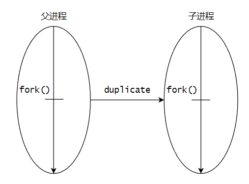

# 【Linux C】并发操作

作者：wallace-lai <br>
发布：2024-05-29 <br>
更新：2024-06-16 <br>

并发操作对应APUE上的章节为：

- 第10章：信号

- 第11章：线程

- 第12章：线程控制

对应的教程：P167 ~ P235

## P167 进程 - 进程的概念

### 1. 进程的基本知识

（1）进程标识符pid

- 类型：`pid_t`

- 命令：`ps`

- 进程号是顺次向下使用的

- 返回当前进程的pid号：`getpid()`

- 返回当前进程的ppid号：`getppid()`


（2）进程的产生

- fork()

- vfork()

**fork()原理**



父进程通过fork调用，拷贝了一个子进程出来，父子进程除了以下几点（不是全部）不一样之外，其他都一样：

- fork返回值不一样：父进程返回一个非负整数（子进程的pid），子进程返回0

- 父子进程的pid不同，ppid也不相同

- 未决信号和文件锁不继承

- 新创建子进程的资源利用量清0

- init进程（1号进程）是所有进程的祖先进程

- 不要假定父子进程谁会先被执行，这取决于linux内核调度器的调度策略

- fflush的重要性（在fork子进程之前刷新父进程打开的流）


（3）进程的消亡及资源释放

（4）exec函数族

（5）用户权限和组权限

（6）观摩课：解释器文件

（7）系统调用system()

（8）进程会计

（9）进程时间

（10）守护进程

（11）系统日志

## P168 ~ P169 进程 - fork实例

### 1. 简单fork实例

[完整源码](https://github.com/wallace-lai/learn-apue/blob/main/src/con/process_basic/fork1.c)

写一个简单的fork实例代码，如下所示：

```c
    pid_t pid;

    printf("pid [%d] : begin ...\n", getpid());

    pid = fork();
    if (pid < 0) { /* ... */ }

    if (pid == 0) {
        // child
        printf("pid [%d] : I'm child ...\n", getpid());
    } else {
        // parent
        printf("pid [%d] : I'm parent ...\n",getpid());
    }

    printf("pid [%d] : end ...\n", getpid());
    exit(0);
```

解释：

（1）fork完成后，子进程通过复制父进程而产生，随后父子进程的执行顺序由调度器决定

（2）打印begin在fork之前，所以只有父进程会打印这句话

（3）fork完成之后的打印顺序是不确定的，同样是因为这取决于具体的调度策略

上述代码的运行结果之一为：

```shell
pid [2657] : begin ...
pid [2657] : I'm parent ...
pid [2657] : end ...
pid [2658] : I'm child ...
pid [2658] : end ...
```

**进程父子关系**

在程序`exit(0)`之前，暂停进程，使用`ps axf`命令查看父子进程的关系。如下所示：

```shell
   2248 pts/0    Ss     0:00  |       \_ -bash
   3070 pts/0    S+     0:00  |           \_ ./fork
   3071 pts/0    S+     0:00  |               \_ ./fork
```

可以看到，bash进程创建了父进程fork，然后父进程通过fork调用创建了子进程fork。

**begin为什么会打印两次**

和上面一样的程序，将程序输出重定向到文件中。发现begin打印了两次，且两次begin都是父进程打印的，为什么会这样？

```shell
$ ./fork > /tmp/out
$ cat /tmp/out
pid [3588] : begin ...
pid [3588] : I'm parent ...
pid [3588] : end ...
pid [3588] : begin ...
pid [3589] : I'm child ...
pid [3589] : end ...
```

如果在fork之前刷新所有打开的流，再重复之前的步骤，发现begin只打印了一次，为什么是这样？

```c
    printf("pid [%d] : begin ...\n", getpid());
    fflush(NULL);

    pid = fork();
    if (pid < 0) { /* ... */ }
```

```shell
$ ./fork > /tmp/out
$ cat /tmp/out
pid [3963] : begin ...
pid [3963] : I'm parent ...
pid [3963] : end ...
pid [3964] : I'm child ...
pid [3964] : end ...
```

原因在于，**printf中的内容还没往文件/tmp/out中写入，还在缓冲区的时候，开始fork子进程。此时，父子进程的缓冲区中各有一句begin的打印。即使printf的输出内容带了换行符也不行，因为文件是全缓冲，换行符不会触发缓冲区的刷新**。

所以，在每次fork子进程之前都需要调用fflush将父进程打开的流给刷新一遍。

### 2. 求取质数的多进程并发版本

[完整源码](https://github.com/wallace-lai/learn-apue/tree/main/src/con/process_basic)

先写一个单进程版本，如下所示：

```c
    for (int i = BEG; i <= END; i++) {
        mark = 1;
        for (int p = 2; p < i / 2; p++) {
            if (i % p == 0) {
                mark = 0;
                break;
            }
        }

        if (mark) {
            printf("%d is a primer.\n", i);
        }
    }
```

改造成多进程版本，思路是每枚举到一个i值，将判断i是否为质数的功能扔给子进程去完成。

```c
    for (int i = BEG; i <= END; i++) {
        pid_t pid = fork();
        if (pid < 0) {
            perror("fork()");
            exit(1);
        }

        if (pid == 0) {
            mark = 1;
            for (int p = 2; p < i / 2; p++) {
                if (i % p == 0) {
                    mark = 0;
                    break;
                }
            }

            if (mark) {
                printf("%d is a primer.\n", i);
            }

            exit(0);
        }
    }
```

解释：

（1）父进程只负责创建子进程

（2）判断i是否为质数的工作交给子进程去完成

（3）注意子进程判断完毕无比调用exit(0)退出，否则系统有死机风险


比较这两个程序的运行所需时间，结果如下：

```shell
$ time ./primer1 > /dev/null

real    0m0.972s
user    0m0.944s
sys     0m0.027s

$ time ./primer2 > /dev/null

real    0m0.096s
user    0m0.000s
sys     0m0.018s
```


