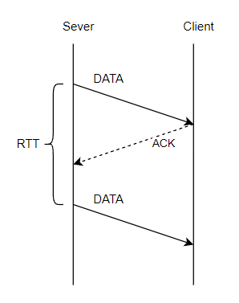
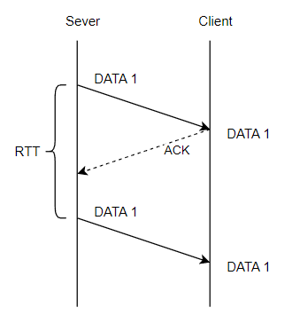
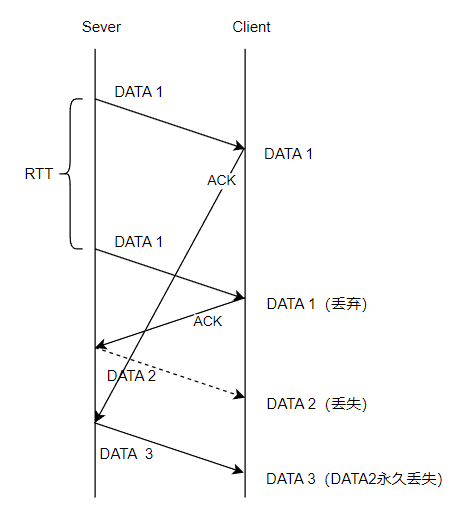
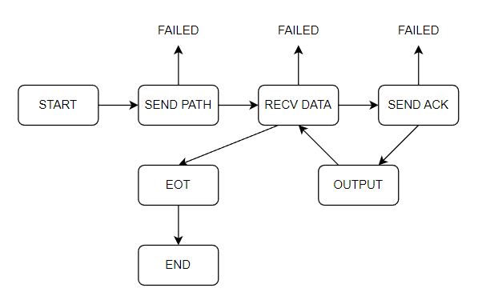

# 【Linux C】进程间通信

作者：wallace-lai <br>
发布：2024-05-29 <br>
更新：2024-06-05 <br>

进程间通信对应APUE上的章节为：

- 第8章：进程控制

- 第13章：守护进程

- 第15章：进程间通信

- 第16章：网络IPC：套接字

对应的教程：P236 ~ P266

## P236 进程间通信详解

### 1. 管道通信

（1）管道特征

- 内核提供
- 单工：一端为读端，一端为写端
- 自同步机制：管道读空了，读操作会被阻塞；管道写满了，写操作会被阻塞

（2）匿名管道pipe

```c
#include <unistd.h>

int pipe(int pipefd[2]);
```

（3）命名管道mkfifo

```c
#include <sys/types.h>
#include <sys/stat.h>

int mkfifo(const char *pathname, mode_t mode);
```


### 2. XSI（SysV）通信

（1）XSI提供的通信机制

- Message Queues

- Shared Memory Segments

- Semaphore Arrays

（2）ipcs命令

```
------ Message Queues --------
key        msqid      owner      perms      used-bytes   messages

------ Shared Memory Segments --------
key        shmid      owner      perms      bytes      nattch     status

------ Semaphore Arrays --------
key        semid      owner      perms      nsems
```

可以看到，三种方式中都有key字段。key的作用是让IPC通信的各个实例能够在没有亲缘关系的进程中共享。

（3）使用方法

- 使用ftok获得key值

- 使用三套接口来操作

上述通信机制提供了三套接口，分别是xxxget、xxxop、xxxctl。xxx表示通信机制，分别是msg（消息队列）、shm（共享内存）、sem（信号量）。使用`man xxxget`命令可以得到对应的man手册。

（4）消息队列

- ftok()
- msgget()
- msgop
- msgctl()

（5）信号量

- ftok()
- semget()
- semop()
- semctl()

（6）共享内存

- shmget()
- shmop()
- shmctl()

### 3. 网络套接字

（1）跨主机传输要注意的问题

（2）报式套接字

（3）流式套接字

## P237 进程间通信 - 管道详解

### 1. 匿名管道实例

```c
int pd[2];
if (pipe(pd) < 0) {
    perror("pipe()");
    exit(1);
}

pid = fork();
if (pid < 0) {
    perror("fork()");
    exit(1);
}

if (pid == 0) {
    // child
    close(pd[1]);
    int len = read(pd[0], buffer, BUFSIZE);
    write(1, buffer, len);
    close(pd[0]);
    exit(0);
} else {
    // parent
    const char *msg = "hello message from parent.\n";
    close(pd[0]);
    write(pd[1], msg, strlen(msg));
    close(pd[1]);
    wait(NULL);
    exit(0);
}
```

注意：

（1）对于子进程而言，因为不需要往管道写入，所以需要关闭写端`pd[1]`以避免麻烦。同时读取完毕后在退出程序前需要关闭读端`pd[0]`；

（2）对于父进程而言，则是关闭读端`pd[0]`，在写完后再关闭写端`pd[1]`；

（3）记得父进程得使用`wait(NULL)`来等待子进程退出；

如果要基于上述匿名管道完成流媒体播放功能，伪代码可以这么写：

```c
if (pid == 0) {
    // child
    close(pd[1]);
    dup2(pd[0], 0);
    close(pd[0]);

    int fd = open("/dev/null", O_RDWR);
    dup2(fd, 1);
    dup2(fd, 2);
    execl("/usr/bin/mpg123", "mpg123", "-", NULL);

    perror("execl()");
    exit(1);
} else {
    // parent
    close(pd[0]);

    // 网络流媒体：父进程从网上收数据，往管道中写

    close(pd[1]);
    wait(NULL);
    exit(0);
}
```

注意：

（1）子进程中的mpg123通过`-`选项读取标准输入作为输入，我们并不需要mpg123本身的信息输出，所以需要将标准输出2和标准错误输出3给重定向到`/dev/null`中去；

### 2. 命名管道实例

（1）使用mkfifo创建一个命名管道，发现管道的文件类型是p（管道文件）

```
$ cd /tmp/
$ mkfifo nfifo
$ ls -lah nfifo
prw-rw-r-- 1 lzh lzh 0 Jun  6 14:39 nfifo
```

（2）往管道中写入数据，发现写入操作会被阻塞

```
$ date
Thu 06 Jun 2024 02:39:08 PM UTC
$ date > nfifo
```

（3）在另一个命令行中读取管道数据，可以将数据读出，此时写入操作才会结束

```
$ cat nfifo
Thu 06 Jun 2024 02:39:23 PM UTC
```

### 3. 总结

（1）匿名管道无法应用在没有亲缘关系的进程之间通信；

（2）命名管道可以应用在没有亲缘关系的进程之间通信，因为命名管道可以对应磁盘上的管道文件

## P238 ~ P240 进程间通信 - 消息队列详解
消息队列常用的接口：

（1）msgget()：创建消息队列

（2）msgop()：操作消息队列（发送、接收）

（3）msgctl()：控制消息队列


### 1. 消息队列

**消息队列的特点**

（1）相关接口

- ftok()
- msgget()
- msgop()
- msgctl()

（2）双工，可读可写

**消息队列的实现案例：基础版**

我们首先定义好发送端和接收端之间的消息格式以及用于生成key的数据，如下所示：

```c
// proto.h

#define KEYPATH "/etc/services"
#define KEYPROJ 'G'

#define NAME_SIZE 16

typedef struct _msg {
    long mtype;
    char name[NAME_SIZE];
    int math;
    int chinese;
} msg;
```

对于接收端，需要先获取key，随后创建消息队列得到msgid，最后将接受到的消息解码后打印：

```c
key_t key = ftok(KEYPATH, KEYPROJ);
if (key < 0) { /* ... */ }

int msgid = msgget(key, IPC_CREAT | 0600);
if (msgid < 0) { /* ... */ }

msg rbuf;
while (1) {
    ssize_t len = msgrcv(msgid, &rbuf, sizeof(msg) - sizeof(long), 0, 0);
    if (len < 0) { /* ... */ }

    printf("NAME = %s\nMATH = %d\nChinese = %d\n", rbuf.name, rbuf.math, rbuf.chinese);
}

msgctl(msgid, IPC_RMID, NULL);
exit(0);
```

对于发送端，则是发送消息：

```c
key_t key = ftok(KEYPATH, KEYPROJ);
if (key < 0) { /* ... */ }

int msgid = msgget(key, 0);
if (msgid < 0) { /* ... */ }

srand(time(NULL));

msg sbuf;
sbuf.mtype = 1;
strncpy(sbuf.name, "Alice", NAME_SIZE);
sbuf.math = rand() % 100;
sbuf.chinese = rand() % 100;

int ret = msgsnd(msgid, &sbuf, sizeof(sbuf) - sizeof(long), 0);
if (ret < 0) { /* ... */ }

puts("OK");
exit(0);
```

注意：

（1）我们将创建消息队列的任务交给接收端来完成，因为接收端不启动，则没有通信的必要；

（2）一般推荐接收端进程先启动，随后才是发送端进程启动。如果发送端进程先启动并发送多个消息，那么消息将会被缓存

启动发送端并连续发送三个消息：

```shell
$ ./snder
OK
$ ./snder
OK
$ ./snder
OK
$
```

则接收端启动时会一下子收到三个消息：

```shell
$ ./rcver
NAME = Alice
MATH = 83
Chinese = 90
NAME = Alice
MATH = 92
Chinese = 13
NAME = Alice
MATH = 50
Chinese = 44
```

每个消息队列的缓存区大小可以通过ulimit查看，可以看到默认设置下的消息队列缓存区大小为800KB（819200B）。这一数值可以修改。如果发送端发送的消息超过了这个限制，那么会产生消息丢失。

```shell
$ ulimit -a
core file size          (blocks, -c) 0
data seg size           (kbytes, -d) unlimited
scheduling priority             (-e) 0
file size               (blocks, -f) unlimited
pending signals                 (-i) 15188
max locked memory       (kbytes, -l) 65536
max memory size         (kbytes, -m) unlimited
open files                      (-n) 1024
pipe size            (512 bytes, -p) 8
POSIX message queues     (bytes, -q) 819200
real-time priority              (-r) 0
stack size              (kbytes, -s) 8192
cpu time               (seconds, -t) unlimited
max user processes              (-u) 15188
virtual memory          (kbytes, -v) unlimited
file locks                      (-x) unlimited
```

**消息队列的实现案例：ftp实例**

[完整源码](https://github.com/wallace-lai/learn-apue/tree/main/src/ipc/xsi/msg/myftp_msg)

## P241 进程间通信 - 信号量详解

### 1. 信号量
信号量常用的接口：

（1）semget()

（2）semop()

（3）semctl()

互斥锁通常用于保护对共享资源的访问，以确保每次只有一个线程可以访问该资源。而信号量是一个更一般的同步机制，可以用来控制对多个共享资源的访问。信号量维护的计数器用于表示可用资源的数量。

互斥锁适用于需要严格互斥访问共享资源的场景，例如对某个数据结构的修改；信号量更适用于需要控制对多个共享资源的并发访问场景，例如生产者-消费者问题，或者需要限制对某一资源的并发访问数量的场景。

### 2. 信号量的使用案例

[完整源码](https://github.com/wallace-lai/learn-apue/blob/main/src/ipc/xsi/sem/add.c)

案例内容为使用多进程的形式，每个进程对给定的存储于文件中的计数器值进行加一操作。具体代码如下所示：

```c
#define PROCNUM     20
#define FNAME       "/tmp/out"
#define LINESIZE    1024

static int semid;
```
解释：

（1）首先定义好进程个数、文件所处路径和缓冲区大小

（2）`semid`用于保存信号量数组的id号

```c
static void p()
{
    struct sembuf buf;
    buf.sem_num = 0;
    buf.sem_op = -1;
    buf.sem_flg = 0;

    while (semop(semid, &buf, 1) < 0) {
        if (errno != EINTR || errno != EAGAIN) {
            perror("semop()");
            exit(1);
        }
    }

    return;
}

static void v()
{
    struct sembuf buf;
    buf.sem_num = 0;
    buf.sem_op = 1;
    buf.sem_flg = 0;

    if (semop(semid, &buf, 1) < 0) {
        perror("semop()");
        exit(1);
    }

    return;
}
```

解释：

（1）使用减一和加一的方式实现对信号量的PV操作

```c
static void func_add(void)
{
    FILE *fp = fopen(FNAME, "r+");
    if (fp == NULL) {
        perror("fopen()");
        exit(1);
    }

    static char linebuf[LINESIZE];

    p();

    fgets(linebuf, LINESIZE, fp);
    fseek(fp, 0, SEEK_SET);
    fprintf(fp, "%d\n", atoi(linebuf) + 1);
    fflush(fp);

    v();

    fclose(fp);
    return;
}
```

解释：

（1）每个进程都需要先打开文件以获取文件句柄

（2）在进行读取计数器值然后加一再写入之前需要进行P操作以获取对文件访问的许可

（3）最后需要进行V操作释放进程所占用的资源

```c
int main()
{
    semid = semget(IPC_PRIVATE, 1, 0600);
    if (semid < 0) { /* ... */ }

    int ret = semctl(semid, 0, SETVAL, 1);
    if (ret < 0) { /* ... */ }

    for (int i = 0; i < PROCNUM; i++) {
        pid_t pid = fork();
        if (pid < 0) { /* ... */ }

        if (pid == 0) {
            // child
            func_add();
            exit(0);
        }
    }

    for (int i = 0; i < PROCNUM; i++) {
        wait(NULL);
    }

    semctl(semid, 0, IPC_RMID);
    exit(0);
}
```

解释：

（1）由于是父子进程间的通信，所以不需要使用`ftok`来获取key值，然后再通过key值获取semid，直接使用`IPC_PRIVATE`即可；

（2）由于共享文件数只有一个，所以`semget`的第二个参数设置为1，并且在`semctl`设置信号量初值为1，此时信号量就等价于一个互斥锁了；

（3）随后使用`fork`创建多个进程，每个进程执行`func_add`

（4）父进程负责回收子进程最后释放该信号量实例

## P242 进程间通信 - 共享内存详解

### 1. 共享内存

共享内存有两种实现方式，分别是：

（1）利用mmap实现内存映射

（2）利用共享内存接口

共享内存常用接口：

（1）shmget()：获取共享内存实例

（2）shmop()：操作共享内存（读、写）

（3）shmctl()：控制共享内存（删除共享内存实例）

### 2. 共享内存使用案例

[完整源码](https://github.com/wallace-lai/learn-apue/blob/main/src/ipc/xsi/shm/shm.c)

这个案例是在具有亲缘关系的父子进程间使用共享内存进行通信，子进程往共享内存中写入，父进程从共享内存中读取。

```c
int shmid = shmget(IPC_PRIVATE, MEMSIZE, 0600);
if (shmid < 0) { /* ... */ }
```

解释：

（1）由于是父子进程间进行通信，所以使用`IPC_PRIVATE`创建匿名通信即可

（2）第二个参数为所需共享内存的大小，注意实际大小是`MEMSIZE`对`PAGE_SIZE`的向上取整

（3）第三个参数需要给出共享内存实例的权限

```c
pid_t pid = fork();
if (pid < 0) {
    /* ... */
} else if (pid == 0) {
    // child
    void *ptr = shmat(shmid, NULL, 0);
    if (ptr == (void *)-1) { /* ... */ }

    strcpy(ptr, "hello message from child process !");
    shmdt(ptr);
    exit(0);
} else {
    // parent
    wait(NULL);

    void *ptr = shmat(shmid, NULL, 0);
    if (ptr == (void *)-1) { /* ... */ }

    puts(ptr);
    shmdt(ptr);
    shmctl(shmid, IPC_RMID, NULL);
    exit(0);
}
```

解释：

（1）对于子进程，需要使用`shmat`去attach一块实际的内存区域，内存起始地址通过返回值返回

（2）随后往内存区域写入数据，在子进程结束前需要使用`shmdt`去deattach这块共享内存

（3）对于父进程，先用`wait`收尸子进程，确保子进程已经将数据写入了共享内存之中

（4）随后使用`shmid`去attach到共享内存上，然后打印子进程写入的数据

（5）在父进程结束前，先使用`shmdt`去deattach共享内存，最后使用`shmctl`删除该共享内存实例

## P243 ~ P247 进程间通信 - 套接字

### 1. 跨主机传输要注意的问题

（1）字节序问题

- 大端：低地址处放高字节内容

- 小端：低地址放低字节内容

对于十六进制数`0xAABBCCDD`而言，大端和小端的表示如下所示：

- 大端

|00|01|02|03|
|--|--|--|--|
|AA|BB|CC|DD|

- 小端

|00|01|02|03|
|--|--|--|--|
|DD|CC|BB|AA|

解决办法，使用**主机字节序**、**网络字节序**的概念。

- 主机字节序：host

- 网络字节序：network

二者之间的转换：`_ to _ _`

- 主机发送前需要将主机字节序转换为网络字节序：`htons`、`htonl`

- 主机从网络接收时需要将网络字节序转换成主机字节序：`ntohs`、`ntohl`

（2）结构体对齐问题

由于不同体系结构下，结构体的对其方式是不一样的。因此，网络传输的场景下，是不允许编译器进行结构体对齐的。

```c
struct _xxx {
    int i;
    float f;
    char ch;
} __attribute__((packed));
```

（3）类型长度的问题

在C语言标准中，诸如int、char、short这种整型数据是没有固定长度的。因此，在不同的体系结构中进行网络传输可能会遇到同种数据类型但二者长度不一致的问题。

解决办法：使用固定长度的通用数据类型，比如`int32_t`、`uint32_t`、`uint64_t`等等

### 2. 套接字

`socket()` creates an endpoint for communication and return a file descriptor thant refers to that endpoint.

```c
#include <sys/types.h>
#include <sys/socket.h>

int socket(int domain, int type, int protocol);
```

使用某种协议族（domain）中的某种协议（protocol）来完成某种类型（type）的传输

（1）domain的常用选项

- AF_INET：IPv4协议族

- AF_INET6：IPv6协议族

（2）type常用选项

- SOCK_STREAM：流式

- SOCK_DGRAM：报式

### 3. 报式套接字

被动端（先收到消息的一端，需先启动）：

（1）取得socket：`socket()`

```c
#include <sys/types.h>
#include <sys/socket.h>

int socket(int domain, int type, int protocol);
```


（2）给socket取得地址：`bind()`

```c
#include <sys/types.h>
#include <sys/socket.h>

int bind(int sockfd, const struct sockaddr *addr, socklen_t addrlen);
```

- 第一个参数是由socket得来的文件描述符

- 第二个参数和第三个参数是虚拟的，针对不同的协议族，有不同的参数类型

- 对于IPv4来说，addr的具体类型如下：

```c
struct sockaddr_in {
    sa_family_t    sin_family;    /* 地址家族，必须是AF_INET */
    in_port_t      sin_port;      /* 网络字节序表示的端口号 */
    struct in_addr sin_addr;      /* IP地址 */
};

struct in_addr {
    uint32_t       s_addr;        /* 网络字节序表示的IP地址 */
};
```

- 第二个参数用于指明要绑定的IP地址和端口号


（3）收/发消息：`recvfrom()`

```c
#include <sys/types.h>
#include <sys/socket.h>

ssize_t recvfrom(int sockfd, void *buf, size_t len, int flags,
                 struct sockaddr *src_addr, socklen_t *addrlen);
```

- 与bind类似，第5个参数是虚拟的，针对不同协议，有不同类型的参数

- 由于不知道src_addr的实际大小，所以需要有第6个参数addrlen来接收其大小


（4）关闭socket：`close()`


主动端（先发消息的一端，需后启动）：

（1）取得socket

（2）给socket取得地址（可省略）

（3）发/收消息：`sendto()`

```c
#include <sys/types.h>
#include <sys/socket.h>

ssize_t sendto(int sockfd, const void *buf, size_t len, int flags,
               const struct sockaddr *dest_addr, socklen_t addrlen);
```

（4）关闭socket


### 4. 报式套接字案例

[完整源码](https://github.com/wallace-lai/learn-apue/tree/main/src/ipc/socket/dgram/basic)

该案例使用UDP在主从两段发送数据，核心代码如下：

```c
#define RECVPORT "1989"
#define NAMESIZE 64

struct msg_s {
    uint8_t name[NAMESIZE];
    uint32_t math;
    uint32_t chinese;
} __attribute__((packed));
```
解释：

（1）先定义发送数据的结构体和接收端的端口号


```c
int sock = socket(AF_INET, SOCK_DGRAM, 0 /* IPPROTO_UDP */);
if (sock < 0) {
    perror("socket()");
    exit(1);
}

struct sockaddr_in laddr;
laddr.sin_family = AF_INET;
laddr.sin_port = htons(atoi(RECVPORT));
inet_pton(AF_INET, "0.0.0.0", &laddr.sin_addr.s_addr);

ret = bind(sock, (void *)&laddr, sizeof(struct sockaddr_in));
if (ret < 0) {
    perror("bind()");
    exit(1);
}
```

解释：

（1）对于接收端，创建socket以后，绑定IP地址和端口号

```c
static char ipstr[IPSTRSIZE];
struct msg_s buffer;
struct sockaddr_in raddr;
socklen_t rlen = 0;
while (1) {
    recvfrom(sock, &buffer, sizeof(buffer), 0, (void *)&raddr, &rlen);

    inet_ntop(AF_INET, &raddr.sin_addr, ipstr, IPSTRSIZE);
    printf("--- RECV MESSAGE FROM %s:%d ---\n", ipstr, ntohs(raddr.sin_port));
    printf("NAME : %s\n", buffer.name);
    printf("MATH : %d\n", ntohl(buffer.math));
    printf("CHINESE : %d\n", ntohl(buffer.chinese));
}

close(sock);
exit(0);
```

解释：

（1）随后不断地监听socket，从中读取来自发送端的数据，一旦读到数据则打印之

对于发送端，可以忽略bind操作，如下所示：

```c
if (argc < 2) {
    fprintf(stderr, "Usage ...\n");
    exit(1);
}

int sock = socket(AF_INET, SOCK_DGRAM, 0);
if (sock < 0) {
    perror("socket()");
    exit(1);
}

// bind();
```

解释：

（1）IP使用命令行传入的方式

```c
struct msg_s buffer;
strncpy(buffer.name, "Alice", NAMESIZE);
buffer.math = htonl(rand() % 100);
buffer.chinese = htonl(rand() % 100);

struct sockaddr_in raddr;
raddr.sin_family = AF_INET;
raddr.sin_port = htons(atoi(RECVPORT));
inet_pton(AF_INET, argv[1], &raddr.sin_addr.s_addr);

ret = sendto(sock, &buffer, sizeof(buffer), 0, (void *)&raddr, sizeof(raddr));
if (ret < 0) {
    perror("sendto()");
    exit(1);
}
puts("Send OK.");

close(sock);
exit(0);
```

解释：

（1）使用sendto给接收端发送消息

## P248 ~ P250 进程间通信 - 套接字（多播）

报式套接字（UDP）可以支持广播和多播/组播功能，具体而言：

（1）广播功能包括：

- 全网广播

- 子网广播

（2）多播 / 组播

### 1. 涉及的接口
（1）设置和读取socket选项

```c
#include <sys/types.h>
#include <sys/socket.h>

int getsockopt(int sockfd, int level, int optname, void *optval, socklen_t *optlen);

int setsockopt(int sockfd, int level, int optname, const void *optval, socklen_t optlen);
```

### 1. 全网广播的实现

[完整源码](https://github.com/wallace-lai/learn-apue/tree/main/src/ipc/socket/dgram/bcast)

下面是发送端的代码改动：

```c
    int sock = socket(AF_INET, SOCK_DGRAM, 0);
    if (sock < 0) { /* ... */ }

    // 打开广播标志
    int val = 1;
    ret = setsockopt(sock, SOL_SOCKET, SO_BROADCAST, (void *)&val, sizeof(val));
    if (ret < 0) { /* ... */ }

    // ...

    // 往全网广播地址255.255.255.255发送
    inet_pton(AF_INET, "255.255.255.255", &raddr.sin_addr.s_addr);
```

解释：

（1）创建socket以后需要使用`setsockopt`打开广播标志

（2）发送IP使用全网广播地址255.255.255.255即可

对于接收端，同样要打开广播标志，如下所示：

```c
    int sock = socket(AF_INET, SOCK_DGRAM, 0 /* IPPROTO_UDP */);
    if (sock < 0) { /* ... */ }

    // 打开广播标志
    int val = 1;
    ret = setsockopt(sock, SOL_SOCKET, SO_BROADCAST, (void *)&val, sizeof(val));
    if (ret < 0) { /* ... */ }
```

### 2. 多播 / 组播的实现

多播实现的基本原理：

（1）发送方创建多播组，并往该组发送消息

（2）接收方加入多播组，从多播组中接收消息

[完整源码](https://github.com/wallace-lai/learn-apue/tree/main/src/ipc/socket/dgram/mbcast)

协议的改动如下：

```c
#define MTGROUP  "224.2.2.2"
```

解释：

（1）协议需要新增组播地址

（2）所有支持组播的设备默认都在224.0.0.1这个网段，所以往224.0.0.1发送消息相当于是全网广播


发送方的改动如下所示：

```c
    int sock = socket(AF_INET, SOCK_DGRAM, 0);
    if (sock < 0) { /* ... */ }

    struct ip_mreqn mreq;
    inet_pton(AF_INET, MTGROUP, &mreq.imr_multiaddr);
    inet_pton(AF_INET, "0.0.0.0", &mreq.imr_address);
    mreq.imr_ifindex = if_nametoindex("eth0");

    ret = setsockopt(sock, IPPROTO_IP, IP_MULTICAST_IF, (void *)&mreq, sizeof(mreq));
    if (ret < 0) { /* ... */ }
```

解释：

（1）发送方使用`setsockopt()`创建组播

接收方的改动如下所示：

```c
    int sock = socket(AF_INET, SOCK_DGRAM, 0 /* IPPROTO_UDP */);
    if (sock < 0) { /* ... */ }

    struct ip_mreqn mreq;
    inet_pton(AF_INET, MTGROUP, &mreq.imr_multiaddr);
    inet_pton(AF_INET, "0.0.0.0", &mreq.imr_address);
    mreq.imr_ifindex = if_nametoindex("eth0");

    ret = setsockopt(sock, IPPROTO_IP, IP_ADD_MEMBERSHIP, &mreq, sizeof(mreq));
    if (ret < 0) { /* ... */ }
```

解释：

（1）接收方使用`IP_ADD_MEMBERSHIP`标志加入发送方创建的组播中

## P251 ~ P252 进程间通信 - UDP传输分析

### 1. UDP协议存在的问题

使用UDP协议实现FTP程序可能存在的问题：

（1）**丢包**

丢包几乎不可能是由TTL耗尽造成的，大概率是由网络阻塞造成的。为了降低丢包率，可以使用流控机制。但流控只能使用闭环流控机制，否则起不到缓解网络阻塞的现象。

（2）**等待时间RTT**



如图所示，假设S端（服务端）在发送完数据包之后等待C端（请求端）的ACK的过程中，ACK消息发生了丢失。面对这种情况，S端应该如何处理？此时，**可以在S端每次发包之后设置一个等待时间RTT**。一旦在RTT时间内没有收到C端的ACK消息，则重新发送上一个包。

（3）**包序列号SEQ**



接着上个问题继续讨论。如图所示，假设S端重新发包并被C端成功接收了，这个时候C端实际上接收到了2个一样的包。但是C端本身并不能确定第二个包是一个新包还是因为ACK丢失而接收到的重传的旧包！所以，**S端要为每一个包都赋予一个不同的编号SEQ**，这样C端通过校验第二个包的SEQ可以得知它是重传的旧包，丢弃该包即可。

（4）**ACK序列号SEQ**



接着上个问题继续讨论。如图所示，假设：

1. C端发送DATA1的ACK时遇到了网络阻塞（不是ACK彻底丢失）；

2. S端在超过RTT时间后重传DATA1，且被C端成功接收（会被C端丢弃）；

3. S端在成功接收到C端的ACK后，发送下一个包DATA2；

4. DATA2在发送给C端的过程中彻底丢失了，且此时S端收到了最初的ACK；

此时，S端会误以为DATA2成功被C端接收，于是发送下一个包DATA3，由此**造成DATA2在C端的永久丢失**！

要解决这个问题，必须让S端能够识别不同的ACK，所以**ACK消息也需要赋予不同的编号SEQ**。

### 2. 基于UDP的ftp程序实现

所谓停等式流控指的是发送端需要先收到上一个包被接收端成功接收的消息ACK之后，才会发送下一个包。这其中存在着等待收取ACK的阶段，因此叫停等式。

加入停等式流控后，ftp程序的请求端的状态机如下所示：



解释：

（1）请求端开始时首先进入SEND PATH状态，将请求的文件路径发送给服务端；

（2）请求端随后进入RECV DATA状态，等待并接收服务端发送的包；

（3）请求端一旦成功接收到了包，则进入SEND ACK状态，向服务端发送ACK；

（4）请求端发送ACK完毕后，进入OUTPUT状态，将接收到的包内容给打印出来；

（5）请求端再次进入RECV DATA状态，等待并接收服务端发送的下一个包；

（6）请求端如果收到EOT消息，则进入EOT状态，然后结束整个流程

注意：对于存在失败可能性的状态，如果失败则进入FAILED状态，FAILED状态用图中的FAILED标签表示。

【pending】

## P253 进程间通信 - TCP传输协议分析
