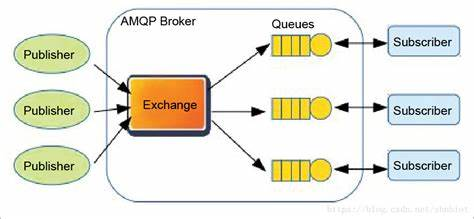
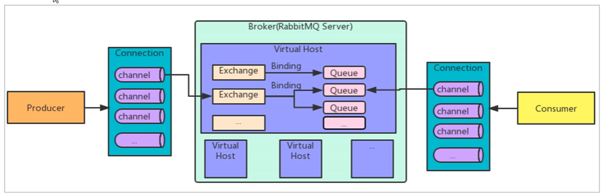

# 【Go】RabbitMQ消息队列

## 消息队列基本概念
### MQ的优势和劣势
优势： 
（1）应用解耦 
（2）异步提速 
（3）削峰填谷

劣势： 
（1）系统可用性降低 
MQ本身宕机会造成系统不可用，因此整个系统可用性会降低 

（2）系统复杂度提高 
如何保证消息没有被重复消费？如何处理消息丢失？如何保证消息顺序性？**私以为这些复杂性问题应该是MQ本身应该处理好的，而不能将问题抛出提升整个系统的复杂性** 

（3）一致性问题 
这属于分布式系统中老生常谈的问题了 

## 使用RabbitMQ
### RabbitMQ简介
AMQP，即Advanced Message Queuing Protocol（高级消息队列协议），是一个应用层的网络协议的开放标准，专为消息中间件设计。基于此协议的客户端与消息中间件可传递消息，并不受客户端/中间件不同产品，不同开发语言的限制。

AMQP协议中规定的几类角色如上图所示。

（1）Publisher：消息生产者

（2）Exchange：消息交换机，交换机通过路由（Routers）将消息发送给对应的队列（Queue）

（3）Queue：存储消息的队列

（4）Consumer：消息消费者

2007年，Rabbit技术公司基于AMQP标准开发的RabbitMQ 1.0发布。RabbitMQ采用Erlang语言开发。Erlang是一种专门为高并发和分布式系统设计的语言，在电信领域使用广泛。

RabbitMQ中的概念

（1）Broker：接收和分发消息的应用，RabbitMQ Server就是Message Broker

（2）Virtual host：出于多租户和安全因素设计，把AMQP的基本组件划分到一个虚拟的分组中，类似网络中的namespace概念。当多个不同用户使用同一个RabbitMQ Server提供的服务时，可以划分出多个vhost，每个用户在自己的vhost创建exchange和queue等

（3）Connection：Publisher / Consumer和broker之间的TCP连接

（4）Channel：Channel是在Connection内部建立的逻辑连接，如果应用程序支持多线程，通常每个thread创建单独的channel进行通讯，AMQP method包含了channel id帮助客户端和message broker识别channel，所以channel之间是完全隔离的。channel作为轻量级的connection极大减少了操作系统建立TCP connection的开销

（5）Exchange：message到达broker的第一站，根据分发规则，匹配查询表中的routing key，分发消息到queue中去。场景的类型有：direct（点对点）、topic（发布订阅）、fanout（广播）

（6）Queue：消息最终被送到这里等待consumer取走

（7）Binding：exchange和queue之间的虚拟连接，binding中可以包含routine key。binding信息被保存到exchange的查询表中，用于message的分发依据

RabbitMQ简介

RabbitMQ提供了6中工作模式：

（1）简单模式

（2）work queues

（3）publish/subscribe

（4）routing

（5）Topics

（6）RPC