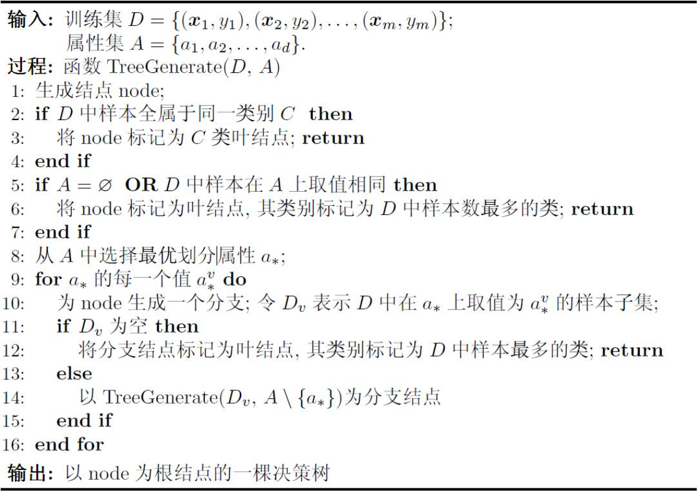

# 【西瓜书】决策树

作者：wallace-lai  
发布：2024-03-15  
更新：2023-03-29  

## 第一部分 读书笔记
### 1. 基本流程

#### 什么是决策树

决策树(decision tree)是一类常见的机器学习方法。顾名思义，决策树是基于树结构来进行决策的，这恰是人类在面临决策问题时一种很自然的处理机制。

例如，我们要对“这是好瓜吗？”这样的问题进行决策时，通常会进行一系列的判断或子决策：我们先看它是什么颜色？，如果是青绿色，则我们再看它的根蒂是什么形态？如果是蜷缩，我们再判断它敲起来是什么声音？，最后，我们得出最终决策：这是个好瓜。

一棵决策树包含一个**根结点**、若干个**内部结点**和若干个**叶结点**。

- 叶结点对应于决策结果，其他每个结点则对应于一个属性测试；

- 每个结点包含的样本集合根据属性测试的结果被划分到子结点中；

- 根结点包含样本全集；

从根结点到每个叶结点的路径对应了一个判定测试序列。**决策树学习的目的是为了产生一棵泛化能力强，即处理未见示例能力强的决策树**。

#### 决策树学习基本算法

决策树的关键是第8行，即**如何选择最优划分属性**。

### 2. 划分选择

#### 信息熵
**信息熵（information entropy）是度量样本集合纯度最常用的一种指标**。假定当前样本集合$D$中第$k$类样本所占的比例为$p_k(k=1,2,...,|y|)$，则$D$的信息熵定义为：

$$
\begin{equation}
Ent(D) = - \sum _{k = 1} ^{|y|} p_k \log _2 p_k \tag{1.1}
\end{equation}
$$

计算信息熵时的一些约定：

（1）若$p = 0$，则$p \log _2 p = 0$；

（2）$Ent(D)$的最小值为0，最大值为$\log _2 |y|$；

（3）$Ent(D)$的值越小，则$D$的纯度越高；

### 3. 剪枝处理

### 4. 连续与缺失值

### 5. 多变量决策树

## 第二部分 算法推导

## 第三部分 代码实现

## 第四部分 sklearn实现

未完待续...