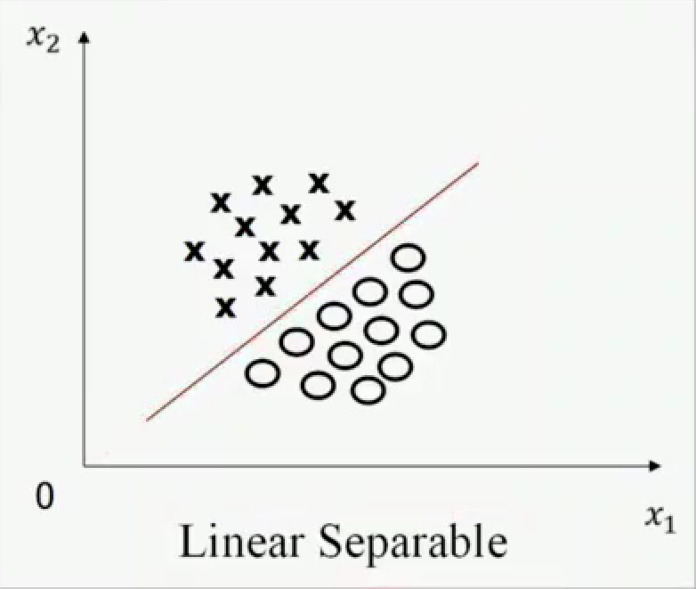
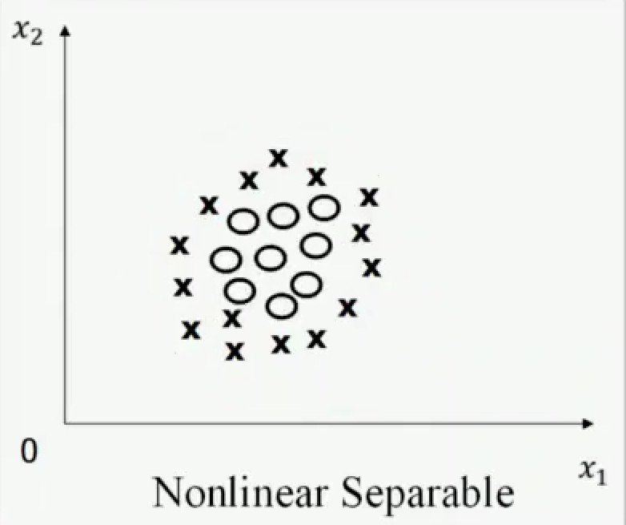
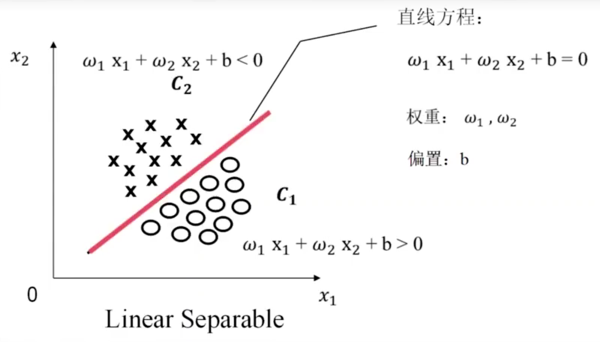

# 【浙大机器学习】第二章

作者：wallace-lai  
发布：2023  
更新：2023  

## P6 支持向量机——线性可分定义

以二维的特征空间为例。

如下图所示，训练样本集是线性可分的，是指**存在一条直线可以将不同类别的样本分开**。

而非线性可分，指的是不存在一条**直线**可以将样本全部分开。

**线性可分的严格数学定义**

严格定义训练样本：

假设我们有N个训练样本（二分类）和他们的标签，用如下公式表示

$$
\begin{array}{ll} & \left\{\left(X_1, y_1\right),\left(X_2, y_2\right), \ldots,\left(X_N, y_N\right)\right\} \\ \text { 其中 } \quad & X_i=\left[x_{i 1}, x_{i 2}\right]^T \\ & y_i=\{+1,-1\} \\ & i = 1 \ldots N
\end{array}
$$

关于$y_i$取值的定义如下：如果$y_i$属于$c_1$，那么$y_i$就等于1；如果$y_i$属于$c_2$，那么$y_i$就等于-1.

严格定义线性可分：

一个训练样本集$\left\{\left(X_1, y_1\right), \ldots,\left(X_N, y_N\right)\right\}$存在$i = 1 \ldots N$时线性可分，是指存在$\left(\omega_1, \omega_2, b\right)$使得对于$i = 1 \ldots N$，有以下公式成立。

$$
(1) \ 若 y_i=+1, 则 \omega_1 x_{i 1}+\omega_2 x_{i 2}+b>0 \\

(2) \ 若 y_i=-1, 则 \omega_1 \mathrm{x}_{i 1}+\omega_2 \mathrm{x}_{i 2}+\mathrm{b}<0
$$

<!--  -->
**思考题**

（1）将线性可分推广到类别数大于2的情况，给出线性可分的数学定义

（2）证明在二分类情况下，如果一个数据集是线性可分的，即存在一个超平面将两个类别完全分开，那么一定存在无数个超平面将这两个类别完全分开

## P7 支持向量机——问题描述

支持向量机算法要解决的问题：

（1）线性可分问题

（2）将线性可分中的结论推广到线性不可分情况中

支持向量机寻找的最优分类直线应该满足以下三个条件：

（1）该直线分开了两类

（2）该直线最大化了间隔（margin）

（3）该直线处于间隔的中间，到所有支持向量的距离相等

注意：**上述描述是在二维空间下的**，如果是多维空间，那么直线就变成了超平面，其余描述一致。

## P8 支持向量机——最优化问题

用最优化公式描述支持向量机如下：

最小化：$$

限制条件：

## P9 支持向量机——线性不可分情况

