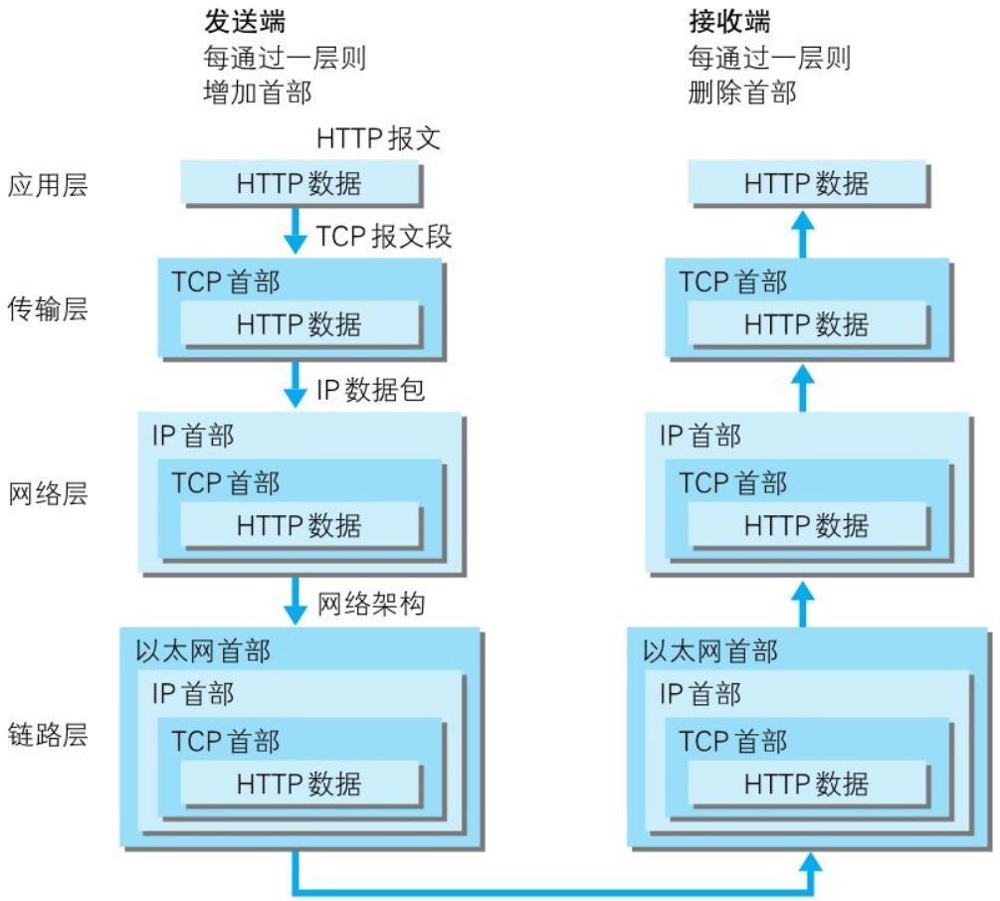

# 【图解HTTP】第一章 了解Web及网络基础

作者：wallace-lai  
发布：2024-03-19  
更新：2023-03-21  

阅读本书的目的只是为了**粗略地**了解HTTP协议的原理，以便快速满足项目需求。更深入的了解还需要借助更详尽的书本来达成。

## 一、HTTP的诞生

构建万维网WWW的三项关键技术：

（1）超文本标记语言HTML；

（2）文档传输协议HTTP；

（3）指定文档所在地址的URL；

### HTTP协议的版本

（1）HTTP/0.9

HTTP于1990年问世。那时的HTTP并没有作为正式的标准被建立。这时的HTTP其实含有HTTP/1.0之前版本的意思，因此被称为HTTP/0.9。

（2）HTTP/1.0

HTTP正式作为标准被公布是在1996年的5月，版本被命名为HTTP/1.0，并记载于RFC1945。虽说是初期标准，但该协议标准至今仍被广泛使用在服务器端。

（3）HTTP/1.1

1997年1月公布的HTTP/1.1是目前主流的HTTP协议版本。当初的标准是RFC2068，之后发布的修订版RFC2616就是当前的最新版本。

补充：HTTP/2.0对HTTP/1.1的改进

（1）<b>二进制与文本格式</b>：HTTP/1.1是一种基于文本的协议，而HTTP/2.0则采用了二进制格式。HTTP/2.0在应用层和传输层之间增加了一个二进制分帧层，所有的传输信息被分为更小的消息和帧，并使用二进制编码。这种二进制格式使得协议解析更为高效，线上传输更为紧凑，且错误率更低。

（2）<b>多路复用与连接管理</b>：HTTP/1.1虽然支持持久连接，但它是有序并阻塞的，每个请求需要按照顺序处理，这可能导致线端阻塞问题。而HTTP/2.0则是完全多路复用的，它可以在一个TCP连接中并行处理多个请求，大大提高了Web性能。

（3）<b>报头压缩</b>：HTTP/1.1不支持header数据的压缩，而HTTP/2.0使用HPACK算法对header的数据进行压缩，减小了数据体积，从而加快了网络传输速度。

（4）<b>服务器端推送</b>：HTTP/2.0引入了服务器端推送（server push）功能，允许服务器在客户端明确请求之前，主动将资源推送到客户端缓存中。这样，客户端可以直接从本地加载这些资源，减少了网络延迟。

总的来说，HTTP/2.0相较于HTTP/1.1在<b>协议格式</b>、<b>连接管理</b>、<b>报头压缩</b>以及<b>服务器端推送</b>等方面都有显著的提升，使得Web应用的性能得到了大幅提升。然而，这并不意味着HTTP/1.1已经过时，它仍然是许多Web应用的基础，并在许多场景下发挥着重要作用。在选择使用哪种协议时，需要根据具体的应用场景和需求进行权衡。

## 二、TCP/IP协议族

这里的TCP/IP协议族的概念指的是与互联网相关联的协议集合的总称。

### TCP/IP协议族的分层管理

TCP/IP协议族按层次分别分为以下4层：应用层、传输层、网络层和数据链路层。

（1）**应用层**

应用层决定了向用户提供应用服务时通信的活动。

TCP/IP协议族内预存了各类通用的应用服务。比如，FTP（File Transfer Protocol，文件传输协议）和DNS（Domain Name System，域名系统）服务就是其中两类。HTTP协议也处于该层。

（2）**传输层**

传输层对上层应用层，提供处于网络连接中的两台计算机之间的数据传输。

在传输层有两个性质不同的协议：TCP（Transmission Control Protocol，传输控制协议）和UDP（User Data Protocol，用户数据报协议）。

（3）**网络层**

网络层用来处理在网络上流动的数据包。数据包是网络传输的最小数据单位。该层规定了通过怎样的路径（所谓的传输路线）到达对方计算机，并把数据包传送给对方。

与对方计算机之间通过多台计算机或网络设备进行传输时，网络层所起的作用就是在众多的选项内选择一条传输路线。

（4）**链路层**

用来处理连接网络的硬件部分。包括控制操作系统、硬件的设备驱动、NIC（Network Interface Card，网络适配器，即网卡），及光纤等物理可见部分（还包括连接器等一切传输媒介）。硬件上的范畴均在链路层的作用范围之内。

发送端在层与层之间传输数据时，每经过一层时必定会被打上一个该层所属的首部信息。反之，接收端在层与层传输数据时，每经过一层时会把对应的首部消去。

这种把数据信息包装起来的做法称为封装(encapsulate)。
