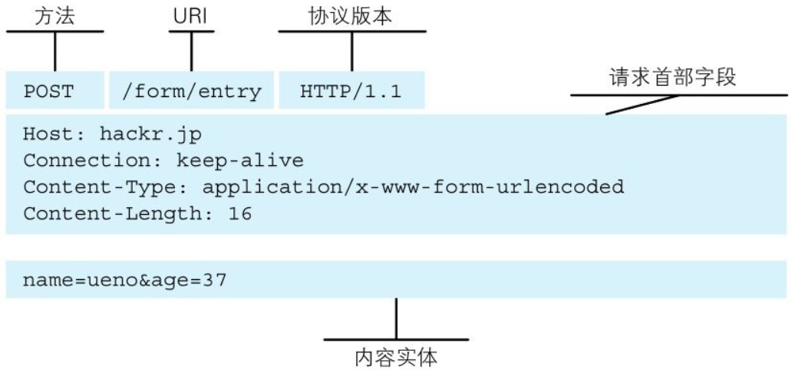
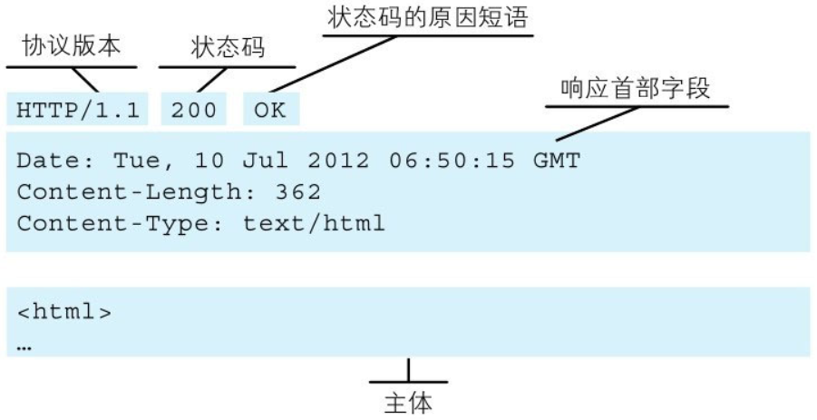
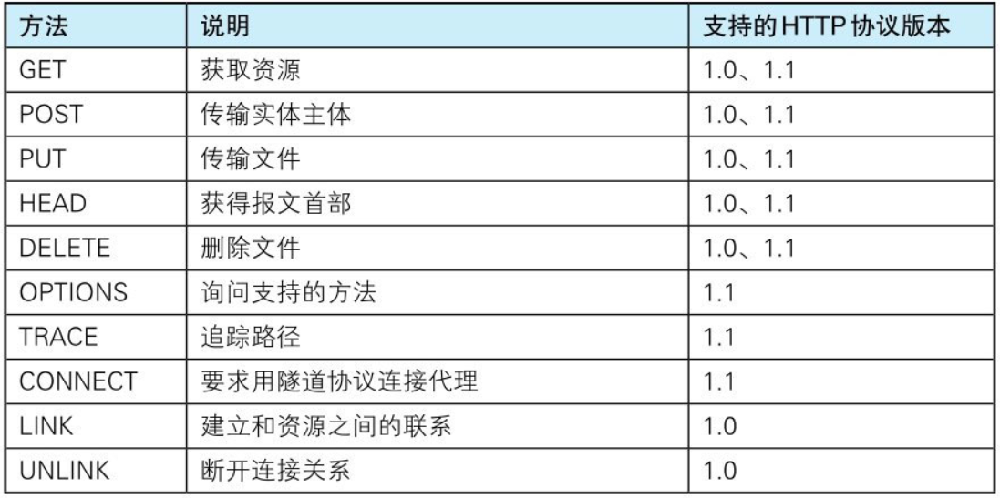

# 【图解HTTP】第二章 简单的HTTP协议

作者：wallace-lai  
发布：2024-03-19  
更新：2023-03-21  

## 一、HTTP协议用于客户端和服务器之间的通信

HTTP协议和TCP/IP协议族内的其他众多的协议相同，用于客户端和服务器之间的通信。

请求访问文本或图像等资源的一端称为客户端，而提供资源响应的一端称为服务器端。

在两台计算机之间使用HTTP协议通信时，在一条通信线路上必定有一端是客户端，另一端则是服务器端。

有时候，按实际情况，两台计算机作为客户端和服务器端的角色有可能会互换。但就仅从一条通信路线来说，服务器端和客户端的角色是确定的，而用HTTP协议能够明确区分哪端是客户端，哪端是服务器端。

## 二、通过请求和响应的交换达成通信

HTTP协议规定，请求从客户端发出，最后服务器端响应该请求并返回。换句话说，肯定是先从客户端开始建立通信的，服务器端在没有接收到请求之前不会发送响应。

（1）请求报文实例

（2）响应报文实例

## 三、HTTP协议是无状态的

HTTP是一种不保存状态，即无状态(stateless)协议。HTTP协议自身不对请求和响应之间的通信状态进行保存。也就是说在HTTP这个级别，协议对于发送过的请求或响应都不做持久化处理。

HTTP/1.1虽然是无状态协议，但为了实现期望的保持状态功能，于是引入了Cookie技术。有了Cookie再用HTTP协议通信，就可以管理状态了。有关Cookie的详细内容稍后讲解。

补充：HTTP中引入Cookie可能造成的网络安全缺陷：

（1）<b>敏感信息泄露</b>：如果cookies中存储了密码、令牌等敏感数据，一旦被恶意获取，攻击者就可能利用这些信息进行非法活动，如登录用户账号、获取用户隐私信息等。

（2）<b>跨站脚本攻击（XSS）</b>：攻击者可能通过注入恶意脚本到网站中，使得用户的浏览器执行这些脚本。这些脚本可以读取、修改或删除用户的cookies，从而导致用户会话被劫持，攻击者能够以用户的身份进行活动。

（3）<b>跨站请求伪造（CSRF）</b>：攻击者可以诱导用户访问一个恶意的网站或点击一个恶意链接，这个网站或链接会发送一个伪造的请求到用户的浏览器，浏览器会自动携带用户的cookies一起发送。如果目标网站没有对请求进行严格的验证，攻击者就可以利用用户的身份执行恶意操作。

（4）<b>中间人攻击</b>：如果cookies没有设置Secure属性，它们可能会通过不安全的HTTP连接进行传输，这使得攻击者有可能在中间截获cookies。即使设置了Secure属性，也并不能完全保证cookies的安全，因为攻击者可能通过其他方式绕过安全限制。

（5）<b>cookies劫持</b>：攻击者可能通过一些手段（如ARP欺骗、DNS劫持等）来篡改用户的网络请求，使得用户的请求被重定向到攻击者控制的服务器上。这样，攻击者就可以获取用户的cookies，并利用这些cookies进行恶意活动。

为了降低cookies引入的安全风险，可以采取一些防范措施，比如：

- 不在cookies中存储敏感信息；

- 对cookies进行加密处理，提高数据传输的安全性；

- 设置cookies的HttpOnly属性，防止JavaScript访问cookies；

- 使用安全的HTTPS协议来传输cookies；

- 对用户输入和请求进行严格的验证和过滤，防止XSS和CSRF攻击；

## 四、HTTP使用URI定位资源

HTTP协议使用URI定位互联网上的资源。正是因为URI的特定功能，在互联网上任意位置的资源都能访问到。

注意URI和URL的区别：URI的功能是对资源进行标识；而URL的功能是描述资源的地址。

## 五、HTTP的方法

（1）GET：获取资源

GET方法用来请求访问已被URI识别的资源。指定的资源经服务器端解析后返回响应内容。也就是说，如果请求的资源是文本，那就保持原样返回；如果是像CGI（Common Gateway Interface，通用网关接口）那样的程序，则返回经过执行后的输出结果。

（2）POST：传输实体主体

POST方法用来传输实体的主体。

虽然用GET方法也可以传输实体的主体，但一般不用GET方法进行传输，而是用POST方法。虽说POST的功能与GET很相似，但POST的主要目的并不是获取响应的主体内容。

（3）PUT：传输文件

PUT方法用来传输文件。就像FTP协议的文件上传一样，要求在请求报文的主体中包含文件内容，然后保存到请求URI指定的位置。

但是，鉴于HTTP/1.1的PUT方法自身不带验证机制，任何人都可以上传文件，存在安全性问题，因此一般的Web网站不使用该方法。若配合Web应用程序的验证机制，或架构设计采用REST（Representational State Transfer，表征状态转移）标准的同类Web网站，就可能会开放使用PUT方法。

（4）HEAD：获取报文首部

HEAD方法和GET方法一样，只是不返回报文主体部分。用于确认URI的有效性及资源更新的日期时间等。

（5）DELETE：删除文件

DELETE方法用来删除文件，是与PUT相反的方法。DELETE方法按请求URI删除指定的资源。

但是，HTTP/1.1的DELETE方法本身和PUT方法一样不带验证机制，所以一般的Web网站也不使用DELETE方法。当配合Web应用程序的验证机制，或遵守REST标准时还是有可能会开放使用的。

（6）OPTIONS：询问支持的方法

OPTIONS方法用来查询针对请求URI指定的资源支持的方法。

（7）TRACE：追踪路径

TRACE方法是让Web服务器端将之前的请求通信环回给客户端的方法。

发送请求时，在Max-Forwards首部字段中填入数值，每经过一个服务器端就将该数字减1，当数值刚好减到0时，就停止继续传输，最后接收到请求的服务器端则返回状态码200 OK的响应。

客户端通过TRACE方法可以查询发送出去的请求是怎样被加工修改/篡改的。这是因为，请求想要连接到源目标服务器可能会通过代理中转，TRACE方法就是用来确认连接过程中发生的一系列操作。

但是，TRACE方法本来就不怎么常用，再加上它容易引发XST（Cross-Site Tracing，跨站追踪）攻击，通常就更不会用到了。

（8）CONNECT：要求使用隧道协议连接代理

CONNECT方法要求在与代理服务器通信时建立隧道，实现用隧道协议进行TCP通信。主要使用SSL（Secure Sockets Layer，安全套接层）和TLS（Transport Layer Security，传输层安全）协议把通信内容加密后经网络隧道传输。

HTTP/1.0和HTTP/1.1支持的办法如下所示：

## 六、持久连接

HTTP协议的初始版本中，每进行一次HTTP通信就要断开一次TCP连接。

以当年的通信情况来说，因为都是些容量很小的文本传输，所以即使这样也没有多大问题。可随着HTTP的普及，文档中包含大量图片的情况多了起来。

为解决上述TCP连接的问题，HTTP/1.1和一部分的HTTP/1.0想出了持久连接（HTTP Persistent Connections，也称为HTTP keep-alive或HTTP connection reuse）的方法。持久连接的特点是，只要任意一端没有明确提出断开连接，则保持TCP连接状态。

持久连接的好处在于减少了TCP连接的重复建立和断开所造成的额外开销，减轻了服务器端的负载。另外，减少开销的那部分时间，使HTTP请求和响应能够更早地结束，这样Web页面的显示速度也就相应提高了。

在HTTP/1.1中，所有的连接默认都是持久连接，但在HTTP/1.0内并未标准化。虽然有一部分服务器通过非标准的手段实现了持久连接，但服务器端不一定能够支持持久连接。毫无疑问，除了服务器端，客户端也需要支持持久连接。

## 七、管线化

持久连接使得多数请求以管线化(pipelining)方式发送成为可能。从前发送请求后需等待并收到响应，才能发送下一个请求。管线化技术出现后，不用等待响应亦可直接发送下一个请求。

这样就能够做到同时并行发送多个请求，而不需要一个接一个地等待响应了。

比如，当请求一个包含10张图片的HTML Web页面，与挨个连接相比，用持久连接可以让请求更快结束。而管线化技术则比持久连接还要快。请求数越多，时间差就越明显。
