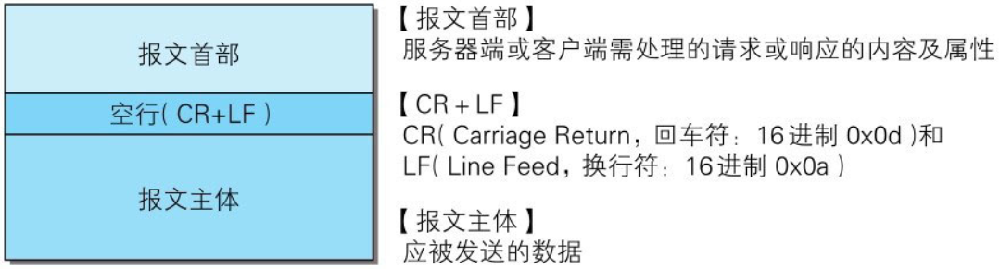
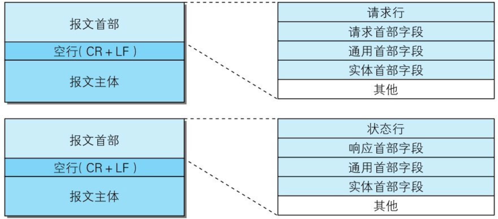
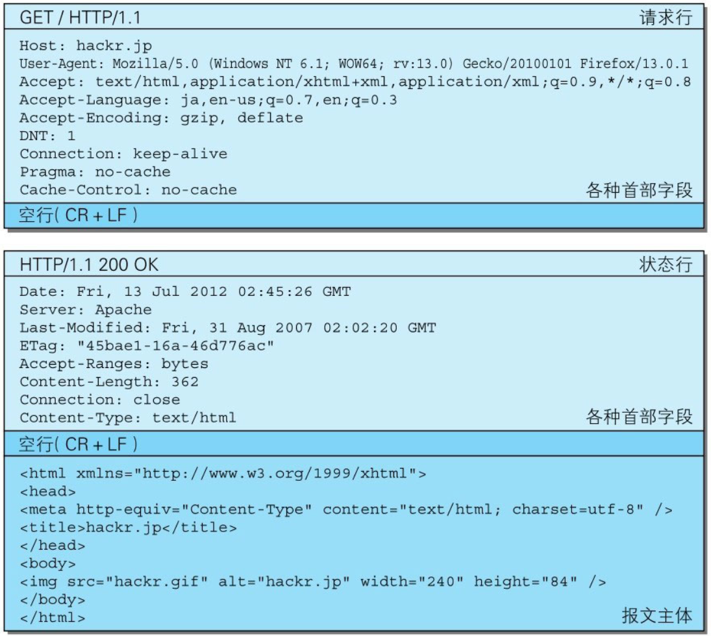

# 【图解HTTP】第三章 HTTP报文内的HTTP信息

作者：wallace-lai <br/>
发布：2024-03-19 <br/>
更新：2023-03-19 <br/>

## 一、报文结构

用于HTTP协议交互的信息被称为**HTTP报文**。请求端（客户端）的HTTP报文叫做**请求报文**，响应端（服务器端）的叫做**响应报文**。

HTTP报文本身是由多行（用CR+LF作换行符）数据构成的字符串文本。



以下是一个具体请求和响应报文的案例。







请求报文和响应报文的首部内容由以下数据组成。

（1）请求行：包含用于请求的方法，请求URI和HTTP的版本；

（2）状态行：包含表明响应结果的状态码，原因短句和HTTP版本；

（3）首部字段：包含表示请求和响应的各种条件和属性的各类首部，具体有

- 通用首部

- 请求首部

- 响应首部

- 实体首部

（4）其他：可能包含HTTP的RFC里未定义的首部


## 二、HTTP机制

### 内容编码

内容编码指明应用在实体内容上的编码格式，并保持实体信息原样压缩。内容编码后的实体由客户端接收并负责解码

### 分块传输编码

分块传输编码会将实体主体分成多个部分（块）。每一块都会用十六进制来标记块的大小，而实体主体的最后一块会使用“0(CR+LF)”来标记

### 多部分对象集合

在MIME（Multipurpose Internet Mail Extensions，多用途因特网邮件扩展）扩展中会使用一种称为多部分对象集合(Multipart)的方法，来容纳多份不同类型的数据。相应地，HTTP协议中也采纳了多部分对象集合，发送的一份报文主体内可含有多类型实体。通常是在图片或文本文件等上传时使用

### 范围请求

指定范围发送的请求叫做范围请求(Range Request)。对一份10000字节大小的资源，如果使用范围请求，可以只请求5001～10000字节内的资源。

执行范围请求时，会用到首部字段Range来指定资源的byte范围。byte范围的指定形式如下。

（1）请求5001 ~ 10000字节

```
Range:bytes=5001-10000
```

（2）从5001字节之后全部的
```
Range:bytes=5001-
```

（3）从一开始到3000字节和5000 ~ 7000字节的多重范围
```
Range:bytes=-3000,5000-7000
```

### 内容协商

同一个Web网站有可能存在着多份相同内容的页面。比如英语版和中文版的Web页面，它们内容上虽相同，但使用的语言却不同。

当浏览器的默认语言为英语或中文，访问相同URI的Web页面时，则会显示对应的英语版或中文版的Web页面。这样的机制称为内容协商(Content Negotiation)。