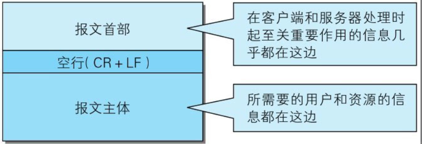
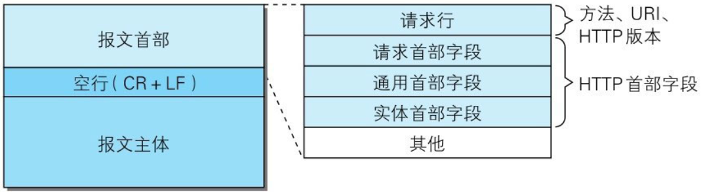
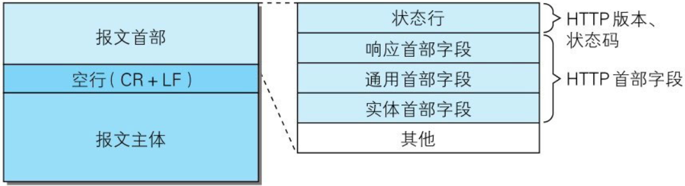

# 【图解HTTP】第六章 HTTP首部

作者：wallace-lai  
发布：2024-03-19  
更新：2023-03-19  

HTTP协议的请求和响应报文中必定包含HTTP首部。首部内容为客户端和服务器分别处理请求和响应提供所需要的信息。

## 一、报文首部

在请求中，HTTP报文由以下几部分组成：

（1）方法；

（2）URI；

（3）HTTP版本；

（4）HTTP首部字段；

- 请求首部字段

- 通用首部字段

- 实体首部字段

在响应中，HTTP报文由以下几部分组成：

（1）HTTP版本；

（2）状态码（数字和原因短语）；

（3）HTTP首部字段；

- 响应首部字段

- 通用首部字段

- 实体首部字段

## 二、首部字段

HTTP中总共有4种首部字段类型：

（1）通用首部字段

请求报文和响应报文两方都会使用的首部。

（2）请求首部字段

从客户端向服务器端发送请求报文时使用的首部。补充了请求的附加内容、客户端信息、响应内容相关优先级等信息。

（3）响应首部字段

从服务器端向客户端返回响应报文时使用的首部。补充了响应的附加内容，也会要求客户端附加额外的内容信息。

（4）实体首部字段

针对请求报文和响应报文的实体部分使用的首部。补充了资源内容更新时间等与实体有关的信息。

HTTP/1.1规范定义了如下的47中首部字段。

### 通用首部字段

|首部字段名|说明|
|--|--|
|Cache-Control|控制缓存的行为|
|Connection|逐跳首部、连接的管理|
|Data|创建报文的日期时间|
|Pragma|报文指令|
|Trailer|报文末端的首部一览|
|Transfer-Encoding|指定报文主体的传输编码方式|
|Upgrade|升级为其他协议|
|Via|代理服务器的相关信息|
|Warning|错误通知|

## 二、请求首部字段

未完待续...