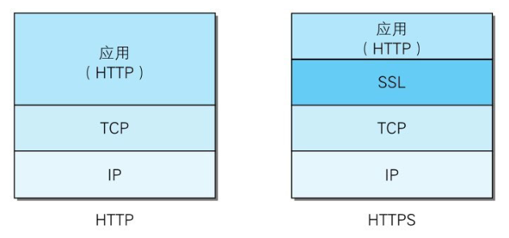
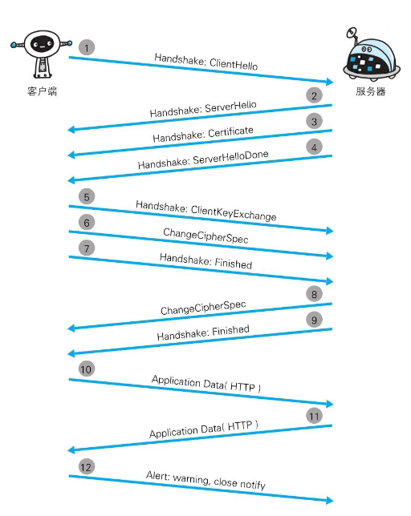

# 【图解HTTP】第七章 确保Web安全的HTTPS

作者：wallace-lai  
发布：2024-03-19  
更新：2023-03-19  

## 一、HTTP的缺点

HTTP主要有以下的不足：

（1）通信使用明文（不加密），内容可能会被窃听；

（2）不验证通信方的身份，因此有可能遭遇伪装；

（3）无法证明报文的完整性，所以有可能已遭篡改；

### 窃听

使用HTTP可能被窃听的原因在于：

（1）HTTP协议本身不支持对内容加密；

（2）TCP/IP协议是互联网，在互联网的任何角落都可以使用抓包工具进行窃听

### 伪装

HTTP协议的实现本身非常简单，不论是谁发来的请求都会返回响应。因此，在这种不确认对方身份的情况下，客户端和服务器双方都可能遭遇伪装。

### 篡改

由于HTTP协议无法证明通信的报文完整性，因此，在请求或响应送出之后直到对方接收之前的这段时间内，即使请求或响应的内容遭到篡改，也没有办法获悉。

## 二、HTTPS对HTTP的改进

为了解决HTTP协议的缺点，需要在HTTP上加入加密处理和认证等机制。我们把添加了加密和认证机制的HTTP称为HTTPS。

### 加密

HTTPS并非是应用层的一种新协议。只是HTTP通信接口部分用SSL(Secure Socket Layer)和TLS(Transport Layer Security)协议代替而已。如下图所示，HTTPS其实是身披SSL外壳的HTTP协议。

注意，SSL是独立于HTTP的协议，所以不光是HTTP协议，其他运行在应用层的SMTP和Telnet等协议均可配合SSL协议使用。

（1）对称加密

加密和解密使用同一个密钥的方法叫做**对称加密**。在客户端和服务端之间使用对称加密，必须解决的一个问题是**如何安全地将密钥发送给对方**。因为，密钥一旦被攻击者窃听得到，那么加密也就失去了意义。

（2）非对称加密

**非对称加密**使用一对非对称的密钥，一把叫做私钥，另一把叫做公钥。私钥不能让其他任何人知道，而公钥可以随意发布。

发送密文的一方**使用对方的公钥进行加密**，对方收到被加密的信息后，**使用自己的私钥进行解密**。利用这种方式，不需要发送用来解密的私钥，也不必担心密钥被攻击者窃听而盗走（因为保存自己手里）。

（3）HTTPS的混合加密机制

HTTPS使用对称加密和非对称加密并用的混合加密模式，首先使用非对称加密安全地交换后续对称加密需要使用的密钥，随后使用对称密钥进行通信。

### 证书

然而，非对称加密还是存在一些问题的，那就是**无法证明公钥本身就是货真价实的公钥**。比如，客户端在和服务器建立通信时，如何确定收到的公钥就是原本预想那台服务器的公钥呢？因为公钥在传输过程中可能被攻击者替换掉了。

为了解决上述问题，需要借助数字证书认证机构CA和由其颁发的公钥证书。数字认证机构是客户端和服务端都可信赖的第三方机构。其业务流程如下。

（1）首先，服务器的运营人员向数字证书认证机构提出公开密钥的申请。数字证书认证机构在判明提出申请者的身份之后，会对已申请的公开密钥做数字签名，然后分配这个已签名的公开密钥，并将该公开密钥放入公钥证书后绑定在一起。

（2）服务器会将这份由数字证书认证机构颁发的公钥证书发送给客户端，以进行公开密钥加密方式通信。公钥证书也可叫做数字证书或直接称为证书。

（3）接到证书的客户端可使用数字证书认证机构的公开密钥，对那张证书上的数字签名进行验证，一旦验证通过，客户端便可明确两件事：一，认证服务器的公开密钥的是真实有效的数字证书认证机构。二，服务器的公开密钥是值得信赖的。

### 篡改

为了更好地理解HTTPS，先来观察一下HTTPS的通信步骤：

（1）客户端通过发送Client Hello报文开始SSL通信

报文中包含的内容：

- 客户端支持的SLL指定版本；

- 加密组件列表（所使用的加密算法和密钥长度等）；

（2）服务器以Server Hello报文作为应答（如果可以进行SSL通信）

和客户端一样，在报文中包含SSL版本以及加密组件。**服务器的加密组件内容是从接收到的客户端加密组件内筛选出来的**。

（3）服务器发送Certificate报文，**报文中包含公开密钥证书**

（4）服务器发送Server Hello Done报文通知客户端，最初阶段的SSL握手协商部分结束

（5）SSL第一次握手结束之后，客户端以Client Key Exchange报文作为回应。报文中包含通信加密中使用的一种被称为Pre-master secret的随机密码串。注意该报文已经使用了步骤（3）中的公钥进行加密

补充：

在HTTPS交互中，Pre-master secret（预主密钥）是一个关键的随机数。其作用主要是增加HTTPS会话的安全性，确保每个会话的密钥都是唯一的。

具体来说，Pre-master secret是由客户端生成的随机数。这个随机数在生成过程中通过公钥进行加密，然后发送给服务器。服务器在接收到加密后的Pre-master secret后，使用私钥进行解密，从而能够生成主密钥。通过使用包括Pre-master secret在内的多个随机数，可以增加密钥的复杂性和安全性，提高加密算法的强度，从而更好地保护通信数据。

（6）接着客户端继续发送Change Cipher Spec报文。该报文会提示服务器，在此报文之后的通信会采用Pre-master secret密钥加密

（7）客户端发送Finished报文。该报文包含连接至今全部报文的整体校验值。这次握手协商是否能够成功，要以服务器是否能够正确解密该报文作为判定标准

（8）服务器同样发送Change Cipher Spec报文

（9）服务器同样发送Change Cipher Spec报文

（10）服务器和客户端的Finished报文交换完毕之后，SSL连接就算建立完成。当然，通信会受到SSL的保护。从此处开始进行应用层协议的通信，即发送HTTP请求

（11）应用层协议通信，即发送HTTP响应

（12）最后由客户端断开连接。断开连接时，发送close_notify报文。上图做了一些省略，这步之后再发送TCP FIN报文来关闭与TCP的通信

在以上流程中，应用层发送数据时会附加一种叫做MAC(Message Authentication Code)的报文摘要。MAC能够查知报文是否遭到篡改，从而保护报文的完整性。

补充：SSL和TLS之间的关系

HTTPS使用SSL(Secure Socket Layer)和TLS(Transport Layer Security)这两个协议。

SSL技术最初是由浏览器开发商网景通信公司率先倡导的，开发过SSL3.0之前的版本。目前主导权已转移到IETF（Internet Engineering Task Force,Internet工程任务组）的手中。

IETF以SSL3.0为基准，后又制定了TLS1.0、TLS1.1和TLS1.2。**TSL是以SSL为原型开发的协议，有时会统一称该协议为SSL**。当前主流的版本是SSL3.0和TLS1.0。

由于SSL1.0协议在设计之初被发现出了问题，就没有实际投入使用。SSL2.0也被发现存在问题，所以很多浏览器直接废除了该协议版本。

简单总结：TLS是在SSL基础上开发的协议，目前流行的版本是SSL3.0和TLS1.0

## 总结

（1）HTTPS使用SSL加密解决了HTTP被窃听的问题；

（2）HTTPS利用证书机制解决了HTTP中的伪装问题；

（3）HTTPS使用MAC报文摘要解决了HTTP中的篡改问题；