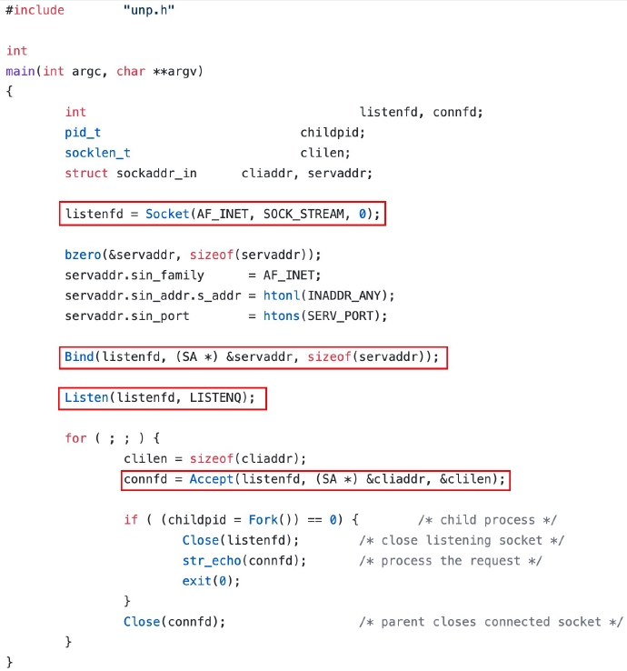
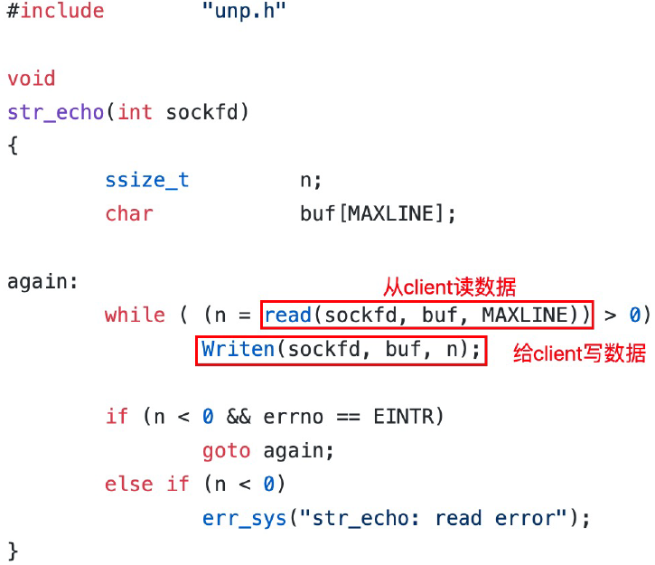
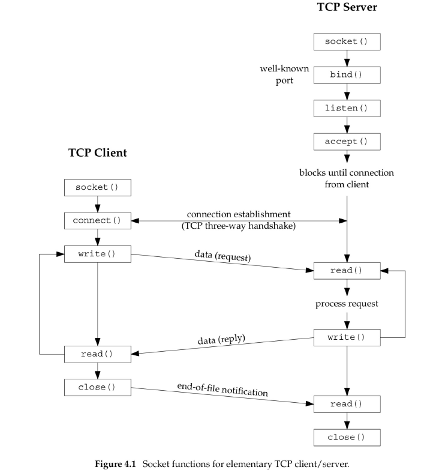
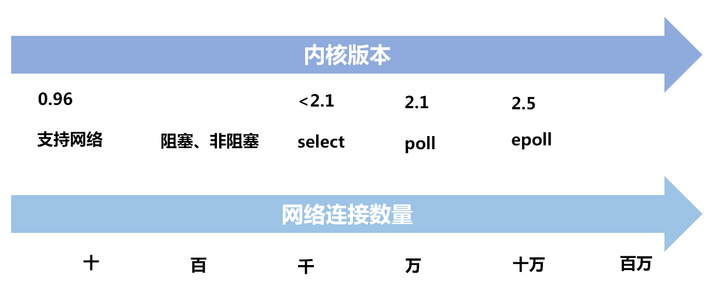
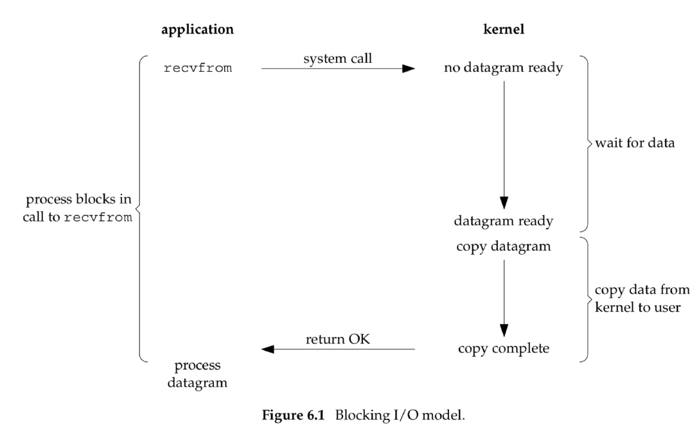
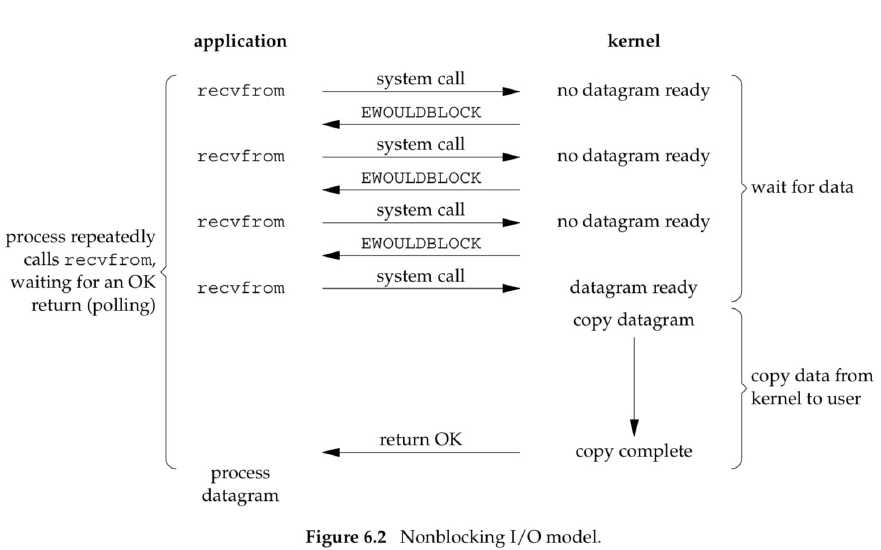

# 网络编程模型

作者：wallace-lai <br/>
发布：2024-07-27 <br/>
更新：2023-07-27 <br/>

## 1. 客户端和服务端交互过程

以简单的echo服务器为例，

服务端：



（1）调用`socket()`方法创建一个对应的`serverfd`；

（2）调用`bind()`方法将`serverfd`和对应的地址（IP地址 + 端口号）绑定；

（3）调用`listen()`方法监听前面所绑定的地址；

（4）进入无限循环，调用`accept()`等待接受客户端的连接请求；

（5）当与客户端的三次握手（以TCP为例）完成后，`accept()`会返回一个`clientfd`；



（6）对`clientfd`调用`read()`可以读取从客户端传来的数据；

（7）对`clientfd`调用`write()`可以往客户端写入数据；


所以，客户端和服务端的完整交互过程如下所示：



## 2. 网络的演变趋势

内核不断推出新的IO模型，助力了网络连接数的提升。



## 3. 阻塞IO



对于阻塞IO而言，当客户端发起`recvfrom()`调用时，会阻塞客户端线程。阻塞过程具体分为两个阶段：

（1）第一阶段是从发起系统调用直到内核数据准备就绪时；

（2）第二阶段是内核将数据从内核态拷贝到用户态时；

数据拷贝完毕之后，客户端线程才能解除阻塞继续往下处理服务端发来的数据。

阻塞IO的优点：

（1）**可以实现client和server之间的通信**

（2）**实现简单，通常一个client连接分配一个线程进行处理即可**

阻塞IO的缺点：

（1）**服务端能支持的并发client连接数较少**，因为一台server能分配的线程是有限的

（2）**大量的线程上下文切换会影响性能**

## 4. 非阻塞IO



之所以一个client连接分配一个线程是因为处理客户端的读写是阻塞式的，为避免该阻塞影响后续接受新的client连接，所以将阻塞逻辑交由线程单独处理。

### 阻塞IO和非阻塞IO之间的区别

阻塞IO和非阻塞IO之间的**主要区别在于内核中数据尚未就绪时，如何处理**。

（1）对于非阻塞IO，内核直接返回`EWOULDBLOCK`错误码；

（2）对于阻塞IO，则一直处于阻塞状态，直到数据就绪并从内核态拷贝到用户态后才返回；

### 如何将IO设置为非阻塞

（1）通过`socket()`方法中的`type`参数来指定为`SOCK_NONBLOCK`即可设置该`socket`为非阻塞方式。

```c
int socket(int domain, int type, int protocol);
```

（2）通过`fcntl()`方法中`args`参数设置为`O_NONBLOCK`即可设置该`socket`为非阻塞方式

```c
int fcntl(int fd, int cmd, .../* arg */);
fcntl(socket_fd, F_SETFL, flags | O_NONBLOCK);
```

### 非阻塞IO的优缺点

优点：

（1）将`socket`设置成非阻塞后，在读取时如果数据未就绪就直接返回。得益于非阻塞的特性，可以通过一个线程管理多个client连接；

缺点：

（1）需要不断轮询内核，查看数据是否已就绪，涉及很多无效的、太频繁的系统调用