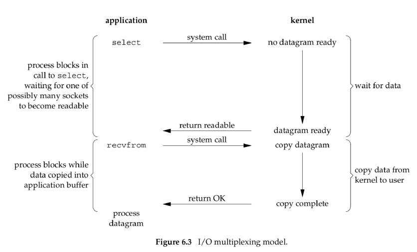
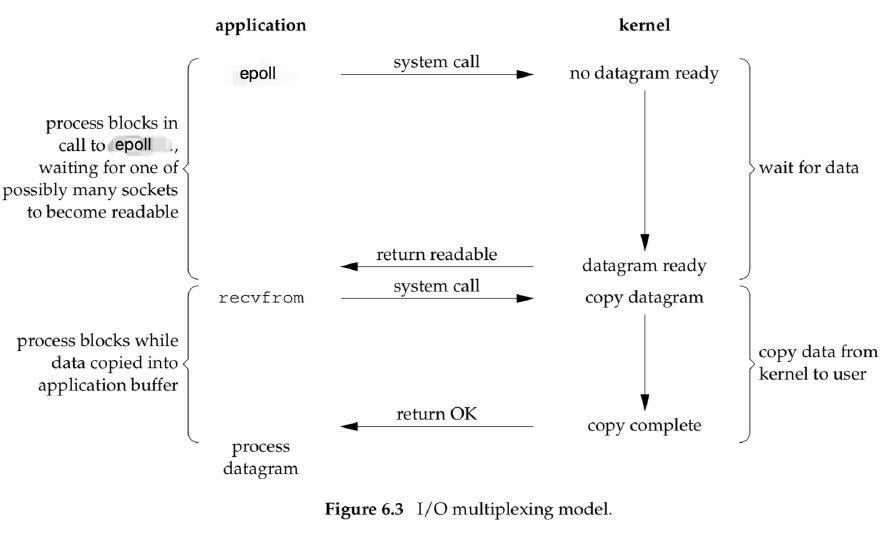

# 网络编程模型

作者：wallace-lai <br/>
发布：2024-07-27 <br/>
更新：2023-07-27 <br/>

## 1. 客户端和服务端交互过程

以简单的echo服务器为例，

服务端：


（1）调用`socket()`方法创建一个对应的`serverfd`；

（2）调用`bind()`方法将`serverfd`和对应的地址（IP地址 + 端口号）绑定；

（3）调用`listen()`方法监听前面所绑定的地址；

（4）进入无限循环，调用`accept()`等待接受客户端的连接请求；

（5）当与客户端的三次握手（以TCP为例）完成后，`accept()`会返回一个`clientfd`；


（6）对`clientfd`调用`read()`可以读取从客户端传来的数据；

（7）对`clientfd`调用`write()`可以往客户端写入数据；


所以，客户端和服务端的完整交互过程如下所示：


## 2. 网络的演变趋势

内核不断推出新的IO模型，助力了网络连接数的提升。


## 3. 阻塞IO


对于阻塞IO而言，当客户端发起`recvfrom()`调用时，会阻塞客户端线程。阻塞过程具体分为两个阶段：

（1）第一阶段是从发起系统调用直到内核数据准备就绪时；

（2）第二阶段是内核将数据从内核态拷贝到用户态时；

数据拷贝完毕之后，客户端线程才能解除阻塞继续往下处理服务端发来的数据。

阻塞IO的优点：

（1）**可以实现client和server之间的通信**

（2）**实现简单，通常一个client连接分配一个线程进行处理即可**

阻塞IO的缺点：

（1）**服务端能支持的并发client连接数较少**，因为一台server能分配的线程是有限的

（2）**大量的线程上下文切换会影响性能**

## 4. 非阻塞IO


之所以一个client连接分配一个线程是因为处理客户端的读写是阻塞式的，为避免该阻塞影响后续接受新的client连接，所以将阻塞逻辑交由线程单独处理。

### 阻塞IO和非阻塞IO之间的区别

阻塞IO和非阻塞IO之间的**主要区别在于内核中数据尚未就绪时，如何处理**。

（1）对于非阻塞IO，内核直接返回`EWOULDBLOCK`错误码；

（2）对于阻塞IO，则一直处于阻塞状态，直到数据就绪并从内核态拷贝到用户态后才返回；

### 如何将IO设置为非阻塞

（1）通过`socket()`方法中的`type`参数来指定为`SOCK_NONBLOCK`即可设置该`socket`为非阻塞方式。

```c
int socket(int domain, int type, int protocol);
```

（2）通过`fcntl()`方法中`args`参数设置为`O_NONBLOCK`即可设置该`socket`为非阻塞方式

```c
int fcntl(int fd, int cmd, .../* arg */);
fcntl(socket_fd, F_SETFL, flags | O_NONBLOCK);
```

### 非阻塞IO的优缺点

优点：

（1）将`socket`设置成非阻塞后，在读取时如果数据未就绪就直接返回。得益于非阻塞的特性，可以通过一个线程管理多个client连接；

缺点：

（1）需要不断轮询内核，查看数据是否已就绪，涉及很多无效的、太频繁的系统调用

## 5. IO多路复用1

非阻塞IO涉及很多次无用的、频繁的系统调用的原因是：**非阻塞socket在read时并不知道啥时候数据会准备好，所以需要不断地主动询问**。如何改进呢？

改进方式：**由单个客户端线程主动询问改进成内核批量通知多个线程可读或者可写了**，如下图所示：



IO多路复用主要复用的是**系统调用**。从原先非阻塞情况下的多个client需要各自发送recvfrom系统调用去不断询问内核数据是否已经就绪；转变成了现在通过一次系统调用select/poll由内核主动通知用户哪些client数据已经就绪（read、write、accept等事件）。大大减少了无效的系统调用次数。

**select和poll之间的不同点**

（1）实现

- select底层是采用**位数组**来实现的，一个描述符对应一个位
- poll底层是通过pollfd结构体来实现的，所管理的描述符通过pollfd数组来组织，一个描述符对应一个pollfd对象

（2）用法

- select默认大小是FD_SETSIZE(1024)，如果要修改，需要修改配置参数同时重新编译内核
- poll采用的是变长数组管理的，因此理论上可以支持管理海量的连接

**select和poll的相同点**

（1）二者都属于IO多路复用的第一版经典实现

（2）二者在调用时，**都需要从用户态拷贝管理的全量描述符到内核态**；返回时**都从内核态拷贝全量的描述符到用户态**，再**由用户态遍历全量的描述符**判断哪些描述符有就绪事件

**select和poll的优点**

（1）充分利用了一次系统调用select/poll就可以实现管理多个client的事件（read、write、accept等）。大大降低了之前非阻塞IO时频繁无效的系统调用。

（2）核心思路是将主动问询改变为等待内核通知，提升了性能

**select和poll的缺点**

（1）每次select/poll都需要将注册管理的多个client从用户态拷贝到内核态，再从内核态拷贝到用户态。在管理百万连接时，由拷贝带来的开销较大，影响性能。

## 6. IO多路复用2

从主动轮询转变为被动通知，确实提升了性能。但select()/poll()每次调用都需要拷贝管理的全量的fd到内核态，导致影响性能，有没有办法改进呢？



**epoll三大核心接口**

```c
#include <sys/epoll.h>

int epoll_create(int size);
int epoll_create1(int flags);
```

（1）从linux2.6.8以后，size参数已经被忽略，但必须大于0

（2）epoll_create()创建返回的epollfd指向内核中的一个epoll实例，同时该epollfd用来调用所有和epoll相关的接口(epoll_ctl()、epoll_wait())

（3）当epollfd不再使用时，需要调用close()关闭。当所有指向epoll的文件描述符关闭后，内核会摧毁该epoll实例并释放和其关联的资源

（4）成功返回时，返回大于0的epollfd。失败时返回-1，根据errno查看错误


```c
#include <sys/epoll.h>

int epoll_ctl(int epfd, int op, int fd, struct epoll_event *event);
```

**参数含义：**

（1）epfd：通过epoll_create创建时返回的epollfd

（2）op：添加（EPOLL_CTL_ADD）、更新（EPOLL_CTL_MOD）、删除（EPOLL_CTL_DEL）

（3）fd：待监听的描述符

（4）event：要监听的fd的事件（读、写、接收连接等）

理解：将哪个客户端（fd）的哪些事件（event）交给哪个epoll（epfd）来管理

**epoll重要事件介绍：**

（1）EPOLLIN：表示对应文件描述符可以读（包括对端SOCKET正常关闭）

（2）EPOLLOUT：表示对应文件描述符可以写

（3）EPOLLPRI：表示对应的文件描述符有紧急的数据可读（这里应该表示有带外数据到来）

（4）EPOLLERR：表示对应的文件描述符发生错误

（5）EPOLLHUP：表示对应的文件描述符被挂断

（6）EPOLLET：将epoll设置为边缘触发（Edge Triggered）模式，这是相对于水平触发（Level Triggered）来说的

（7）EPOLLONESHOT：只监听一次事件，当监听完这次事件之后，如果还需要继续监听这个socket的话，需要再次把这个socket加入到EPOLL队列里

```c
#include <sys/epoll.h>

int epoll_wait(int epfd, struct epoll_event *events, int maxevents, int timeout);

// 检测event
if (event & EPOLLHUP) {
    // ...
}

if (event & (EPOLLPRI | EPOLLERR | EPOLLHUP)) {
    // ...
}
```

**参数含义：**

（1）epfd：通过epoll_create()创建的epollfd

（2）events：返回就绪的事件列表，就绪的事件列表个数通过epoll_wait()的返回值来传递

（3）maxevents：最多返回的events个数，该值用来告诉内核创建的events有多大

（4）timeout：超时时间，-1表示无限期等待、0表示立即返回、timeout>0表示正常超时时间

（5）返回值cnt：0表示超时时间范围内无就绪列表；大于0表示返回就绪列表的个数(后续通过循环遍历events[0]~events[cnt-1])；-1表示错误，通过errno来识别具体错误信息

**epoll的边缘触发ET模式和水平触发LT模式的区别：**

（1）触发时机

- 对于ET模式，仅当监控的描述符有事件就绪时触发
- 对于LT模式，当监控的描述符有事件就绪或就绪时间未完全处理完时都会触发

（2）性能消耗

- 对于ET模式，相同场景下所涉及的系统调用次数较少
- 对于LT模式，相同场景下所涉及的系统调用次数较多

（3）编程难度

- 对于ET模式，难度较高，数据完整性由上层用户态保证
- 对于LT模式，难度较低，数据完整性由内核来保证，epoll默认的就是LT模式

**epoll的边缘触发ET模式和水平触发LT模式的相同点：**

（1）都属于epoll内置的触发模式

（2）都可以实现网络传输功能

**epoll源码分析**

epoll是一个数据结构封装的典型案例，有研究其实现的价值

【pending】

