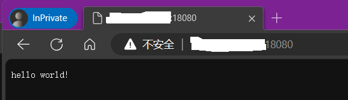
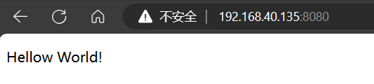
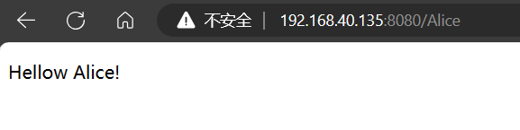

# 【Crow】Crow学习笔记（1）

作者：wallace-lai </br>
发布：2024-01-07 </br>
更新：2024-01-07 </br>

## 一、Crow是什么


[Crow](https://crowcpp.org/master/)是一个用于创建HTTP或者Websocket服务的C++框架，类似于Python的Flask路由。它的特点是易于使用和高性能，在运行速度方面打败了很多现有框架。

以当前（01/2024）的最新版本v1.0+5为例，Crow的所有实现都放在了include目录下的32个头文件中，总共代码量不超过13K。Crow的首个正式发布版本v0.2是2020年11月发布的，距今不超过4年。因此，Crow是非常值得学习的。

## 二、使用Crow开发Web应用
### 2.1 hello world
第一个hello world程序如下所示。

```c++
#include "crow.h"

int main(int argc, char **argv)
{
    crow::SimpleApp app;

    CROW_ROUTE(app, "/")([]() {
        return "hello world!";
    });

    app.port(18080).multithreaded().run();
}
```

对于第一个程序，可以做更详细的讲解。

- 包含crow头文件
```c++
#include "crow.h"`
```

所有使用crow库的程序都应该包含`crow.h`头文件

- 实例化一个SimpleApp对象
```c++
crow::SimpleApp app
```

SimpleApp类是crow库自带的一个App类实现。SimpleApp类内部包含了crow大部分组件，用户可以通过app和crow的其余组件进行交互。说白了就是关于Web编程的大部分需求都可以通过app来实现。关于App的更详细介绍将放在后面的笔记中。

- 定义路由

```c++
CROW_ROUTE(app, "/")([]() {
    return "hello world!";
});
```



使用`CROW_ROUTE`宏定义一条根路由。所谓定义路由就是定义当客户端访问一个确定的URL时会发生什么事情。具体到上述例子就是：当用户访问网站首页（`/`），比如`http://0.0.0.0:18080`时，服务器将会向用户的浏览器页面返回一个"hello world!"的字符串。

- 启动app

```c++
app.port(18080).multithreaded().run();
```

启动app，指定服务运行端口（`port()`）为18080并使用多线程（`multithreaded()`）的方式（默认启用4个线程）。注意`port()`和`multithreaded()`并不是必须的，如果不使用`port()`指定端口则使用默认的80端口。

- 编译

使用以下命令编译上面的代码，注意需要加上`-lpthread`选项才能成功编译。

```shell
 g++ 00-helloworld.cpp -lpthread -o hello
```

### 2.2 使用模板
#### 简单模板
为了让页面更加美观，我们不能再像上节中的例子一样，简单地在浏览器页面上显示个字符串。corw作为Web开发框架，支持模板功能，利用模板功能，我们可以向浏览器返回一个HTML页面。

首先准备好HTML页面，比如`index.html`，放在`templates`目录下。放在`templates`目录下的模板可以直接被crow识别。
```html
<!DOCTYPE html>
<html>
    <body>
        <p>Hellow World!</p>
    </body>
</html>
```

随后在上节例子的基础上稍加改动即可。使用`mustache`的`load_text`方法将`index.html`的内容返回给浏览器。

```c++
CROW_ROUTE(app, "/")([]() {
    auto index = crow::mustache::load_text("index.html");
    return index;
});
```



#### 向模板传参
假设我们需要向模板传入用户名字这么一个参数，我们首先需要在模板中定义好相应的变量，用于接收crow传递过来的值。如下所示，我在模板中定义了一个name变量用于存放crow传递过来的用户名。

```html
<!DOCTYPE html>
<html>
    <body>
        <p>Hellow {{name}}!</p>
    </body>
</html>
```

随后将上节中的路由改写成下面的样子
```c++
CROW_ROUTE(app, "/<string>")([](std::string name) {
    auto page = crow::mustache::load("index.html");
    crow::mustache::context ctx ({{"name", name}});
    return page.render(ctx);
});
```

稍作解释：

- `"/<string>"` : 将`/`后面的内容当做string来解析
- `load("index.html")` : 因为模板中定义了变量，所以不能再用`load_text`了
- `ctx ({{"name", name}})` : 定义一个渲染模板所需的上下文，将用户名name传入
- `page.render(ctx)` : 根据上下文ctx去渲染模板



## 三、总结
上面章节属于是crow框架快速上手的介绍性内容，共涉及了三个简单场景总结如下。

- （1）简单路由场景

```c++
#include "crow.h"

int main(int argc, char **argv)
{
    crow::SimpleApp app;

    CROW_ROUTE(app, "/")([]() {
        return "hello world!";
    });

    app.port(18080).multithreaded().run();
}
```

- （2）使用模板


模板代码：
```html
<!DOCTYPE html>
<html>
    <body>
        <p>Hellow World!</p>
    </body>
</html>
```

C++代码：
```c++
#include "crow.h"

int main(int argc, char **argv)
{
    crow::SimpleApp app;

    CROW_ROUTE(app, "/")([]() {
        auto index = crow::mustache::load_text("index.html");
        return index;
    });

    app.port(8080).multithreaded().run();
}
```

- （3）向模板传参


模板代码：
```html
<!DOCTYPE html>
<html>
    <body>
        <p>Hellow {{name}}!</p>
    </body>
</html>
```

C++代码：
```c++
#include "crow.h"

int main(int argc, char **argv)
{
    crow::SimpleApp app;

    CROW_ROUTE(app, "/<string>")([](std::string name) {
        auto page = crow::mustache::load("index.html");
        crow::mustache::context ctx ({{"name", name}});
        return page.render(ctx);
    });

    app.port(8080).multithreaded().run();
}
```

以上三个场景中涉及到的crow框架中的“元素”有：
- `crow::SimpleApp` : App类
- `CROW_ROUTE` : 路由
- `crow::mustache` : 模板

crow中的更多“元素”将在后续的笔记中介绍