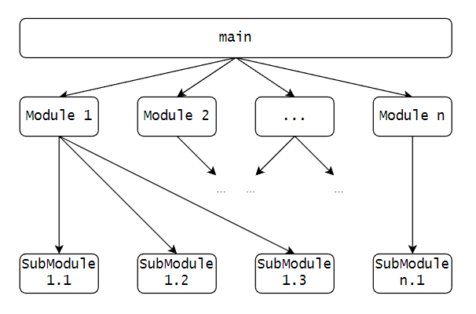

# 【PurC】源码分析（一）

作者：wallace-lai <br/>
发布：2024-06-02 <br/>
更新：2024-06-02 <br/>

[PurC](https://github.com/HVML/PurC.git)是首个针对HVML语言的解释器，HVML是由魏永明设计的一种描述式编程语言。阅读源码的目的是为了学习其中一些有关C语言的优雅设计。不定期更新，看到哪更到哪，但只看感兴趣的部分。

## 一、编码风格
### 1.1 区分对内和对外函数
对于某个编译单元来说，对外函数是该单元对外暴露的接口，对内函数则是起到辅助性的内部函数，不对外暴露。为了减轻程序员的负担，其实是有必要在代码中对对内和对外函数作出区分的。可以通过下面的规则来做出区分：

（1）对内函数
- 对内函数不能出现在头文件中【必须】
- 函数加`static`修饰，使其对外不可见【必须】
- 函数名以下划线开头【不必须，和库函数有冲突风险】

（2）对外函数
- 对外函数应该出现在头文件中【必须】
- 对外函数不能用`static`修饰，否则对外不可见【必须】

```c
// 有static修饰，表明是对内函数
static void do_init(void)
{
    // ...
}

// 无static修饰，表明是对外接口
void module_init(void)
{
    // ...
}
```

## 二、宏的使用技巧

### 2.1 管理extern "C"代码
对于C和C++混编的工程来说，如果不做特殊处理，那么诸如下面的`extern "C"`代码就会充斥在每个C语言头文件中。如何去除大量C语言头文件中的重复`extern "C"`代码？让代码更加简洁。

```c
#ifdef __cpluscplus
extern "C" {
#endif

// ...

#ifdef __cplusplus
}
#endif
```

PurC的处理方式很优雅，通过自定义宏的方式消除了代码重复。在公共头文件中定义如下的宏：

```c
// purc-macros.h
#ifdef __cplusplus
#define PCA_EXTERN_C_BEGIN extern "C" {
#define PCA_EXTERN_C_END }
#else
#define PCA_EXTERN_C_BEGIN
#define PCA_EXTERN_C_END
#endif
```

然后在C语言头文件中直接使用`PCA_EXTERN_C_BEGIN`和`PCA_EXTERN_C_END`即可。代码行数由原先不做处理时的6行削减到了只有2行，代码变得更加简洁明了。

```c
// purc.h

PCA_EXTERN_C_BEGIN

// content

PCA_EXTERN_C_END
```

## 2.2 函数化（宏化）求表大小
表驱动是C语言中最常见的逻辑与数据分离手段，使用逻辑与数据分离的好处是可以轻而易举地进行功能扩展。使用表驱动时，基本都会涉及到计算表大小的操作，如下所示。

```c
static const tag_id_ops maps[] = {
    // ...
};

for (size_t i = 0; i < sizeof(maps) / sizeof(maps[0]); i++) {
    const struct tag_id_ops *ops = maps[i];
    // ...
}
```

为了减轻程序员负担，可以将计算表大小的操作给函数化（宏化）。尤其是如果表名很长时，会让for循环这一行显得又臭又长。可以将操作定义成一个专门的宏，如下所示。

```c
#define PCA_TABLESIZE(table)    (sizeof(table)/sizeof(table[0]))

for (size_t i = 0; i < PCA_TABLESIZE(maps); i++) {
    // ...
}
```

## 三、管理模块的初始化
C语言做为面向过程的编程语言，其最常见的解决复杂问题的方式是分解的方式。即通过将大问题分解成模块，模块再划分成子模块的方式，分而治之，解决问题，如下图所示。



因为我们希望所有的子模块能只成功初始化一遍，有任一子模块初始化失败则意味着整个初始化流程失败。那么如何管理众多子模块的初始化呢？如果只是完成子模块的初始化功能，那么需要对子模块进行模块化管理的说服力还不够。但是如果有更多的功能，比如子模块的动态加载和卸载，那么子模块的管理就成了必须的了。

按照这个思路，问题上升为如何管理众多子模块？不仅仅是子模块的初始化了。PurC为此提供了一个通用的思路，即**将公共的模块功能给抽象成基类，子模块作为具体模块实例来注册**。这是什么？这是**面向接口编程**！尽管C语言不具备面向对象的能力，但思想是相通的。

我们需要一个抽象基类，如下所示，尽管它只有初始化相关功能：

```c
struct pcmodule {
    // PURC_HAVE_XXXX if !always
    unsigned int               id;
    unsigned int               module_inited;

    module_init_once_f         init_once;
    module_init_instance_f     init_instance;
    module_cleanup_instance_f  cleanup_instance;
};
```

executors作为一个子模块，需要提供具体实现：

```c
static int _init_once(void)
{
    // ...
}

static int _init_instance(/* ... */)
{
    // ...
}

static void _cleanup_instance(/* ... */)
{
    // ...
}

struct pcmodule _module_executor = {
    .id              = PURC_HAVE_VARIANT | PURC_HAVE_HVML,
    .module_inited   = 0,

    .init_once                = _init_once,
    .init_instance            = _init_instance,
    .cleanup_instance         = _cleanup_instance,
};
```

在模块实例管理部分，需要对各子模块实例进行注册：
```c
// ...
extern struct pcmodule _module_executor;
// ...

struct pcmodule* _pc_modules[] = {
    // ...
    &_module_executor,
    // ...
};
```

各子模块注册完毕后，统一初始化就很好做了，直接面向接口编程：
```c
static bool _init_ok = false;
static void _init_once(void)
{
    /* call once initializers of modules */
    for (size_t i = 0; i < PCA_TABLESIZE(_pc_modules); ++i) {
        struct pcmodule *m = _pc_modules[i];
        if (!m->init_once)
            continue;

        if (m->init_once())
            return;

        m->module_inited = 1;
    }

    _init_ok = true;
}

// 使用pthread_once只初始化一次
static inline void init_once(void)
{
    static int inited = false;
    if (inited)
        return;

    // ...
    static pthread_once_t once = PTHREAD_ONCE_INIT;
    pthread_once(&once, _init_once);

    inited = true;
}
```