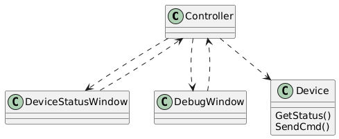

# 【4+1视图】理解4+1视图

作者：wallace-lai <br>
发布：2024-07-13 <br>
更新：2024-10-03 <br>

## 一、介绍


软件架构的4+1视图分别为：

（1）Logical View

利益相关人：End User

视图关注点：Functionality

（2）Implementation View

利益相关人：Programmers

视图关注点：Software Management

（3）Process View

利益相关人：System Integrators

视图关注点：

- Performance
- Scalability
- Throughput

（4）Deployment View

利益相关人：System Engineering

视图关注点：

- System Topology
- Communications

（5）场景视图

## 二、理解4+1视图的常见问题

### 2.1 为什么要高出这么多个视图？用一个不行吗？

软件架构设计要考虑的点很多，比如我们要考虑软件最终用户、设计人员、开发人员的需求等，同一张图很难将众多的需求给表示出来；

软件开发过程中，涉及了几大类利益相关人。每一类利益相关人的关注点是不一样的，因此，用不同的视图来描述这些关注点。

### 2.2 为什么要叫4+1试图，直接叫5大试图不行吗？

四个视图是从不同的角度来进行软件架构的设计，而场景视图更多是一种需求的抽象，严格来讲不能算是软件架构设计的内容。场景视图是软件架构设计的输入，驱动另外四个视图的设计。在架构设计的后期，可以用场景视图来验证另外四个视图设计的正确性（是否能实现需求）。

### 2.3 每种试图分别该用哪种表示法来描绘？

没有严格的限制说每种视图必须用哪种表示方法来描绘，只要能将当前视图的关注点给表示清楚即可。

## 三、各视图的关注点

### 3.1 逻辑视图

（1）系统功能

（2）类和对象的分解

### 3.2 过程视图
（1）并发和同步特性

（2）任何（进程或者线程）和任务之间的配合关系

### 3.3 实现视图

（1）软件在其开发环境中的静态组织结构

（2）模块和子系统的划分


### 3.4 部署视图

（1）软件和硬件的映射关系


### 3.5 用例（场景）视图

（1）重要的需求抽象


## 四、论文走读

4+1视图是非常通用的，可以使用其他的表示方法和工具，可以使用其他的设计方法，特别是在进行逻辑和过程分解的时候。

### 4.1 逻辑视图

逻辑视图主要用于功能需求：系统应该向用户提供什么服务。系统被分解为一组主要来自问题领域的关键抽象，这些抽象的形式是对象或者对象类别。（这是面向对象的设计方法）

除了面向对象方法，以数据驱动为主的应用程序可以使用其他形式的逻辑视图，比如E-R图。

**逻辑视图的表示法**

如果是使用面向对象的设计方法的话，那么最常用的逻辑视图表示方法是**类图**。**类图最常用的绘制工具是统一建模语言UML**。

### 4.2 过程视图

过程视图考虑一些非功能需求，比如性能和可靠性。它解决并发性、分布式、系统完整性、容错等问题。以及逻辑视图中的主要抽象如何应用到过程架构中，即：对象操作实际在哪个控制任务上执行。

**过程视图的表示法**：对于过程视图的表示方法，常用的有UML中的序列图（稍微更合理的表示方法）、活动图、状态图。**序列图可以表示任务之间的交互，但具体对象的实际操作在哪个任务上执行可能更适合用文字来描述**。

### 4.3 开发视图

开发视图聚焦于软件模块在实际开发环境中如何组织。软件被分割成程序库或者子系统这样的小块，使得程序库或者子系统可以分给一个或者少数几个开发者来开发。子系统以分层（layer）的形式组织，每一层都为它的上层提供一个小范围的、定义好的接口。

**开发视图的表示法**：开发视图的常用表示法是**组件图**。


### 4.4 物理视图

物理视图着眼于建立软件和硬件的映射关系。物理架构考虑系统的非功能需求，比如：系统可用性、可靠性（容错）、性能和可扩展性。

软件在一个计算机网络或者处理节点上执行。各种已定义的元素（网络、进程、任务、对象）必须被映射到不同的节点上。

**物理视图的表示法**：物理视图的表示用部署图即可

### 4.5 用例（场景）视图

用例是一组场景的集合，具体而言，用例是一组有共同用户目标的场景的集合。

场景是最重要的需求的抽象，其扮演了两个重要的角色：

（1）驱动我们在架构设计中去发现架构元素；

（2）当架构设计完成后，验证和证实已完成的架构；

前面四个视图描述的是系统的设计，而用例视图描述的是系统的需求的抽象。通过将需求抽象成用例和场景，作为系统设计的输入。

**用例视图的表示法**：用例视图的表示使用用例图即可。

### 4.6 裁剪模型

不是所有的软件架构都需要完整的4+1视图。架构描述时可以将没什么用的视图给省略掉。比如：

（1）如果只有一个处理器而且只有一个进程或程序时，可以省略过程视图；

（2）对于非常小的系统，逻辑视图和开发视图可能都是一样的，那就没有必要分开描述；

（3）但场景视图在任何情况下都是有用的；


### 总结

|视图|逻辑|过程|开发|物理|场景|
|--|--|--|--|--|--|
|组件|类|任务|模块、子系统|节点|步骤、脚本|
|连接器|关联、继承、包含|消息、广播、RPC等|编译依赖|通信介质、局域网、广域网、总线等||
|容器|类的类别|进程|子系统（库）|物理子系统|Web|
|利益相关人|最终用户|系统设计人员、集成人员|开发人员、项目经理|系统设计人员|最终用户、开发人员|
|关注点|功能|性能、可用性、软件容错、完整性|组织、可复用性、可移植性、产品线|可扩展性、性能、可用性|可理解性|

## 五、用例视图案例

假设用户需求如下：

功能需求：

（1）支持查看设备状态；

（2）支持发送设备调试命令；

非功能需求：

（1）支持多人（2、3人）同时调试

则初步的用例图可以是以下的形式：


假设和用户交流后，客户对需求新增了一些约束：

（1）设备状态只能由专门的数据采集器进行采集；

（2）设备只支持通过RS232串口接收调试命令；

则用例视图需要更新为：


设备调试系统案例的启示：

（1）客户提需求，通常不是一次就能提清楚的，需要在设计过程多个环节多次交流确认；

（2）在用例视图阶段、我们跟客户交流的重点：

- 重要功能有没有遗漏
- 系统边界是否合理


## 六、逻辑视图案例
逻辑视图关注类和对象的划分，对于整个系统，划分成以下几个对象：

（1）Controller：指挥其他对象实现系统功能

（2）DeviceStatusWindow：用户界面，显示设备状态

（3）DebugWindow：用户界面，供调试人员输入调试命令

说明：因为系统使用场景只有自然人操作，没有机器或脚本操作，所以当前只提供图形界面

（4）Device：实现系统跟设备（包括数据采集器）的交换
说明：为什么不设计一个数据采集器对象？虽然系统会和数据采集器交互，但数据采集器只是起到类似通道的作用，系统采集的还是设备的状态信息。

```
@startuml

class Controller

class DeviceStatusWindow

class DebugWindow

class Device
{
    GetStatus()
    SendCmd()
}

Controller ..> Device

Controller ..> DeviceStatusWindow
DeviceStatusWindow ..> Controller

Controller ..> DebugWindow
DebugWindow ..> Controller

@enduml
```




**逻辑视图案例演练的启示**

（1）除了描述决策结果，还要描述决策过程。后续看设计文档时，决策过程比决策结果更有价值；

（2）设计过程中要不断地确认和细化需求；

（3）在逻辑视图阶段，我们跟客户交流的重点：**更细节的功能需求**；

## 七、过程视图案例

过程视图主要是设计任务和任务之间的并发与同步。根据需求可知，系统应该支持并发操作但并发数不是很多（支持2到3人调试）。且系统对性能的要求不是很高，因为并发量不高且自然人操作要比机器操作更慢。

整个系统的进程划分如下所示：

（1）界面进程

根据需求要求支持多人（2到3人）同时调试，所以需要多个承载界面运行的进程，每个设备调试人员一个进程；

DeviceStatusWindow和DebugWindow都运行在界面进程上；

（2）主控进程

因为界面进程并发数量很低，所以用一个主控进程来支持。Controller运行在主控进程上，它接收DebugWindow发来的调试命令，收到后就调用Device的方法把调试命令发送给设备。如果一条调试命令正在执行又来了一条调试命令，那么先等当前的命令处理完再处理下一条调试命令。

Controller和Device不用并发执行，所以Device也运行在主控进程上。

查看设备状态有两种可能性：

1. 查看设备状态由调试人员来触发，其过程与DebugWindow发送调试命令类似；
2. 只要DeviceStatusWindow一打开，就要实时更新设备状态；

假设是第二种可能性，则需要一个定时器。

（3）定时器

由Controller启动一个定时器，由Controller定时查询设备状态，并在查询后将状态信息通知给DeviceStatusWindow。

## 八、实现视图和部署视图案例

实现视图的关注点是**软件在其开发环境中的静态组织结构**，以使得开发工作更简单、代码的可复用性更高。

实现视图通常要解决以下这些问题：

（1）系统要分解为哪些模块、子系统；

（2）使用第三方软件，还是自研代码；

（3）代码库怎么组织；

（4）如何进行配置管理；

（5）编译生成哪些可执行文件、动态库；

**实现视图设计**

DeviceStatusWindow和DebugWindow ：使用Windows MFC开发

Controller和Device ：基于Linux开发，Device通过成熟的开源软件S232实现串口通信

```
@startuml

component win {
    skinparam componentStyle rectangle
    [DeviceStatusWindow]
    [DebugWindow]
    [MFC]
    skinparam componentStyle default
}

DeviceStatusWindow ..> MFC
DebugWindow ..> MFC

component Controller

component Device {
    [S232]
}

Controller .> Device

DebugWindow ..> Controller
Controller ..> DebugWindow

DeviceStatusWindow ..> Controller
Controller ..> DeviceStatusWindow

@enduml
```


**实现视图案例演示启示**

（1）各个视图的设计并不是完全并列的，有时需要从多个视图的角度结合起来思考，但可以分开描述；

（2）有些视图也可以合在一起描述。特别是在系统比较简单时，逻辑视图和实现视图输出的内容差不多，常常可以合并在一起描述，但这两个视图的关注点仍然是完全不同的，还是需要从不同的关注点来思考；

**部署视图设计**

```
@startuml

node win_1
node win_2
node win_3

note left of win_1 : include DeviceStatusWindow and DebugWindow

node server {
    rectangle Controller
    rectangle Device
}

node "设备" as w1
node "数据采集器" as w2

cloud ethernet

win_1 -- ethernet
win_2 -- ethernet
win_3 -- ethernet

ethernet -- server

Device -- w1 : RS232
Device -- w2 : RS232

@enduml
```


说明：

（1）DeviceStatusWindow和DebugWindow部署在调式人员本地电脑上，针对每个设备调试人员单独部署。部署依赖于MFC环境；

（2）Controller和Device部署在机房Linux服务器上，每套设备调试系统仅需要部署一份。设备调试人员本地电脑和机房Linux服务器通过以太网连接；

