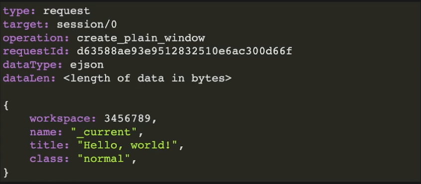

# 【C语言最佳实践】解耦代码和数据

作者：wallace-lai <br>
发布：2022-07-31 <br>
更新：2023-11-26 <br>

## 一、为什么要解耦代码和数据

解耦代码和数据的重要性：
1. 简化代码，降低出错几率

2. 对杂乱的代码做结构化处理

3. 提高代码的可维护性

## 二、代码和数据解耦实践案例

### 2.1 案例一：根据错误码返回错误信息

```c
// bad design case
const char *my_error_message(int errcode)
{
    switch (errcode) {
        case EINVAL:
            return "Invalid argument";
        case EACCESS:
            return "Permission denied";
        // ...
    }
    
    return "Unknown error code";
}
```

这个改进起来很简单，利用表驱动即可。

```c
// good design case
const char * const sys_errlist[] = {
    // ...
    "Invalid argument",     // EINVAL
    // ...
    "Permission denied",    // EACCESS
    // ...
};

const char *my_error_message(int errcode)
{
    if (errno < sizeof(sys_errlist) / sizeof(sys_errlist[0]) {
        return sys_errlist[errno];
    }
    
    return "Unknown error code";
}
```

案例补充

只要你使用了表驱动，那么大概率会看到以下的代码用于计算数组中元素的个数。这种用数组总大小除以第一个元素大小的方式非常常见。
```c
size_t len = sizeof(sys_errlist) / sizeof(sys_errlist[0]);
```

然而，不是所有的数组元素个数都是以上述这种方式计算的。如下所示，还有一种常见的应用场景是这样的。
```c
enum Feature {
    FEATURE_XX1 = 0;
    FEATURE_XX2;
    FEATURE_XX3;
    // ...

    FEATURE_BUTT;
};

int features[FEATURE_BUTT];
features[FEATURE_XX1] = 1;
features[FEATURE_XX2] = 2;
// ...

bool IsFeatureValid(int f)
{
    if (f < FEATURE_BUTT) {
        return true;
    }
    return false;
}

// v2
// inline bool IsFeatureValid(int f)
// {
//     return (f < FEATURE_BUTT ? true : false);
// }
```
在enum场景下，我们一般会让首个枚举值从0开始（C语言默认首个枚举值也是0），并且在最后加上一个BUTT值。这个BUTT值不是一个合法的枚举值，但之所以保留它主要是因为它有个好处：

（1）可以使用BUTT值作为数组的大小（枚举值从0开始递增的情况下）

（2）可以作为判断输入枚举值是否合法的判据（小于BUTT值才是合法的）


### 2.2 案例二

**初始版本**

```c
static purc_variant_t type_getter(purc_variant_t root, size_t nr_args)
{
    UNUSED_PARAM(root);

    purc_variant_t ret = PURC_VARIANT_INVALID;

    if (nr_args == 0) {
        pcinst_set_error(PURC_ERROR_WRONG_ARGS);
        return PURC_VARIANT_INVALID;
    }

    if (argv[0] == PURC_VARIANT_INVALID) {
        pcinst_set_error(PURC_ERROR_WRONG_ARGS);
        return PURC_VARIANT_INVALID;
    }

    // purc_variant_get_type返回的类型值不连续，所以无法使用表驱动？
    switch ((int)purc_variant_get_type(argv[0])) {
        case PURC_VARIANT_TYPE_NULL:
            ret = purc_variant_make_string("null", false);
            break;
        case PURC_VARIANT_TYPE_UNDEFINED:
            ret = purc_variant_make_string("undefined", false);
            break;
        // ...
    }

    return ret;
}
```
**改进版本一**

```c
// xxx.h
typedef enum purc_variant_type
{
    PURC_VARIANT_TYPE_FIRST = 0,

    /* critical: keep order as it is */
    PURC_VARIANT_TYPE_UNDEFINED = PURC_VARIANT_TYPE_FIRST,
    PURC_VARIANT_TYPE_NULL,
    PURC_VARIANT_TYPE_BOOLEAN,
    // ...
    PURC_VARIANT_TYPE_ARRAY,
    PURC_VARIANT_TYPE_SET,

    /* critical:  this MUST be the last enum */
    PURC_VARIANT_TYPE_LAST = PURC_VARIANT_TYPE_SET,
} purc_variant_type;

#define PURC_VARIANT_TYPE_NR \
    (PURC_VARIANT_TYPE_LAST - PURC_VARIANT_TYPE_FIRST + 1)

// xxx.c
static purc_variant_t type_getter(purc_variant_t root, size_t nr_args)
{
    static const char *type_names[] = {
        "undefined",
        "null",
        "boolean",
        // ...
        "array",
        "set"
    };

    /* make sure the last one is `set` */
    assert(sizeof(type_names[PURC_VARIANT_TYPE_FIRST]) == 10);
    assert(sizeof(type_names[PURC_VARIANT_TYPE_LAST]) == 4);

    UNUSED_PARAM(root);

    if(argv == NULL || nr_args == 0) {
        pcinst_set_error(PURC_ERROR_WRONG_ARGS);
        return PURC_VARIANT_INVALID;
    }

    assert(argv[0] != PURC_VARIANT_INVALID);

    return purc_variant_make_string_static(
        type_names[purc_variant_get_type(argv[0])], false
    );
}
```

上述改进版本一中还是存在两个问题：

1. `purc_variant_type`是定义在`xxx.h`中的，如果后续有维护人员在`purc_variant_type`中新增了类型或者调换了原有类型的顺序但是忘记了修改`xxx.c`中的`type_names[]` 。那么，程序就会出错

2. `xxx.c`中的两个`assert`的本意是确保`type_names[]`中的第一个和最后一个分别是`undefined`和`set`，但是使用`sizeof`检查长度是否匹配的方法太弱了。它检查不了长度相等但是内容不匹配的错误

**改进版本二**

```c
// xxx.h
typedef enum purc_variant_type
{
    PURC_VARIANT_TYPE_FIRST = 0,

    /* critical: keep order as it is */
    PURC_VARIANT_TYPE_UNDEFINED = PURC_VARIANT_TYPE_FIRST,
    PURC_VARIANT_TYPE_NULL,
    PURC_VARIANT_TYPE_BOOLEAN,
    // ...
    PURC_VARIANT_TYPE_ARRAY,
    PURC_VARIANT_TYPE_SET,

    /* critical:  this MUST be the last enum */
    PURC_VARIANT_TYPE_LAST = PURC_VARIANT_TYPE_SET,
} purc_variant_type;

#define PURC_VARIANT_TYPE_NR \
    (PURC_VARIANT_TYPE_LAST - PURC_VARIANT_TYPE_FIRST + 1)

#define VARIANT_TYPE_NAME_UNDEFINED "undefined"
#define VARIANT_TYPE_NAME_NULL      "null"
#define VARIANT_TYPE_NAME_BOOLEAN   "boolean"
// ...
#define VARIANT_TYPE_NAME_ARRAY     "array"
#define VARIANT_TYPE_NAME_SET       "set"

// xxx.c
// 使用宏可以避免拼写错误
static const char *type_names[] = {
    VARIANT_TYPE_NAME_UNDEFINED,
    VARIANT_TYPE_NAME_NULL,
    VARIANT_TYPE_NAME_BOOLEAN,
    // ...
    VARIANT_TYPE_NAME_ARRAY,
    VARIANT_TYPE_NAME_SET
};

// 使用编译时宏可以避免purc_variant_type和type_names个数不一致的情况
#define _COMPILE_TIME_ASSERT(name, x) \
    typedef int _dummy_ ## name[(x) * 2 - 1]

#define PCA_TABLESIZE(table) \
    (sizeof(table) / sizeof(table[0]))

_COMPILE_TIME_ASSERT(types, PCA_TABLESIZE(type_names) == PURC_VARIANT_TYPE_NR)

#undef _COMPILE_TIME_ASSERT

static purc_variant_t type_getter(purc_variant_t root, size_t nr_args)
{
    UNUSED_PARAM(root);

    if(argv == NULL || nr_args == 0) {
        pcinst_set_error(PURC_ERROR_WRONG_ARGS);
        return PURC_VARIANT_INVALID;
    }

    assert(argv[0] != PURC_VARIANT_INVALID);

    /* make sure that the first one is `undefined` and the last one is `set` */
    assert(strcmp(type_names[PURC_VARIANT_TYPE_FIRST],
        VARIANT_TYPE_NAME_UNDEFINED) == 0);
    assert(strcmp(type_names[PURC_VARIANT_TYPE_LAST],
        VARIANT_TYPE_NAME_SET) == 0);

    return purc_variant_make_string_static(
        type_names[purc_variant_get_type(argv[0])], false
    );
}
```

改进版本二的优点：

1. 使用宏定义字符串常量，避免拼写错误

2. 使用编译期断言避免出现未有效维护的情形

上面这个例子的两个优点同时也是让我感到比较巧妙的，尤其是这个编译期断言。这种可以把错误在编译器就暴露出来的方法真是太赞了！另外，使用宏定义字符串常量建议在实际代码编写过程中贯彻到底，固定不变的字符串常量绝对不要编写第二遍。

### 2.3 案例三

假定有如下格式的消息包，



我们希望能够将它解析成以下的标准数据结构：
```c
struct _pcrdr_msg {
    pcrdr_msg_type          type;
    pcrdr_msg_target        target;
    pcrdr_msg_element_type  elementType;
    pcrdr_msg_data_type     dataType;
    unsigned int            retCode;

    uintptr_t               targetValue;
    char *                  operation;
    char *                  element;
    char *                  property;
    char *                  event;

    char *                  requestId;

    uintptr_t               resultValue;

    size_t                  dataLen;
    char *                  data;
};
```
**初始版本如下**

```c
int pcrdr_parse_packet(char *packet, size_t sz_packet)
{
    pcrdr_msg msg;

    char *str1;
    char *line;
    char *saveptr1;

    memset(&msg, 0, sizeof(msg));

    for (str1 = packet; ; str1 = NULL) {
        line = strtok_r(str1, STR_LINE_SEPARATOR, &saveptr1);
        if (line == NULL) {
            goto failed;
        }

        if (is_blank_line(line)) {
            msg.data = strtok_r(NULL, STR_LINE_SEPARATOR, &saveptr1);
            break;
        }

        char *key, *value;
        char *saveptr2;
        key = strtok_r(line, STR_PAIR_SEPARATOR, &saveptr2);
        if (key == NULL) {
            goto failed;
        }

        value = strtok_r(NULL, STR_PAIR_SEPARATOR, &saveptr2);
        if (value == NULL) {
            goto failed;
        }

        // bad smell
        if (strcasecmp(key, "type") == 0) {
            // ...
        } else if (strcasecmp(key, "target") == 0) {
            // ...
        } else if (/* ... */) {
            // ...
        }

        // ...
    }
}
```

**改进版本一**

解决办法仍然是表驱动，如下所示
```c

   #define STR_KEY_TYPE        "type"
   #define STR_KEY_TARGET      "target"
   // ...
   #define STR_KEY_DATA_LEN    "dataLen"

   typedef bool (*key_op)(pcrdr_msg *msg, char *value);

   static struct key_op_pair {
       const char *key;
       key_op     op;
   } key_ops[] = {
       { STR_KEY_TYPE,          on_type },
       { STR_KEY_TARGET,        on_target },
       // ...
       { STR_KEY_DATA_LEN,      on_data_len }
   };

   static key_op find_key_op(const char *key) 
   {
       for (int i = 0; i < sizeof(key_ops) / sizeof(key_ops[0]); i++) {
           if (strcasecmp(key, key_ops[i].key) == 0) {
               return key_ops[i].op;
           }
       }
       
       return NULL;
   }

   int pcrdr_parse_packet(char *packet, size_t sz_packet)
   {
       // ...
       key_op op = find_key_op(key);
       if (op == NULL) {
           goto failed;
       }

       if (!op(&msg, skip_left_space(value))) {
           goto failed;
       }
       // ...
   }
```
但是，这个版本仍然有个问题！试想一下，如果`key_ops`比较多那么每次查找`key_op`的时间消耗就比较多，再加上频繁的调用次数那么这可能对性能有较大的影响。

**改进版本二**

改进的思路也很简单，就是让`key_ops`按照`key`作升序排列，然后使用二分查找。

```c
/* critical: items must list as asc order */
static struct key_op_pair {
    const char *key;
    key_op     op;
} key_ops[] = {
    { STR_KEY_DATA_LEN,     on_data_len },
    { STR_KEY_DATA_TYPE,    on_data_type },
    { STR_KEY_ELEMENT,      on_element }
    // ...
    { STR_KEY_TYPE,         on_type },
    { STR_KEY_TARGET,       on_target }
};

static key_op find_key_op(const char *key) 
{
    int cmp;
    ssize_t low = 0, mid;
    static ssize_t high = sizeof(key_ops) / sizeof(key_ops[0]);

    while (low <= high) {
        mid = (low + high) / 2;
        cmp = strcasecmp(key, key_ops[mid].key);
        if (cmp == 0) {
            goto found;
        } else if (cmp < 0) {
            high = mid - 1;
        } else {
            low = mid + 1;
        }
    }

    return NULL;

found:
    return key_ops[mid].op;
}
```

上述版本隐含了一个非常巧妙的写法——将`high`设置为一个局部的`static`变量。稍有经验的程序员一看就知道它的妙处在哪，不过需要注意一点就是这种技法只能在数组在运行中不更改的情况下。

不过这个要求程序员在添加`key_ops`的时候要严格按照升序排列新增项，这对程序员来说是个负担。这个问题又该如何优雅地去解决呢？

**终极改进版本**

1. 让程序处理大量的重复性编码工作，避免手工编写引入错误。这个方法基本解决了上文中提到的要求程序员需要手动维护`key_ops`有序才能新增项的问题，比如我们可以将`key`扔到脚本里，让用脚本自动生成一个有序的`key_ops`表即可

2. 处理字符串时，字符串较多时，二分查找性能不高（时间复杂度`O(log n)`），可以使用哈希表（时间复杂度`O(1)`）；用脚本可以找到一个相对均衡的哈希算法。

3. 依赖构建系统自动维护代码的重新生成

总之，能用脚本自动生成的重复性代码就不要自己手动地去编写。

