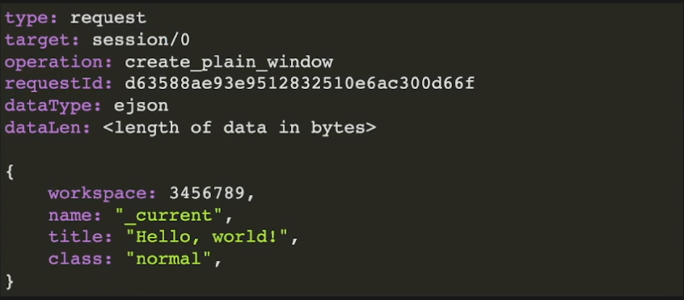

【C语言最佳实践】解耦代码和数据
===============================
| 作者：wallace-lai
| 时间：2022-07-31

一、为什么要解耦代码和数据
-------------------------------

解耦代码和数据的重要性：

1. 简化代码，降低出错几率

2. 对杂乱的代码做结构化处理

3. 提高代码的可维护性

二、代码和数据解耦实践案例
-------------------------------

2.1 案例一：根据错误码返回错误信息
~~~~~~~~~~~~~~~~~~~~~~~~~~~~~~~~~~~~~~~~~~~~~~~~~~~~~~~~~~~~~~

.. code:: c

   // bad design case
   const char *my_error_message(int errcode)
   {
       switch (errcode) {
           case EINVAL:
               return "Invalid argument";
           case EACCESS:
               return "Permission denied";
           // ...
       }
       
       return "Unknown error code";
   }

这个改进起来很简单，利用表驱动即可。

.. code:: c

   // good design case
   const char * const sys_errlist[] = {
       // ...
       "Invalid argument",     // EINVAL
       // ...
       "Permission denied",    // EACCESS
       // ...
   };

   const char *my_error_message(int errcode)
   {
       if (errno < sizeof(sys_errlist) / sizeof(sys_errlist[0]) {
           return sys_errlist[errno];
       }
       
       return "Unknown error code";
   }

2.2 案例二
~~~~~~~~~~~~~~~~~~~~~~~~~~~~~~~~~~~~~~~~~~~~~~~~~~~~~~~~~~~~~~

**初始版本**

.. code:: c

   static purc_variant_t type_getter(purc_variant_t root, size_t nr_args)
   {
       UNUSED_PARAM(root);

       purc_variant_t ret = PURC_VARIANT_INVALID;

       if (nr_args == 0) {
           pcinst_set_error(PURC_ERROR_WRONG_ARGS);
           return PURC_VARIANT_INVALID;
       }

       if (argv[0] == PURC_VARIANT_INVALID) {
           pcinst_set_error(PURC_ERROR_WRONG_ARGS);
           return PURC_VARIANT_INVALID;
       }

       // purc_variant_get_type返回的类型值不连续，所以无法使用表驱动？
       switch ((int)purc_variant_get_type(argv[0])) {
           case PURC_VARIANT_TYPE_NULL:
               ret = purc_variant_make_string("null", false);
               break;
           case PURC_VARIANT_TYPE_UNDEFINED:
               ret = purc_variant_make_string("undefined", false);
               break;
           // ...
       }

       return ret;
   }

**改进版本一**

.. code:: c

   // xxx.h
   typedef enum purc_variant_type
   {
       PURC_VARIANT_TYPE_FIRST = 0,

       /* critical: keep order as it is */
       PURC_VARIANT_TYPE_UNDEFINED = PURC_VARIANT_TYPE_FIRST,
       PURC_VARIANT_TYPE_NULL,
       PURC_VARIANT_TYPE_BOOLEAN,
       // ...
       PURC_VARIANT_TYPE_ARRAY,
       PURC_VARIANT_TYPE_SET,

       /* critical:  this MUST be the last enum */
       PURC_VARIANT_TYPE_LAST = PURC_VARIANT_TYPE_SET,
   } purc_variant_type;

   #define PURC_VARIANT_TYPE_NR \
       (PURC_VARIANT_TYPE_LAST - PURC_VARIANT_TYPE_FIRST + 1)

   // xxx.c
   static purc_variant_t type_getter(purc_variant_t root, size_t nr_args)
   {
       static const char *type_names[] = {
           "undefined",
           "null",
           "boolean",
           // ...
           "array",
           "set"
       };

       /* make sure the last one is `set` */
       assert(sizeof(type_names[PURC_VARIANT_TYPE_FIRST]) == 10);
       assert(sizeof(type_names[PURC_VARIANT_TYPE_LAST]) == 4);

       UNUSED_PARAM(root);

       if(argv == NULL || nr_args == 0) {
           pcinst_set_error(PURC_ERROR_WRONG_ARGS);
           return PURC_VARIANT_INVALID;
       }

       assert(argv[0] != PURC_VARIANT_INVALID);

       return purc_variant_make_string_static(
           type_names[purc_variant_get_type(argv[0])], false
       );
   }

上述改进版本一中还是存在两个问题：

1. ``purc_variant_type``\ 是定义在\ ``xxx.h``\ 中的，如果后续有维护人员在\ ``purc_variant_type``\ 中新增了类型或者调换了原有类型的顺序但是忘记了修改\ ``xxx.c``\ 中的\ ``type_names[]``\ 。那么，程序就会出错

2. ``xxx.c``\ 中的两个\ ``assert``\ 的本意是确保\ ``type_names[]``\ 中的第一个和最后一个分别是\ ``undefined``\ 和\ ``set``\ ，但是使用\ ``sizeof``\ 检查长度是否匹配的方法太弱了。它检查不了长度相等但是内容不匹配的错误

**改进版本二**

.. code:: c

   // xxx.h
   typedef enum purc_variant_type
   {
       PURC_VARIANT_TYPE_FIRST = 0,

       /* critical: keep order as it is */
       PURC_VARIANT_TYPE_UNDEFINED = PURC_VARIANT_TYPE_FIRST,
       PURC_VARIANT_TYPE_NULL,
       PURC_VARIANT_TYPE_BOOLEAN,
       // ...
       PURC_VARIANT_TYPE_ARRAY,
       PURC_VARIANT_TYPE_SET,

       /* critical:  this MUST be the last enum */
       PURC_VARIANT_TYPE_LAST = PURC_VARIANT_TYPE_SET,
   } purc_variant_type;

   #define PURC_VARIANT_TYPE_NR \
       (PURC_VARIANT_TYPE_LAST - PURC_VARIANT_TYPE_FIRST + 1)

   #define VARIANT_TYPE_NAME_UNDEFINED "undefined"
   #define VARIANT_TYPE_NAME_NULL      "null"
   #define VARIANT_TYPE_NAME_BOOLEAN   "boolean"
   // ...
   #define VARIANT_TYPE_NAME_ARRAY     "array"
   #define VARIANT_TYPE_NAME_SET       "set"

   // xxx.c
   // 使用宏可以避免拼写错误
   static const char *type_names[] = {
       VARIANT_TYPE_NAME_UNDEFINED,
       VARIANT_TYPE_NAME_NULL,
       VARIANT_TYPE_NAME_BOOLEAN,
       // ...
       VARIANT_TYPE_NAME_ARRAY,
       VARIANT_TYPE_NAME_SET
   };

   // 使用编译时宏可以避免purc_variant_type和type_names个数不一致的情况
   #define _COMPILE_TIME_ASSERT(name, x) \
       typedef int _dummy_ ## name[(x) * 2 - 1]

   #define PCA_TABLESIZE(table) \
       (sizeof(table) / sizeof(table[0]))

   _COMPILE_TIME_ASSERT(types, PCA_TABLESIZE(type_names) == PURC_VARIANT_TYPE_NR)

   #undef _COMPILE_TIME_ASSERT

   static purc_variant_t type_getter(purc_variant_t root, size_t nr_args)
   {
       UNUSED_PARAM(root);

       if(argv == NULL || nr_args == 0) {
           pcinst_set_error(PURC_ERROR_WRONG_ARGS);
           return PURC_VARIANT_INVALID;
       }

       assert(argv[0] != PURC_VARIANT_INVALID);

       /* make sure that the first one is `undefined` and the last one is `set` */
       assert(strcmp(type_names[PURC_VARIANT_TYPE_FIRST], VARIANT_TYPE_NAME_UNDEFINED) == 0);
       assert(strcmp(type_names[PURC_VARIANT_TYPE_LAST], VARIANT_TYPE_NAME_SET) == 0);

       return purc_variant_make_string_static(
           type_names[purc_variant_get_type(argv[0])], false
       );
   }

改进版本二的优点：

1. 使用宏定义字符串常量，避免拼写错误

2. 使用编译期断言避免出现未有效维护的情形

上面这个例子的两个优点同时也是让我感到比较巧妙的，尤其是这个编译期断言。这种可以把错误在编译器就暴露出来的方法真是太赞了！另外，使用宏定义字符串常量建议在实际代码编写过程中贯彻到底，固定不变的字符串常量绝对不要编写第二遍。

2.3 案例三
~~~~~~~~~~~~~~~~~~~~~~~~~~~~~~~~~~~~~~~~~~~~~~~~~~~~~~~~~~~~~~

假定有如下格式的消息包，我们希望能够将它解析成以下的标准数据结构。

.. code:: c

   struct _pcrdr_msg {
       pcrdr_msg_type          type;
       pcrdr_msg_target        target;
       pcrdr_msg_element_type  elementType;
       pcrdr_msg_data_type     dataType;
       unsigned int            retCode;

       uintptr_t               targetValue;
       char *                  operation;
       char *                  element;
       char *                  property;
       char *                  event;

       char *                  requestId;

       uintptr_t               resultValue;

       size_t                  dataLen;
       char *                  data;
   };

**初始版本如下**

.. code:: c

   int pcrdr_parse_packet(char *packet, size_t sz_packet)
   {
       pcrdr_msg msg;

       char *str1;
       char *line;
       char *saveptr1;

       memset(&msg, 0, sizeof(msg));

       for (str1 = packet; ; str1 = NULL) {
           line = strtok_r(str1, STR_LINE_SEPARATOR, &saveptr1);
           if (line == NULL) {
               goto failed;
           }

           if (is_blank_line(line)) {
               msg.data = strtok_r(NULL, STR_LINE_SEPARATOR, &saveptr1);
               break;
           }

           char *key, *value;
           char *saveptr2;
           key = strtok_r(line, STR_PAIR_SEPARATOR, &saveptr2);
           if (key == NULL) {
               goto failed;
           }

           value = strtok_r(NULL, STR_PAIR_SEPARATOR, &saveptr2);
           if (value == NULL) {
               goto failed;
           }

           // bad smell
           if (strcasecmp(key, "type") == 0) {
               // ...
           } else if (strcasecmp(key, "target") == 0) {
               // ...
           } else if (/* ... */) {
               // ...
           }

           // ...
       }
   }

**改进版本一**

解决办法仍然是表驱动，如下所示。但是，这个版本仍然有个问题！试想一下，如果\ ``key_ops``\ 比较多那么每次查找\ ``key_op``\ 的时间消耗就比较多，再加上频繁的调用次数那么这可能对性能有较大的影响。

.. code:: c

   #define STR_KEY_TYPE        "type"
   #define STR_KEY_TARGET      "target"
   // ...
   #define STR_KEY_DATA_LEN    "dataLen"

   typedef bool (*key_op)(pcrdr_msg *msg, char *value);

   static struct key_op_pair {
       const char *key;
       key_op     op;
   } key_ops[] = {
       { STR_KEY_TYPE,          on_type },
       { STR_KEY_TARGET,        on_target },
       // ...
       { STR_KEY_DATA_LEN,      on_data_len }
   };

   static key_op find_key_op(const char *key) 
   {
       for (int i = 0; i < sizeof(key_ops) / sizeof(key_ops[0]); i++) {
           if (strcasecmp(key, key_ops[i].key) == 0) {
               return key_ops[i].op;
           }
       }
       
       return NULL;
   }

   int pcrdr_parse_packet(char *packet, size_t sz_packet)
   {
       // ...
       key_op op = find_key_op(key);
       if (op == NULL) {
           goto failed;
       }

       if (!op(&msg, skip_left_space(value))) {
           goto failed;
       }
       // ...
   }

**改进版本二**

改进的思路也很简单，就是让\ ``key_ops``\ 按照\ ``key``\ 作升序排列，然后使用二分查找。不过这个要求程序员在添加\ ``key_ops``\ 的时候要严格按照升序排列新增项，这对程序员来说是个负担。这个问题又该如何优雅地去解决呢？

.. code:: c

   /* critical: items must list as asc order */
   static struct key_op_pair {
       const char *key;
       key_op     op;
   } key_ops[] = {
       { STR_KEY_DATA_LEN,     on_data_len },
       { STR_KEY_DATA_TYPE,    on_data_type },
       { STR_KEY_ELEMENT,      on_element }
       // ...
       { STR_KEY_TYPE,         on_type },
       { STR_KEY_TARGET,       on_target }
   };

   static key_op find_key_op(const char *key) 
   {
       int cmp;
       ssize_t low = 0, mid;
       static ssize_t high = sizeof(key_ops) / sizeof(key_ops[0]);

       while (low <= high) {
           mid = (low + high) / 2;
           cmp = strcasecmp(key, key_ops[mid].key);
           if (cmp == 0) {
               goto found;
           } else if (cmp < 0) {
               high = mid - 1;
           } else {
               low = mid + 1;
           }
       }

       return NULL;

   found:
       return key_ops[mid].op;
   }

上述版本隐含了一个非常巧妙的写法——将\ ``high``\ 设置为一个局部的\ ``static``\ 变量。稍有经验的程序员一看就知道它的妙处在哪，不过需要注意一点就是这种技法只能在静态表中使用。

终极改进版本

1. 让程序处理大量的重复性编码工作，避免手工编写引入错误。这个方法基本解决了上文中提到的要求程序员需要手动维护\ ``key_ops``\ 有序才能新增项的问题，比如我们可以将\ ``key``\ 扔到脚本里，让用脚本自动生成一个有序的\ ``key_ops``\ 表即可

2. 处理字符串时，字符串较多时，二分查找性能不高（时间复杂度\ ``O(n)``\ ），可以使用哈希表（时间复杂度\ ``O(1)``\ ）；用脚本可以找到一个相对均衡的哈希算法。

3. 依赖构建系统自动维护代码的重新生成

总之，能用脚本自动生成的重复性代码就不要自己手动地去编写。