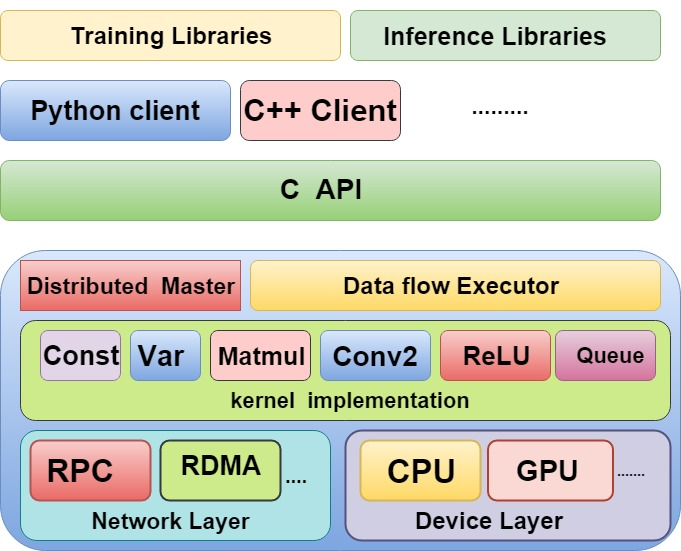

# 【C语言最佳实践】动态加载模块

作者：wallace-lai <br>
发布：2022-08-04 <br>
更新：2022-08-04 <br>

## 一、可加载模块的应用场景

可加载模块的应用场景

（1）可加载模块是子驱动程序模式的一种自然扩展

（2）为应对未来不可预知的扩展

（3）将某些功能的实现交给第三方独立模块实现

（4）软件模块间解耦的利器


## 二、可加载模块机制和策略

### 再论机制和策略

机制：需要提供什么功能

策略：如何使用这些功能

### 机制和策略是相对的

（1）对STDIO来说，带缓冲区的FILE是使用策略，文件描述符是一种实现机制

（2）对内核进程来讲，文件描述符是策略，字符设备是一种实现机制，文件系统是另外一种实现机制

### 软件栈和模块间的解耦

（1）操作系统是堆叠的软件栈，越往上抽象层次越高

（2）可加载模块可以在不同的层面实现

1. 内核（内核ko）
2. 中间件（比如x11中应用级驱动程序）
3. 编程语言（python中的import）

（3）可加载模块的重要设计原则

1. 认清模块在软件栈中的位置
2. 向下依赖，不要向上依赖
3. 尽量避免同级依赖

附：TensorFlow架构图



<text style="color: red;">
问题：如何避免同级模块之间依赖？
</text> <br> <br>

## 三、可加载模块的底层机制

其实就是共享库的实现机制了，无论是POSIX系统还是Windows机器都有类似的接口。

```c
// POSIX
#include <dlfcn.h>

void *dlopen(const char *filename, int flags);      // 打开共享库
void *dlsym(void *handle, const char *symbol);      // 在共享库中查找符号地址
int dlclose(void *handle);              // 关闭共享库  
```

```c
// Windows
HMODULE LoadLibraryA(LPCSTR lpLibFileName);
FARPROC GetProcAddress(HMODULE hModule, LPCSTR lpProcName);
BOOL FreeLibrary(HMODULE hLibModule);
```

### Linux共享库的版本管理

```
lrwxrwxrwx 1 root root     19 Apr 26 01:19 libcurl-gnutls.so.3 -> libcurl-gnutls.so.4
lrwxrwxrwx 1 root root     23 Apr 26 01:19 libcurl-gnutls.so.4 -> libcurl-gnutls.so.4.5.0
-rw-r--r-- 1 root root 522696 Apr 26 01:19 libcurl-gnutls.so.4.5.0
lrwxrwxrwx 1 root root     16 Apr 26 01:19 libcurl.so.4 -> libcurl.so.4.5.0
-rw-r--r-- 1 root root 530888 Apr 26 01:19 libcurl.so.4.5.0
```

可以看到系统中目前有两种不同的libcurl实现，分别是libcurl.so和GNU实现的libcurl-gnutls。`libcurl-gnutls.so.3`和`libcurl-gnutls.so.4`是两个不同版本的二进制so软链接，但是它们最终都指向了实际的`libcurl-gnutls.so.4.5.0`，这表明`libcurl-gnutls.so.3`和`libcurl-gnutls.so.4`是二进制兼容的。`libcurl.so.4`也是一样的道理，它的二进制版本号是4，实际指向的so文件是`libcurl.so.4.5.0`。

我们在加载so文件的时候，应该指定类似`libcurl-gnutls.so.4`这样的版本软链接名，它是稳定的。而它实际的指向是不稳定的。

### 共享库的搜索路径

（1）若调用这个dlopen的可执行程序是ELF格式，则查看DT_RPATH标记指定的共享库路径

（2）LD_LIBRARY_PATH环境变量定义的共享库搜索路径

（3）若调用这个dlopen的可执行程序是ELF格式，则查看DT_RUNPATH标记指定的共享库路径

（4）`/etc/ld.so.cache`维护的搜索路径（由ldconfig维护，来自`/etc/ld.so.conf`文件）

（5）最后搜索`/lib`和`/usr/lib`路径

## 四、套路

动态加载模块实现的一般套路

（1）调用dlopen装载指定的共享库

（2）调用dlsym获得特定（事先约定）符号，作为初始化函数

（3）调用初始化还是并返回操作集

（4）之后，跟正常的子驱动程序一样使用

（5）不需要的时候，调用操作集中的清理或终止方法

（6）调用dlclose卸载动态模块

