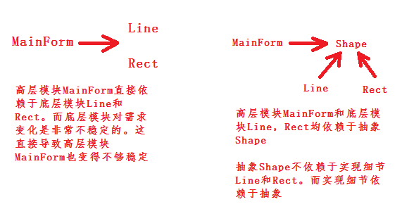

# 【设计模式】简介

作者：wallace-lai <br>
发布：2019-11-30 <br>
更新：2024-04-03 <br>

## 一、设计模式简介

设计模式参考教材：《设计模式：可复用面向对象软件的基础》

### 1.1 什么是设计模式

每一个模式描述了一个在我们周围不断重复发生的问题以及该问题的解决方案的核心。这样，你就能一次又一次地使用该方案而不必做重复劳动。

———— Christopher Alexander

### 1. 2 从面向对象谈起

有两种思维，分别是底层思维（底层）和抽象模型（高层）。

**底层思维**：向下，如何把握机器底层，从微观理解对象构造

- （1）语言构造

- （2）编译转换

- （3）内存模型

- （4）运行时机制

**抽象思维**：向上，如何将我们的周围世界抽象为程序代码

- （1）面向对象

- （2）组件封装

- （3）设计模式

- （4）架构模式

抽象思维的功能：帮助开发人员管理代码的复杂度。因为我们知道软件工程是在对抗软件复杂度的过程中诞生的。

### 1.3 理解面向对象

**向下**：深入理解三大面向对象机制，本质上是理解面向对象的底层实现机理，参考《深度探索C++对象模型》

- （1）封装：隐藏内部实现

- （2）继承：复用现有代码

- （3）多态：改写对象行为

**向上**：深刻把握面向对象机制所带来的抽象意义，理解如何使用这些机制来表达现实世界，掌握什么是**好的面向对象设计**

### 1.4 软件设计的复杂性

建筑商从来不会去想给一栋已经建好的100层高楼底下新修一个小地下室，这样做花费极大且注定要失败。然而令人惊奇的是，软件系统的用户在要求作出类似改变时却不会仔细考虑，而且他们认为这只是需要简单编程的事情。

软件设计复杂额根本原因：**变化**

- （1）客户需求的变化

- （2）技术平台的变化

- （3）开发团队的变化

- （4）市场环境的变化

- ......

### 1.5 解决复杂性的方法

解决复杂性有两种方法：

- （1）分解

人们面对复杂性有一个常见的做法，即分而治之，将大问题分解为多个小问题，将复杂问题分解为多个简单问题。以C语言为代表的过程式语言就采用分解的办法来解决复杂问题。

- （2）抽象

从更高层次来讲，人们处理复杂性有一个通用的技术，即抽象。由于不能掌握全部的复杂对象，我们选择忽视它的非本质细节而去处理泛化和理想化了的对象模型。

对于这两种解决复杂性的方法，有两个直观的小例子来说明。假设我们要设计一个画图软件，分别运用分解和抽象的办法来设计。

如果是采用分解的思路，可以把伪代码写成如下的形式：

```cpp
// Shape.h

class Point {
public:
	int x;
	int y;
};

class Line {
public:
	Point start;
	Point end;

	Line(const Point& start, const Point& end) {
		this->start = start;
		this->end = end;
	}
};

class Rect {
public:
	Point leftUp;
	int width;
	int height;

	Rect(const Point& leftUp, int width, int height) {
		this->leftUp = leftUp;
		this->width = width;
		this->height = height;
	}
};
```

```cpp
// MainForm.cpp

#include <vector>
#include "Shape.h"
using namespace std;

class MainForm : public Form {
private:
	Point p1;
	Point p2;

	vector<Line> lineVector;
	vector<Rect> rectVector;

public:
	MainForm() {
		// ...
	}

protected:
	virtual void OnMouseDown(const MouseEventArgs& e);
	virtual void OnMouseUp(const MouseEventArgs& e);
	virtual void OnPaint(const PaintEventArgs& e);
};

void MainForm::OnMouseDown(const MouseEventArgs& e) {
	p1.x = e.X;
	p1.y = e.Y;

	// ...
	Form::OnMouseDown(e);
}

void MainForm::OnMouseUp(const MouseEventArgs& e) {
	p2.x = e.X;
	p2.y = e.Y;

	if (rdoLine.Checked) {
		Line line(p1, p2);
		lineVector.push_back(line);
	}
	else if (rdoRect.Checked) {
		int width = abs(p2.x - p1.x);
		int height = abs(p2.y - p1.y);
		Rect rect(p1, width, height);
		rectVector.push_back(rect);
	}

	// ...
	this->Refresh();
	Form::OnMouseUp(e);
}

void MainForm::OnPaint(const PaintEventArgs& e) {
	// 针对直线
	for (int i = 0; i < lineVector.size(); ++i) {
		e.Graphics.DrawLine(Pens.Red,
			lineVector[i].start.x,
			lineVector[i].start.y,
			lineVector[i].end.x,
			lineVector[i].end.y);
	}

	// 针对矩形
	for (int i = 0; i < rectVector.size(); ++i) {
		e.Graphics.DrawRectangle(Pens.Red,
			rectVector[i].leftUp,
			rectVector[i].width,
			rectVector[i].height);
	}

	// ...
	Form::OnPaint(e);
}
```

如果是采用抽象的思路，则可以把代码写成下面的样子：

```cpp
// Shape.h

class Shape {
public:
	virtual void Draw(const Graphics& g) = 0;
	virtual ~Shape() {}
};

class Point {
public:
	int x;
	int y;
};

class Line : public Shape {
public:
	Point start;
	Point end;

	Line(const Point& start, const Point& end) {
		this->start = start;
		this->end = end;
	}

	// 实现自己的Draw，负责画自己
	virtual void Draw(const Graphics& g) {
		g.DrawLine(Pens.Red, start.x, start.y, end.x, end.y);
	}
};

class Rect : public Shape {
public:
	Point leftUp;
	int width;
	int height;

	Rect(const Point& leftUp, int width, int height) {
		this->leftUp = leftUp;
		this->width = width;
		this->height = height;
	}

	// 实现自己的Draw，负责画自己
	virtual void Draw(const Graphics& g) {
		g.DrawRectangle(Pens.Red, leftUp, width, height);
	}
};

```

```cpp
// MainForm.cpp

#include "Shape.h"
#include <vector>
using namespace std;

class MainForm : public Form {
private:
	Point p1;
	Point p2;

	// 针对所有形状
	vector<Shape*> shapeVector;

public:
	MainForm() {
		// ...
	}

protected:
	virtual void OnMouseDown(const MouseEventArgs& e);
	virtual void OnMouseUp(const MouseEventArgs& e);
	virtual void OnPaint(const PaintEventArgs& e);
};

void MainForm::OnMouseDown(const MouseEventArgs& e) {
	p1.x = e.X;
	p1.y = e.Y;

	// ...
	Form::OnMouseDown(e);
}

void MainForm::OnMouseUp(const MouseEventArgs& e) {
	p2.x = e.X;
	p2.y = e.Y;

	if (rdoLine.Checked) {
		shapeVector.push_back(new Line(p1, p2));
	}
	else if (rdoRect.Checked) {
		int width = abs(p2.x - p1.x);
		int height = abs(p2.y - p2.y);
		shapeVector.push_back(new Rect(p1, width, height));
	}

	// ...
	this->Refrash();
	Form::OnMouseUp(e);
}

void MainForm::OnPaint(const PaintEventArgs& e) {
	// 针对所有形状
	for (int i = 0; i < shapeVector.size(); ++i) {
		// 多态调用，各负其责
		shapeVector[i]->Draw(e.Graphics);
	}

	// ...
	Form::OnPaint(e);
}
```



如果此时需要增加一个绘制圆形的功能，那么采用抽象的方法所需要的更改会明显少于采用分解的方法。也就是说采用抽象的方法能够更好地实现代码复用，更好地抵御需求变更所带来的冲击。

### 1.6 软件设计的目标

什么是好的设计？

**软件的复用性高**才是好的设计。