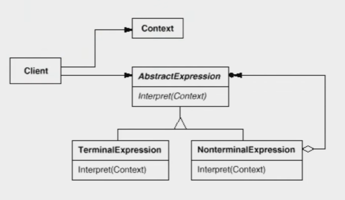

# 【设计模式】领域问题

作者：wallace-lai <br>
发布：2024-04-02 <br>
更新：2024-04-29 <br>

在特定领域中，某些变化虽然频繁，但可以抽象为某种规则。这时候，结合特定领域，将问题抽象为语法规则，从而给出在该领域下的一般性解决方案。

领域问题的典型模式有：

（1）Interpreter ：解析器模式

## 一、解析器模式
### 1.1 动机
在软件构建过程中，如果某一特定领域的问题比较复杂，类似的结构不断重复出现，如果使用普通的编程方式来实现将面临非常频繁的变化。

在这种情况下，将特定领域的问题表达为某种语法规则下的句子，然后构建一个解释器来解释这样的句子，从而达到解决问题的目的。

### 1.2 定义
解释器模式：**给定一个语言，定义它的文法的一种表示，并定义一种解释器，这个解释器使用该表示来解释语言中的句子**。

下面给出一个求解包含加法和减法运算的表达式值的代码作为解释器模式的案例。

```cpp
class Expression {
public:
    virtual int interpreter(map<char, int> var) = 0;
    virtual ~Expression() {}
};

// 变量表达式
class VarExpression : public Expression {
    char key;
public:
    VarExpression(const char &key) {
        this->key = key;
    }

    int interpreter(map<char, int> var) override {
        return var[key];
    }
};

// 符号表达式
class SymbolExpression : public Expression {
    // 运算符左右两个参数
protected:
    Expression *left;
    Expression *right;

public:
    SymbolExpression(Expression *left, Expression *right) :
        left(left), right(right) {}
};

// 加法运算
class AddExpression : public SymbolExpression {
public:
    AddExpression(Expression *left, Expression *right) :
        SymbolExpression(left, right) {}

    int interpreter(map<char, int> var) override {
        return left->interpreter(var) + right->interpreter(var);
    }
};

// 减法运算
class SubExpression : public SymbolExpression {
public:
    SubExpression(Expression *left, Expression *right) :
        SymbolExpression(left, right) {}

    int interpreter(map<char, int> var) override {
        return left->interpreter(var) - right->interpreter(var);
    }
};

Expression *analyse(string expr)
{
    stack<Expression*> expStk;
    Expression *left = nullptr;
    Expression *right = nullptr;

    for (int i = 0; i < expr.size(); i++) {
        switch (expr[i]) {
            case '+':
                left = expStk.top();
                right = new VarExpression(expr[++i]);
                expStk.push(new AddExpression(left, right));
                break;
            case '-':
                left = expStk.top();
                right = new VarExpression(expr[++i]);
                expStk.push(new SubExpression(left, right));
                break;
            default:
                // 终结表达式
                expStk.push(new VarExpression(expr[i]));
        }
    }

    Expression *expression = expStk.top();
    return expression;
}

void release(Expression *expr)
{
    // 释放表达式树的内存
}

int main()
{
    string expr = "a+b-c+d";
    map<char, int> var;

    var.insert(make_pair('a', 5));
    var.insert(make_pair('b', 2));
    var.insert(make_pair('c', 1));
    var.insert(make_pair('d', 6));

    Expression *resultExpr = analyse(expr);
    int result = resultExpr->interpreter(var);

    cout << result << endl;
    release(resultExpr);
    return 0;
}
```

<p style="color:red;">
注：对于上述代码，如果你学过编译原理中的语法分析相关的内容，那么理解起来应该可以毫不费力。实际上语法分析已经是非常成熟（过时）的技术了，初学者利用bison这种语法分析工具可以很容易地制作一门自己的编程语言出来。
</p>

解释器模式的结构图如下所示，基本上可以和代码一一对应起来。



### 1.3 总结

（1）解释器模式的应用场合是其应用中的难点，只有满足“业务规则频繁变化”，且类似的结构不断重复出现，并且容易抽象为语法规则的问题才适合使用解释器模式。

（2）使用解释器模式来表示文法规则，从而可以使用面向对象技巧来方便地扩展文法。

（3）解释器模式比较适合简单的文法表示，对于复杂的文法表示，解释器模式会产生比较大的类层次结构，需要求助于语法分析生成器（比如bison）这样的标准工具。