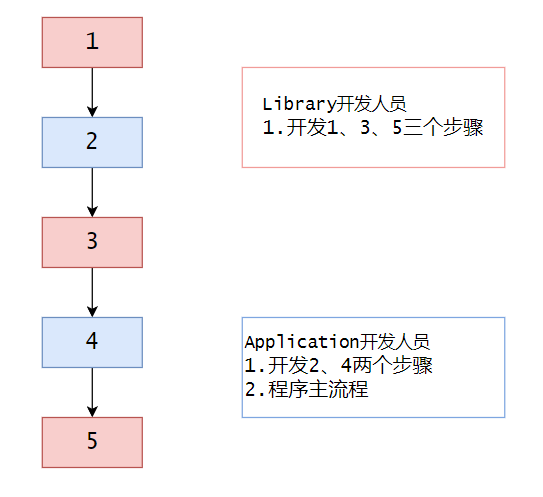
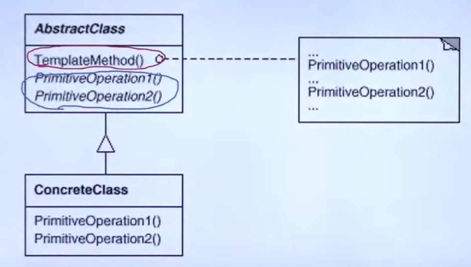
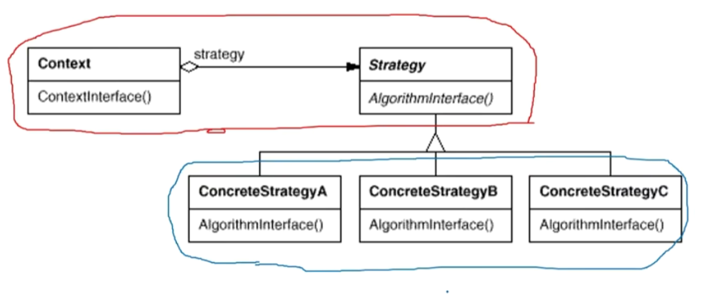
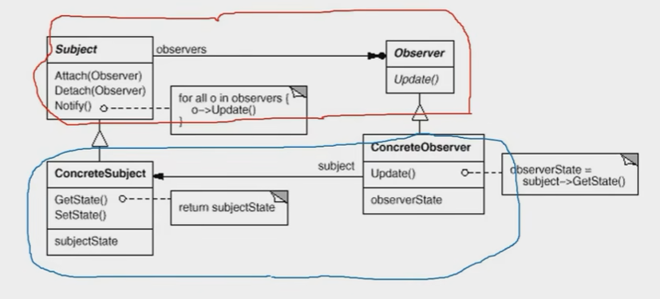

# 【设计模式】组件协作类

作者：wallace-lai <br>
发布：2024-04-02 <br>
更新：2024-04-09 <br>

现代软件专业分工之后的第一个结果是**框架与应用程序的划分**，组件协作模式通过**晚期绑定**，来实现框架与应用程序之间的松耦合，是二者之间协作时常用的模式。

组件协作的典型模式：

（1）Template Method

（2）Strategy

（3）Observer/Event

## 一、模板方法

### 1.1 动机
在软件构建过程中，对于某一项任务，它常常**有稳定的整体结构，但各个子步骤却有很多改变的需求**。或者由于固有的原因（比如框架与应用之间的关系）而无法和任务的整体结构同时实现。

如何在确定稳定操作结构的前提下，来灵活应对各个子步骤的变化或者晚期实现的需求？

### 1.2 定义

模板方法：**模板方法定义一个操作中的算法的骨架（稳定），而将一些步骤延迟到子类中。模板方法使得子类可以不改变（复用）一个算法的结构即可重定义（override重写）该算法的某些特定步骤**。

下面是一个采用结构化设计思想的案例：

```cpp
// 程序库开发人员
// 程序库只提供了稳定的Step1(), Step3()和Step5()方法的实现
// 程序主流程和Step2()以及Step4()方法均由应用程序实现。由于
// 程序主流程依赖了程序库的Step1(), Step3()和Step5()方法
// 所以这是个应用程序依赖程序库的早绑定方式。
class Library {
public:
	void Step1() {
		// ...
	}

	void Step3() {
		// ...
	}

	void Step5() {
		// ...
	}
};
```
```cpp
// 应用程序开发人员
class Application {
public:
	bool Step2() {
		// ...
	}

	void Step4() {
		// ...
	}
};

// 主流程
int main() {
	Library lib();
	Application app();

	lib.Step1();

	if (app.Step2()) {
		lib.Step3();
	}

	for (int i = 0; i < 4; ++i) {
		app.Step4();
	}

	lib.Step5();
	return 0;
}
```

对于上述结构化软件设计案例，可以用图来表示：



可以看到上述结构化软件设计案例中，是应用程序依赖了库函数，这是早绑定的。

应用模板方法，可以将上面的例子设计成以下的形式：

```cpp
// 程序库开发人员
// 程序主流程Run和Step1(), Step2(), Step3()方法是稳定的
// 稳定的东西由程序库来实现，需要容纳变化的Step2和Step4()方
// 法采用虚函数的方式应用程序人员提供实现。这样就实现了晚绑定
class Library {
public:
	// 流程也是稳定的，所以应该由程序库提供
	void Run() {
		Step1();

		// 支持变化，虚函数的多态调用
		if (Step2()) {
			Step3();
		}

		// 支持变化，虚函数的多态调用
		for (int i = 0; i < 4; ++i) {
			Step4();
		}

		Step5();
	}

	virtual ~Library() {}

protected:
	void Step1() {	// 稳定
		// ...
	}

	void Step3() {	// 稳定
		// ...
	}

	void Step5() {	// 稳定
		// ...
	}

	virtual bool Step2() = 0;	// 变化
	virtual void Step4() = 0;	// 变化
};
```

```cpp
// 应用程序开发人员需要重写父类的虚函数
class Application : public Library {
protected:
	virtual bool Step2() {
		// ...子类重写实现
	}

	virtual void Step4() {
		// ...子类重写实现
	}
};

// 使用程序库
int main() {
	Library *pLib = new Application();
	pLib->Run();

	delete pLib;
}
```

### 1.3 注意

（1）模板方法的结构如下所示，其中红色的部分是稳定的，蓝色是变化的部分；



（2）模板方法模式成立的前提是算法骨架（Run方法）是稳定的。如果算法骨架都不是稳定的，那么它就不适合用模板方法方法；

（3）如果所有步骤都是稳定不变的（极端情况下），那么就没有使用设计模式的必要了。设计模式的意义在于在变化（部分）和稳定（部分）之间寻找隔离点，从而管理变化；

（4）稳定和变化是相对的，没有绝对不变的东西，只有某部分代码相对其他代码更稳定一点；

### 1.4 总结
（1）模板方法模式是一种非常基础性的设计模式，在面向对象系统中有着大量的应用。它用最简洁的机制（**虚函数的多态性**）为很多应用程序框架提供了灵活的扩展点，是代码复用方面的基本实现结构。

（2）除了可以灵活地应对子步骤的变化外，“不要调用我，让我调用你”的反向控制结构是模板方法的典型应用。“不要调用我，让我调用你”，即你应用程序不要调用我程序库，让我来调用你。

（3）在具体实现方面，被模板方法调用的虚方法可以具有实现，也可以没有任何实现（抽象方法、纯虚方法），但一般推荐将它们设计为protected方法，不供外界调用。

## 二、策略模式

### 2.1 动机
在软件构建过程中，某些对象使用的算法可能多种多样，经常改变，如果将这些算法都编码到对象中，将会使对象变得异常复杂。而且有时候支持不使用的算法也是一个性能负担。

如何在运行时根据需要透明地更改对象的算法？将算法与对象本身解耦，从而避免上述问题？

### 2.2 定义
策略模式：**定义一系列算法，把它们一个个封装起来，并且使它们可互相替换（变化）。该模式使得算法可独立于使用它的客户程序（稳定）而变化（扩展、子类化）**。

如下所示，有同样功能的两段代码。

不使用策略模式：

```cpp
enum TaxBase {
	CN_TAX,
	US_TAX,
	DE_TAX,
	FR_TAX	// 更改
};

class SalesOrder {
	TaxBase tax;

public:
	double CalculateTax() {
		// ...
		if (tax == CN_TAX) {
			// ...
		}
		else if (tax == US_TAX) {
			// ...
		}
		else if (tax == DE_TAX) {
			// ...
		}
		else if (tax == FR_TAX) {	// 更改
			// ...
		}
	}
};
```

不使用策略模式存在的问题：

（1）假如要新增`FR_TAX`类型的税种计算，那么就会产生更改。这违背了开闭原则

使用策略模式：

```cpp
class TaxStrategy {
public:
	virtual double Calculate(const Context& context) = 0;
	virtual ~TaxStrategy() {}
};

class CNTax : public TaxStrategy {
public:
	virtual double Calculate(const Context& context) {
		// ...
	}
};

class USTax : public TaxStrategy {
public:
	virtual double Calculate(const Context& context) {
		// ...
	}
};

class DETax : public TaxStrategy {
public:
	virtual double Calculate(const Context& context) {
		// ...
	}
};

// 添加而非更改
class FRTax : public TaxStrategy {
public:
	virtual double Calculate(const Context& context) {
		// ...
	}
};

class SalesOrder {
private:
	TaxStrategy* strategy;

public:
	SalesOrder(StrategyFactory* strategyFactory) {
		this->strategy = strategyFactory->NewStrategy();
	}

	~SalesOrder() {
		delete this->strategy;
	}

	public double CalculateTax() {
		// ...
		Context context();
		// 多态调用
		double val = strategy->Calculate(context);
		// ...
	}
};
```

使用策略模式的好处：

（1）假如要新增`FR_TAX`类型的税种计算，那么只需要进行扩展而无需进行更改；

（2）上述代码的可复用性得到了提升；

### 2.3 总结

（1）策略模式的结构图如下，其中红色是稳定部分，蓝色为变化部分；



（2）Strategy及其子类为组件提供了一系列可重用的算法，从而可以使得类型在**运行时**方便地根据需要在各个算法之间进行切换；

（3）Strategy模式提供了用条件判断语句以外的另一种选择，消除条件判断语句，就是在解耦合。含有许多条件判断语句的代码通常需要Strategy模式；

（4）如果Strategy对象没有实例变量，那么各个上下文可以共享同一个Strategy对象，从而节省对象开销；

## 三、观察者模式
### 3.1 动机
在软件构建过程中，我们需要为某些对象建立一种“通知依赖关系”——一个对象（目标对象）的状态发生改变，所有依赖对象（观察者对象）都将得到通知。如果这样的依赖关系过于紧密，将使得软件不能很好地抵御变化。

使用面向对象的技术，可以将这种依赖关系弱化，并形成一种稳定的依赖关系。从而实现软件体系结构的松耦合。

### 3.2 模式定义
观察者模式：**定义对象间的一种一对多（变化）的依赖关系，以便当一个对象（Subject）的状态发生改变时，所有依赖于它的对象（Observer）都得到通知并自动更新**。

假如我们要做一个文件分割器的小软件，它的初始源码可以是以下的形式。此时，还不涉及到观察者模式。

```cpp
class FileSplitter {
    string filePath;
    int fileNumber;

public:
    FileSplitter(const string &filePath, int num) :
        filePath(filePath), fileNumber(num) {}

    void split(void) {
        // 1. 读取大文件

        // 2. 分批次向小文件中写入
        for (int i = 0; i < fileNumber; i++) {
            // ...
        }
    }
};

class MainForm : public Form
{
    TextBox *txtFilePath;
    TextBox *txtFileNumber;

public:
    void Button1_Click() {
        string filePath = txtFilePath->getText();
        int number = atoi(txtFileNumber->getText().c_str());

        FileSplitter splitter(filePath, number);
        splitter.split();
    }
};
```

假如要添加一个进度条的功能，最简单的方法是如下的写法。

```cpp
class FileSplitter {
    string filePath;
    int fileNumber;
    ProgressBar *progressBar;   // 新增

public:
    FileSplitter(const string &filePath, int num, ProgressBar *progress) :
        filePath(filePath), fileNumber(num), progressBar(progress) {}

    void split(void) {
        // 1. 读取大文件

        // 2. 分批次向小文件中写入
        for (int i = 0; i < fileNumber; i++) {
            // ...

            // 新增
            if (progressBar != nullptr) {
                progressBar->setValue((i + 1) / fileNumber);
            }
        }
    }
};

class MainForm : public Form
{
    TextBox *txtFilePath;
    TextBox *txtFileNumber;

    ProgressBar *progress;  // 新增

public:
    void Button1_Click() {
        string filePath = txtFilePath->getText();
        int number = atoi(txtFileNumber->getText().c_str());

        // 更改
        FileSplitter splitter(filePath, number, progress);
        splitter.split();
    }
};
```

上述代码存在什么问题？

它违反了依赖倒置原则，即抽象不应该依赖于实现细节，实现细节应该依赖于抽象。`FileSplitter`中新增的`progressBar`就是实现细节。一旦提示的形式变了（这是很容易发生的），不再是进度条了，那么上述代码就需要跟着变动。

仔细分析一下，`progressBar`在代码起到的作用是**通知**，如何用一种更加抽象的机制来起到通知的功能呢？下面的代码就不再违反依赖倒置原则了，原因在于`FilterSplitter`由原来的依赖具体`ProgressBar`类变成了依赖抽象的通知机制`IProgress`。

此时的代码是只有一个观察者的观察者模式，观察者对象是`MainForm`，目标对象是`FileSplitter`。

```cpp
// 抽象的通知机制
class IProgress {
public:
    virtual void DoProgress(float value) = 0;
    virtual ~IProgress() {}
};

class FileSplitter {
    string filePath;
    int fileNumber;
    // ProgressBar *progressBar;  // 具体的通知控件
    IProgress *progress;    // 抽象的通知机制

public:
    FileSplitter(const string &filePath, int num, IProgress *progress) :
        filePath(filePath), fileNumber(num), progress(progress) {}

    void split(void) {
        // 1. 读取大文件

        // 2. 分批次向小文件中写入
        for (int i = 0; i < fileNumber; i++) {
            // ...

            // 新增
            if (progress != nullptr) {
                float value = (i + 1) / fileNumber;
                progress->DoProgress(value);
            }
        }
    }
};

// 主继承 + 接口的继承形式
class MainForm : public Form, public IProgress
{
    TextBox *txtFilePath;
    TextBox *txtFileNumber;

    ProgressBar *progress;  // 新增

public:
    void Button1_Click() {
        string filePath = txtFilePath->getText();
        int number = atoi(txtFileNumber->getText().c_str());

        // 更改
        FileSplitter splitter(filePath, number, this);
        splitter.split();
    }

    virtual void DoProgress(float value) {
        progress->setValue(value);
    }
};
```

但是，如果需要有多个观察者对象又该怎么办呢？上述的代码显然就不好支持多个观察者对象了。此时就需要进行多观察者改造了，具体代码如下。至此，终于得到了完整的观察者模式代码。

```cpp
// 抽象的通知机制
class IProgress {
public:
    virtual void DoProgress(float value) = 0;
    virtual ~IProgress() {}
};


class FileSplitter {
    string filePath;
    int fileNumber;
    // ProgressBar *progressBar;  // 具体的通知控件
    // IProgress *progress;    // 抽象的通知机制
    list<IProgress*> progress;  // 观察者列表，支持多个观察者

public:
    FileSplitter(const string &filePath, int num) :
        filePath(filePath), fileNumber(num) {}

    // 添加观察者
    void AddIProgress(IProgress *i) {
        progress.add(i);
    }

    // 移除观察者
    void RemoveIProgress(IProgress *i) {
        progress.remove(i);
    }

    // 移除观察者
    void split(void) {
        // 1. 读取大文件

        // 2. 分批次向小文件中写入
        for (int i = 0; i < fileNumber; i++) {
            // ...

            float value = (i + 1) / fileNumber;
            OnProgress(value);
        }
    }

protected:
    void OnProgress(float value) {
        list<IProgress*>::iterator iter = progress.begin();
        while (iter != progress.end()) {
            (*iter)->DoProgress(value);
        }
    }
};

// 主继承 + 接口的继承形式
class MainForm : public Form, public IProgress
{
    TextBox *txtFilePath;
    TextBox *txtFileNumber;

    ProgressBar *progressBar;  // 新增

public:
    void Button1_Click() {
        string filePath = txtFilePath->getText();
        int number = atoi(txtFileNumber->getText().c_str());

        ConsoleNotifier cn;

        FileSplitter splitter(filePath, number);
        splitter.AddIProgress(this);
        splitter.AddIProgress(&cn);
        
        splitter.split();

        splitter.RemoveIProgress(&cn);
        splitter.RemoveIProgress(this);
    }

    virtual void DoProgress(float value) {
        progressBar->setValue(value);
    }
};

class ConsoleNotifier : public IProgress {
public:
    virtual void DoProgress(float value) {
        cout << ".";
    }
};
```


### 3.3 要点总结

（1）观察者模式的结构如下所示，红色部分为稳定部分，蓝色部分为不稳定部分。



Subject为目标对象，其中的Attach表示往其中新增观察者，Detach表示移除观察者，Notify表示对所有的观察者进行通知。Observer为观察者对象。

（2）使用面向对象的抽象，Observer模式使得我们可以独立地改变目标与观察者，从而使二者之间的依赖关系达到松耦合。

（3）目标发送通知时，无需指定观察者，通知（可以携带通知信息作为参数）会自动传播。

（4）观察者自己决定是否需要订阅通知，目标对象对此一无所知。

（5）Observer模式是基于事件的UI框架中非常常用的设计模式，也是MVC模式的一个重要组成部分。