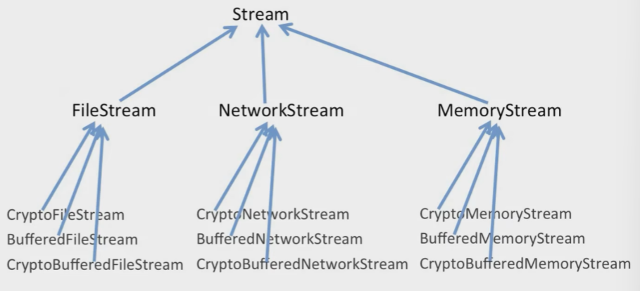
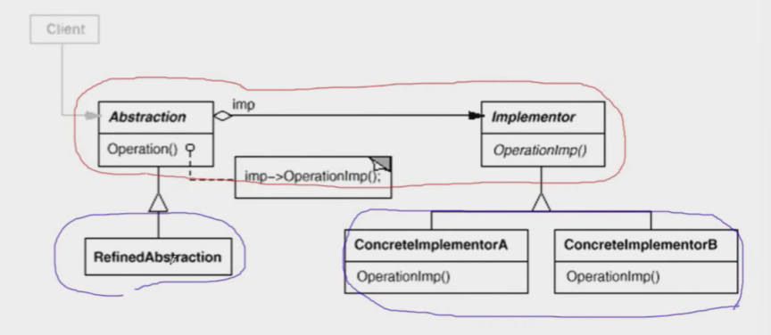

# 【设计模式】单一职责类

作者：wallace-lai <br>
发布：2024-04-02 <br>
更新：2024-04-17 <br>

在软件组件的设计中，如果责任划分的不清晰，使用继承得到的结果往往是随着需求的变化，子类急剧膨胀，同时充斥着重复代码，这时的关键是划清责任。

典型的单一职责类模式有：

（1）Decorator

（2）Bridge

## 一、装饰器模式
### 1.1 动机
在某些情况下我们可能会**过度地使用继承来扩展对象的功能**，由于继承为类型引入的静态特质，使得这种扩展方式缺乏灵活性；并且随着子类增多（扩展功能的增多），各种子类的组合（扩展功能的组合）会导致更多子类的膨胀。

如何使**对象功能的扩展**能够根据需要来动态地实现？同时**避免扩展功能的增多带来的子类膨胀问题**？从而使得任何功能扩展变化所导致的影响降为最低？

### 1.2 模式定义
装饰器模式：**动态（组合）地给一个对象增加一些额外的职责。就增加功能而言，Decorator模式比生成子类（继承）更为灵活（消除重复代码并且减少子类个数）**。

假设我们需要编写一个流操作的库，代码如下所示。目前看起来，不存在任何问题。

```cpp
class Stream {
public:
    virtual char Read(int num) = 0;
    virtual void Seek(int pos) = 0;
    virtual void Write(char data) = 0;

    virtual ~Stream() {}
};

// 文件流
class FileStream : public Stream {
public:
    virtual char Read(int num) {
        // 读文件
    }

    virtual void Seek(int pos) {
        // 定位文件
    }

    virtual void Write(char data) {
        // 写文件
    }
};

// 网络流
class NetworkStream : public Stream {
public:
    virtual char Read(int num) {
        // 读取网络流
    }

    virtual void Seek(int pos) {
        // 定位网络流
    }

    virtual void Write(char data) {
        // 写网络流
    }
};

// 内存流
class MemoryStream : public Stream {
public:
    virtual char Read(int num) {
        // 读内存流
    }

    virtual void Seek(int pos) {
        // 定位内存流
    }

    virtual void Write(char data) {
        // 写内存流
    }
};
```

假如我们需要对以上各个流扩展一个加密功能，那么得继续添加代码，如下所示。

```cpp
// 加密文件流
class CryptoFileStream : public FileStream {
public:
    virtual char Read(int num) {
        // 额外的加密操作
        FileStream::Read(num);  // 读取文件流
    }

    virtual void Seek(int pos) {
        // 额外的加密操作
        FileStream::Seek(pos);  // 定位内存流
    }

    virtual void Write(char data) {
        // 额外的加密操作
        FileStream::Write(data);  // 写内存流
    }
};

// 加密网络流
class CryptoNetworkStream : public NetworkStream {
public:
    virtual char Read(int num) {
        // 额外的加密操作
        NetworkStream::Read(num);  // 读取文件流
    }

    virtual void Seek(int pos) {
        // 额外的加密操作
        NetworkStream::Seek(pos);  // 定位内存流
    }

    virtual void Write(char data) {
        // 额外的加密操作
        NetworkStream::Write(data);  // 写内存流
    }
};

// 加密内存流
class CryptoMemoryStream : public MemoryStream {
public:
    virtual char Read(int num) {
        // 额外的加密操作
        MemoryStream::Read(num);  // 读取文件流
    }

    virtual void Seek(int pos) {
        // 额外的加密操作
        MemoryStream::Seek(pos);  // 定位内存流
    }

    virtual void Write(char data) {
        // 额外的加密操作
        MemoryStream::Write(data);  // 写内存流
    }
};
```

这个时候你会发现，添加的代码几乎都是类似的，代码坏味道开始出现。假如还需要添加缓存流功能，那么还需要继续添加代码，如下所示。

```cpp
class BufferedFileStream : public FileStream {
    // ...
};

class BufferedNetworkStream : public NetworkStream {
    // ...
};

class BufferedMemoryStream : public MemoryStream {
    // ...
};
```

那假如还需要新增同时具有加密和缓存的流功能呢？还需要添加...

```cpp
class CryptoBufferedFileStream : public FileStream {
    // ...
};

class CryptoBufferedNetworkStream : public NetworkStream {
    // ...
};

class CryptoBufferedMemoryStream : public MemoryStream {
    // ...
};
```

用图表示上述这些代码中的继承情况如下所示，总共有13个类！如果操作数变多，那么子类个数将以指数的方式增长！



【未完待续...】

### 1.3 总结

（1）通过采用组合而非继承的手法，Decorator模式实现了在运行时动态扩展对象功能的能力，而且可以根据需要扩展多个功能。避免了使用继承带来的“灵活性差”和“多子类衍生的问题”。

（2）Decorator模式在接口上表现为is-a Component的继承关系，即Decorator类继承了Component类所具有的接口。但在实现上又表现为has-a Component的组合关系，即Decorator类又使用了另外一个Component类

（3）Decorator模式的目的并非解决“多子类衍生的多继承”问题，Decorator模式应用的要点在于解决“主体类在多个方向上的扩展功能”——是为“装饰”的含义。

## 二、桥模式

### 2.1 动机
由于某些类型的固有的实现逻辑，使得它们具有两个变化的维度，甚至多个维度的变化。

如何应对这种**多维度的变化**？如何利用面向对象技术来使得类型可以轻松地沿着两个乃至多个方向变化，而不引入额外的复杂度？

### 2.2 模式定义

桥模式：**将抽象部分（业务功能）与实现部分（平台实现）分离，使它们都可以独立地变化**。


假设我们要实现一个类似消息发送的功能，基类可以做如下的实现。

```cpp
class Messager {
public:
    virtual void Login(string username, string password) = 0;
    virtual void SendMessage(string message) = 0;
    virtual void SendPicture(Image img) = 0;

    virtual void PlaySound() = 0;
    virtual void DrawShape() = 0;
    virtual void WriteText() = 0;
    virtual void Connect() = 0;

    virtual ~Messager() {}
};
```

针对上述基类，我们目前需要实现PC和Mobile两个平台的消息发送。基类中的PlaySound等功能针对不同的平台有不同的实现，因此我们需要继承基类扩展两个针对不同平台的子类，如下所示。

```cpp
// 平台实现 n个
// PC平台
class PCMessagerBase : public Messager {
public:
    virtual void PlaySound() {
        // ...
    }

    virtual void DrawShape() {
        // ...
    }

    virtual void WriteText() {
        // ...
    }

    virtual void Connect() {
        // ...
    }
};

// Mobile平台
class MobileMessagerBase : public Messager {
public:
    virtual void PlaySound() {
        // ---
    }

    virtual void DrawShape() {
        // ---
    }

    virtual void WriteText() {
        // ---
    }

    virtual void Connect() {
        // ---
    }
};
```

然后针对不同的业务，又需要有不同的业务抽象。每个平台都需要有Lite和Perfert版本，为此又需要根据业务抽象扩展不同的子类，如下所示。

```cpp
// 业务抽象 m个
// 类的数目：1 + n + n * m
// PC平台
class PCMessageLite : public PCMessagerBase {
public:
    virtual void Login(string username, string password) {
        PCMessagerBase::Connect();
        // ...
    }

    virtual void SendMessage(string message) {
        PCMessagerBase::WriteText();
        // ...
    }

    virtual void SendPicture(Image img) {
        PCMessagerBase::DrawShape();
        // ...
    }
};

class PCMessagerPerfect : public PCMessagerBase {
public:
    virtual void Login(string username, string password) {
        PCMessagerBase::PlaySound();
        // ---
        PCMessagerBase::Connect();
        // ...
    }

    virtual void SendMessage(string message) {
        PCMessagerBase::PlaySound();
        // ---
        PCMessagerBase::WriteText();
        // ...
    }

    virtual void SendPicture(Image img) {
        PCMessagerBase::PlaySound();
        // ---
        PCMessagerBase::DrawShape();
        // ...
    }
};

// Mobile平台
class MobileMessagerLite : public MobileMessagerBase {
public:
    virtual void Login(string username, string password) {
        MobileMessagerBase::Connect();
        // ...
    }

    virtual void SendMessage(string message) {
        MobileMessagerBase::WriteText();
        // ...
    }

    virtual void SendPicture(Image img) {
        MobileMessagerBase::DrawShape();
        // ...
    }
};

class MobileMessagerPerfect : public MobileMessagerBase {
public:
    virtual void Login(string username, string password) {
        MobileMessagerBase::PlaySound();
        // ---
        MobileMessagerBase::Connect();
        // ...
    }

    virtual void SendMessage(string message) {
        MobileMessagerBase::PlaySound();
        // ---
        MobileMessagerBase::WriteText();
        // ...
    }

    virtual void SendPicture(Image img) {
        MobileMessagerBase::PlaySound();
        // ---
        MobileMessagerBase::DrawShape();
        // ...
    }
};
```

或许你已经闻到了上述代码中的“坏味道”了。假设共有$N$个平台，每个平台下有$M$个业务抽象，那么总共需要的子类个数为$1 + N + N * M$。需要的子类数目太多了！

仔细观察PCMessagerPerfect和MobileMessagerPerfect，你会发现它们的区别仅在于调用的基类方法不一样，其他都是一样（重复）的。PCMessageLite和MobileMessageLite也是一样的情况。接下来开始使用技巧消除重复代码。

（1）针对PCMessageLite和MobileMessagerLite，用基类指针替换继承；

```cpp
class PCMessageLite {
    PCMessagerBase *messager;

public:
    virtual void Login(string username, string password) {
        messager->Connect();
        // ...
    }

    virtual void SendMessage(string message) {
        messager->WriteText();
        // ...
    }

    virtual void SendPicture(Image img) {
        messager->DrawShape();
        // ...
    }
};

class MobileMessagerLite  {
    MobileMessagerBase *messager;

public:
    virtual void Login(string username, string password) {
        messager->Connect();
        // ...
    }

    virtual void SendMessage(string message) {
        messager->WriteText();
        // ...
    }

    virtual void SendPicture(Image img) {
        messager->DrawShape();
        // ...
    }
};
```

这个时候你会发现，PCMessageLite和MobileMessagerLite之间的区别就基类指针PCMessagerBase和MobileMessagerBase不一样。但实际上它们二者可以用同一个基类Messager来表示。

（2）用共同基类Messager替换当前基类指针；
```cpp
// PC平台
class PCMessageLite {
    Messager *messager; // = new PCMessagerBase()

public:
    virtual void Login(string username, string password) {
        messager->Connect();
        // ...
    }

    virtual void SendMessage(string message) {
        messager->WriteText();
        // ...
    }

    virtual void SendPicture(Image img) {
        messager->DrawShape();
        // ...
    }
};

// Mobile平台
class MobileMessagerLite  {
    Messager *messager; // = new MobileMessagerBase()

public:
    virtual void Login(string username, string password) {
        messager->Connect();
        // ...
    }

    virtual void SendMessage(string message) {
        messager->WriteText();
        // ...
    }

    virtual void SendPicture(Image img) {
        messager->DrawShape();
        // ...
    }
};
```

至此，PCMessageLite和MobileMessagerLite在编译时已经没有区别了，唯一区别在于运行时基类指针指向不同的子类对象。消除重复代码后，PCMessageLite和MobileMessagerLite变成了MessageLite。

```cpp
class MessagerLite  {
    Messager *messager; // = new PCMessagerBase() / MobileMessagerBase()

public:
    virtual void Login(string username, string password) {
        messager->Connect();
        // ...
    }

    virtual void SendMessage(string message) {
        messager->WriteText();
        // ...
    }

    virtual void SendPicture(Image img) {
        messager->DrawShape();
        // ...
    }
};
```

（3）用同样的方法，可以得到MessagerPerfect，如下所示；
```cpp
class MessagerPerfect {
    Messager *messager;  // = new PCMessagerBase() / MobileMessagerBase()

public:
    virtual void Login(string username, string password) {
        messager->PlaySound();
        // ---
        messager->Connect();
        // ...
    }

    virtual void SendMessage(string message) {
        messager->PlaySound();
        // ---
        messager->WriteText();
        // ...
    }

    virtual void SendPicture(Image img) {
        messager->PlaySound();
        // ---
        messager->DrawShape();
        // ...
    }
};
```

至此，整个代码变成了以下的形式。但你会发现此时的代码是不成立的，因为PCMessagerBase和MobileMessagerBase是抽象类。**原因在于它们只重写了抽象基类Messager中的部分方法，它们本身仍然是个抽象类**，无法实例化。

```cpp
class Messager {
public:
    virtual void Login(string username, string password) = 0;
    virtual void SendMessage(string message) = 0;
    virtual void SendPicture(Image img) = 0;

    virtual void PlaySound() = 0;
    virtual void DrawShape() = 0;
    virtual void WriteText() = 0;
    virtual void Connect() = 0;

    virtual ~Messager() {}
};

// 平台实现
// PC平台
class PCMessagerBase : public Messager {
public:
    virtual void PlaySound() {
        // ...
    }

    virtual void DrawShape() {
        // ...
    }

    virtual void WriteText() {
        // ...
    }

    virtual void Connect() {
        // ...
    }
};

// Mobile平台
class MobileMessagerBase : public Messager {
public:
    virtual void PlaySound() {
        // ---
    }

    virtual void DrawShape() {
        // ---
    }

    virtual void WriteText() {
        // ---
    }

    virtual void Connect() {
        // ---
    }
};

// 业务抽象
// PC平台
class MessageLite {
    Messager *messager; // = new PCMessagerBase() / MobileMessagerBase()

public:
    virtual void Login(string username, string password) {
        messager->Connect();
        // ...
    }

    virtual void SendMessage(string message) {
        messager->WriteText();
        // ...
    }

    virtual void SendPicture(Image img) {
        messager->DrawShape();
        // ...
    }
};

class MessagerPerfect {
    Messager *messager;  // = new PCMessagerBase() / MobileMessagerBase()

public:
    virtual void Login(string username, string password) {
        messager->PlaySound();
        // ---
        messager->Connect();
        // ...
    }

    virtual void SendMessage(string message) {
        messager->PlaySound();
        // ---
        messager->WriteText();
        // ...
    }

    virtual void SendPicture(Image img) {
        messager->PlaySound();
        // ---
        messager->DrawShape();
        // ...
    }
};
```

为什么只重写抽象基类中的部分接口？因为抽象基类中的两部分接口放一起是不合适的，我们需要把它们拆开。

（4）拆分抽象基类，将Messager再拆分出一个MessageImpl

```cpp
class Messager {
public:
    virtual void Login(string username, string password) = 0;
    virtual void SendMessage(string message) = 0;
    virtual void SendPicture(Image img) = 0;

    virtual ~Messager() {}
};

class MessagerImpl {
public:
    virtual void PlaySound() = 0;
    virtual void DrawShape() = 0;
    virtual void WriteText() = 0;
    virtual void Connect() = 0;

    virtual ~MessagerImpl() {}
};

// 平台实现
// PC平台
class PCMessagerImpl : public MessagerImpl {
public:
    virtual void PlaySound() {
        // ...
    }

    virtual void DrawShape() {
        // ...
    }

    virtual void WriteText() {
        // ...
    }

    virtual void Connect() {
        // ...
    }
};

// Mobile平台
class MobileMessagerImpl : public MessagerImpl {
public:
    virtual void PlaySound() {
        // ---
    }

    virtual void DrawShape() {
        // ---
    }

    virtual void WriteText() {
        // ---
    }

    virtual void Connect() {
        // ---
    }
};

// 业务抽象
// PC平台
class MessageLite : public Messager {
    MessagerImpl *messagerImpl; // = new PCMessagerBase() / MobileMessagerBase()

public:
    virtual void Login(string username, string password) {
        messagerImpl->Connect();
        // ...
    }

    virtual void SendMessage(string message) {
        messagerImpl->WriteText();
        // ...
    }

    virtual void SendPicture(Image img) {
        messagerImpl->DrawShape();
        // ...
    }
};

class MessagerPerfect : public Messager{
    MessagerImpl *messagerImpl;  // = new PCMessagerBase() / MobileMessagerBase()

public:
    virtual void Login(string username, string password) {
        messagerImpl->PlaySound();
        // ---
        messagerImpl->Connect();
        // ...
    }

    virtual void SendMessage(string message) {
        messagerImpl->PlaySound();
        // ---
        messagerImpl->WriteText();
        // ...
    }

    virtual void SendPicture(Image img) {
        messagerImpl->PlaySound();
        // ---
        messagerImpl->DrawShape();
        // ...
    }
};
```

（5）将子类中的同样字段提升至父类
```cpp
class Messager {
protected:
    MessagerImpl *messageImpl;

public:
    virtual void Login(string username, string password) = 0;
    virtual void SendMessage(string message) = 0;
    virtual void SendPicture(Image img) = 0;

    virtual ~Messager() {}
};

class MessagerImpl {
public:
    virtual void PlaySound() = 0;
    virtual void DrawShape() = 0;
    virtual void WriteText() = 0;
    virtual void Connect() = 0;

    virtual ~MessagerImpl() {}
};

// 平台实现 n个
// PC平台
class PCMessagerImpl : public MessagerImpl {
public:
    virtual void PlaySound() {
        // ...
    }

    virtual void DrawShape() {
        // ...
    }

    virtual void WriteText() {
        // ...
    }

    virtual void Connect() {
        // ...
    }
};

// Mobile平台
class MobileMessagerImpl : public MessagerImpl {
public:
    virtual void PlaySound() {
        // ---
    }

    virtual void DrawShape() {
        // ---
    }

    virtual void WriteText() {
        // ---
    }

    virtual void Connect() {
        // ---
    }
};

// 业务抽象 m个
// PC平台
class MessageLite : public Messager {
public:
    virtual void Login(string username, string password) {
        messagerImpl->Connect();
        // ...
    }

    virtual void SendMessage(string message) {
        messagerImpl->WriteText();
        // ...
    }

    virtual void SendPicture(Image img) {
        messagerImpl->DrawShape();
        // ...
    }
};

class MessagerPerfect : public Messager{
public:
    virtual void Login(string username, string password) {
        messagerImpl->PlaySound();
        // ---
        messagerImpl->Connect();
        // ...
    }

    virtual void SendMessage(string message) {
        messagerImpl->PlaySound();
        // ---
        messagerImpl->WriteText();
        // ...
    }

    virtual void SendPicture(Image img) {
        messagerImpl->PlaySound();
        // ---
        messagerImpl->DrawShape();
        // ...
    }
};

void Process()
{
    MessagerImpl = new PCMessagerImpl();
    Message *m = new Messager(impl);
}
```

此时，我们得到了桥模式的写法。桥模式中的子类数目变成了$1 + N + M$个。

### 2.3 总结

（1）桥模式的结构如下图所示，其中红色部分是稳定的，蓝色部分是不稳定的；



- Abstraction就是代码中的Messager

- Implementor就是代码中的MessagerImpl

- RefinedAbstraction就是代码中的Lite和Perfect版本

- ConcreteImplementorA和ConcreteImplementorB就是代码中的PC和Mobile平台

- 桥模式可以让抽象部分和实现部分各自独立地变化，彼此相安无事

（2）Bridge模式使用**对象间的组合关系**解耦了抽象和实现之间固有的绑定关系，使得抽象和实现可以沿着各自的维度来变化。所谓抽象和实现沿着各自的维度变化即“子类化”它们；

（3）Bridge模式有时类似于多继承方案，但是多继承方案往往违背单一职责（即一个类只有一个变化的原因），复用性较差。Bridge模式是比多继承方案更好的解决办法；

（4）Bridge模式的应用一般在“两个非常强的变化维度”，有时一个类也有多于两个的变化维度，这时可以使用Bridge的扩展模式；


【未完待续...】