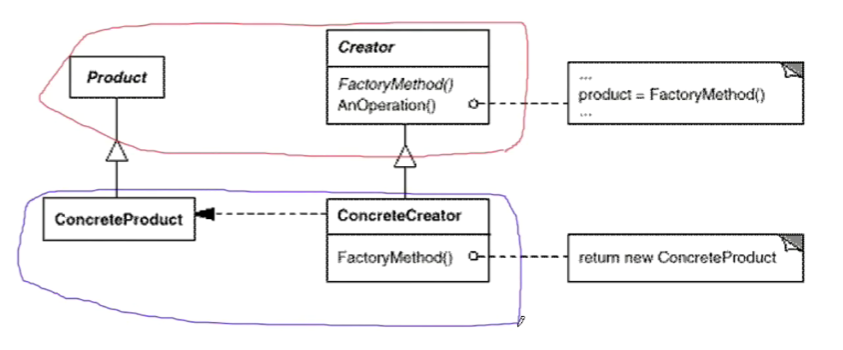

# 【设计模式】对象创建类

作者：wallace-lai <br>
发布：2024-04-02 <br>
更新：2042-02-17 <br>

通过对象创建模式绕开new操作，来避免对象创建过程中所导致的紧耦合（依赖具体类），从而支持对象创建的稳定。它是接口抽象之后的第一步工作。

典型的对象创建类模式有：

（1）简单工厂：Factory Method

（2）抽象工厂：Abstract Factory

（3）原型模式：Prototype

（4）构建器模式：Builder


## 一、简单工厂
### 1.1 动机

在软件系统中，经常面临着创建对象的工作；由于需求的变化，需要创建的对象的具体类型经常变化。

如何应对这种变化？如何绕过常规的对象创建方法（new），提供一种“封装机制”来避免客户程序和这种“具体对象创建工作”的紧耦合？

举个例子。假设我们要考虑一个文件分割器，代码如下所示：

```cpp
// 抽象类
class ISplitter {
public:
    virtual void split() = 0;
    virtual ~ISplitter() {}
};

class BinarySplitter : public ISplitter {
public:
    void split() {}
};

class TextSplitter : public ISplitter {
public:
    void split() {}
};

class ImageSplitter : public ISplitter {
public:
    void split() {}
};

class VideoSplitter : public ISplitter {
public:
    void split() {}
};
```

根据设计原则可知我们应该面向抽象编程，于是我们选择基类指针`ISplitter *splitter`，如下所示。这是一个抽象依赖，但是我们同时发现等号右边却是一个细节依赖，这是无法通过编译的。如何解决这个问题？

```cpp
ISplitter *splitter =       // 抽象依赖
    new BinarySplitter();   // 细节依赖 ?
```

### 1.2 定义

简单工厂：**定义一个用于创建对象的接口，让子类决定实例化哪一个类。工厂方法（简单工厂）使得一个类的实例化延迟到了子类当中**。

简单工厂解决上述问题的答案很简，创建一个工厂基类，每个不同的Splitter继承工厂基类形成一个该类型Splitter对应的具体工厂方法，如下所示：

```cpp
// 工厂基类
class SplitterFactory {
public:
    virtual ISplitter *CreateSplitter() = 0;
    virtual ~SplitterFactory() {}
};

// 具体工厂
class BinarySplitterFactory : public SplitterFactory {
public:
    virtual ISplitter *CreateSplitter() {
        return new BinarySplitter();
    }
};

class TextSplitterFactory : public SplitterFactory {
public:
    virtual ISplitter *CreateSplitter() {
        return new TextSplitter();
    }
};

class ImageSplitterFactory : public SplitterFactory {
public:
    virtual ISplitter *CreateSplitter() {
        return new ImageSplitter();
    }
};

class VideoSplitterFactory : public SplitterFactory {
public:
    virtual ISplitter *CreateSplitter() {
        return new VideoSplitter();
    }
};
```

最后通过多态的方式实现了创建不同类型的Splitter，如下图中的代码所示：

```cpp
class MainForm : public Form
{
    SplitterFactory *factory;   // = new BinarySplitterFactory();
                                // = new TextSplitterFactory();
                                // = new ImageSplitterFactory();
                                // ... 多态

public:
    void Button_Click() {
        ISplitter *splitter = factory->CreateSplitter();
    }
};
```

### 1.3 总结



（1）简单工厂的结构如上图所示，其中红色部分是稳定的，蓝色部分是不稳定的；

- Product就是代码中的ISplitter;

- ConcreteProduct就是代码中的各具体的Splitter，比如BinarySplitter等；

- Creator就是代码中的工厂基类SplitterFactory；

- ConcreteCreator就是代码中的具体工厂，比如BinarySplitterFactory等；

（2）简单工厂模式用于隔离类对象的使用者和具体类型之间的耦合关系。面对一个经常变化的具体类型，紧耦合关系（直接new对象）会导致软件的脆弱；

（3）简单工厂模式通过面向对象的手法，将所要创建的具体对象工作**延迟**到子类，从而实现一种扩展（而非更改）的策略，较好地解决了这种紧耦合关系；

（4）简单工厂模式解决了**单个对象**的需求变化。**缺点在于要求创建方法和参数相同**；

- 因为简单工厂模式中，创建具体对象是通过`factory->CreateSplitter(args)`方法来完成的，这就要求所有不同类别的子类的构造函数入参必须是一样的才能使用简单工厂模式。


## 二、抽象工厂


未完待续...