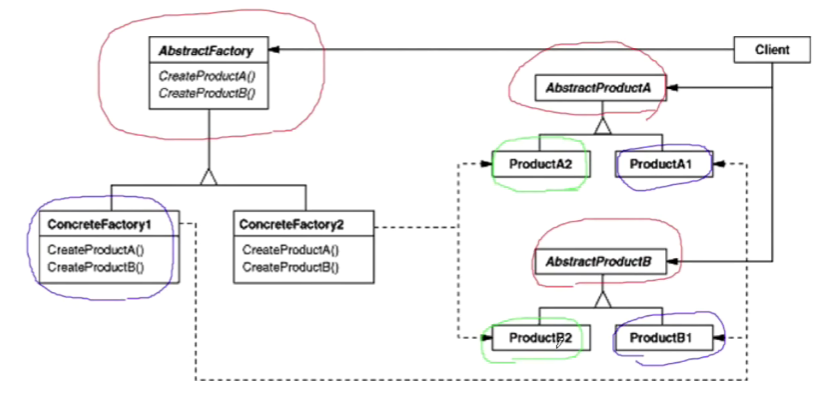

# 【设计模式】对象创建

作者：wallace-lai <br>
发布：2024-04-02 <br>
更新：2024-05-14 <br>

通过对象创建模式绕开new操作，来避免对象创建过程中所导致的紧耦合（依赖具体类），从而支持对象创建的稳定。它是接口抽象之后的第一步工作。

典型的对象创建类模式有：

（1）简单工厂：Factory Method

（2）抽象工厂：Abstract Factory

（3）原型模式：Prototype

（4）构建器模式：Builder


## 一、简单工厂
### 1.1 动机

在软件系统中，经常面临着创建对象的工作；由于需求的变化，需要创建的对象的具体类型经常变化。

如何应对这种变化？如何绕过常规的对象创建方法（new），提供一种“封装机制”来避免客户程序和这种“具体对象创建工作”的紧耦合？

举个例子。假设我们要考虑一个文件分割器，代码如下所示：

```cpp
// 抽象类
class ISplitter {
public:
    virtual void split() = 0;
    virtual ~ISplitter() {}
};

class BinarySplitter : public ISplitter {
public:
    void split() {}
};

class TextSplitter : public ISplitter {
public:
    void split() {}
};

class ImageSplitter : public ISplitter {
public:
    void split() {}
};

class VideoSplitter : public ISplitter {
public:
    void split() {}
};
```

根据设计原则可知我们应该面向抽象编程，于是我们选择基类指针`ISplitter *splitter`，如下所示。这是一个抽象依赖，但是我们同时发现等号右边却是一个细节依赖，这是无法通过编译的。如何解决这个问题？

```cpp
ISplitter *splitter =       // 抽象依赖
    new BinarySplitter();   // 细节依赖 ?
```

### 1.2 定义

简单工厂：**定义一个用于创建对象的接口，让子类决定实例化哪一个类。工厂方法（简单工厂）使得一个类的实例化延迟到了子类当中**。

简单工厂解决上述问题的答案很简，创建一个工厂基类，每个不同的Splitter继承工厂基类形成一个该类型Splitter对应的具体工厂方法，如下所示：

```cpp
// 工厂基类
class SplitterFactory {
public:
    virtual ISplitter *CreateSplitter() = 0;
    virtual ~SplitterFactory() {}
};

// 具体工厂
class BinarySplitterFactory : public SplitterFactory {
public:
    virtual ISplitter *CreateSplitter() {
        return new BinarySplitter();
    }
};

class TextSplitterFactory : public SplitterFactory {
public:
    virtual ISplitter *CreateSplitter() {
        return new TextSplitter();
    }
};

class ImageSplitterFactory : public SplitterFactory {
public:
    virtual ISplitter *CreateSplitter() {
        return new ImageSplitter();
    }
};

class VideoSplitterFactory : public SplitterFactory {
public:
    virtual ISplitter *CreateSplitter() {
        return new VideoSplitter();
    }
};
```

最后通过多态的方式实现了创建不同类型的Splitter，如下图中的代码所示：

```cpp
class MainForm : public Form
{
    SplitterFactory *factory;   // = new BinarySplitterFactory();
                                // = new TextSplitterFactory();
                                // = new ImageSplitterFactory();
                                // ... 多态

public:
    void Button_Click() {
        ISplitter *splitter = factory->CreateSplitter();
    }
};
```

### 1.3 总结


（1）简单工厂的结构如上图所示，其中红色部分是稳定的，蓝色部分是不稳定的；

- Product就是代码中的ISplitter;

- ConcreteProduct就是代码中的各具体的Splitter，比如BinarySplitter等；

- Creator就是代码中的工厂基类SplitterFactory；

- ConcreteCreator就是代码中的具体工厂，比如BinarySplitterFactory等；

（2）简单工厂模式用于隔离类对象的使用者和具体类型之间的耦合关系。面对一个经常变化的具体类型，紧耦合关系（直接new对象）会导致软件的脆弱；

（3）简单工厂模式通过面向对象的手法，将所要创建的具体对象工作**延迟**到子类，从而实现一种扩展（而非更改）的策略，较好地解决了这种紧耦合关系；

（4）简单工厂模式解决了**单个对象**的需求变化。**缺点在于要求创建方法和参数相同**；

- 因为简单工厂模式中，创建具体对象是通过factory->CreateSplitter(args)方式来完成的，这就要求所有不同类别的子类的构造函数入参必须是一样的才能使用简单工厂模式。


## 二、抽象工厂

### 2.1 动机
在软件设计中，经常面临着**一系列相互依赖的对象**的创建工作；同时，由于需求的变化，往往存在更多系列对象的创建工作。

如何应对这种变化？如何绕过常规的对象创建方法（new），提供一种封装机制来避免客户程序和这种多系列具体对象创建工作的紧耦合？

### 2.2 定义
抽象工厂：**提供一个接口，让该接口负责创建一些列相关或者相互依赖的对象，无需指定它们具体的类**。


假设我们有一个基于SqlServer的简单数据访问层代码，如下所示：

```cpp
class EmployeeDAO {
public:
    vector<EmployeeDO> GetEmployees() {
        SqlConnection *conn = new SqlConnection();
        conn->ConnectionString = "...";

        SqlCommand *cmd = new SqlCommand();
        cmd->CommandText = "...";

        SqlDataReader *reader = cmd->ExecuteReader();
        while (reader->Read()) {
            // ...
        }

    }
};
```

这个时候我们发现，EmployeeDAO里面出现了对具体类SqlCommand的依赖，这是不符合面向对象设计原则的。为了改造成面向接口编程的形式，可以做如下改动。

```cpp
// 为了支持变化，新增数据库访问相关基类
class IDBConnection {

};

class IDBCommand {

};

class IDataReader {

};

// 支持SQL Server
class SqlConnection : public IDBConnection {

};

class SqlCommand : public IDBCommand {

};

class SqlDataReader : public IDataReader {

};

// 支持Oracle
class OracleConnection : public IDBConnection {

};

class OracleCommand : public IDBCommand {

};

class OracleDataReader : public IDataReader {

};

// 此时，问题出现，左侧是虚基类指针右侧是具体类
class EmployeeDAO {
public:
    vector<EmployeeDO> GetEmployees() {
        IDBConnection *conn = new SqlConnection();
        conn->ConnectionString = "...";

        IDBCommand *cmd = new SqlCommand();
        cmd->CommandText = "...";

        IDataReader *reader = cmd->ExecuteReader();
        while (reader->Read()) {
            // ...
        }

    }
};
```

这个时候我们又发现有新问题出现，左侧是虚基类指针，但是右侧仍然是具体类。假如我们使用上一节中的简单工厂模式，如下所示：

```cpp
class EmployeeDAO {
    IDBCommandFactory *dbCommandFactory;
    IDBConnectFactory *dbConnectFactory;
    IDBReaderFactory *dbReaderFactory;

public:
    vector<EmployeeDO> GetEmployees() {
        IDBConnection *conn = dbConnectFactory->CreateConnect();
        conn->ConnectionString = "...";

        IDBCommand *cmd = dbCommandFactory->CreateCommand();
        cmd->CommandText = "...";

        IDataReader *reader = dbReaderFactory->CreateReader();
        while (reader->Read()) {
            // ...
        }

    }
};
```

这个时候我们会发现，上述代码仍然存在问题：Command、Connection和Reader之间是有关联性的，我们不能传入sqlServer的Command去搭配Oracle的Connection。怎么解决？这个时候就需要抽象工厂模式了。将有相关性的三个简单工厂放在一个抽象工厂中。如下所示：

```cpp
// 抽象工厂基类
class IDBFactory {
public:
    virtual IDBConnection *CreateConnection() = 0;
    virtual IDBCommand *CreateCommand() = 0;
    virtual IDataReader *CreateDataReader() = 0;
};

// SQL Server的抽象工厂
class SqlServerDBFactory : public IDBFactory {
public:
    virtual IDBConnection *CreateConnection() { /* 实现 */};
    virtual IDBCommand *CreateCommand() { /* 实现 */};
    virtual IDataReader *CreateDataReader() { /* 实现 */};
};

// Oracle的抽象工厂
class OracleDBFactory : public IDBFactory {
public:
    virtual IDBConnection *CreateConnection() { /* 实现 */};
    virtual IDBCommand *CreateCommand() { /* 实现 */};
    virtual IDataReader *CreateDataReader() { /* 实现 */};
};

class EmployeeDAO {
    IDBFactory *factory;
public:
    vector<EmployeeDO> GetEmployees() {
        IDBConnection *conn = factory->CreateConnection();
        conn->ConnectionString = "...";

        IDBCommand *cmd = factory->CreateCommand();
        cmd->CommandText = "...";

        IDataReader *reader = factory->CreateDataReader();
        while (reader->Read()) {
            // ...
        }

    }
};
```

至此，问题被圆满解决！

### 2.3 总结

（1）抽象工厂的结构如下所示



- AbstractFactory相当于是IDBFactory，是稳定的；

- ConcreteFactory1和ConcreteFactory2相当于是SqlServerDBFactory和OracleDBFactory；

- AbstractProductA和AbstractProductB相当于是IDBConnection和IDBCommand等数据库访问中的基类；

- ProductA1和ProductA2则相当于是SqlConnection和SqlCommand；

（2）如果没有应对**多系列对象构建**的变化需求，则没有必要使用Abstract Factory模式，这时候使用简单工厂模式完全可以；

（3）**系列对象**指的是在某一特定系列下的对象之间有相互依赖或作用的关系。不同系列的对象之间不能相互依赖；

（4）Abstract Factory模式主要在于应对**新系列**的需求变动。其缺点在于难以应对**新对象**的需求变动；


## 三、原型模式

### 3.1 动机

在软件系统中，经常面临着**某些结构复杂的对象**的创建工作；由于需求的变化，这些对象经常面临着剧烈的变化，但是它们却拥有比较稳定一致的接口。

如何应对这种变化？如何向**客户程序（使用这些对象的程序）**隔离出这些易变的对象，从而使得**依赖这些易变对象的客户程序**不随着需求改变而改变？

【未完待续】

### 3.2 定义

### 3.3 总结

未完待续...