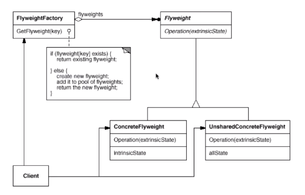

# 【设计模式】对象性能类

作者：wallace-lai <br>
发布：2024-04-02 <br>
更新：2024-04-24 <br>

面向对象很好地解决了**抽象**的问题，但是必不可免地要付出一定的代码。对于通常情况来讲，面向对象的成本大都可以忽略不计。但是某些情况下，面向对象所带来的成本必须谨慎地处理。

典型模式：

（1）单例模式 - Singleton

（2）享元模式 - Flyweight

## 一、单例模式

### 1.1 动机

在软件系统中，经常有这样一些特殊的类，必须保证它们在系统中只存在一个实例，才能保证它们的逻辑正确性、以及良好的效率。

如何绕过常规的构造器，提供一种机制来保证一个类只有一个实例？

注意，保证一个类只有一个实例是类设计者的责任，而不是使用者的责任。

### 1.2 定义

单例模式：

针对单例模式，先写出基本版本代码如下：

```cpp
class Singleton {
private:
    Singleton();
    Singleton(const Singleton &other);

public:
    static Singleton *GetInstance();
    static Singleton *mInstance;
};

Singleton *Singleton::mInstance = nullptr;

// 非线程安全版本
Singleton *Singleton::GetInstance()
{
    if (mInstance == nullptr) {
        mInstance = new Singleton();
    }

    return mInstance;
}
```

然而基本版本不是线程安全的，存在内存泄露和多次创建的可能，选择加互斥锁解决问题：

```cpp
// 线程安全版本，但锁的代码太高
Singleton *Singleton::GetInstance()
{
    Lock lock;
    if (mInstance == nullptr) {
        mInstance = new Singleton();
    }
    return mInstance();
}
```

但是改进版本对于大量读的场景下，因为是互斥锁的原因导致性能很差劲，使用双检查锁改进：

```cpp
Singleton *Singleton::GetInstance()
{
    if (mInstance == nullptr) {
        Lock lock;
        if (mInstance == nullptr) {
            mInstance = new Singleton();
        }
    }

    return mInstance;
}
```

然而，上述双检查锁在**内存reorder**的情况下会失效！最终正确的写法如下：

```cpp
std::atomic<Singleton*> Singleton::mInstance;
std::mutex Singleton::mMutex;

Singleton *Singleton::GetInstance()
{
    Singleton *tmp = mInstance.load(std::memory_order_relaxed);
    std::atomic_thread_fence(std::memory_order_acquire);
    if (tmp == nullptr) {
        std::lock_guard<std::mutex> lock(mMutex);
        tmp = mInstance.load(std::memory_order_relaxed);
        if (tmp == nullptr) {
            tmp = new Singleton();
            std::atomic_thread_fence(std::memory_order_relaxed);
            mInstance.store(tmp, std::memory_order_relaxed);
        }
    }

    return tmp;
}
```

### 1.3 总结

（1）Singleton模式中的实例构造器可以设置为protected以允许子类派生；

（2）Singleton模式一般不要支持拷贝构造函数和Clone接口，因为这有可能导致多个对象实例，与Singleton模式的初衷违背；

（3）如何实现多线程环境下安全的Singleton？注意对双检查锁的正确实现；

## 二、享元模式

### 2.1 动机

在软件系统中采用纯粹对象方案的问题在于大量细粒度的对象会很快充斥在系统中，从而带来很高的运行时代价——主要指内存方面的代价。

如何在避免大量细粒度对象问题的同时，让外部客户端程序仍然能够透明地使用面向对象的方式来进行操作？

### 2.2 定义
享元模式：**运用共享技术有效地支持大量细粒度的对象**。



享元模式的结构如上图所示，其中：

（1）FlyweightFactory是享元工厂，用户通过key去获取对应的享元。若key对应的享元不存在则创建之并存入享元池中；否则直接返回key对应的享元。

下面给出一个享元模式的实例代码。

```cpp
class Font {
private:
    // unique object key
    string key;

    // ...
public:
    Font(const string &key) {
        // ...
    }
};

class FontFactory {
private:
    map<string, Font*> fontPool;

public:
    Font *GetFont(const string &key) {
        map<string, Font*>::iterator iter = fontPool.find(key);
        if (iter == fontPool.end()) {
            Font *font = new Font(key);
            fontPool[key] = font;
        }

        return fontPool[key];
    }
};
```

### 2.3 总结
（1）面向对象很好地解决了抽象性的问题，但是作为一个运行在机器中的程序实体，我们需要考虑对象的代价问题。Flyweight主要解决面向对象的代价问题，一般不触及面向对象的抽象性问题；

（2）Flyweight采用对象共享的做法来降低系统中对象的个数，从而降低细粒度对象给系统带来的内存压力。在具体实现方面，要注意对象状态的处理；

（3）对象的数量太大从而导致对象内存开销加大——什么样的数量才算大？这需要我们仔细地根据具体应用情况进行评估，而不能凭空臆断；
