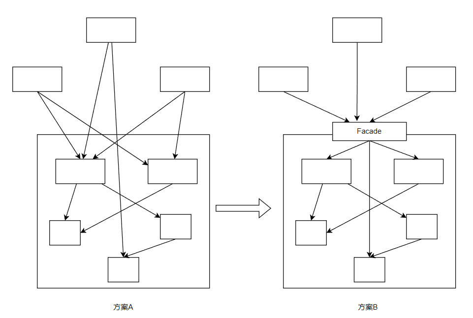
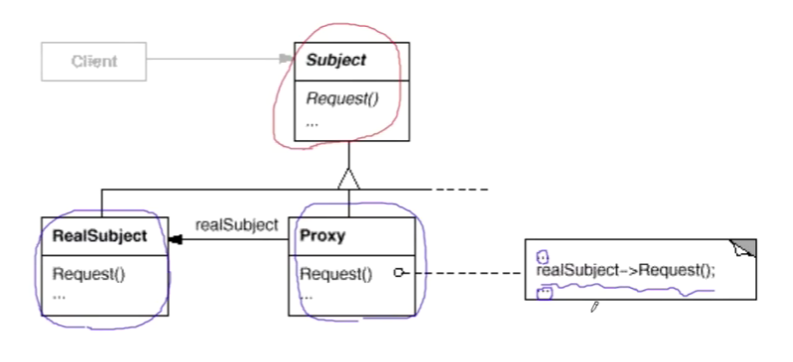
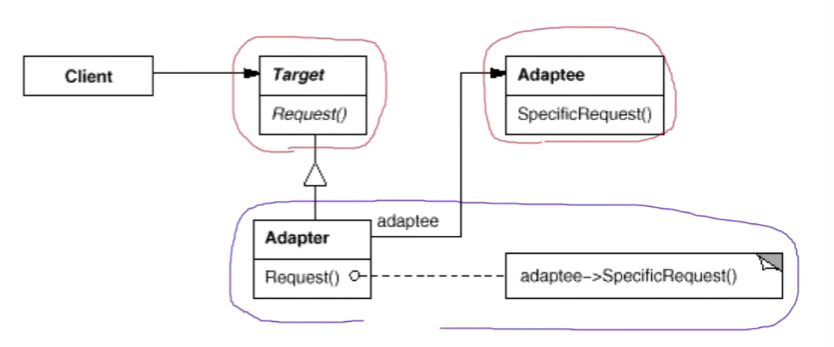
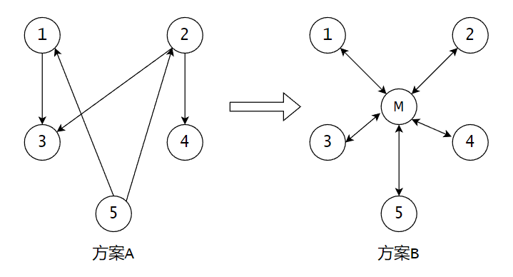

# 【设计模式】接口隔离

作者：wallace-lai <br>
发布：2024-04-02 <br>
更新：2024-04-27 <br>

在组件构建过程中，某些接口之间直接的依赖常常会带来很多问题、甚至根本无法实现。采用添加一层**间接**（稳定）接口，来隔离本来互相紧密关联的接口是一种常见的解决方案。

典型的接口隔离模式有：

（1）Facade - 门面模式

（2）Proxy - 代理模式

（3）Adapter - 适配器

（4）Mediator - 中介者

## 一、门面模式

### 1.1 动机

假设有三个外部组件要和子系统内部组件交互，有以下两种方案：

（1）方案A中外部组件直接和系统内部的组件交互；

（2）方案B中子系统新增Facade间接层，外部组件通过Facade层与子系统内部组件交互；



上述A方案的问题在于组件的客户和组件中各种复杂的子系统有了过多的耦合，随着外部客户程序和各子系统的演化，这种过多的耦合面临很多变化的挑战。

如何简化外部客户程序和系统间的交互接口？如何将外部客户程序的演化和内部子系统的变化之间的依赖解耦？

### 1.2 定义
门面模式：**为子系统中的一组接口提供一个一致（稳定）的界面，门面模式定义了一个高层接口，这个接口使得这一子系统更加容易使用（复用）**。

### 1.3 总结
（1）从客户程序的角度来看，门面模式简化了整个组件系统的接口，对于组件内部与外部客户程序来说，达到了一种解耦的效果——内部子系统的任何变化不会影响到门面接口的变化。

（2）门面模式更注重从架构的层次去看整个系统，而不是单个类的层次。门面模式很多时候更是一种架构设计模式。

（3）门面模式并非一个集装箱，可以任意地放进如何多个对象。门面模式中的组件的内容应该是相互耦合关系比较大的一系列组件，而不是一个简单的功能集合。

## 二、代理模式
### 2.1 动机
在面向对象系统中，有些对象由于某种原因（比如对象创建的开销很大，或者某些操作需要安全控制，或者需要进程外的访问等），直接访问会给使用者、或者系统结构带来很多麻烦。

如何在不失去透明操作对象的同时来管理和控制这些对象特有的复杂性？增加一层间接层是软件开发中常见的解决方式。

### 2.2 定义

代理模式：**为其他对象提供一种代理以控制（隔离，使用接口）对这个对象的访问**。



代理模式的结构看起来很简单，但实际实现起来可以很复杂。

（1）Subject为接口

（2）RealSubject为实际操作的对象

（3）Proxy提供了接口实现，客户端Client通过Proxy间接与实际操作对象进行交互

给出一个代理模式示意性的例子，如下所示。

```cpp
class ISubject {
public:
    virtual void process() = 0;
};

// proxy的设计
class SubjectProxy : public ISubject {
public:
    virtual void process() {
        // 对RealSubject的间接访问
        // ...
    }
};

class ClientApp {
    ISubject *subject;

public:
    ClientApp() {
        subject = new SubjectProxy();
    }

    void DoTask() {
        // ...
        subject->process();
        // ...
    }
};
```

### 2.3 总结

（1）增加一层间接层是软件系统中对许多复杂问题的一种常见解决方法。在面向对象系统中，直接使用某些对象会带来很多问题，作为间接层的代理模式便是解决这一问题的常用手段。【在分布式系统中，代理模式很常见】

（2）具体代理模式的实现方法、实现粒度都相差很大，有些可能对单个对象做细粒度的控制，比如copy-on-write技术，有些可能对组件模块提供抽象代理层，在架构层次对对象做代理。

（3）代理模式并不一定要求保持接口完整的一致性，只要能够实现间接控制，有时候损及一些透明性是可以接受的。


## 三、适配器

### 3.1 动机

在软件系统中，由于应用环境的变化，常常需要将一些现存的对象放在新的环境中应用，但是新环境要求的接口是这些现存对象所不满足的。

如何应对这种迁移的变化？如何既能利用现有对象的良好实现，同时又能满足新的应用环境所要求的接口？


### 3.2 定义

适配器模式：**将一个类的接口转换成客户希望的另一个接口。适配器模式使得原本由于接口不兼容而不能一起工作的那些类可以一起工作**。




如上图所示为适配器模式的结构图，其中：

（1）Target是我们希望得到的接口

（2）Adapter通过继承Target接口的同时组合了一个将要被转换的对象Adaptee，在Adapter中实现了Target中的接口

具体代码如下：

```cpp
// 目标接口（新接口）
class ITarget {
public:
    virtual void Process() = 0;
    virtual void ~Process() {}
};

// 遗留接口（老接口）
class IAdaptee {
public:
    virtual void foo(int data) = 0;
    virtual int bar() = 0;
};

// 遗留类
class OldClass : public IAdaptee {
    // ...
};

// 适配器
class Adapter : public ITarget {
protected:
    IAdaptee *pAdaptee;

public:
    virtual void Process() {
        int data = pAdaptee->bar();
        pAdaptee->foo(data);
    }
};

int main()
{
    IAdaptee *p = new OldClass();

    ITarget *pTarget = new Adapter(p);
    pTarget->Process();
}
```

### 3.3 总结

（1）适配器模式主要应用于希望复用一些现存的类，但是接口又与复用环境不一致的情况，在遗留代码复用，类库迁移等方面非常有用。

（2）GoF 23定义了两种适配器模式的实现结构：对象适配器和类适配器。但类适配器采用多继承的实现范式，一般不推荐使用。对象适配器采用对象组合的方式，更符合松耦合精神。

（3）适配器模式可以非常灵活，不必拘泥于GoF 23中定义的两种结构。例如，完全可以将适配器模式中的现存对象作为新的接口方法参数，来达到适配的目的。


## 四、中介者

### 4.1 动机
在软件构建过程中，经常会出现多个对象相互关联交互的情况，对象之间常常会维持一种复杂的引用关系，如果遇到一些需求的更改，这种直接的引用关系将面临不断的变化。

在这种情况下，我们可使用一个中介对象来管理对象间的关联关系，避免相互交互的对象之间的紧耦合引用关系，从而更好地抵御变化。


### 4.2 定义
中介者模式：**用一个中介对象来封装（封装变化）一些列的对象交互。中介者使用各个对象不需要显式地相互引用（编译时依赖 -> 运行时依赖），从而使其耦合松散（管理变化），而且可以独立地改变它们之间的交互**。

如下图所示，一系统中有多个组件且彼此之间存在着较为复杂的交互关系。假如不采用任何措施，如方案A所示，那么各个组件之间由于互相引用，很难做到彼此相互独立。此时可采用中介者模式，新增中介者M，各个组件之间通过中介者M进行交互，彼此之间相互独立。



### 4.3 总结

（1）中介者模式将多个对象间复杂的关联关系解耦，将多个对象间的控制逻辑进行集中管理，变多个对象相互关联为多个对象和一个中介者关联，简化了系统维护，抵御了可能的变化。

（2）随着控制逻辑的复杂化，中介者模式具体对象的实现可能相当复杂。这时候可以对中介者对象进行分解处理。

（3）Facade模式是解耦系统间（单向）的对象关联关系；中介者模式是解耦系统内各个对象之间（双向）的关联联系。

