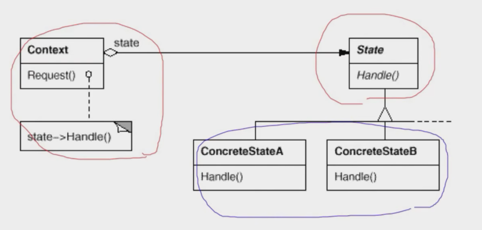
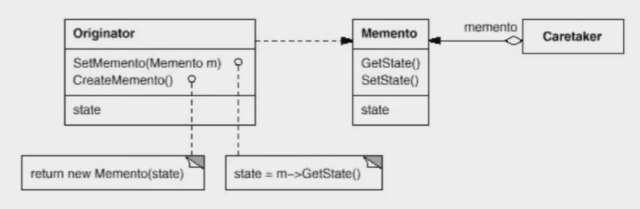

# 【设计模式】状态变化

作者：wallace-lai <br>
发布：2024-04-02 <br>
更新：2024-05-10 <br>

在组件构建过程中，某些对象的状态经常面临变化，如何对这些变化进行有效管理？同时又维持高层模块的稳定？状态变化类模式为这一问题提供了一种解决方案。

典型的状态变化类模式：

（1）State - 状态模式

（2）Memento - 备忘录模式

## 一、状态模式
### 1.1 动机
在软件构建过程中，某些对象的状态如果发生改变，其行为也会随之而发生变化。比如文档处于只读状态，其支持的行为和读写状态支持的行为就可能完全不同。

如何在运行时根据对象的状态来透明地更改对象行为？而不会为对象操作和状态转化之间引入紧耦合？

### 1.2 定义
状态模式：**允许一个对象在其内部状态改变时改变它的行为。从而使得对象看起来似乎修改了其行为**。

假如有一个网络处理程序，需要根据网络状态的不同有不同的操作，那么它可能会写成如下的形式。

```cpp
enum NetworkState {
    Network_Open,
    Network_Close,
    Network_Connect,
};

class NetworkProcessor {
    NetworkState state;
public:
    void Op1() {
        if (state == Network_Open) {
            // ***
            state = Network_Close;
        } else if (state == Network_Close) {
            // ...
            state = Network_Connect;
        } else if (state == Network_Connect) {
            // $$$
            state = Network_Open;
        }
    }

    void Op2() {
        if (state == Network_Open) {
            // ******
            state = Network_Connect;
        } else if (state == Network_Close) {
            // ......
            state = Network_Open;
        } else if (state == Network_Connect) {
            // $$$$$$
            state = Network_Close;
        }
    }

    void Op3() {
        // ...
    }
};
```

但是很显然，上述代码是违背开闭原则的。因为如果新增一个NetworkState，那么将会造成大量的代码改动。不妨先改动成以下的形式。

```cpp
class NetworkState {
public:
    NetworkState *pNext;
    virtual void Op1() = 0;
    virtual void Op2() = 0;
    virtual void Op3() = 0;

    virtual ~NetworkState() {}
};

class OpenState : public NetworkState {
    static NetworkState *mInst;
public:
    static NetworkState *GetInstance() {
        if (mInst == nullptr) {
            mInst = new OpenState();
        }
        return mInst;
    }

    void Op1() override {
        // ...
        pNext = CloseState::GetInstance();
    }

    void Op2() override {
        // ***
        pNext = ConnectState::GetInstance();
    }

    void Op3() override {
        // ---
        pNext = OpenState::GetInstance();
    }
};

class CloseState : public NetworkState {
    static NetworkState *mInst;
public:
    static NetworkState *GetInstance() {
        if (mInst == nullptr) {
            mInst = new OpenState();
        }
        return mInst;
    }

    void Op1() override {
        // ...
        pNext = /* change state */;
    }

    void Op2() override {
        // ***
        pNext = /* change state */;
    }

    void Op3() override {
        // ---
        pNext = /* change state */;
    }
};

class ConnectState : public NetworkState {
    static NetworkState *mInst;
public:
    static NetworkState *GetInstance() {
        if (mInst == nullptr) {
            mInst = new OpenState();
        }
        return mInst;
    }

    void Op1() override {
        // ...
        pNext = /* change state */;
    }

    void Op2() override {
        // ***
        pNext = /* change state */;
    }

    void Op3() override {
        // ---
        pNext = /* change state */;
    }
};

class NetworkProcessor {
    NetworkState *pState;
public:
    NetworkProcessor(NetworkState *pState) {
        this->pState = pState;
    }

    void Operation1() {
        // ...
        pState->Op1();
        pState = pState->pNext;
    }

    void Operation2() {
        // ...
        pState->Op2();
        pState = pState->pNext;
    }

    void Operation3() {
        // ...
        pState->Op3();
        pState = pState->pNext;
    }
};
```

此时，代码就符合了开闭原则。


状态模式的结构图如下所示。



### 1.3 总结
（1）状态模式将所有与一个特定状态相关的行为都放入一个状态的子类对象中，在对象状态切换时，切换相应的对象；但同时维持状态的接口，这样实现了具体操作与状态转换之间的解耦。

（2）为不同状态引入不同的对象使得状态转换变得更加明确，而且可以保证不会出现状态不一致的情况，因为转换时原子性的，即要么彻底转换过来，要么不转换。

（3）如果状态对象没有实例变量，那么各个上下文可以共享同一个状态对象，从而节省对象开销。

## 二、备忘录模式
### 2.1 动机
在软件构建过程中，某些对象的状态在转换过程中，可能由于某种需要，要求程序能够回溯到对象之前处于某个点时的状态。如果使用一些共有接口来让其他对象得到对象的状态，变会暴露对象的细节实现。

如何实现对象状态的良好保存与恢复？但同时又不会因此而破坏对象本身的封装性。

### 2.2 定义
备忘录模式：**在不破坏封装性的前提下，捕获一个对象的内部状态，并在该对象之外保存这个状态。这样以后就可以将该对象恢复到原先保存的状态**。

下面给出一个示意性的案例。

```cpp
class Memento {
    string state;

public:
    Memento(const string &s) : state(s) {}
    string GetState() const { return state; }
    void SetState(const string &s) { state = s; }
};

class Originator {
    string state;
public:
    Originator() {}

    // 不破坏Originator的封装性
    Memento CreateMomento() {
        Memento m(state);
        return m;
    }

    void SetMomento(const Memento &m) { state = m.GetState(); }
};

int main()
{
    Originator originator;

    // 存储到备忘录中，捕获对象内部状态
    Memento mem = originator.CreateMomento();

    // 改变originator的状态
    // ...

    // 从备忘录中恢复
    originator.SetMomento(mem);
}
```

备忘录模式的结构如下图所示，其中：



（1）Originator是需要被捕获内部状态的对象

- CreateMemento ：创建一个内部状态的快照抛给外部

- SetMemento ：根据快照恢复内部状态

（2）Memento ：备忘录对象

（3）Caretaker ：使用备忘录模式的对象

### 2.3 总结
（1）备忘录（Memento）存储原发器（Originator）对象的内部状态，在需要时恢复原发器的状态。

（2）备忘录模式的核心是信息隐藏，即Originator需要向外界隐藏信息，保持其封装性。但同时又需要将状态保持到外界。

（3）由于现代语言运行时（如C#、Java等）都具有相当的对象序列化支持，因此往往采用效率较高、又较容易正确实现的序列化方案来实现备忘录模式。
