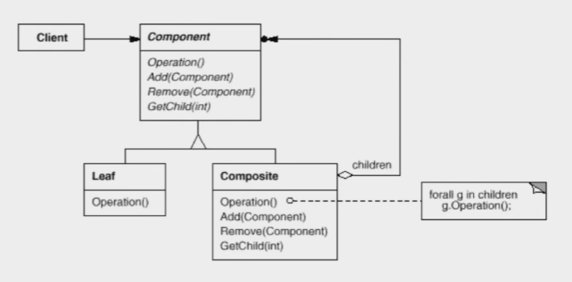
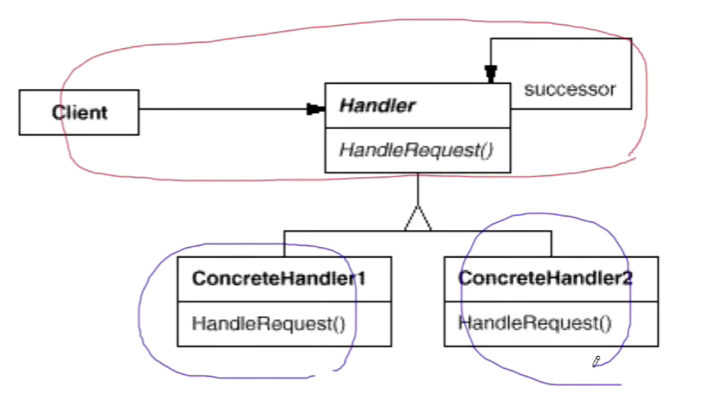

# 【设计模式】数据结构

作者：wallace-lai <br>
发布：2024-04-02 <br>
更新：2024-05-07 <br>

常常有一些组件在内部具有特定的数据结构，如果让客户程序依赖这些特定的数据结构，将极大地破坏组件的复用。这时候，将这些特定的数据结构封装在内部，在外部提供统一的接口，来实现与特定数据结构无关的访问，是一种行之有效的解决方案。

典型模式有：

（1）Composite - 组合模式

（2）Iterator - 迭代器模式

（3）Chain of Resposibility - 责任链模式

## 一、组合模式

### 1.1 动机
在软件某些情况下，客户代码过多地依赖于对象容器复杂的内部实现结构，对象容器内部实现结构（而非抽象接口）的变化将引起客户代码的频繁变化，带来了代码的维护性、扩展性等弊端。

如何将客户代码与复杂的对象容器结构解耦？让对象容器自己来实现自身的复杂结构，从而使得客户代码就像处理简单对象一样来处理复杂的对象容器？

### 1.2 定义
组合模式：**将对象组合成树形结构以表示“部分——整体”的层次结构。组合模式使得用户对单个对象和组合对象的使用具有一致性（稳定）**。

下面给出一个案例：
```cpp
class Component {
public:
    virtual void process() = 0;
    virtual ~Component() {}
};

class Composite : public Component {
    string name;
    list<Component*> elements;
public:
    Composite(const string &s) : name(s) {}

    void add(Component *ele) {
        elements.push_back(ele);
    }

    void remove(Component *ele) {
        elements.remove(ele);
    }

    void process() {
        // 1. process current node

        // 2. process leaf nodes
        for (auto &ele : elements) {
            ele->process();
        }
    }
};

class Leaf : public Component {
    string name;
public:
    Leaf(string s) : name(s) {}

    void process() {
        // process current node
    }
};

void Invoke(Component &c) {
    // ...
    c.process();
    // ...
}

int main()
{
    Composite root("root");
    Composite treeNode1("treeNode1");
    Composite treeNode2("treeNode2");
    Composite treeNode3("treeNode3");
    Composite treeNode4("treeNode4");

    Leaf leaf1("leaf1");
    Leaf leaf2("leaf2");

    root.add(&treeNode1);
    treeNode1.add(&treeNode2);
    treeNode2.add(&leaf1);

    root.add(&treeNode3);
    treeNode3.add(&treeNode4);
    treeNode4.add(&leaf2);

    Invoke(root);
}
```

仔细体会案例中是如何处理才让对单个对象（Leaf）和组合对象（Composite）的使用具有一致性的。

组合模式的结构图如下所示：



组合模式有个非常尴尬的地方就是，父类Component中有Add和Remove方法，但是其子类Leaf显然是不应该有这两方法的。但如果将Add和Remove放在Composite类中，那在处理Component类型的指针时你就得判断其指向到底是Leaf还是Composite了。这块没有更好的解决办法，算是组合模式不完美的地方了。


### 1.3 总结
（1）组合模式使用树形结构来实现普遍存在的对象容器，从而将一对多的关系转化为一对一的关系，使得客户代码可以一致地（复用）处理对象和对象容器（不论是对象还是对象容器，客户代码只需要直接调用process即可）。

（2）将客户代码与复杂的对象容器结构解耦是组合模式的核心思想，解耦之后，客户代码将与纯粹的抽象接口——而非对象容器的内部实现结构——发生依赖，从而更能应对变化。

（3）组合模式在具体实现中，可以让父对象中的子对象反向追溯；如果父对象有频繁的遍历需求，可以使用缓存技巧来改善效率。

## 二、迭代器模式

### 2.1 动机
在软件构建过程中，集合对象内部结构常常变化各异。但对于这些集合对象，我们希望在不暴露其内部结构的同时，可以让外部客户代码透明地访问其中包含的元素；同时这种透明遍历也为同一种算法在多种集合对象上进行操作提供了可能。

使用面向对象技术将这种遍历机制抽象为迭代器对象为应对变化中的集合对象提供了一种优雅的方式。


### 2.2 定义
迭代器模式：**提供一种方法顺序访问一个聚合对象中的各个元素，而又不暴露（稳定）该对象的内部表示**。

关于迭代器最好案例是STL里的容器。STL发展到今天（2024年）已经让迭代器模式显得有些过时了，实际上STL中各容器的迭代器也不是使用面向对象的方式实现的，而是使用模板（编译时多态）来实现的。因为面向对象中的虚函数（运行时多态）的使用是有性能成本的。

### 2.3 总结

（1）迭代抽象：访问一个聚合对象的内容而无需暴露它的内部表示。

（2）迭代多态：为遍历不同的集合结构提供一个统一的接口，从而支持同样的算法在不同的集合结构上进行操作。

（3）迭代器的健壮性考虑：遍历的同时更改迭代器所在的集合结构，会导致问题

## 三、责任链模式
### 3.1 动机
在软件构建过程中，一个请求可能被多个对象处理，但是每个请求在运行时只能有一个接受者，如果显式指定，将必不可少地带来请求发送者与接受者的紧耦合。

如何使请求的发送者不需要指定具体的接受者？让请求的接受者自己在运行时决定来处理请求，从而使两者解耦。

### 3.2 定义
责任链模式：**使多个对象都有机会处理请求，从而避免请求的发送者和接收者之间的耦合关系。将这些对象连成一条链，并沿着这条链传递请求，直到有一个对象处理它为止**。

下面给出一个责任链模式的案例，不难看出代码的用意。

```cpp
enum class RequestType {
    REQ_HANDLER1,
    REQ_HANDLER2,
    REQ_HANDLER3,
};

class Request {
    string desc;
    RequestType type;
public:
    Request(const string &desc, RequestType type) :
        desc(desc), type(type) {}

    RequestType GetRequestType() const { return type; }

    const string &GetDesc() const { return desc; }
};

class ChainHandler {
    ChainHandler *next;

    void SendRequestToNextHandler(const Request &req) {
        if (next != nullptr) {
            next->handle(req);
        }
    }

protected:
    virtual bool CanHandleRequest(const Request &req) = 0;

    virtual void ProcessRequest(const Request &req) = 0;

public:
    ChainHandler() { next = nullptr; }

    void SetNextChain(ChainHandler *next) { next = next; }

    void handle(const Request &req) {
        if (CanHandleRequest(req)) {
            ProcessRequest(req);
        } else {
            SendRequestToNextHandler(req);
        }
    }
};

class Handler1 : public ChainHandler {
protected:
    bool CanHandleRequest(const Request &req) override {
        return req.GetRequestType() == RequestType::REQ_HANDLER1;
    }

    void ProcessRequest(const Request &req) override {
        cout << "Handler1 is handle request : " << req.GetDesc() << endl;
    }
};

class Handler2 : public ChainHandler {
protected:
    bool CanHandleRequest(const Request &req) override {
        return req.GetRequestType() == RequestType::REQ_HANDLER2;
    }

    void ProcessRequest(const Request &req) override {
        cout << "Handler2 is handle request : " << req.GetDesc() << endl;
    }
};

class Handler3 : public ChainHandler {
protected:
    bool CanHandleRequest(const Request &req) override {
        return req.GetRequestType() == RequestType::REQ_HANDLER3;
    }

    void ProcessRequest(const Request &req) override {
        cout << "Handler3 is handle request : " << req.GetDesc() << endl;
    }
};

int main()
{
    Handler1 h1;
    Handler2 h2;
    Handler3 h3;

    h1.SetNextChain(&h2);
    h2.SetNextChain(&h3);

    Request req("Process task ...", RequestType::REQ_HANDLER3);
    h1.handle(req);

    return 0;
}
```

责任链模式的结构图如下所示：



### 3.3 总结
（1）责任链模式的应用场合在于一个请求可能有多个接受者，但是最后真正的接受者只有一个，这时候请求发送者与接受者的耦合可能无法抵御变化，职责链的目的就是将二者解耦，从而更好地应对变化。

（2）应用了责任链模式后，对象的职责分派将更具灵活性。我们可以在运行时动态添加、修改请求处理的处理职责。

（3）如果请求传递到责任链的末尾仍得不到处理，应该有一个合理的缺省机制。这也是每一个接受对象的责任，而不是发出请求的对象的责任。
