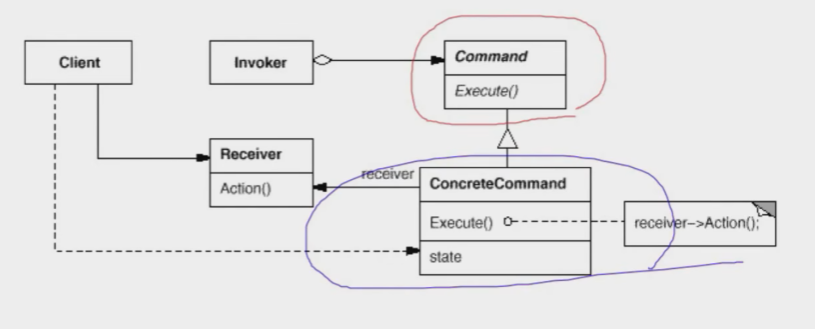
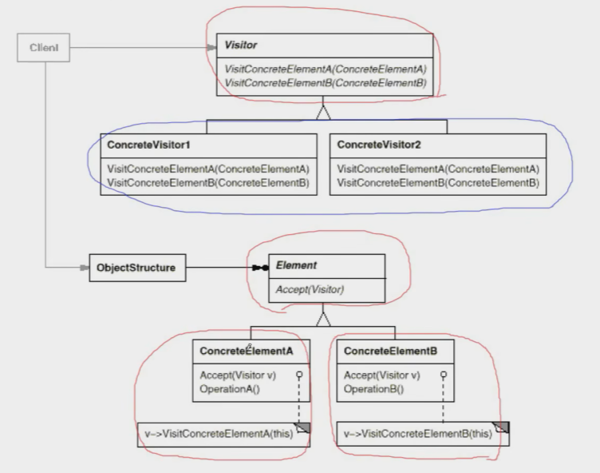

# 【设计模式】行为变化

作者：wallace-lai <br>
发布：2024-04-02 <br>
更新：2024-04-28 <br>

在组件的构建过程中，组件行为的变化经常导致组件本身剧烈的变化。行为变化模式将组件的行为和组件本身进行解耦，从而支持组件行为的变化，实现两者之间的松耦合。

典型的行为变化模式有：

（1）Command - 命令模式

（2）Visitor - 访问器模式

## 一、命令模式
### 1.1 动机
在软件构建过程中，行为请求者和行为实现者通常呈现一种紧耦合。但在某些场合，比如需要对行为进行记录、撤销、重做、事务等处理，这种无法抵御变化的紧耦合是不合适的。

在这种情况下，如何将行为请求者与行为实现者解耦？将一组行为抽象为对象，可以实现二者之间的松耦合。

### 1.2 定义
命令模式：**将一个请求（行为）封装成一个对象，从而使你可用不同的请求对客户进行参数化；对请求排队或记录请求日志，以及支持可撤销的操作**。

```cpp
// 行为对象化为Command对象
class Command {
public:
    virtual void execute() = 0;
};

class CCommand1 : public Command {
    string args;
public:
    CCommand1(const string &args) : args(args) {}

    void execute() override
    {
        cout << "#1 process ..." << args << endl;
    }
};

class CCommand2 : public Command {
    string args;
public:
    CCommand2(const string &args) : args(args) {}

    void execute() override
    {
        cout << "#2 process ..." << args << endl;
    }
};

// 利用组合模式创建复合Command对象，支持命令组合
class MacroCommand : public Command {
    vector<Command *> cmds;
public:
    void addCmd(Command *c) { cmds.push_back(c); }
    void execute() override
    {
        for (auto &cmd : cmds) {
            cmd->execute();
        }
    }
};

int main()
{
    CCommand1 cmd1("Arg 1");
    CCommand2 cmd2("Arg 2");

    MacroCommand macro;
    macro.addCmd(&cmd1);
    macro.addCmd(&cmd2);

    macro.execute();
}
```

命令模式的结构如下图所示：



（1）Command：行为对象化基类

（2）ConcreteCommand：具体的行为对应的对象


### 1.3 总结
（1）命令模式的根本目的在于将行为请求者与行为实现者解耦，在面向对象语言中，常见的实现手段是将行为抽象为对象。

（2）实现命令模式接口的具体命令对象有时候根据需要可能会保存一些额外的状态信息。通过组合模式，可以将多个命令封装为一个复合命令。

（3）命令模式与C++中的函数对象有些类似。但两者定义行为接口的规范有所区别：命令模式以面向对象中的“接口-实现”来定义行为接口规范，更严格，但有性能损失；C++函数对象以函数签名来定义行为接口规范，更灵活，性能更高。


## 二、访问器模式
### 2.1 动机
在软件构建过程中，由于需求的改变，某些类层次结构中常常需要增加新的行为（方法），如果直接在基类中这样的更改，将会给子类带来很繁重的变更负担，甚至破坏原有的设计。

如何在不更改类层次结构的前提下，在运行时根据需要透明地为类层次结构上的各个类动态地添加新的操作，从而避免上述问题？

### 2.2 定义
访问器模式：**表示一个作用于某对象结构中的各元素的操作。使得可以在不改变（稳定）各元素的类的前提下定义（扩展）作用于这些元素的新操作（变化）**。

假设我们有一个基类和两个子类如下所示：

```cpp
class Element {
public:
    virtual void Func1() = 0;
    virtual ~Element() {}
};

class ElementA : public Element {
public:
    void Func1() override {
        // ...
    }
};

class ElementB : public Element {
public:
    void Func1() override {
        // ***
    }
};
```

随着业务的发展，我们需要给基类增加功能，需要新增Func2，那么你所有的子类得跟着一起新增。这违背了开闭原则。

```cpp
class Element {
public:
    virtual void Func1() = 0;
    virtual void Func2() = 0;       // 新增
    virtual ~Element() {}
};

class ElementA : public Element {
public:
    void Func1() override {
        // ...
    }

    // 新增
    void Func2() override {
        // ...
    }
};

class ElementB : public Element {
public:
    void Func1() override {
        // ***
    }

    // 新增
    void Func2() override {
        // ***
    }
};
```

可以使用访问器模式提前做好设计，如下所示：
```cpp
class Visitor;

class Element {
public:
    virtual void accept(Visitor &vis) = 0;
    virtual ~Element() {}
};

class ElementA : public Element {
public:
    void accept(Visitor &vis) override {
        vis.visitElementA(*this);
    }
};

class ElementB : public Element {
public:
    void accept(Visitor &vis) override {
        vis.visitElementB(*this);
    }
};

class Visitor {
public:
    virtual void visitElementA(ElementA &ele) = 0;
    virtual void visitElementB(ElementB &ele) = 0;
    virtual ~Visitor() {}
};
```

上述的设计是稳定的，假如我们需要添加处理方式，可以这样做。

```cpp
class Visitor1 : public Visitor {
public:
    void visitElementA(ElementA &ele) override {
        // ...
    }

    void visitElementB(ElementB &ele) override {
        // ...
    }
};

class Visitor2 : public Visitor {
public:
    void visitElementA(ElementA &ele) override {
        // ...
    }

    void visitElementB(ElementB &ele) override {
        // ...
    }
};

int main()
{
    Visitor2 vis;
    ElementB ele;
    ele.accept(vis);
}
```

<p style="color:red;">注：没看懂它好在哪里...假如要新增Element的子类，Visitor岂不是也变得不稳定了？</p>

访问器模式的结构图如下所示，访问器模式成立的前提是Elment和Visitor是稳定的（这就回答了上面的问题），这个是访问器模式的缺点。Element有几个子类，Visitor中就得有多少个方法，这两者稳定后的蓝色部分是可变（扩展）部分。




### 2.3 总结
（1）访问器模式通过所谓的双重分发（double dispatch）来实现在不更改Element类层次结构的前提下，在运行时透明地为类层次结构上的各个类动态添加新的操作（支持变化）。

（2）所谓双重分发即访问器模式中间包括了两个多态分发（注意其中的多态机制）：第一个为accept方法的多态辨析；第二个为visitElementX方法的多态辨析。

（3）Visitor模式的最大缺点在于扩展类层次结构（增添新的Element子类），会导致Visitor类的改变。因此Visitor模式适用于Element类层次结构稳定，而其中的操作却经常面临频繁改动。
