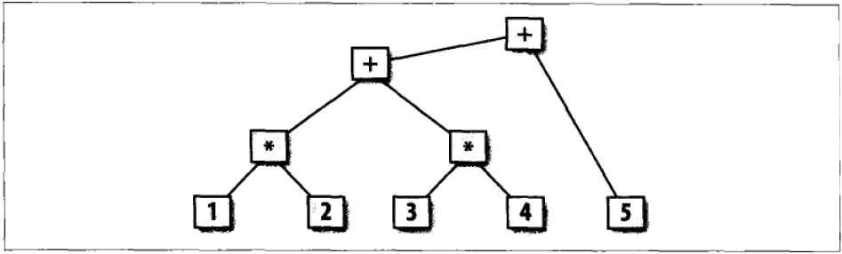

# 【flex与bison学习笔记】第一章

作者：wallace-lai <br/>
发布：2024-01-23 <br/>
更新：2024-01-23 <br/>

第一章主要是让人对flex和bison有一个大概的印象。学习笔记的主要内容可以总结成以下的几个问题

- flex和bison是什么？
- flex程序的常见形式是怎样的？
- bison程序的常见形式是怎样的？
- flex和bison如何一起配合使用？

## 1. flex和bison是什么？
flex和bison是用来**生成程序的工具**，它们生成的程序能够处理结构化的输入。具体而言，flex一般用来生成词法分析器程序，bison一般用来生成语法分析程序。

注：词法分析和语法分析均为编译器前端处理的步骤之一，其具体含义见编译原理相关资料，这里不赘述。不难理解，flex和bison工具最早就是为了方便实现代码编译而设计的。


## 2. flex程序的常见形式是怎样的？
词法分析所做的就是在输入内容中寻找符合特定模式的字符串。比如C程序中，变量名称是以字母或者下划线开头，后面跟着零个或者多个字母、数字、下划线构成的一个字符串。以字母或者下划线开头，后面跟着零个或者多个字母、数字、下划线就是C程序中变量的**模式**。

在flex中，上述的模式是用正则表达式来描述的。flex程序由一系列带有指令的正则表达式组成，指令确定的是其正则表达式匹配后相应的动作。下面是第一个简单的flex程序，用于统计输入内容的行数、单词数和字符数，实现了类似linux下wc命令的功能。

```
/* flex1.l */
%{
    int chars = 0;
    int words = 0;
    int lines = 0;
%}

%%
[^ \t\n\r\f\v]+     { words++; chars += strlen(yytext); }
\n                  { chars++; lines++; }
.                   { chars++; }
%%

int main(int argc, char **argv)
{
    yylex();
    printf("%8d%8d%8d\n", lines, words, chars);

    return 0;
}
```

对于上述程序，做如下解释说明：

（1）flex程序包含了三个部分，分别是：

- 包含在`%{`和`%}`之间的声明部分

上述代码中该部分包含的是变量的定义。这部分代码会原封不动地拷贝到生成的C源文件的**开头**位置。

- 包含在`%%`和`%%`之间的模式部分，模式部分主要是正则表达式和对应的动作。

上述代码中将`[a-zA-Z]+`识别成一个单词，对应动作为单词数加一且字符数加上单词的长度；`\n`识别成一行，对应动作为单词数加一且行数加一；`.`识别成一个字符，对应动作为字符数加一。

- 会拷贝到生成的C源文件的C代码部分，通常是一些和动作相关的代码

上述代码中定义了main函数，并在其中调用了生成的词法分析接口函数`yylex()`。

（2）flex中模式的动作很灵活，可以是任意常见的C程序，比如函数调用等等。

（3）对于flex程序的编译过程

我们需要先使用`flex`命令，将flex程序生成对应的词法分析代码，默认生成的词法分析代码文件名为`lex.yy.c`。

```shell
flex flex1.l
```

随后使用gcc编译生成的词法分析代码。记得加上`-lfl`的链接选项，否则无法成功链接。

```shell
gcc lex.yy.c -lfl
```

上述代码的运行效果如下所示。可以看到，输入的内容共2行，3个单词，15个字符。

```
$ ./flex1
hi
hello world
       2       3      15
```
## 3. bison程序的常见形式是怎样的？
词法分析器的功能是将输入流分割成一个个的记号（token），而语法分析器的功能则是找到各记号之间的关系。记号之间的关系常见的表示形式就是语法分析树。

以算术表达式`1 * 2 + 3 * 4 + 5`为例，其词法分析的结果可能是如下的记号序列（空格会被忽略）。

```
NUMBER TIMES NUMBER PLUS NUMBER TIMES PLUS NUMBER
```

而其语法分析的结果则表征了上述表达式的优先级顺序，如下图所示。语法分析的结果表示该表达式应该先计算`1 * 2`和`3 * 4`的值，然后将这两个结果相加，最后再将相加后的结果再加上5，最终的运算结果才是该表达式的值。



在bison中，使用BNF范式来表示一系列的语法分析规则。BNF范式是书写上下文无关文法（CFG）的标准形式。而我们**常见的编程语言均是用上下文无关文法来描述的**。关于BNF范式和上下文无关文法等内容请参考编译原理相关资料，这里不赘述。

在给出第一个bison程序之前，先给出一个稍微复杂点的flex程序，然后再在此基础上加入bison的内容。一个稍微复杂的flex程序如下所示。

```
/* flex3.l */
%{
    enum yytokentype {
        NUMBER = 258,
        ADD,
        SUB,
        MUL,
        DIV,
        ABS,
        EOL,
    };

    int yylval;
%}

%%
"+"     { return ADD; }
"-"     { return SUB; }
"*"     { return MUL; }
"/"     { return DIV; }
"|"     { return ABS; }
[0-9]+  { yylval = atoi(yytext); return NUMBER; }
\n      { return EOL; }
[ \t]   { /* 忽略空白字符 */ }
.       { printf("Mystery Character %s\n", yytext); }
%%

int main(int argc, char **argv)
{
    int tok;

    while (tok = yylex()) {
        printf("%d", tok);
        if (tok == NUMBER) {
            printf(" = %d\n", yylval);
        } else {
            printf("\n");
        }
    }
    
    return 0;
}
```

上述程序中，我们先是定义了所有的记号类型`yytokentype`和一个`yylval`变量用于存储转换后的整数值；随后定义了模式，对于`+ - * / |`这五种运算符，直接返回其记号类型、对于数字`[0-9]+`，则是将其转换成整数值保存在`yylval`中并返回其记号类型等等；最后是在mian函数中循环调用`yylex()`，如果返回的记号类型是NUMBER，则打印其值。注意`yylex()`在所有记号生成完毕后，会返回值为0的EOF，使得循环结束。

为了让flex和bison协同工作，首先需要对`flex3.l`做一定的修改，将修改后内容保存为`flex4.l`，如下所示。

```
/
%{
#include "flex4.tab.h"
%}

%%
"+"     { return ADD; }
"-"     { return SUB; }
"*"     { return MUL; }
"/"     { return DIV; }
"|"     { return ABS; }
"("     { return OP;  }
")"     { return CP;  }
"//".*  {  }
[0-9]+  { yylval = atoi(yytext); return NUMBER; }
\n      { return EOL; }
[ \t]   { /* 忽略空白字符 */ }
.       { printf("Mystery Character %s\n", yytext); }
%%
```

具体改动有两点：（1）删除token类型定义，使用`#include "flex4.tab.h"`的方式。即token类型的定义放在bison中去做，只要将bison生成的token类型定义头文件`flex4.tab.h`包含进来即可；（2）删除原先的mian函数，main函数同样放在bison中完成。

综合来看，`flex4.l`中只包含了词法分析的内容，即模式的正则表达式和对应的动作。token类型的定义放在了bison中去完成，在flex中只引用token类型定义所在的头文件。

随后需要编写bison文件，命名为`flex4.y`，内容如下所示。

```
%{
#include <stdio.h>
%}

/* declare tokens */
%token NUMBER
%token OP CP
%token ADD SUB MUL DIV ABS
%token EOL

%%
calclist: /* 空规则 */
    | calclist exp EOL { printf("= %d\n", $2); }
    ;

exp: factor  { $$ = $1; }
    | exp ADD factor { $$ = $1 + $3; }
    | exp SUB factor { $$ = $1 - $3; }
    ;

factor: term { $$ = $1; }
    | factor MUL term { $$ = $1 * $3; }
    | factor DIV term { $$ = $1 / $3; }
    ;

term: NUMBER { $$ = $1; }
    | ABS term { $$ = $2 >= 0 ? $2 : - $2; }
    | OP exp CP { $$ = $2; }
    ;
%%

void yyerror(char *s)
{
    fprintf(stderr, "error : %s\n", s);
}

int main(int argc, char **argv)
{
    yyparse();
    
    return 0;
}
```

对于上述首次出现的bison程序，做如下解释说明。

（1）与flex程序类似，bison程序也类似的几个部分，分别是：

- 包含在`%{`和`%}`之间的声明，其功能与上述flex中的描述一致

- 使用%token定义的token类型，注意bison中定义的token类型的枚举值从258开始，目的是为了避免和文字字符记号产生冲突

- 包含在`%%`和`%%`之间的一些列BNF范式，BNF范式描述了语法规则。bison根据给定的BNF范式自动生成其对应语法规则的语法分析器

- C源码部分，比如上述代码中包含了main函数，main函数中调用了语法分析的入口函数`yyparse()`

（2）上述代码中给定的BNF范式描述了一个简单计算器的语法规则。BNF范式具体含义以及如何编写BNF范式需要查阅编译原理相关资料，这里不赘述。

## 4. flex和bison如何一起配合使用？
紧接着上节的内容，现在我们有了`flex4.l`和`flex4.y`两个文件。`flex4.l`文件中描述了如何进行词法分析，`flex4.y`中则是定义了token类型并给定了描述语法规则的BNF范式。为了让flex和bison一起配合使用，我们需要将这两个文件进行联和编译。

（1）首先使用bison命令，将`flex4.y`文件转换成词法分析器程序。在这个过程中会生成`flex4.tab.h`和`flex4.tab.c`两个文件，token类型定义就在`flex4.tab.h`中。

```
bison -d flex4.y
```

（2）随后使用flex命令，将`flex4.l`转换成语法分析器程序。默认会生成`lex.yy.c`文件

```
flex flex4.l
```

（3）最后，联和编译`lex.yy.c`和`flex4.tab.c`文件，构成一个完整的计算器程序

```
gcc flex4.tab.c lex.yy.c -lfl -o flex4
```

以上步骤比较繁琐，可以考虑写在Makefile文件中。

```makefile
flex4: flex4.l flex4.y
	bison -d flex4.y
	flex flex4.l
	gcc -o $@ flex4.tab.c lex.yy.c -lfl
```

最后的运行效果如下所示。

```shell
$ make flex4
$ ./flex4
1 + 2 * 3
= 7
6 / 2 * 3
= 9
999999 + 1 / 1
= 1000000
```

## 结语

以上内容只是flex和bison的开胃菜，概述了flex和bison的使用方法和二者如何配合使用。后续将深入了解flex和bison这两个工具如何使用。